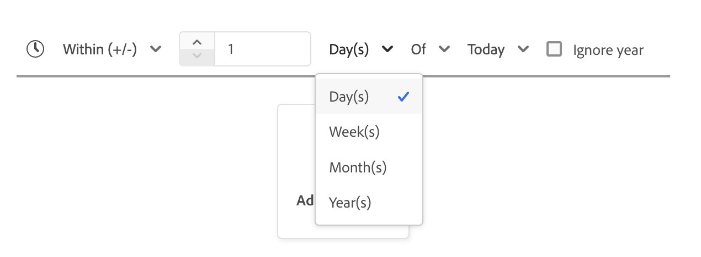
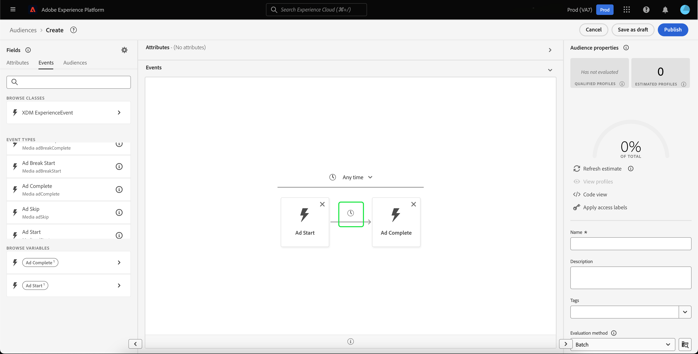

# [!DNL Segment Builder] UI-hulplijn

>[!NOTE]
>
>Deze gids verklaart hoe te om publiek door **segmentdefinities** tot stand te brengen gebruikend de Bouwer van het Segment. Leren hoe te om publiek tot stand te brengen gebruikend de Samenstelling van het Publiek, te lezen gelieve de [&#x200B; gids UI van de Samenstelling van het Publiek &#x200B;](./audience-composition.md).

[!DNL Segment Builder] biedt een rijke werkruimte waarmee u kunt werken met [!DNL Profile] -gegevenselementen. De werkruimte biedt intuïtieve besturingselementen voor het maken en bewerken van regels, zoals tegels voor slepen en neerzetten die worden gebruikt om gegevenseigenschappen te vertegenwoordigen.

## Bouwstenen voor segmentdefinitie {#building-blocks}

>[!CONTEXTUALHELP]
>id="platform_segments_createsegment_segmentbuilder_fields"
>title="Velden"
>abstract="De drie veldtypen waaruit een segmentdefinitie bestaat, zijn kenmerken, gebeurtenissen en doelgroepen. Met kenmerken kunt u Profielkenmerken gebruiken die horen bij de klasse Individueel profiel XDM, gebeurtenissen kunt u een publiek maken op basis van handelingen of gebeurtenissen die plaatsvinden met XDM ExperienceEvent-gegevenselementen en publiek kunt geïmporteerde soorten publiek uit externe bronnen gebruiken."

>[!CONTEXTUALHELP]
>id="platform_segmentation_segmentbuilder_showfullxdmschema"
>title="Volledig XDM-schema weergeven"
>abstract="Standaard worden alleen velden weergegeven die gegevens bevatten. Schakel deze optie in om alle velden in het XDM-schema weer te geven."

>[!CONTEXTUALHELP]
>id="platform_segmentation_segmentbuilder_showdeprecatedfields"
>title="Vervangen velden tonen"
>abstract="Vervangen XDM-velden worden standaard niet weergegeven. Schakel deze optie in om vervangen XDM-velden weer te geven."

De basisbouwstenen van segmentdefinities zijn attributen en gebeurtenissen. Daarnaast kunnen de kenmerken en gebeurtenissen in bestaande doelgroepen worden gebruikt als componenten voor nieuwe definities.

>[!CONTEXTUALHELP]
>id="platform_segments_createsegment_segmentbuilder_summarydata"
>title="Samenvattingsgegevens"
>abstract="De summiere gegevens verschijnen slechts voor profielattributen en <b> </b> verschijnen niet voor of gebeurtenis of publieksattributen.   Summiere gegevens voor profielattributen kunnen niet onder de volgende omstandigheden verschijnen: <ol><li>Sommige waarden van het kenmerk zijn meer dan 100 tekens lang.</li><li>Er zijn meer dan 3000 unieke waarden voor het kenmerk.</li></ol>"

>[!NOTE]
>
>Als u de informatiballon van een attribuut selecteert, kunt u de verdeling van waarden, die ook als summiere gegevens worden bekend, van het gebied bekijken. Deze zijn **slechts** beschikbaar in het attributenlusje, en zijn niet beschikbaar voor gebruik in de gebeurtenissen of het publiek tabel.
>
>Samenvattingsgegevens worden weergegeven als het kenmerk aan de volgende criteria voldoet: alle waarden van het kenmerk zijn 100 tekens of minder en er zijn 3000 of minder unieke waarden voor het kenmerk.
>
>Nochtans, zal een attribuut **&#x200B;**&#x200B;geen summiere gegevens hebben als het multi-entiteitgegevens verbonden aan het profiel door een verhouding is. Bijvoorbeeld, als u een douaneschema genoemd `Vehicle` hebt, zullen de **eigenschappen** binnen het `Vehicle` schema **&#x200B;**&#x200B;geen summiere gegevens hebben.

U kunt deze bouwstenen zien in de sectie **[!UICONTROL Fields]** aan de linkerkant van de [!DNL Segment Builder] -werkruimte. **[!UICONTROL Fields]** bevat een lusje voor elk van de belangrijkste bouwstenen: &quot;[!UICONTROL Attributes]&quot;, &quot;[!UICONTROL Events]&quot;, en &quot;[!UICONTROL Audiences]&quot;.

### Attributen

Op het tabblad **[!UICONTROL Attributes]** kunt u door [!DNL Profile] -kenmerken bladeren die tot de klasse [!DNL XDM Individual Profile] behoren. Elke map kan worden uitgevouwen om extra kenmerken weer te geven. Elk kenmerk is een tegel die naar het canvas voor regelbuilders in het midden van de werkruimte kan worden gesleept. Het [&#x200B; canvas van de regelbouwer &#x200B;](#rule-builder-canvas) wordt besproken meer in detail later in deze gids.

De kenmerken die u toevoegt, kunnen een van de volgende gegevenstypen zijn:

| Gegevenstype | Vaak voorkomende gebruiksscenario&#39;s |
| --------- | ---------------- |
| String | Namen, e-mailadressen, productcategorieën |
| Numeriek | Leeftijd, inkomsten, producthoeveelheden, loyaliteitsscores |
| Boolean | Voorkeuren, statusindicatoren, gebruikersmarkeringen |
| Enum | Vooraf gedefinieerde lijsten zoals geslacht of status |
| Datum/tijd | Aankoopdatums, bezoektijden, geboortedatum |

U kunt de volgende operatoren gebruiken voor de respectievelijke gegevenstypen:

+++ Reeksoperatoren

| Operator | Beschrijving | Voorbeeld |
| -------- | ----------- | ------- |
| Gelijk | Een exacte overeenkomst zoeken met de opgegeven waarde | E-mail **evenaart** &quot;sample@example.com&quot; |
| Niet gelijk | Hiermee wordt de opgegeven waarde uitgesloten | De status **is niet gelijk** &quot;Geannuleerd&quot; |
| Bevat | De tekst bevat de opgegeven waarde | De naam van het product **bevat** &quot;iPhone&quot; |
| Bevat niet | De tekst bevat niet de opgegeven waarde | De beschrijving **bevat** &quot;gestopt&quot; |
| Begint met | De tekst begint met de opgegeven waarde | Identiteitskaart van de klant **begint met** &quot;PREM&quot; |
| Eindigt met | De tekst eindigt met de opgegeven waarde | E-mail **beëindigt met** &quot;@company.com&quot; |
| Exists | De waarde bestaat | De middelnaam **bestaat** |
| Is niet bestaand | De waarde bestaat niet | Loyalty status **bestaat niet** |

+++

+++ Numerieke operatoren

| Operator | Beschrijving | Voorbeeld |
| -------- | ----------- | ------- |
| Gelijk | Een exacte overeenkomst zoeken met de opgegeven waarde | Leeftijd **evenaart** 25 |
| Niet gelijk | Hiermee wordt de opgegeven waarde uitgesloten | Het aantal van de orde **is niet gelijk** 0 |
| Groter dan | Het aantal is **groter** dan de gespecificeerde waarde. Deze waarde is **exclusief** van het gespecificeerde aantal. | Jaarlijkse opbrengst **groter dan** 50000 |
| Groter dan of gelijk aan | Het aantal is **groter** dan de gespecificeerde waarde. Deze waarde is **inclusief** van het gespecificeerde aantal. | Leeftijd **groter dan of gelijk** 21 |
| Minder dan | Het aantal is kleiner **&#x200B;**&#x200B;dan de gespecificeerde waarde. Deze waarde is **exclusief** van het gespecificeerde aantal. | Dagen sinds aankoop **minder dan** 30 |
| Kleiner dan of gelijk aan | Het aantal is kleiner **&#x200B;**&#x200B;dan de gespecificeerde waarde. Deze waarde is **inclusief** van het gespecificeerde aantal. | De waarde van de kunst **minder dan of gelijk** 100 |
| Tussen | Het aantal is **tussen** de gespecificeerde waarden. Deze waarden zijn **inclusief** van de gespecificeerde aantallen. | Leeftijd **tussen** 25 en 45 |
| Exists | De waarde bestaat | De score van het krediet **bestaat** |
| Is niet bestaand | De waarde bestaat niet | De score van het krediet **bestaat niet** |

+++

+++ Booleaanse operatoren

| Operator | Beschrijving | Voorbeeld |
| -------- | ----------- | ------- |
| Gelijk | De booleaanse waarde wordt ingesteld op de opgegeven waarde (Waar of Onwaar) | E-mail opt-in **is Waar** |
| Niet gelijk | De booleaanse waarde wordt **niet** geplaatst aan de gespecificeerde waarde (Waar of Vals) | Mobiele geïnstalleerde app **evenaart niet Waar** |

+++

+++ Enumoperatoren

| Operator | Beschrijving | Voorbeeld |
| -------- | ----------- | ------- |
| Gelijk | De waarde is gelijk aan de opgegeven opsommingswaarden | Gendergelijkheid **evenaart** Vrouwelijk |
| Niet gelijk | De waarde is niet gelijk aan de opgegeven opsommingswaarde | De status van de orde **is niet gelijk** Geannuleerd |
| Exists | De opsommingswaarde is ingesteld | De voorkeurstaal **bestaat** |
| Is niet bestaand | De opsommingswaarde is niet ingesteld | De voorkeurstaal **bestaat niet** |

+++

+++ Operatoren voor datum en tijd

| Operator | Beschrijving | Voorbeeld |
| -------- | ----------- | ------- |
| Vandaag | De waarde is vandaag opgetreden. U kunt **selecteren negeren jaar** checkbox om de vergelijking te maken negeren het jaar. | De datum van de geboorte **is** vandaag |
| Gisteren | De waarde is gisteren opgetreden. | De aankoop van de kunst **is** Gisteren |
| Deze maand | De waarde is deze kalendermaand opgetreden. | De maand van de geboorte **is** Deze maand |
| Dit jaar | De waarde vond dit kalenderjaar plaats. | De datum van het teken **is** dit jaar |
| Aangepaste datum | De waarde is op de opgegeven datum opgetreden. | De datum van de aankoop **is op** de datum van de Douane |
| Laatste | De waarde is opgetreden binnen de laatste gekozen tijdsperiode. Verjaardag **is** In vorige maand |
| Van (tot) | De waarde vond plaats binnen de twee gekozen kalenderdata. Deze periode van tijd is **inclusief** van beide data. | De aanmaakdatum van de rekening **is** van 20 april tot 13 juli |
| Tijdens | De waarde is opgetreden binnen de geselecteerde maand of het geselecteerde jaar. | Verkoop **is** tijdens Maart |
| Binnen (+/-) | De waarde is opgetreden binnen dagen, weken, maanden of jaren na de geselecteerde datum. Deze periode van tijd is **inclusief** van beide data. | Het verlaten van de kunst is **binnen** 3 dagen |
| Voor | De waarde is voor de geselecteerde datum opgetreden. | Het lidmaatschap sluit zich aan bij datum is **vóór** 3 Januari, 2025 |
| Na | De waarde is opgetreden na de geselecteerde datum. | De datum van de aankoop is **na** Maart 14th, 2024 |
| Rolbereik | De waarde is opgetreden tussen de twee relatieve datums. | De laatste aankoopdatum ligt tussen zeven dagen geleden en drie dagen geleden. |
| In volgende | De waarde is opgetreden binnen de volgende geselecteerde tijdsperiode. | Afmelden van winkelwagentje duurt over 2 dagen |

Voor meer gedetailleerde informatie over de tijd en de datumfuncties, lees de [&#x200B; sectie van tijdbeperkingen &#x200B;](#time-constraints).

+++

#### Berekende kenmerken {#computed-attributes}

Berekende kenmerken zijn velden die worden berekend op basis van andere kenmerken met behulp van aggregaties of formules. U kunt berekende attributen gebruiken als u samengevoegde gegevens zoals sommen, tellingen, of gemiddelden over veelvoudige gebeurtenissen nodig hebt of als u veelgebruikte publiek bouwt dat complexe berekeningen vereist.

Voor meer informatie over gegevens verwerkte attributen, met inbegrip van hoe te om hen tot stand te brengen, welke functies u binnen hen kunt gebruiken, en hoe te om hen te beheren, lees het [&#x200B; gegevens verwerkte attributenoverzicht &#x200B;](/help/profile/computed-attributes/overview.md).

### Gebeurtenissen

Op het tabblad **[!UICONTROL Events]** kunt u een publiek maken op basis van gebeurtenissen of acties die hebben plaatsgevonden met behulp van [!DNL XDM ExperienceEvent] -gegevenselementen. U kunt gebeurtenistypen ook vinden op het tabblad **[!UICONTROL Events]** . Dit zijn een verzameling veelgebruikte gebeurtenissen waarmee u uw segmentdefinities sneller kunt maken.

U kunt niet alleen zoeken naar [!DNL ExperienceEvent] -elementen, maar ook naar gebeurtenistypen. Gebeurtenistypen gebruiken dezelfde coderingslogica als [!DNL ExperienceEvents], zonder dat u door de klasse [!DNL XDM ExperienceEvent] hoeft te zoeken om de juiste gebeurtenis te vinden. Bijvoorbeeld, die de onderzoeksbar gebruiken om &quot;wortel&quot;te zoeken keert de Types &quot;[!UICONTROL AddCart]&quot;van Gebeurtenis en &quot;[!UICONTROL RemoveCart] terug, die twee zeer vaak gebruikte kartacties zijn wanneer het bouwen van segmentdefinities.

Om het even welk type van component kan worden gezocht door zijn naam in de onderzoeksbar te typen, die [&#x200B; het onderzoekssyntaxis van Lucene &#x200B;](https://docs.microsoft.com/en-us/azure/search/query-lucene-syntax) gebruikt. De zoekresultaten beginnen te vullen wanneer hele woorden worden ingevoerd. Als u bijvoorbeeld een regel wilt maken op basis van het XDM-veld `ExperienceEvent.commerce.productViews` , typt u &quot;productweergaven&quot; in het zoekveld. Nadat u het woord &quot;product&quot; hebt getypt, worden de zoekresultaten weergegeven. Elk resultaat bevat de objecthiërarchie waartoe het behoort.

>[!NOTE]
>
>De het schemagebieden van de douane die door uw organisatie worden bepaald kunnen tot 24 uren aan verschijnen en beschikbaar voor gebruik in het bouwen van regels vergen.

Vervolgens kunt u [!DNL ExperienceEvents] en &quot;[!UICONTROL Event Types]&quot; eenvoudig naar uw segmentdefinitie slepen.

Standaard worden alleen gevulde schemavelden uit de gegevensopslag weergegeven. Dit omvat &quot;[!UICONTROL Event Types]&quot;. Als &quot;[!UICONTROL Event Types]&quot;lijst niet zichtbaar is, of u slechts &quot; [!UICONTROL Any]&quot;als &quot;[!UICONTROL Event Type]&quot;kunt selecteren, selecteer het **tandwielpictogram** naast **[!UICONTROL Fields]**, dan uitgezocht **[!UICONTROL Show full XDM schema]** onder **[!UICONTROL Available Fields]**. Selecteer het **tandwielpictogram** opnieuw om aan het **[!UICONTROL Fields]** lusje terug te keren en u zou veelvoudige &quot;[!UICONTROL Event Types]&quot;en schemagebieden nu moeten kunnen bekijken, ongeacht of zij gegevens bevatten of niet.

#### Gegevenssets van Adobe Analytics-rapportsuite

U kunt gegevens uit één of meerdere Adobe Analytics-rapportreeksen gebruiken als gebeurtenissen binnen de segmentatie.

Als Experience Platform gegevens uit één analytische rapportsuite gebruikt, worden automatisch beschrijvingen en vriendelijke namen aan Vars toegevoegd, zodat u die velden gemakkelijker kunt vinden in [!DNL Segment Builder] .

Wanneer het gebruiken van gegevens van de veelvoudige het rapportreeksen van de Analyse, Experience Platform **kan** automatisch geen beschrijvers of vriendschappelijke namen aan eVars toevoegen. Dientengevolge, alvorens de gegevens van Analytics rapportreeksen te gebruiken, moet u aan XDM gebieden in kaart brengen. Meer informatie over de variabelen van de afbeeldingsanalyse aan XDM kan in de [&#x200B; bron van Adobe Analytics verbindingsgids &#x200B;](../../sources/tutorials/ui/create/adobe-applications/analytics.md#mapping) worden gevonden.

Neem bijvoorbeeld een situatie waarin u twee rapportsuites met de volgende variabelen had:

| Veld | Report Suite Schema A | Report Suite Schema B |
| ----- | --------------------- | --------------------- |
| eVar1 | Referentiedomein | Aangemeld in Y/N |
| eVar2 | Paginanaam | Lidmaatschap-ID |
| eVar3 | URL | Paginanaam |
| eVar4 | Zoekvoorwaarden | Productnaam |
| event1 | Klikken | Paginaweergaven |
| event2 | Paginaweergaven | Extra winkelwagentjes |
| event3 | Extra winkelwagentjes | Afbeeldingen |
| event4 | Aankopen | Aankopen |

In dit geval, kon u de twee rapportreeksen met het volgende schema in kaart brengen:

>[!NOTE]
>
>Terwijl de generische waarden van eVar nog bevolkt worden, zou u **niet** hen in uw segmentdefinities (als mogelijk) moeten gebruiken, aangezien de waarden verschillende dingen konden betekenen dan wat zij oorspronkelijk in hun rapporten waren.

Zodra de rapportsuites in kaart zijn gebracht, kunt u deze onlangs in kaart gebrachte gebieden binnen uw op profiel-betrekking hebbende werkschema&#39;s en segmentatie gebruiken.

| Scenario | Unieschema-ervaring | Segmentatie generieke variabele | Aan segment toegewezen variabele |
| -------- | ----------------------- | ----------------------------- | ---------------------------- |
| Single-rapportenpakket | Beschrijvende naam wordt opgenomen in algemene variabelen.   **Voorbeeld:** Naam van de Pagina (eVar2) | <ul><li>Beschrijvende naam opgenomen met algemene variabelen</li><li>De vraag gebruikt gegevens van de specifieke dataset, aangezien het de enige is</li></ul> | Query&#39;s kunnen gebruikmaken van Adobe Analytics-gegevens en mogelijk andere bronnen. |
| Meerdere rapportsuites | Bij generieke variabelen worden geen beschrijvingen van vriendelijke namen opgenomen.   **Voorbeeld:** eVar2 | <ul><li>Elk veld met meerdere beschrijvingen wordt algemeen weergegeven. Dit betekent dat er geen vriendelijke namen worden weergegeven in de gebruikersinterface.</li><li>De vragen kunnen gegevens van om het even welke datasets gebruiken die eVar bevatten, die in gemengde of onjuiste resultaten kunnen resulteren.</li></ul> | De vraag gebruikt correct gecombineerde resultaten van veelvoudige datasets. |

### Doelgroepen

>[!CONTEXTUALHELP]
>id="platform_segmentation_segmentBuilder_b2b_decomposition"
>title="Complexe evaluatie"
>abstract="De volgende expressie is te gecompliceerd om als één publiek te worden uitgedrukt. Volg onderstaande stappen om zowel B2B-regels als op mensen gebaseerde gebeurtenissen in dezelfde segmentdefinitie te gebruiken.<ol><li>Creeer een segmentdefinitie die slechts naar de op mensen-gebaseerde-gebeurtenissen verwijst, en bewaar het als zijn eigen segmentdefinitie.</li><li>In een nieuwe segmentdefinitie, voer de eerder gecreeerde segmentdefinitie terwijl het verwijzen naar de B2B-regels in.</li></ol>"

>[!CONTEXTUALHELP]
>id="platform_segmentation_segmentbuilder_externalaudiences"
>title="Extern publiek"
>abstract="Het publiek dat via het tabblad Soorten publiek wordt geïmporteerd, wordt nu automatisch opgezocht via het Poort publiek. Dit omvat publiek dat van Audience Manager, Customer Journey Analytics, Segment Match, en andere douaneintegratie wordt opgenomen.   tegen eind september 2025, zal het publiek uitsluitend door Verenigd Onderzoek worden teruggewonnen, en het vorige werkschema zal niet meer gesteund. De Overeenkomst van het segment blijft beschikbaar slechts voor een klein aantal aangewezen klanten terwijl wij de dienst overgaan. De toegang voor de nieuwe klanten van de Gelijke van het Segment kan nog op verzoek worden toegelaten alvorens de dienst volledig gepensioneerd is.   voor aan de gang zijnde gevallen van het gebruik van gegevenssamenwerking, adviseert Adobe zich aan Collaboration te bewegen, die de op lange termijn gesteunde oplossing is."
>additional-url="https://experienceleague.adobe.com/en/docs/experience-platform/segmentation/ui/audience-portal#list" text="Poort publiek"

>[!NOTE]
>
>Voor publiek dat binnen Experience Platform wordt gecreeerd, slechts zal het publiek dat het **zelfde** fusiebeleid heeft worden getoond.

Het tabblad **[!UICONTROL Audiences]** bevat een lijst met alle soorten publiek die zijn geïmporteerd uit externe bronnen, zoals Adobe Audience Manager of Customer Journey Analytics, en met soorten publiek dat is gemaakt in [!DNL Experience Platform] .

Op het tabblad **[!UICONTROL Audiences]** kunt u alle beschikbare bronnen weergeven als een groep mappen. Terwijl u de mappen selecteert, zijn de beschikbare submappen en doelgroepen zichtbaar. Bovendien kunt u het mappictogram (zoals weergegeven in de afbeelding uiterst rechts) selecteren om de mapstructuur weer te geven (een vinkje geeft de map aan die u momenteel in hebt) en eenvoudig terug te navigeren door de mappen door de naam van een map in de boomstructuur te selecteren.

U kunt de muisaanwijzer boven de ⓘ naast een doelgroep houden om informatie over het publiek weer te geven, zoals de id, beschrijving en maphiërarchie, om het publiek te zoeken.

## Rule builder canvas {#rule-builder-canvas}

>[!IMPORTANT]
>
>Vanaf de release van juni 2024 vertegenwoordigen de tijdbeperkingen &quot;Deze maand&quot; en &quot;Dit jaar&quot; respectievelijk &quot;maand-tot-datum&quot; en &quot;jaar-tot-datum&quot;. Als u bijvoorbeeld op 18 juli een publiek hebt gemaakt dat op zoek was naar &quot;alle klanten van wie de verjaardag deze maand plaatsvindt&quot;, krijgt het publiek alle klanten van wie de verjaardagen tussen 1 juli en 31 juli hebben plaatsgevonden. Op 1 augustus, zou dit publiek alle klanten krijgen van wie verjaardag van 1 augustus aan 31 augustus voorkomt.
>
>Eerder vertegenwoordigden &quot;Deze maand&quot; en &quot;dit jaar&quot; respectievelijk 30 dagen en 365 dagen, die geen rekening hielden voor maanden met 31 dagen en schrikkeljaren.
>
>Als u de logica van uw publiek wilt bijwerken, slaat u het eerder gemaakte publiek opnieuw op.

Een segmentdefinitie is een inzameling van regels die worden gebruikt om zeer belangrijke kenmerken of gedrag van een doelpubliek te beschrijven. Deze regels worden gecreeerd gebruikend het canvas van de regelbouwer, dat in het centrum van [!DNL Segment Builder] wordt gevestigd.

Als u een nieuwe regel wilt toevoegen aan de segmentdefinitie, sleept u een tegel van de tab **[!UICONTROL Fields]** naar het canvas van de regelbuilder. Vervolgens krijgt u contextspecifieke opties, afhankelijk van het type gegevens dat u wilt toevoegen. Beschikbare gegevenstypen zijn: tekenreeksen, datums, [!DNL ExperienceEvents] , &quot;[!UICONTROL Event Types]&quot; en soorten publiek.

>[!IMPORTANT]
>
>De meest recente wijzigingen in Adobe Experience Platform hebben het gebruik van de logische operatoren `OR` en `AND` tussen gebeurtenissen bijgewerkt. Deze updates zijn niet van invloed op bestaande segmentdefinities. Nochtans, zullen alle verdere updates aan bestaande segmentdefinities en pas gecreëerde segmentdefinities door deze veranderingen worden beïnvloed. Gelieve te lezen de [&#x200B; update van tijdconstanten &#x200B;](./segment-refactoring.md) voor meer informatie.

Wanneer u een waarde voor het kenmerk selecteert, wordt een lijst met opsommingswaarden weergegeven die het kenmerk kan bevatten.

Als u een waarde in deze lijst met nummers selecteert, krijgt de waarde een effen rand. Nochtans, voor gebieden die `meta:enum` (zachte) opsommingen gebruiken, kunt u een waarde ook selecteren die **niet** van de lijst van lijsten is. Als u uw eigen waarde maakt, krijgt deze de omtrek met een gestippelde rand en een waarschuwing dat deze waarde niet in de opsommingslijst voorkomt.

Als u meerdere waarden maakt, kunt u deze allemaal tegelijk toevoegen door de bulkupload te gebruiken. Selecteer het  om **[!UICONTROL Add values in bulk]** popover te tonen.

In de pop-up **[!UICONTROL Add values in bulk]** kunt u een CSV- of TSV-bestand uploaden.

U kunt ook handmatig door komma&#39;s gescheiden waarden toevoegen.

Er zijn maximaal 250 waarden toegestaan. Als u deze hoeveelheid overschrijdt, moet u enkele waarden verwijderen voordat u meer waarden toevoegt.

### Validatie van publiek {#audience-validation}

De Bouwer van het segment analyseert en bevestigt automatisch uw publieksdefinitie om u aan de beste praktijken van de publieksdefinitie te verzekeren. Deze beste praktijken kunnen in twee categorieën worden geplaatst: kritieke bevestiging en prestatiesoptimalisering.

Als een publieksdefinitie een kritieke bevestiging beste praktijken breekt, zult u **niet** uw veranderingen kunnen bewaren om uw zandbak stabiel te houden. Als een publieksdefinitie een prestaties optimaliseert beste praktijken breekt, zult u uw veranderingen kunnen bewaren, maar het wordt *hoogst geadviseerd* om uw publieksdefinitie bij te werken om prestatieskwesties te vermijden.

| Validatiecontrole | Type | Drempel |
| ---------------- | ---- | --------- |
| Logische complexiteit | Kritieke validatie | De definitie van het publiek is te ingewikkeld. |
| Opeenvolgende gebeurtenissen | Kritieke validatie | Er zijn meer dan zes opeenvolgende gebeurtenissen binnen een publieksdefinitie. |
| Geaggregeerd aantal | Optimalisatie van prestaties | Er zijn meer dan 3 samenvoegingsfuncties binnen een publieksdefinitie. |
| Geneste gegevens | Optimalisatie van prestaties | Er zijn meer dan 2 niveaus van genestelde gegevensdiepte (serie of kaartgegevenstypes) binnen een publieksdefinitie. |
| Grootte publiek | Optimalisatie van prestaties | De kwalificatiegrootte van het publiek is groter dan 30% van het totale aantal profielen in de sandbox. |

Voor meer informatie over hoe de werken van de publieksbevestiging, de [&#x200B; gids van de publieksbevestiging &#x200B;](/help/segmentation/validation.md) lezen.

### Soorten publiek toevoegen

>[!CONTEXTUALHELP]
>id="platform_segmentation_segmentbuilder_addaudiences"
>title="Zoeken in updates"
>abstract="Het bestaande zoeksysteem is bijgewerkt om Unified Search te gebruiken. Het verenigde Onderzoek staat u toe om uw publiek gemakkelijker en robuuster naar segmentlidmaatschap te zoeken."

U kunt een publiek van het **[!UICONTROL Audience]** lusje op het canvas van de regelbouwer slepen en laten vallen om publiekslidmaatschap in de nieuwe segmentdefinitie te verwijzen. Dit staat u toe om publiekslidmaatschap als attribuut in de nieuwe regels van de segmentdefinitie te omvatten of uit te sluiten.

Voor [!DNL Experience Platform] publiek dat met [!DNL Segment Builder] wordt gecreeerd, krijgt u de optie om het publiek in de reeks regels om te zetten die in de segmentdefinitie voor dat publiek werden gebruikt. Deze omzetting maakt een exemplaar van de regellogica, die dan kan worden gewijzigd zonder de originele segmentdefinitie te beïnvloeden. Zorg ervoor dat u recente wijzigingen in de segmentdefinitie hebt opgeslagen voordat u deze omzet in regellogica.

>[!NOTE]
>
>Wanneer u een publiek uit een externe bron toevoegt, wordt alleen verwezen naar het publiekslidmaatschap. U kunt het publiek niet in regels omzetten, en daarom kunnen de regels die worden gebruikt om het originele publiek tot stand te brengen niet in de nieuwe segmentdefinitie worden gewijzigd.

Als er conflicten optreden wanneer een publiek wordt omgezet in regels, probeert [!DNL Segment Builder] de bestaande opties zo goed mogelijk te behouden.

### Codeweergave

U kunt ook een op code gebaseerde versie weergeven van een regel die is gemaakt in de [!DNL Segment Builder] . Zodra u uw regel binnen het canvas van de regelbouwer hebt gecreeerd, kunt u selecteren **[!UICONTROL Code view]** om uw segmentdefinitie als PQL te zien.

De mening van de code verstrekt een knoop die u toestaat om de waarde van de segmentdefinitie aan gebruik in API vraag te kopiëren. Om de recentste versie van de segmentdefinitie te krijgen, zorg ervoor u uw recentste veranderingen in de segmentdefinitie hebt bewaard.

 toestaat

### Samenvoegingsfuncties

Een aggregatie in [!DNL Segment Builder] is een berekening op een groep XDM-kenmerken waarvan het gegevenstype een getal is (een getal of een geheel getal). De vier gesteunde samenvoegingsfuncties binnen de Bouwer van het Segment zijn SUM, GEMIDDELD, MIN, en MAX.

Als u een aggregatiefunctie wilt maken, selecteert u een gebeurtenis in de linkertrack en voegt u deze in de container van [!UICONTROL Events] in.

Nadat u de gebeurtenis in de container Gebeurtenissen hebt geplaatst, selecteert u het pictogram Ovalen (...), gevolgd door **[!UICONTROL Aggregate]** .

De samenvoeging wordt nu toegevoegd. U kunt nu de aggregatiefunctie selecteren, kiezen welk kenmerk wordt geaggregeerd, de gelijkheidsfunctie en de waarde. In het onderstaande voorbeeld zou deze segmentdefinitie elk profiel kwalificeren dat een som aangekochte waarden heeft die groter is dan $100, zelfs als elke afzonderlijke aankoop minder dan $100 is.

### Telfuncties {#count-functions}

De functies van de telling in de Bouwer van het Segment worden gebruikt om gespecificeerde gebeurtenissen te zoeken en het aantal tijden te tellen zij worden gedaan. De gesteunde telfuncties in de Bouwer van het Segment zijn &quot;minstens&quot;, &quot;hoogstens&quot;, &quot;Precies&quot;, &quot;tussen&quot;, en &quot;allen&quot;.

Als u een telfunctie wilt maken, selecteert u een gebeurtenis in de linkertrack en voegt u deze in de container van [!UICONTROL Events] in.

Nadat u de gebeurtenis in de container Gebeurtenissen hebt geplaatst, selecteert u de knop [!UICONTROL At least 1] .

De telfunctie wordt nu toegevoegd. U kunt nu de telfunctie en de waarde van de functie selecteren. In het onderstaande voorbeeld ziet u hoe u elke gebeurtenis met ten minste één klik opneemt.

### Tijdbeperkingen {#time-constraints}

Met tijdbeperkingen kunt u tijdbeperkingen toepassen op op tijd gebaseerde kenmerken, gebeurtenissen en de volgorde tussen de gebeurtenissen.

>[!IMPORTANT]
>
>Als u een segmentdefinitie met &quot;Deze maand&quot;of &quot;Dit jaar&quot;tijdbeperkingen voorafgaand aan Juni 2024 creeerde, zult u uw segmentdefinities moeten opnieuw opslaan. Vóór juni 2024 was &quot;Deze maand&quot; gebaseerd op 30 dagen en &quot;Dit jaar&quot; op 365 dagen.

>[!NOTE]
>
>Zowel [&#x200B; negeren de beperking van de jaartijd &#x200B;](./ignore-year.md) en [&#x200B; regel-vlakke tijdbeperkingen &#x200B;](./segment-refactoring.md) eerder refactored, met meer informatie beschikbaar in de verbonden overzichten.

De lijst van beschikbare tijdbeperkingen is als volgt:

+++ Beschikbare tijdbeperkingen

>[!NOTE]
>
>Alle tijdbeperkingen zijn gebaseerd op UTC.
>
>Bovendien, als [!UICONTROL Ignore year] checkbox wordt toegelaten, zal het jaar **niet** als deel van de evaluatie van de segmentdefinitie worden vergeleken.

| Tijdsbeperking | Beschrijving | Kan negeren jaar inschakelen | Voorbeeld |
| --------------- | ----------- | ------------------- | ------- |
| Vandaag | De attributen of de gebeurtenis die **worden vergeleken moeten** vandaag voorkomen. | Ja | {width="100" zoomable="yes"} |
| Gisteren | De attributen of de gebeurtenis die **worden vergeleken moeten** gisteren voorkomen. | Ja | {width="100" zoomable="yes"} |
| Deze maand | De attributen of de gebeurtenis die **worden vergeleken moeten** deze kalendermaand voorkomen. | Ja | {width="100" zoomable="yes"} |
| Dit jaar | De attributen of de gebeurtenis die **worden vergeleken moeten** dit kalenderjaar voorkomen. | Nee | {width="100" zoomable="yes"} |
| Aangepaste datum | De attributen of de gebeurtenis die **worden vergeleken moeten** op de gegeven datum voorkomen. | Ja | {width="100" zoomable="yes"} |
| Laatste | De attributen of de gebeurtenis die **worden vergeleken moeten** binnen de laatste gekozen periode voorkomen. Deze periode van tijd is **inclusief** tot de evaluatietijd. | Nee | {width="100" zoomable="yes"} |
| Van (tot) | Het attribuut of de gebeurtenis die **worden vergeleken moet** binnen de twee gekozen kalenderdata voorkomen. Deze periode van tijd is **inclusief** van beide data. | Ja, indien aangepaste datum | {width="100" zoomable="yes"} |
| Tijdens | De attributen of de gebeurtenis die **worden vergeleken moeten** binnen de geselecteerde maand of het jaar voorkomen. Als een maand is geselecteerd, moet u zowel de maand als een jaar kiezen waarin het kenmerk of de gebeurtenis heeft plaatsgevonden.  Als een jaar is geselecteerd, hoeft u alleen het jaar te kiezen waarin het kenmerk of de gebeurtenis heeft plaatsgevonden. Als u een maand selecteert, kunt u ook het selectievakje [!UICONTROL Ignore year] inschakelen. | Ja | {width="100" zoomable="yes"} |
| Binnen (+/-) | De attributen of de gebeurtenis die **worden vergeleken moeten** binnen dagen, weken, maanden, of jaren van de geselecteerde datum voorkomen. Deze periode van tijd is **inclusief** van beide data. De geselecteerde datum kan vandaag, gisteren, of een andere douanedatum van uw keuze zijn. | Ja | {width="100" zoomable="yes"} |
| Voor | De attributen of de gebeurtenis die **worden vergeleken moeten** vóór de geselecteerde datum voorkomen. De geselecteerde datum kan een aangepaste datum of een selectie van dagen, weken, maanden of jaren geleden zijn. | Ja | {width="100" zoomable="yes"} |
| Na | De attributen of de gebeurtenis die **worden vergeleken moeten** na de geselecteerde datum voorkomen. De geselecteerde datum kan een aangepaste datum of een selectie van dagen, weken, maanden of jaren geleden zijn. | Ja | {width="100" zoomable="yes"} |
| Rolbereik | Het kenmerk of de gebeurtenis die wordt vergeleken, moet tussen de twee relatieve datums plaatsvinden. De datums kunnen worden weergegeven in seconden, minuten, uren, dagen, weken, maanden of jaren. | Nee | {width="100" zoomable="yes"} |
| In volgende | Het kenmerk of de gebeurtenis die wordt vergeleken, moet binnen de volgende geselecteerde periode plaatsvinden. De geselecteerde tijdsperiodes omvatten minuten, uren, dagen, weken, maanden en jaren. | Nee | {width="100" zoomable="yes"} |
| Exists | Het kenmerk bestaat. | Nee | {width="100" zoomable="yes"} |
| Is niet bestaand | Het kenmerk bestaat niet. | Nee | {width="100" zoomable="yes"} |

+++

Wanneer u een tijdbeperking toepast op een gebeurtenis, kunt u deze toepassen op canvasniveau, op kaartniveau of tussen gebeurtenissen.

#### Beperking op canvasniveau

Als u een tijdbeperking op canvasniveau wilt toepassen, selecteert u het klokpictogram dat boven de tijdlijn van gebeurtenissen wordt weergegeven.

Wanneer u een tijdbeperking op canvas-niveau toepast, past dit de tijdbeperking op **alle** gebeurtenissen in het publiek toe.

#### Beperking op kaartniveau

Als u een beperking op kaartniveau wilt toepassen, selecteert u de kaart waarop u de tijdbeperking wilt toepassen, gevolgd door het pictogram met de ellips, en **[!UICONTROL Apply time rule]** . Hiermee kunt u een tijdbeperking selecteren in de container van **[!UICONTROL Event Rules]** .

Wanneer u een tijdbeperking op kaart-niveau toepast, past dit de tijdbeperking op de **gespecificeerde** gebeurtenis in het publiek toe.

#### Tussen gebeurtenisrestrictie

Als u een tijdbeperking tussen gebeurtenissen wilt toepassen, selecteert u het klokpictogram tussen de twee gebeurtenissen waarop u de tijdbeperking wilt toepassen.

Wanneer u een tijdbeperking tussen de gebeurtenis toepast, past dit de tijdbeperking op de tijd **tussen** de gebeurtenissen toe.

De lijst van beschikbare tijdbeperkingen voor deze verrichting verschilt van de belangrijkste lijst van tijdbeperkingen, en zijn als volgt:

+++ Beschikbare tijdbeperkingen

| Tijdsbeperking | Beschrijving |
| --------------- | ----------- |
| Na | De laatstgenoemde gebeurtenis **moet minstens** na de vroegere gebeurtenis plaatsvinden. |
| Within | De twee gebeurtenissen **moeten** tijdens de tijdperiode plaatsvinden die binnen de tijdbeperking wordt vermeld. |

>[!NOTE]
>
>Wanneer u de tijdbeperking &quot;Na&quot; gebruikt, kan de laatste gebeurtenis meer plaatsvinden dan de hoeveelheid tijd die binnen de tijdbeperking wordt vermeld. >
>Als u bijvoorbeeld een gebeurtenis Paginaweergave en een uitcheckgebeurtenis hebt en u de tijdbeperking Na 1 uur tussen deze twee gebeurtenissen plaatst, komt een segmentdefinitie met een uitcheckgebeurtenis 2 uur na de gebeurtenis Paginaweergave in aanmerking.
>
>Bovendien kunnen deze twee tijdsbeperkingen in overleg met elkaar worden gebruikt.
>
>Als u bijvoorbeeld een gebeurtenis Paginaweergave en een uitcheckgebeurtenis hebt en u zowel de tijdbeperkingen &quot;Na 1 uur&quot; als &quot;Binnen 24 uur&quot; plaatst, zou een segmentdefinitie met een uitcheckgebeurtenis 12 uur na de gebeurtenis Paginaweergave in aanmerking komen, maar zou een segmentdefinitie met een uitcheckgebeurtenis 36 uur na de gebeurtenis Paginaweergave niet in aanmerking komen.

+++

## Containers {#containers}

Het publiek wordt geëvalueerd in de volgorde waarin het wordt vermeld. De containers staan controle over de orde van uitvoering door het gebruik van genestelde vragen toe.

Zodra u minstens één tegel aan het canvas van de regelbouwer hebt toegevoegd, kunt u beginnen om containers toe te voegen. Als u een nieuwe container wilt maken, selecteert u de ellipsen (...) in de rechterbovenhoek van de tegel en selecteert u vervolgens **[!UICONTROL Add container]** .

Een nieuwe container wordt weergegeven als het onderliggende element van de eerste container, maar u kunt de hiërarchie aanpassen door de containers te slepen en te verplaatsen. Het standaardgedrag van een container is &quot;[!UICONTROL Include]&quot;de attributen, de gebeurtenis, of het publiek verstrekte. U kunt de regel aan &quot;[!UICONTROL Exclude]&quot;profielen plaatsen die de containercriteria door **[!UICONTROL Include]** in de linkerbovenhoek van de tegel te selecteren en &quot;[!UICONTROL Exclude]&quot;te selecteren.

Een onderliggende container kan ook inline worden geëxtraheerd en toegevoegd aan de bovenliggende container door &quot;container opheffen&quot; te selecteren in de onderliggende container. Selecteer de ellipsen (...) in de hoger-juiste hoek van de kindcontainer om tot deze optie toegang te hebben.

Nadat u **[!UICONTROL Unwrap container]** hebt geselecteerd, wordt de onderliggende container verwijderd en worden de criteria inline weergegeven.

>[!NOTE]
>
>Wanneer het unwrapping containers, zorg ervoor dat de logica de gewenste segmentdefinitie blijft ontmoeten.

### Voorbeelden {#container-examples}

U kunt uw containers binnen de Bouwer van het Segment op drie verschillende manieren gebruiken: om uw regels met booleaanse logica te groeperen, om te controleren of om profielen te omvatten of uit te sluiten die de criteria van de container aanpassen, en om gebeurtenisopeenvolgingen met tijdbeperkingen te bepalen.

+++ Gemengde Booleaanse logica

Het volgende voorbeeld mengt **zowel** ALS en OF logica binnen één enkele uitdrukking. Zonder containers te gebruiken, kunt u niet zowel EN met logica OF in één enkel niveau mengen.

+++

+++ Gebeurtenisvolgorde

In het volgende voorbeeld worden containers gebruikt om de reeks gebeurtenissen samen te stellen.

+++

### Best practices {#container-best-practices}

Houd rekening met de volgende richtlijnen wanneer u containers toevoegt aan uw publiek:

- Bouw uw containers stapsgewijs, testend de logica met elke stap u toevoegt
   - Dit is vooral belangrijk als u de logica &#39;Exclude&#39; gebruikt, omdat dit de resultaten aanzienlijk kan wijzigen
- Geef uw containers duidelijk een naam om te begrijpen wat ze moeten doen
- Vermijd het gebruik van te veel geneste containerniveaus omdat dit de prestaties vermindert
- Zorg ervoor dat de volgorde van de containers correct is, aangezien de volgorde van de gebeurtenissen de containers met reeksen aanzienlijk beïnvloedt

## Beleid samenvoegen

>[!CONTEXTUALHELP]
>id="platform_segmentation_createSegment_segmentBuilder_mergePolicies"
>title="Beleid samenvoegen"
>abstract="Met een samenvoegbeleid kunt u verschillende gegevenssets samenvoegen tot uw profiel. Experience Platform heeft een standaardbeleid voor samenvoeging opgegeven of u kunt een nieuw standaardbeleid voor samenvoegen maken in profielen. Kies een samenvoegbeleid dat overeenkomt met uw marketingdoel voor dit publiek."

Met [!DNL Experience Platform] kunt u gegevens uit meerdere bronnen samenvoegen en combineren om een volledige weergave van elk van uw individuele klanten weer te geven. Wanneer u deze gegevens samenbrengt, worden in [!DNL Experience Platform] regels gebruikt voor het samenvoegen van gegevens om te bepalen hoe de prioriteit van gegevens wordt bepaald en welke gegevens worden gecombineerd om een profiel te maken.

U kunt een samenvoegbeleid selecteren dat aansluit bij uw marketingdoel voor dit publiek of het standaardsamenvoegbeleid gebruiken dat wordt geboden door [!DNL Experience Platform] . U kunt meerdere samenvoegbeleidsregels maken die uniek zijn voor uw organisatie, waaronder het maken van uw eigen standaardbeleid voor samenvoegen. Voor geleidelijke instructies bij het creëren van fusiebeleid voor uw organisatie, gelieve te beginnen door het [&#x200B; overzicht van het samenvoegingsbeleid &#x200B;](../../profile/merge-policies/overview.md) te lezen.

Als u een samenvoegbeleid voor uw segmentdefinitie wilt selecteren, selecteert u het tandwielpictogram op het tabblad **[!UICONTROL Fields]** en selecteert u het samenvoegbeleid dat u wilt gebruiken in het vervolgkeuzemenu **[!UICONTROL Merge Policy]** .

## Eigenschappen van publiek {#audience-properties}

>[!CONTEXTUALHELP]
>id="platform_segments_createsegment_segmentbuilder_segmentproperties"
>title="Eigenschappen van publiek"
>abstract="In de sectie met publiekseigenschappen wordt een schatting weergegeven van de grootte van het resulterende publiek, waarbij het aantal gekwalificeerde profielen wordt weergegeven in vergelijking met het totale aantal profielen. Zo kunt u het publiek naar wens aanpassen voordat u het publiek zelf gaat opbouwen."

>[!CONTEXTUALHELP]
>id="platform_segments_createsegment_segmentbuilder_refreshestimate"
>title="Ramingen vernieuwen"
>abstract="U kunt de ramingen van uw segmentdefinitie verfrissen om onmiddellijk een voorproef van te zien hoeveel profielen voor de voorgestelde segmentdefinitie zouden kwalificeren. De schattingen van het publiek worden geproduceerd door een steekproefgrootte van de steekproefgegevens van die dag te gebruiken."
>additional-url="https://experienceleague.adobe.com/docs/experience-platform/segmentation/tutorials/create-a-segment.html#estimate-and-preview-an-audience" text="Een publiek schatten en voorvertonen"

>[!CONTEXTUALHELP]
>id="platform_segments_createsegment_segmentbuilder_qualifiedprofiles"
>title="Gekwalificeerde profielen"
>abstract="Gekwalificeerde profielen geven het werkelijke aantal profielen aan dat overeenkomt met de regels van het publiek. Dit aantal werkt om de 24 uur bij, nadat de baan van de segmentevaluatie is gelopen."

>[!CONTEXTUALHELP]
>id="platform_segments_createsegment_segmentbuilder_estimatedprofiles"
>title="Geschatte profielen"
>abstract="Geschatte profielen geven een geschat aantal profielen aan, gebaseerd op de voorbeeldtaak, die in aanmerking zouden komen voor de regels van het publiek."

Wanneer het bouwen van een segmentdefinitie, **[!UICONTROL Audience properties]** sectie op de rechterkant van de werkruimte toont een schatting van de grootte van de resulterende segmentdefinitie, die u toestaat om uw segmentdefinitie aan te passen zoals nodig alvorens het publiek zelf te bouwen.

**[!UICONTROL Qualified Profiles]** wijst op het **daadwerkelijke** aantal profielen die de regels van de segmentdefinitie aanpassen. Dit aantal werkt om de 24 uur bij, nadat de baan van de segmentevaluatie is gelopen.

De timestamp voor gekwalificeerde profielen wijst op de meest recente **partij** baan van de segmentevaluatie en **&#x200B;**&#x200B;getoond niet &lbrace;voor gesegmenteerde definities gebruikend het stromen of randsegmentatie. Als u de segmentdefinitie uitgeeft, zal het aantal gekwalificeerde profielen het zelfde blijven tot de volgende baan van de segmentevaluatie in werking wordt gesteld.

**[!UICONTROL Estimated Profiles]** wijst op een **benaderende waaier** van profielen, die van de **steekproefbaan** worden gebaseerd. Dit betekent dat de steekproefgegevens worden geprojecteerd op de grotere profielreeks, resulterend in een geschat aantal dat van het daadwerkelijke aantal gekwalificeerde profielen kan verschillen. Het geschatte profielmonster heeft een 95% betrouwbaarheidsinterval.

Wanneer u wijzigingen aanbrengt in de regels van het publiek, kunt u de knop **[!UICONTROL Refresh estimate]** selecteren om een bijgewerkte telling van geschatte profielen weer te geven. Dit aantal is echter nog steeds gebaseerd op de vorige voorbeeldtaak. De voorbeeldtaak wordt bijgewerkt wanneer de klantgegevens meer dan 3% veranderen of de laatste voorbeeldtaak ouder is dan drie dagen.

Als u de informatiballon selecteert, geeft u de datum en tijd waarop de laatste voorbeeldtaak is uitgevoerd.

In de sectie **[!UICONTROL Audience properties]** kunt u ook belangrijke informatie over uw doelgroep opgeven, zoals de naam, beschrijving en evaluatietype. De namen worden gebruikt om uw segmentdefinitie onder die te identificeren die door uw organisatie worden bepaald en zouden daarom beschrijvend, beknopt, en uniek moeten zijn.

Terwijl u uw publiek blijft opbouwen, kunt u een gepagineerde voorvertoning van het publiek weergeven door **[!UICONTROL View Profiles]** te selecteren.

>[!NOTE]
>
>De schattingen van het publiek worden geproduceerd door een steekproefgrootte van de steekproefgegevens van die dag te gebruiken. Als uw profielarchief minder dan 1 miljoen entiteiten bevat, wordt de volledige gegevensset gebruikt; voor 1 tot 20 miljoen entiteiten worden 1 miljoen entiteiten gebruikt; en voor meer dan 20 miljoen entiteiten wordt 5% van de totale entiteiten gebruikt.
>
>Bovendien is deze schatting gebaseerd op het tijdstip waarop de laatste voorbeeldtaak voor het profiel is uitgevoerd. Dit betekent dat als u een relatieve datumfunctie zoals &quot;Vandaag&quot;of &quot;Deze week&quot;gebruikt, de schatting zijn berekeningen van de laatste runtime van de profielsteekproefbaan zal baseren. Als vandaag bijvoorbeeld 24 januari is en de laatste voorbeeldtaak voor het profiel op 22 januari is uitgevoerd, wordt de relatieve datumfunctie &#39;Gisteren&#39; gebaseerd op 21 januari en niet op 23 januari.
>
>Meer informatie over het produceren van ramingen voor segmentdefinities kan in de [&#x200B; sectie van de schatingengeneratie &#x200B;](../tutorials/create-a-segment.md#estimate-and-preview-an-audience) van het de creatieleerprogramma van de segmentdefinitie worden gevonden.

U kunt ook uw evaluatiemethode selecteren. Als u weet welke evaluatiemethode u wilt gebruiken, kunt u de gewenste evaluatiemethode selecteren of gebruikend dropdown lijst. Als u wilt weten welke evaluatietypen deze segmentdefinitie voor kwalificeert, kunt u het doorbladerpictogram  selecteren om een lijst van de beschikbare de evaluatiemethodes van de segmentdefinitie te zien.

De pop-up [!UICONTROL Evaluation method eligibility] wordt weergegeven. Deze popover toont de beschikbare evaluatiemethodes, die partij, het stromen, en rand zijn. Uit de pop-up blijkt welke evaluatiemethoden subsidiabel en niet-subsidiabel zijn. Afhankelijk van de parameters u in uw segmentdefinitie gebruikte, kan het niet voor bepaalde evaluatiemethodes kwalificeren. Voor meer informatie over de vereisten voor elke evaluatiemethode, te lezen gelieve de [&#x200B; het stromen segmentatie &#x200B;](../methods/streaming-segmentation.md#query-types) of de [&#x200B; randsegmentatie &#x200B;](../methods/edge-segmentation.md#query-types) overzichten.

U kunt de evaluatiemethode van de segmentdefinitie ook veranderen nadat u klaar bent met het creëren van het. Als u de evaluatiemethode van Edge of het Streamen in Partij verandert, zult u **&#x200B;**&#x200B;niet het terug naar Edge of het Streamen kunnen veranderen. De verandering in de evaluatiemethode zal **slechts** van kracht worden zodra u **[!UICONTROL Save]** in popover selecteert. Het annuleren van de dialoog zal **&#x200B;**&#x200B;de originele evaluatiemethode handhaven.

Als u een ongeldige evaluatiemethode selecteert, zult u worden ertoe aangezet om of uw regels van de segmentdefinitie te veranderen of de evaluatiemethode te veranderen.

Meer informatie over de verschillende de evaluatiemethodes van de segmentdefinitie kan in het [&#x200B; segmentatieoverzicht &#x200B;](../home.md#evaluate-segments) worden gevonden.

## Volgende stappen {#next-steps}

Segment Builder biedt een rijke workflow waarmee u verkoopbare soorten publiek kunt isoleren van [!DNL Real-Time Customer Profile] -gegevens. Na het lezen van deze handleiding moet u nu in staat zijn om:

- Maak segmentdefinities met een combinatie van kenmerken, gebeurtenissen en bestaand publiek als bouwstenen.
- Gebruik het canvas en de containers van de regelbouwer om de orde te controleren waarin de publieksregels worden uitgevoerd.
- De schattingen van de mening van uw potentiële publiek, toestaand u om uw segmentdefinities zonodig aan te passen.
- Schakel alle segmentdefinities in voor geplande segmentatie.
- Hiermee kunt u opgegeven segmentdefinities voor streaming segmentatie inschakelen.

Als u meer wilt weten over [!DNL Segmentation Service] , leest u de documentatie en vult u deze aan door de verwante video&#39;s te bekijken. Om meer over de andere delen van [!DNL Segmentation Service] UI te leren, te lezen gelieve de [[!DNL Segmentation Service]  gebruikersgids &#x200B;](./overview.md).
