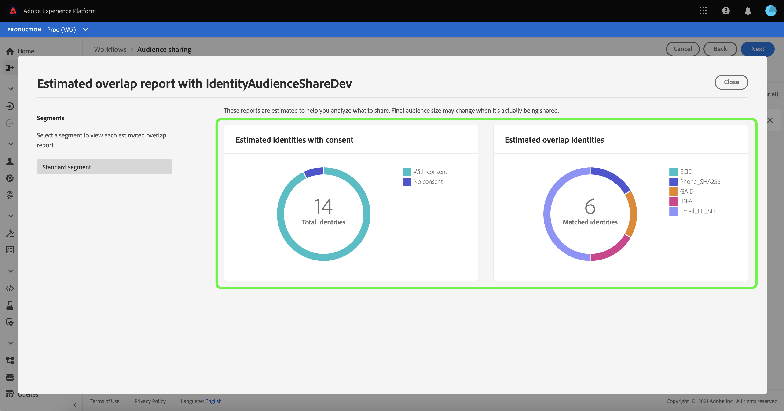

# (bèta) [!DNL Segment Match] overzicht

>[!IMPORTANT]
>
>[!DNL Segment Match] is momenteel in bèta. De documentatie en de functionaliteit kunnen worden gewijzigd.

Adobe Experience Platform Segment Match is een segment-delende dienst die voor twee of meer gebruikers van het Platform toestaat om segmentgegevens op een veilige, beheerde, en privacy-vriendelijke manier uit te wisselen. [!DNL Segment Match] gebruikt de privacynormen van het Platform en persoonlijke herkenningstekens zoals gehakte e-mails, gehakte telefoonaantallen, en apparatenherkenningstekens zoals IDFAs en GAIDs.

Met [!DNL Segment Match] u kunt:

* Het overlappingsproces van de identiteit beheren.
* Schattingen vóór het delen weergeven.
* Pas de etiketten van het gegevensgebruik toe om te controleren of de gegevens met partners kunnen worden gedeeld.
* Behoud het beheer van de levenscyclus van het gedeelde publiek na het publiceren van een voer en zet een dynamische uitwisseling van gegevens door mogelijkheden voort om toe te voegen, te schrappen, en te delen.

[!DNL Segment Match] gebruikt een proces van identiteitsoverlapping om ervoor te zorgen dat het delen van segmenten op een veilige en privacy-gerichte manier wordt gedaan. An **overlappende identiteit** is een identiteit die een gelijke in zowel uw segment als het segment van uw geselecteerde partner heeft. Voordat een segment wordt gedeeld tussen een afzender en een ontvanger, wordt tijdens het proces voor identiteitsoverlap gecontroleerd of er sprake is van overlapping in naamruimten en toestemmingscontroles tussen de verzender en de ontvanger(s). Beide overlappende controles moeten overgaan opdat een segment wordt gedeeld.

In de volgende secties vindt u meer informatie over [!DNL Segment Match], inclusief informatie over de installatie en de end-to-end workflow.

## Instellen

De volgende secties schetsen hoe te opstelling en te vormen [!DNL Segment Match]:

### Identiteitsgegevens en naamruimten instellen {#namespaces}

De eerste stap om aan de slag te gaan met [!DNL Segment Match] moet ervoor zorgen u gegevens tegen gesteunde identiteitsnamespaces inneemt.

Identiteitsnaamruimten zijn een component van [Adobe Experience Platform Identity Service](../../identity-service/home.md). Elke identiteit van de klant bevat een bijbehorende naamruimte die de context van de identiteit aangeeft. Een naamruimte kan bijvoorbeeld een waarde onderscheiden van &quot;name&quot;@email.com&quot; als e-mailadres of &quot;443522&quot; als een numerieke CRM-id.

Een volledig gekwalificeerde identiteit omvat een waarde van identiteitskaart en een namespace. Bij het afstemmen van recordgegevens in profielfragmenten (bijvoorbeeld wanneer [!DNL Real-time Customer Profile] Voegt profielgegevens samen), zowel de identiteitswaarde als de naamruimte moeten overeenkomen.

In de context van [!DNL Segment Match]naamruimten worden gebruikt in het overlappingsproces bij het delen van gegevens.

De lijst met ondersteunde naamruimten ziet er als volgt uit:

| Naamruimte | Beschrijving |
| --------- | ----------- |
| E-mails (SHA256, verlaagd) | A namespace for pre-hashed email address. Waarden die in deze naamruimte worden opgegeven, worden omgezet in kleine letters voordat er een hash plaatsvindt met SHA256. De spaties aan het begin en aan het einde moeten worden bijgesneden alvorens een e-mailadres wordt genormaliseerd. Deze instelling kan niet met terugwerkende kracht worden gewijzigd. Zie het volgende document op [SHA256-hashingondersteuning](https://experienceleague.adobe.com/docs/id-service/using/reference/hashing-support.html?lang=en#hashing-support) voor meer informatie . |
| Telefoon (SHA256_E.164) | A namespace that represents raw phone numbers that need to be hashed using both SHA256 and E.164 format. |
| ECID | Een naamruimte die een ECID-waarde (Experience Cloud ID) vertegenwoordigt. Naar deze naamruimte kan ook worden verwezen door de volgende aliassen: &quot;Adobe Marketing Cloud ID&quot;, &quot;Adobe Experience Cloud ID&quot;, &quot;Adobe Experience Platform ID&quot;. Zie de [ECID-overzicht](../../identity-service/ecid.md) voor meer informatie . |
| Apple IDFA (ID voor adverteerders) | Een naamruimte die Apple-id voor adverteerders vertegenwoordigt. Zie het volgende document op [op rente gebaseerde advertenties](https://support.apple.com/en-us/HT202074) voor meer informatie . |
| Google-advertentie-ID | A namespace that represents a Google Advertising ID. Zie het volgende document op [Google-advertentie-id](https://support.google.com/googleplay/android-developer/answer/6048248?hl=en) voor meer informatie . |

### Configuratie van toestemming instellen

U moet een toestemmingsconfiguratie verstrekken en zijn standaardwaarde plaatsen aan of `opt-in` of `opt-out` voor een toestemmingscontrole.

De controle van de opt-in en opt-out toestemming bepaalt of u met de toestemming kunt werken om gebruikersgegevens door gebrek te delen. Als het gebrek van de toestemmingsconfiguratie aan wordt geplaatst `opt-in`, kunnen gebruikersgegevens worden gedeeld, tenzij een gebruiker expliciet weigert. Als de standaardwaarde is ingesteld op `opt-out`, kunnen gebruikersgegevens niet worden gedeeld, tenzij een gebruiker expliciet binnen kiest.

De standaardtoestemmingsconfiguratie voor [!DNL Segment Match] is ingesteld op `opt-out`. Als u een aanmeldingsmodel voor uw gegevens wilt afdwingen, stuurt u een e-mailverzoek naar uw accountmanager van Adobe.

Voor meer informatie over de `share` kenmerk dat wordt gebruikt voor het instellen van de toestemmingswaarde voor gegevensdeling, zie de volgende documentatie over [privacy en toestemmingsgebiedsgroep](../../xdm/field-groups/profile/consents.md). Voor informatie over de specifieke veldgroep die wordt gebruikt om de toestemming van de consument voor het verzamelen en gebruiken van gegevens met betrekking tot privacy, personalisatie en marketingvoorkeuren, zie het volgende [Toestemming voor het voorbeeld van GitHub van de Voorkeur van de Privacy, van de Personalisatie en van de Marketing](https://github.com/adobe/xdm/blob/master/docs/reference/datatypes/consent/consent-preferences.schema.md).

### Gegevensgebruikslabels configureren

De laatste voorwaarde u moet vestigen is een nieuw etiket van het gegevensgebruik te vormen om gegevens te verhinderen delend. Via labels voor gegevensgebruik kunt u bepalen door welke gegevens het gaat [!DNL Segment Match].

Met labels voor gegevensgebruik kunt u gegevenssets en velden categoriseren op basis van het gebruiksbeleid dat op die gegevens van toepassing is. Labels kunnen op elk gewenst moment worden toegepast, zodat u op flexibele wijze gegevens kunt beheren. De beste praktijken bevorderen etiketteringsgegevens zodra het in Experience Platform wordt opgenomen, of zodra de gegevens voor gebruik in Platform beschikbaar worden.

[!DNL Segment Match] gebruikt het C11-label, een specifiek contractlabel voor [!DNL Segment Match] dat u handmatig aan alle datasets of kenmerken kunt toevoegen om ervoor te zorgen dat deze worden uitgesloten van de [!DNL Segment Match] procedure voor het delen van partners. Het label C11 geeft gegevens aan die niet mogen worden gebruikt in [!DNL Segment Match] processen. Nadat u hebt bepaald welke datasets en/of gebieden u van wilt uitsluiten [!DNL Segment Match] en voegt het label C11 dienovereenkomstig toe, wordt het label automatisch afgedwongen door de [!DNL Segment Match] workflow. [!DNL Segment Match] schakelt automatisch de [!UICONTROL Restrict data sharing] kernbeleid. Voor specifieke instructies over hoe te om de etiketten van het gegevensgebruik op datasets toe te passen, zie de zelfstudie op [gegevensgebruikslabels beheren in de gebruikersinterface](../../data-governance/labels/user-guide.md).

Voor een lijst met gegevensgebruikslabels en de bijbehorende definities raadpleegt u de [woordenlijst met gegevensgebruikslabels](../../data-governance/labels/reference.md). Voor informatie over het beleid van het gegevensgebruik, zie [overzicht van beleidsregels voor gegevensgebruik](../../data-governance/policies/overview.md).

### Begrijpen [!DNL Segment Match] machtigingen

Er zijn twee machtigingen gekoppeld aan [!DNL Segment Match]:

| Machtiging | Beschrijving |
| --- | --- |
| Verbindingen voor delen van publiek beheren | Deze toestemming staat u toe om het proces van de partnerhanddruk te voltooien, dat twee organisaties IMS verbindt om toe te laten [!DNL Segment Match] stromen. |
| Aandelen van publiek beheren | Met deze machtiging kunt u feeds maken, bewerken en publiceren (het pakket gegevens dat wordt gebruikt voor [!DNL Segment Match]) met actieve partners (partners die door de admin gebruiker met zijn verbonden **[!UICONTROL Audience Share Connections]** toegang). |

Zie de [toegangsbeheeroverzicht](../../access-control/home.md) voor meer informatie over toegangsbeheer en toestemmingen.

## [!DNL Segment Match] end-to-end workflow

Wanneer u uw identiteitsgegevens en naamruimten, toestemmingsconfiguratie, en het etiket van het gegevensgebruik hebt opgesteld, kunt u beginnen met het werken met [!DNL Segment Match] en de kenmerken ervan.

### Partner beheren

Selecteer in de gebruikersinterface van het Platform de optie **[!UICONTROL Segments]** van de linkernavigatie en selecteer dan **[!UICONTROL Feeds]** in de bovenste koptekst.

De [!UICONTROL Feeds] Deze pagina bevat een lijst met feeds die zijn ontvangen van partners en feeds die u hebt gedeeld. Om een lijst van bestaande partners te bekijken of een verbinding met een nieuwe partner te vestigen, selecteer **[!UICONTROL Manage partners]**.

Een verbinding tussen twee partners is een &quot;bidirectionele handdruk&quot;die als zelfbediening methode voor gebruikers dienst doet om hun organisaties van het Platform op een zandbakniveau samen te verbinden. De verbinding is vereist om het Platform te informeren dat een overeenkomst is gesloten en dat Platform de deelservices tussen u en uw partner(s) kan vergemakkelijken.

>[!NOTE]
>
>De &quot;bidirectionele handdruk&quot;tussen u en uw partner is strikt een verbinding. Tijdens dit proces worden geen gegevens uitgewisseld.

U kunt een lijst van verbindingen met bestaande partners in de belangrijkste interface van bekijken [!UICONTROL Manage partners] scherm. Op de rechterspoorlijn is de [!UICONTROL Share setting] , die u de mogelijkheid biedt om een nieuwe [!UICONTROL connect ID] en een invoervak waarin u de [!UICONTROL connect ID].

Een nieuwe [!UICONTROL connect ID], selecteert u **[!UICONTROL Regenerate]** krachtens [!UICONTROL Share setting] en selecteer vervolgens het kopieerpictogram naast de zojuist gegenereerde id.

Om een partner te verbinden die hun [!UICONTROL connect ID]Voer de unieke id-waarde in het invoervak onder [!UICONTROL Connect partner] en selecteer vervolgens **[!UICONTROL Request]**.

### Feed maken

A **voeden** is een groepering van gegevens (segmenten), de regels voor hoe dat gegeven kan worden blootgesteld of worden gebruikt, en de configuraties die bepalen hoe uw gegevens tegen de gegevens van uw partners worden aangepast. Een diervoeder kan onafhankelijk worden beheerd en via [!DNL Segment Match].

Als u een nieuwe feed wilt maken, selecteert u **[!UICONTROL Create feed]** van de [!UICONTROL Feeds] dashboard.

De basisopstelling van een voer omvat een naam, een beschrijving, en configuraties betreffende marketing gebruiksgevallen en identiteitsmontages. Geef een naam en een beschrijving voor uw feed op en pas vervolgens de gevallen van marketinggebruik toe waarvan u wilt dat uw gegevens worden uitgesloten. U kunt meerdere keren hoofdlettergebruik selecteren in een lijst met:

* [!UICONTROL Analytics]
* [!UICONTROL Combine with PII]
* [!UICONTROL Cross-site targeting]
* [!UICONTROL Data Science]
* [!UICONTROL Email targeting]
* [!UICONTROL Export to third party]
* [!UICONTROL Onsite advertising]
* [!UICONTROL Onsite personalization]
* [!UICONTROL Segment Match]
* [!UICONTROL Single identity personalization]

Selecteer ten slotte de juiste naamruimten voor uw feed. Voor informatie over de specifieke naamruimten die worden ondersteund door [!DNL Segment Match], zie de [tabel met identiteitsgegevens en naamruimten](#namespaces). Als u klaar bent, selecteert u **[!UICONTROL Next]**.

Zodra u de montages van uw voer hebt gevestigd, selecteer de segmenten u van uw lijst van eerste-partijsegmenten wilt delen. U kunt meer dan één segment uit de lijst selecteren en u kunt de rechter-spoorlijn gebruiken om uw lijst van geselecteerde segmenten te beheren. Als u klaar bent, selecteert u **[!UICONTROL Next]**.

De [!UICONTROL Share] wordt weergegeven, zodat u een interface hebt waarmee u de partners kunt selecteren waarmee u de feed wilt delen. Tijdens deze stap, kunt u het pre-aandeel overlap schattingsrapport ook bekijken en het aantal overlappende identiteiten door namespace tussen u en uw partner zien, het aantal overlappende identiteiten die toestemming hebben om gegevens te delen.

Selecteren **[!UICONTROL Analyze by segment]** het ramingenrapport te bekijken.

Het overlappende ramingenrapport staat u toe om overlappende en toestemmingscontroles per partner en per segment te beheren alvorens uw voer te delen.

| Metrics | Beschrijving |
| ------- | ----------- |
| Geschatte identiteiten met toestemming | Het totale aantal overlappende identiteiten die aan de toestemmingsvereisten voldoen die voor uw organisatie worden gevormd. |
| Geschatte overlappende identiteiten | Het aantal identiteiten die voor het geselecteerde segment kwalificeren en ook een gelijke met de geselecteerde partner hebben. Deze identiteiten worden weergegeven door naamruimte en vertegenwoordigen geen individuele profielidentiteiten. De overlap schattingen zijn gebaseerd op profielschetsen. |

Als u klaar bent, selecteert u **[!UICONTROL Close]**.

Als u uw partners hebt geselecteerd en uw rapport met overlappende schattingen hebt bekeken, selecteert u **[!UICONTROL Next]** om verder te gaan.

De [!UICONTROL Review] wordt weergegeven, zodat u uw nieuwe feed kunt controleren voordat deze wordt gedeeld en gepubliceerd. Deze stap omvat details over de identiteitsinstelling die u toepaste, evenals informatie over de gevallen, segmenten en partners van het marketinggebruik die u hebt geselecteerd.

Selecteren **[!UICONTROL Finish]** om verder te gaan.

### Feed bijwerken

Als u segmenten wilt toevoegen of verwijderen, selecteert u **[!UICONTROL Create feed]** van de [!UICONTROL Feeds] pagina en selecteer vervolgens **[!UICONTROL Existing feed]**. Selecteer in de lijst met bestaande feed die wordt weergegeven de feed die u wilt bijwerken en selecteer vervolgens **[!UICONTROL Next]**.

De lijst met segmenten wordt weergegeven. Van hieruit kunt u nieuwe segmenten aan uw feed toevoegen en kunt u de rechterrail gebruiken om segmenten te verwijderen die u niet meer nodig hebt. Als u de segmenten in uw feed hebt beheerd, selecteert u **[!UICONTROL Next]** en voert u de hierboven beschreven stappen uit om de bijgewerkte feed te voltooien.

>[!NOTE]
>
>Wanneer u toevoegt of een segment uit een gedeelde voer verwijdert, moet de ontvangende partner de verandering bevestigen door opnieuw toe te laten [!DNL Profile] schakelen in hun lijst met ontvangen feeds.

### Een inkomende feed accepteren

Als u een binnenkomende feed wilt weergeven, selecteert u **[!UICONTROL Received]** van de koptekst van de [!UICONTROL Feeds] en selecteer vervolgens de feed die u wilt weergeven in de lijst. Als u de feed wilt accepteren, selecteert u **[!UICONTROL Enable for profile]** en kan de status enkele ogenblikken worden bijgewerkt vanaf [!UICONTROL Pending] tot [!UICONTROL Enabled].

Nadat u een gedeelde feed hebt geaccepteerd, kunt u beginnen met het gebruik van de gedeelde gegevens om nieuwe segmenten te maken.

## Volgende stappen

Door dit document te lezen, hebt u meer inzicht gekregen in [!DNL Segment Match], de mogelijkheden en de end-to-end workflow. Raadpleeg de volgende documenten voor meer informatie over andere services van Platforms:

* [[!DNL Segmentation Service]](../home.md)
* [[!DNL Identity Service]](../../identity-service/home.md)
* [[!DNL Real-time Customer Profile] - overzicht](../../profile/home.md)
