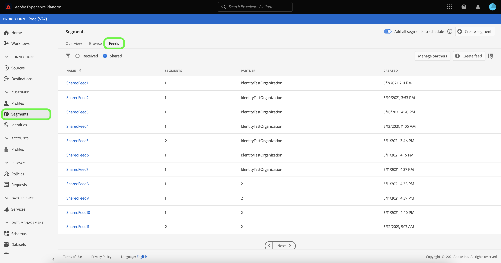

# [!DNL Segment Match]-overzicht

>[!IMPORTANT]
>
>Adobe introduceerde [!DNL Segment Match] in 2021 voor klanten om samen te werken en publiek uit te wisselen. Begin 2025, introduceerde Adobe [&#x200B; Real-Time CDP Collaboration &#x200B;](https://experienceleague.adobe.com/nl/docs/real-time-cdp-collaboration/using/home), die de langeretermijnbenadering is om dit gebruik-geval te ontmoeten.
>
>* Voor klanten in de Verenigde Staten, Canada, Australië en Nieuw-Zeeland: Adobe raadt Real-Time CDP Prime en Ultimate aan om samenwerkingskwesties op het gebied van overgangsgegevens te gebruiken van [!DNL Segment Match] naar Real-Time CDP Collaboration. Bekijk de [&#x200B; documentatie &#x200B;](https://experienceleague.adobe.com/nl/docs/real-time-cdp-collaboration/using/home) en [&#x200B; gids snel-begin &#x200B;](https://experienceleague.adobe.com/nl/docs/real-time-cdp-collaboration/using/quick-start-guide) voor Real-Time CDP Collaboration en contacteer uw de rekeningsteam van Adobe om meer te leren.
>* Voor klanten in alle andere geografische gebieden: [!DNL Segment Match] is de aanbevolen optie totdat Real-Time CDP Collaboration in 2026 in die geografische gebieden wordt uitgebracht.

Adobe Experience Platform Segment Match is een segment-delende dienst die voor twee of meer gebruikers van Experience Platform toestaat om segmentgegevens op een veilige, beheerde, en privacy-vriendelijke manier uit te wisselen. In [!DNL Segment Match] worden Experience Platform-privacystandaarden en persoonlijke id&#39;s gebruikt, zoals gehashte e-mails, gehashte telefoonnummers en apparaat-id&#39;s, zoals id&#39;s en GAID&#39;s.

Met [!DNL Segment Match] kunt u:

* Het overlappingsproces van de identiteit beheren.
* Schattingen vóór het delen weergeven.
* Pas de etiketten van het gegevensgebruik toe om te controleren of de gegevens met partners kunnen worden gedeeld.
* Behoud het beheer van de levenscyclus van het gedeelde publiek na het publiceren van een voer en zet een dynamische uitwisseling van gegevens door mogelijkheden voort om toe te voegen, te schrappen, en te delen.

[!DNL Segment Match] gebruikt een identiteitsoverlappingsproces om ervoor te zorgen dat het delen van segmenten op een veilige en privacy-gerichte manier wordt gedaan. Een **overlapte identiteit** is een identiteit die een gelijke in zowel uw segment als het segment van uw geselecteerde partner heeft. Voordat een segment wordt gedeeld tussen een afzender en een ontvanger, wordt tijdens het proces voor identiteitsoverlap gecontroleerd of er sprake is van overlapping in naamruimten en toestemmingscontroles tussen de verzender en de ontvanger(s). Beide overlappende controles moeten overgaan opdat een segment wordt gedeeld.

In de volgende secties vindt u meer informatie over [!DNL Segment Match] , zoals informatie over de installatie en de end-to-end workflow.

## Instellen

In de volgende secties wordt beschreven hoe u [!DNL Segment Match] kunt instellen en configureren:

### Identiteitsgegevens en naamruimten instellen {#namespaces}

De eerste stap om aan de slag te gaan met [!DNL Segment Match] is ervoor te zorgen dat u gegevens opgeeft tegen de ondersteunde naamruimten.

Identiteitsnaamruimten zijn een component van [&#x200B; de Dienst van de Identiteit van Adobe Experience Platform &#x200B;](../../../identity-service/home.md). Elke identiteit van de klant bevat een bijbehorende naamruimte die de context van de identiteit aangeeft. Bijvoorbeeld, kan een namespace een waarde van &quot;naam @email.com&quot;als e-mailadres of &quot;443522&quot;als numerieke identiteitskaart van CRM onderscheiden.

Een volledig gekwalificeerde identiteit omvat een waarde van identiteitskaart en een namespace. Wanneer recordgegevens worden vergeleken met profielfragmenten (bijvoorbeeld wanneer [!DNL Real-Time Customer Profile] profielgegevens samenvoegt), moeten zowel de identiteitswaarde als de naamruimte overeenkomen.

In de context van [!DNL Segment Match] worden naamruimten gebruikt in het overlappingsproces bij het delen van gegevens.

De lijst met ondersteunde naamruimten ziet er als volgt uit:

| Naamruimte | Beschrijving |
| --------- | ----------- |
| E-mails (SHA256, verlaagd) | A namespace for pre-hashed email address. Waarden die in deze naamruimte worden opgegeven, worden omgezet in kleine letters voordat er een hash plaatsvindt met SHA256. De spaties aan het begin en aan het einde moeten worden bijgesneden alvorens een e-mailadres wordt genormaliseerd. Deze instelling kan niet met terugwerkende kracht worden gewijzigd. Experience Platform biedt twee methodes aan om het hakken op gegevensinzameling, door [`setCustomerIDs` &#x200B;](https://experienceleague.adobe.com/docs/id-service/using/reference/hashing-support.html?lang=nl-NL#hashing-support) en door [&#x200B; gegevens prep &#x200B;](../../../data-prep/functions.md#hashing) te steunen. |
| Telefoon (SHA256_E.164) | A namespace that represents raw phone numbers that need to be hashed using both SHA256 and E.164 format. |
| ECID | Een naamruimte die een Experience Cloud ID-waarde (ECID) vertegenwoordigt. Deze naamruimte kan ook worden aangeduid met de volgende aliassen: &quot;Adobe Marketing Cloud ID&quot;, &quot;Adobe Experience Cloud ID&quot;, &quot;Adobe Experience Platform ID&quot;. Zie het [&#x200B; overzicht ECID &#x200B;](../../../identity-service/features/ecid.md) voor meer informatie. |
| Apple IDFA (ID voor adverteerders) | Een naamruimte die Apple-id voor adverteerders vertegenwoordigt. Zie het volgende document op [&#x200B; op rente-gebaseerde advertenties &#x200B;](https://support.apple.com/en-us/HT202074) voor meer informatie. |
| Google-ID | Een naamruimte die een Google Advertising-id vertegenwoordigt. Zie het volgende document op [&#x200B; identiteitskaart van Google Advertising &#x200B;](https://support.google.com/googleplay/android-developer/answer/6048248?hl=en) voor meer informatie. |

### Configuratie van toestemming instellen

U moet een toestemmingsconfiguratie verstrekken en zijn standaardwaarde aan of `opt-in` of `opt-out` voor een toestemmingscontrole plaatsen.

De controle van de opt-in en opt-out toestemming bepaalt of u met de toestemming kunt werken om gebruikersgegevens door gebrek te delen. Als de standaard voor de configuratie van de toestemming is ingesteld op `opt-out` , kunnen gebruikersgegevens worden gedeeld, tenzij een gebruiker dit expliciet weigert. Als de standaardwaarde is ingesteld op `opt-in` , kunnen gebruikersgegevens niet worden gedeeld, tenzij een gebruiker hier expliciet voor kiest.

De standaard toestemmingsconfiguratie voor [!DNL Segment Match] wordt geplaatst aan `opt-out`. Stuur een e-mailaanvraag naar uw Adobe-accountteam om een aanmeldingsmodel voor uw gegevens af te dwingen.

Voor meer informatie over het `share` attribuut dat wordt gebruikt om gegeven-delende toestemmingswaarde te plaatsen, zie de volgende documentatie over [&#x200B; privacy en de groep van het toestemmingsgebied van toestemmingen &#x200B;](../../../xdm/field-groups/profile/consents.md). Voor informatie over de specifieke gebiedsgroep die wordt gebruikt om de toestemming van de consument voor inzameling en gebruik van gegevens te vangen met betrekking tot privacy, verpersoonlijking en marketing voorkeur, zie de volgende [&#x200B; Toestemming voor Privacy, Personalization en het Voorkeur GitHub voorbeeld van de Marketing &#x200B;](https://github.com/adobe/xdm/blob/master/docs/reference/datatypes/consent/consent-preferences.schema.md).

### Gegevensgebruikslabels configureren

De laatste voorwaarde u moet vestigen is een nieuw etiket van het gegevensgebruik te vormen om gegevens te verhinderen delend. Via labels voor gegevensgebruik kunt u bepalen welke gegevens mogen worden gedeeld via [!DNL Segment Match] .

Met labels voor gegevensgebruik kunt u gegevenssets en velden categoriseren op basis van het gebruiksbeleid dat op die gegevens van toepassing is. Labels kunnen op elk gewenst moment worden toegepast, zodat u op flexibele wijze gegevens kunt beheren. De beste praktijken bevorderen etiketteringsgegevens zodra het in Experience Platform wordt opgenomen, of zodra de gegevens voor gebruik in Experience Platform beschikbaar worden.

[!DNL Segment Match] gebruikt het C11-label, een specifiek contractlabel voor [!DNL Segment Match] dat u handmatig kunt toevoegen aan gegevenssets of kenmerken om ervoor te zorgen dat deze worden uitgesloten van het [!DNL Segment Match] -partnerdelingsproces. Het label C11 geeft gegevens aan die niet mogen worden gebruikt in [!DNL Segment Match] -processen. Nadat u hebt bepaald welke datasets en/of gebieden u van [!DNL Segment Match] wilt uitsluiten en het etiket C11 dienovereenkomstig toevoegt, wordt het etiket automatisch afgedwongen door de [!DNL Segment Match] werkschema. [!DNL Segment Match] schakelt automatisch het [!UICONTROL Restrict data sharing] kernbeleid in. Voor specifieke instructies op hoe te om de etiketten van het gegevensgebruik op datasets toe te passen, zie het leerprogramma op [&#x200B; het beheren van de etiketten van het gegevensgebruik in UI &#x200B;](../../../data-governance/labels/user-guide.md).

Voor een lijst van de etiketten van het gegevensgebruik en hun definities, zie de [&#x200B; verklarende woordenlijst van de de etiketten van het gegevensgebruik &#x200B;](../../../data-governance/labels/reference.md). Voor informatie over het beleid van het gegevensgebruik, zie het [&#x200B; overzicht van het beleid van het gegevensgebruik &#x200B;](../../../data-governance/policies/overview.md).

### [!DNL Segment Match] -machtigingen

Er zijn twee machtigingen gekoppeld aan [!DNL Segment Match] :

| Machtiging | Beschrijving |
| --- | --- |
| Verbindingen voor delen van publiek beheren | Deze toestemming staat u toe om het proces van de partnerhanddruk te voltooien, dat twee organisaties verbindt om [!DNL Segment Match] stromen toe te laten. |
| Aandelen van publiek beheren | Met deze machtiging kunt u feeds (het pakket gegevens dat voor [!DNL Segment Match] wordt gebruikt) maken, bewerken en publiceren met actieve partners (partners die via **[!UICONTROL Audience Share Connections]** -toegang door de beheerder zijn verbonden). |

Zie het [&#x200B; overzicht van de toegangscontrole &#x200B;](../../../access-control/home.md) voor meer informatie over toegangsbeheer en toestemmingen.

## [!DNL Segment Match] end-to-end workflow

Wanneer u uw identiteitsgegevens en naamruimten, configuratie van de toestemming, en het etiket van het gegevensgebruik hebt opstelling, kunt u beginnen met het werken met [!DNL Segment Match] en zijn eigenschappen.

### Partner beheren

Selecteer in de gebruikersinterface van Experience Platform **[!UICONTROL Segments]** in de linkernavigatie en selecteer vervolgens **[!UICONTROL Feeds]** in de bovenste koptekst.

De pagina [!UICONTROL Feeds] bevat een lijst met feeds die zijn ontvangen van partners en feeds die u hebt gedeeld. Selecteer **[!UICONTROL Manage partners]** als u een lijst met bestaande partners wilt weergeven of een verbinding met een nieuwe partner wilt maken.

Een verbinding tussen twee partners is een &quot;bidirectionele handdruk&quot;die als zelfbediening methode voor gebruikers dienst doet om hun organisaties van Experience Platform op een zandbakniveau samen te verbinden. De verbinding is vereist om Experience Platform te laten weten dat er een overeenkomst is gesloten en dat Experience Platform het delen van services tussen u en uw partner(s) kan vergemakkelijken.

>[!NOTE]
>
>De &quot;bidirectionele handdruk&quot;tussen u en uw partner is strikt een verbinding. Tijdens dit proces worden geen gegevens uitgewisseld.

U kunt een lijst met verbindingen met bestaande partners in de belangrijkste interface van het [!UICONTROL Manage partners] scherm bekijken. Op de rechterrail is het [!UICONTROL Share setting] paneel, dat u van de optie voorziet om nieuwe [!UICONTROL connect ID] evenals een inputdoos te produceren waar u de partner [!UICONTROL connect ID] kunt ingaan.

Als u een nieuwe [!UICONTROL connect ID] wilt maken, selecteert u **[!UICONTROL Regenerate]** onder [!UICONTROL Share setting] en selecteert u vervolgens het kopieerpictogram naast de zojuist gegenereerde id.

Als u een partner wilt verbinden met behulp van hun [!UICONTROL connect ID] , typt u de unieke id-waarde in het invoervak onder [!UICONTROL Connect partner] en selecteert u **[!UICONTROL Request]** .

### Feed maken {#create-feed}

>[!CONTEXTUALHELP]
>id="platform_segment_match_marketing"
>title="Beperkte gevallen van marketinggebruik"
>abstract="Beperkte gevallen van marketinggebruik helpen uw partners te helpen ervoor te zorgen dat gedeelde segmenten correct worden gebruikt volgens uw beperkingen op het gebied van gegevensbeheer."
>text="Learn more in documentation"

A **voer** is een groepering van gegevens (segmenten), de regels voor hoe dat gegeven kan worden blootgesteld of worden gebruikt, en de configuraties die bepalen hoe uw gegevens tegen de gegevens van uw partners worden aangepast. Een feed kan onafhankelijk worden beheerd en via [!DNL Segment Match] worden uitgewisseld met andere Experience Platform-gebruikers.

Als u een nieuwe feed wilt maken, selecteert u **[!UICONTROL Create feed]** in het [!UICONTROL Feeds] -dashboard.

De basisopstelling van een voer omvat een naam, een beschrijving, en configuraties betreffende marketing gebruiksgevallen en identiteitsmontages. Geef een naam en een beschrijving voor uw feed op en pas vervolgens de gevallen van marketinggebruik toe waarvan u wilt dat uw gegevens worden uitgesloten. U kunt meerdere keren hoofdlettergebruik selecteren in een lijst die het volgende bevat:

* [!UICONTROL Analytics]
* [!UICONTROL Combine with PII]
* [!UICONTROL Cross-site targeting]
* [!UICONTROL Data Science]
* [!UICONTROL Email targeting]
* [!UICONTROL Export to third party]
* [!UICONTROL Onsite advertising]
* [!UICONTROL Onsite personalization]
* [!UICONTROL Segment Match]
* [!UICONTROL Single identity personalization]

Selecteer ten slotte de juiste naamruimten voor uw feed. Voor informatie over specifieke namespaces die door [!DNL Segment Match] worden gesteund, zie de [&#x200B; identiteitsgegevens en namespaces lijst &#x200B;](#namespaces). Selecteer **[!UICONTROL Next]** wanneer u klaar bent.

Zodra u de montages van uw voer hebt gevestigd, selecteer de segmenten u van uw lijst van eerste-partijsegmenten wilt delen. U kunt meer dan één segment uit de lijst selecteren en u kunt de rechter-spoorlijn gebruiken om uw lijst van geselecteerde segmenten te beheren. Als u klaar bent, selecteert u **[!UICONTROL Next]** .

De pagina [!UICONTROL Share] wordt weergegeven, zodat u een interface hebt waarmee u de partners kunt selecteren waarmee u de feed wilt delen. Tijdens deze stap, kunt u het pre-aandeel overlap schattingsrapport ook bekijken en het aantal overlappende identiteiten door namespace tussen u en uw partner zien, het aantal overlappende identiteiten die toestemming hebben om gegevens te delen.

Selecteer **[!UICONTROL Analyze by segment]** om het schattingsrapport weer te geven.

Het overlappende ramingenrapport staat u toe om overlappende en toestemmingscontroles per partner en per segment te beheren alvorens uw voer te delen.

| Metrics | Beschrijving |
| ------- | ----------- |
| Geschatte identiteiten met toestemming | Het totale aantal overlappende identiteiten die aan de toestemmingsvereisten voldoen die voor uw organisatie worden gevormd. |
| Geschatte overlappende identiteiten | Het aantal identiteiten die voor het geselecteerde segment kwalificeren en ook een gelijke met de geselecteerde partner hebben. Deze identiteiten worden weergegeven door naamruimte en vertegenwoordigen geen individuele profielidentiteiten. De overlap schattingen zijn gebaseerd op profielschetsen. |

Selecteer **[!UICONTROL Close]** wanneer u klaar bent.

Nadat u uw partners hebt geselecteerd en het rapport voor overlappende ramingen hebt bekeken, selecteert u **[!UICONTROL Next]** om door te gaan.

De stap [!UICONTROL Review] wordt weergegeven, zodat u uw nieuwe feed kunt bekijken voordat deze wordt gedeeld en gepubliceerd. Deze stap omvat details over de identiteitsinstelling die u toepaste, evenals informatie over de gevallen, de segmenten, en de partners van het marketing gebruik die u selecteerde.

Selecteer **[!UICONTROL Finish]** om door te gaan.

### Feed bijwerken

Als u segmenten wilt toevoegen of verwijderen, selecteert u **[!UICONTROL Create feed]** op de [!UICONTROL Feeds] -pagina en selecteert u vervolgens **[!UICONTROL Existing feed]** . Selecteer in de lijst met bestaande feed die wordt weergegeven de feed die u wilt bijwerken en selecteer vervolgens **[!UICONTROL Next]** .

De lijst met segmenten wordt weergegeven. Van hieruit kunt u nieuwe segmenten aan uw feed toevoegen en kunt u de rechterrail gebruiken om segmenten te verwijderen die u niet meer nodig hebt. Nadat u de segmenten in uw feed hebt beheerd, selecteert u **[!UICONTROL Next]** en voert u de hierboven beschreven stappen uit om de bijgewerkte feed te voltooien.

>[!NOTE]
>
>Wanneer u een segment toevoegt of verwijdert uit een gedeelde feed, moet de ontvangende partner de wijziging bevestigen door de [!DNL Profile] -schakeloptie opnieuw in te schakelen in de lijst met ontvangen feeds.

### Een inkomende feed accepteren

Als u een binnenkomende feed wilt weergeven, selecteert u **[!UICONTROL Received]** in de koptekst van de pagina [!UICONTROL Feeds] en selecteert u vervolgens de feed die u in de lijst wilt weergeven. Als u de feed wilt accepteren, selecteert u **[!UICONTROL Enable for profile]** en laat u de status enkele ogenblikken bijwerken van [!UICONTROL Pending] naar [!UICONTROL Enabled] .

Nadat u een gedeelde feed hebt geaccepteerd, kunt u beginnen met het gebruik van de gedeelde gegevens om nieuwe segmenten te maken.

## Volgende stappen

Door dit document te lezen hebt u meer inzicht gekregen in [!DNL Segment Match] , de mogelijkheden ervan en de end-to-end workflow. Raadpleeg de volgende documenten voor meer informatie over andere platformservices:

* [[!DNL Segmentation Service]](../../home.md)
* [[!DNL Identity Service]](../../../identity-service/home.md)
* [[!DNL Real-Time Customer Profile]-overzicht](../../../profile/home.md)
