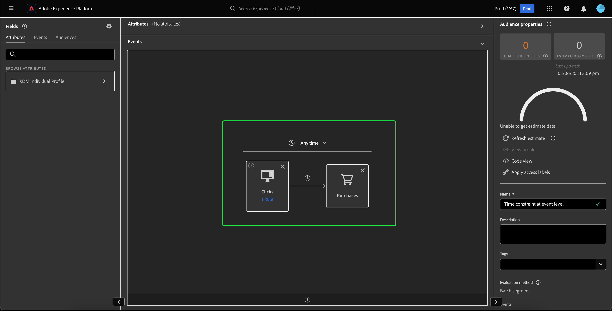

# Tijd beperkte reactoring {#refactorization}

>[!CONTEXTUALHELP]
>id="platform_audiences_segmentBuilder_constraints"
>title="Tijd beperkte reactoring"
>abstract="De regel-niveau en groep-vlakke tijdbeperkingen zijn verwijderd om tijdbeperkingsgebruik te verduidelijken. Schrijf de restrictie opnieuw als een beperking op canvasniveau of op kaartniveau."

De release van januari 2024 voor Adobe Experience Platform heeft wijzigingen aangebracht in Adobe Experience Platform Segmentation Service die nieuwe beperkingen toevoegen aan waar tijdbeperkingen kunnen worden gedefinieerd. Deze wijzigingen zijn van invloed op pas gemaakte of bewerkte segmenten die zijn gemaakt met de gebruikersinterface van Segment Builder. Deze gids verklaart hoe te om deze veranderingen te verlichten.

Vóór de versie van Januari 2024, verwijzen alle regel-niveau, groep-niveau, en canvas-vlakke tijdbeperkingen overtollig naar zelfde timestamp. Om tijdbeperkingsgebruik te verduidelijken, zijn regel-niveau en groep-vlakke tijdbeperkingen verwijderd. Om deze verandering aan te passen, moeten alle tijdbeperkingen **** als **canvas-niveau** of **kaart-niveau** tijdbeperkingen worden herschreven.

Eerder kon aan een afzonderlijke gebeurtenis meerdere regels voor tijdbeperking zijn gekoppeld. Met deze recente update, zal het proberen om een tijdbeperking aan een regel toe te voegen nu in een **fout** resulteren.

Tijdbeperkingen kunnen nu alleen op canvasniveau of op kaartniveau worden toegepast.

Wanneer u een tijdbeperking op canvasniveau toepast, kunt u nog steeds alle beschikbare tijdbeperkingen selecteren.

>[!NOTE]
>
>Als er slechts één **kaart op het canvas is, is het toepassen van de tijdbeperking op de kaart** gelijkwaardig **aan het toepassen van de tijdbeperking op canvas-niveau.**
>
>Als er **veelvoudige** kaarten op het canvas zijn, zal het toepassen van de tijdbeperking op canvas-niveau die tijdbeperking op **alle** kaarten op het canvas toepassen.

Als u een tijdbeperking op kaartniveau wilt toepassen, selecteert u de specifieke kaart waarop u de tijdbeperking wilt toepassen. De container **[!UICONTROL Event Rules]** wordt weergegeven. U kunt nu de tijdbeperking selecteren die u op de kaart wilt toepassen.

