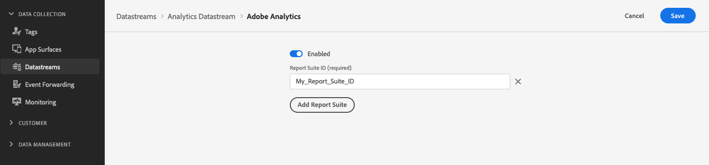

# Interactie met Adobe Analytics

## Overzicht {#overview}

Adobe Analytics-gegevensverzameling werkt door XDM-gegevens te vertalen naar een indeling die Adobe Analytics kan begrijpen. Verschillende XDM-velden zijn [automatisch toegewezen](../edge/data-collection/adobe-analytics/automatically-mapped-vars.md) naar variabelen Analytics.

U kunt ook [XDM-waarden handmatig toewijzen](../edge/data-collection/adobe-analytics/manually-mapping-variables.md) naar verouderde analytische variabelen.

Om Adobe Analytics in staat te stellen gegevens van server API te ontvangen, moet u [configureren, gegevensstroom](../edge/fundamentals/datastreams.md#adobe-analytics-settings) om gebeurtenissen naar Adobe Analytics door te sturen, door de rapportsuite-id in te voeren in de configuratiepagina van de gegevensstroom.



## Interactie met Adobe Analytics {#interacting-analytics}

### API-indeling {#format}

```http
POST https://server.adobedc.net/v2/interact?dataStreamId={DATASTREAM_ID}
```

### Verzoek {#request}

Het onderstaande voorbeeld bevat verschillende automatisch toegewezen waarden uit de `_experience.analytics` veldgroep. De klasse bevat ook op JSON gebaseerde gegevenslagen. Hoewel deze gegevenslagen niet automatisch kunnen worden toegewezen, is het mogelijk [Gegevensvoorvoegsel voor gegevensverzameling](../edge/fundamentals/datastreams.md#data-prep) om deze waarden toe te wijzen aan een schema dat gebiedsgroepen bevat hierboven van verwijzingen voorzien.

Alle waarden die gebruikers toewijzen aan die velden, worden automatisch toegewezen aan de juiste analysewaarden, alsof deze zijn opgenomen in de API-aanvraag.

```shell
curl -X POST "https://server.adobedc.net/v2/interact?dataStreamId={DATASTREAM_ID}" \
-H "Authorization: Bearer {TOKEN}" 
-H "x-gw-ims-org-id: {ORG_ID}" 
-H "x-api-key: {API_KEY}" 
-H "Content-Type: application/json" \
-d '{
   "event": {
      "xdm": {
         "eventType": "web.webpagedetails.pageViews",
         "web": {
            "webPageDetails": {
               "URL": "https://alloystore.dev",
               "name": "Home Page"
            },
            "webReferrer": {
               "URL": ""
            }
         },
         "device": {
            "screenHeight": 1440,
            "screenWidth": 3440,
            "screenOrientation": "landscape"
         },
         "environment": {
            "type": "browser",
            "browserDetails": {
               "viewportWidth": 3440,
               "viewportHeight": 1440
            }
         },
         "placeContext": {
            "localTime": "2022-03-22T22:45:21.193-06:00",
            "localTimezoneOffset": 360
         },
         "timestamp": "2022-03-23T04:45:21.193Z",
         "implementationDetails": {
            "name": "https://ns.adobe.com/experience/alloy/reactor",
            "version": "2.8.0+2.9.0",
            "environment": "browser"
         },
         "_experience": {
            "analytics": {
               "customDimensions": {
                  "eVars": {
                     "eVar14": "eVar14"
                  }
               },
               "event1to100": {
                  "event13": {
                     "value": 1
                  },
                  "event14": {
                     "value": 2
                  }
               }
            }
         }
      }
   },
   "data": {
      "page": {
         "pageInfo": {
            "pageName": "Promotions",
            "siteSection": "Home"
         },
         "promos": {
            "heroPromos": "purse,shoes,sunglasses"
         },
         "customVariables": {
            "testGroup": "orange/black theme"
         },
         "events": {
            "homePage": true
         },
         "products": [
            {
               "productSKU": "abc123",
               "productName": "shirt"
            }
         ]
      }
   }
}'
```

### Reactie {#response}

```json
{
   "requestId": "d2ad6364-5675-4a86-ba41-50e7a4c4a299",
   "handle": []
}
```
