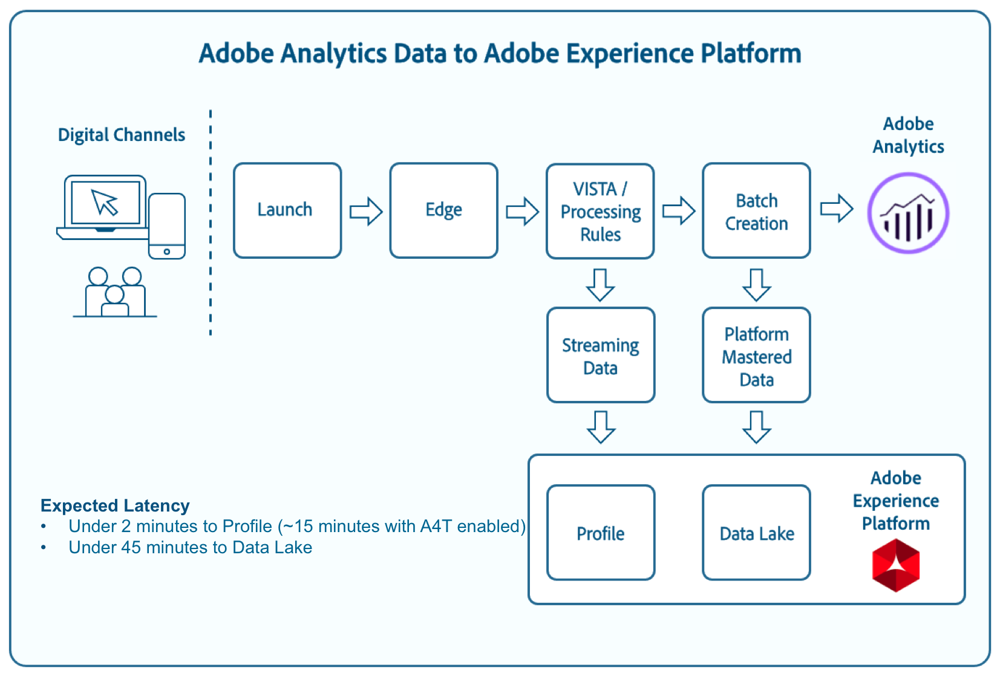

# Toewijzingsvelden voor analysemogelijkheden

Met het Adobe Experience Platform kunt u Adobe Analytics-gegevens innemen via de Analytics Data Connector (ADC). Sommige gegevens die via ADC worden ingevoerd, kunnen rechtstreeks van de gebieden van Analytics aan de gebieden van het Gegevensmodel van de Ervaring worden in kaart gebracht (XDM), terwijl andere gegevens transformaties en specifieke functies vereisen om met succes in kaart te worden gebracht.

## Directe toewijzingsvelden

Bepaalde velden worden rechtstreeks toegewezen van Adobe Analytics aan Experience Data Model (XDM).

De volgende tabel bevat kolommen met de naam van het veld Analytics (*veld* Analytics), het corresponderende veld XDM (veld *XDM) en het type ervan (type**XDM) en een beschrijving van het veld (* beschrijving **).

>[!NOTE] Schuif naar links/rechts om de volledige inhoud van de tabel weer te geven.

| Veld Analyse | XDM-veld | XDM-type | Beschrijving |
| --------------- | --------- | -------- | ---------- |
| m_evar1 - m_evar250 | _experience.analytics.customDimensions.eVars.eVar1 - _experience.analytics.customDimensions.eVars.eVar250 | string | Een aangepaste variabele, die kan variëren van 1 tot en met 250. Elke organisatie gebruikt deze aangepaste eVars anders. |
| m_prop1 - m_prop75 | _experience.analytics.customDimensions.props.prop1 - _experience.analytics.customDimensions.props.prop75 | string | Aangepaste verkeersvariabelen, die kunnen variëren van 1 tot 75. |
| m_browser | _experience.analytics.environment.browserID | integer | De nummer-id van de browser. |
| m_browser_height | environment.browserDetails.viewportHeight | integer | De hoogte van de browser, in pixels. |
| m_browser_breedte | environment.browserDetails.viewportWidth | integer | De breedte van de browser, in pixels. |
| m_campagne | marketing.trackingCode | string | De variabele die wordt gebruikt in de dimensie Code bijhouden. |
| m_kanaal | web.webPageDetails.siteSection | string | De variabele die wordt gebruikt in de dimensie Site-secties. |
| m_domain | environment.domain | string | De variabele die in de dimensie van het Domein wordt gebruikt. Dit wordt gebaseerd op de internetprovider (ISP) van de gebruiker. |
| m_geo_city | placeContext.geo.city | string | De naam van de stad van de hit. Dit is gebaseerd van het IP van de klap adres. |
| m_geo_dma | placeContext.geo.dmaID | integer | De numerieke id van het demografische gebied voor de hit. Dit is gebaseerd van het IP van de klap adres. |
| m_geo_region | placeContext.geo.stateProvince | string | De naam van de staat of regio van de treffer. Dit is gebaseerd van het IP van de klap adres. |
| m_geo_zip | placeContext.geo.postalCode | string | De postcode van de hit. Dit is gebaseerd van het IP van de klap adres. |
| m_trefwoorden | search.keywords | string | De variabele die in de afmeting van het Sleutelwoord wordt gebruikt. |
| m_os | _experience.analytics.environment.operatingSystemID | integer | De numerieke id die het besturingssysteem van de bezoeker vertegenwoordigt. Dit is gebaseerd op de user_agent kolom. |
| m_page_url | web.webPageDetails.URL | string | De URL van de paginaklok. |
| m_pagename_no_url | web.webPageDetails.name | string | Een variabele die wordt gebruikt om de afmetingen Pagina&#39;s te vullen. |
| m_reference | web.webReferrer.URL | string | De pagina-URL van de vorige pagina. |
| m_search_page_num | search.pageDepth | integer | Wordt gebruikt door de afmeting Alle zoekpaginaranalen. Hiermee geeft u aan op welke pagina met zoekresultaten uw site is weergegeven voordat de gebruiker op uw site heeft geklikt. |
| m_state | _experience.analytics.customDimensions.stateProvince | string | Staatvariabele. |
| m_user_server | web.webPageDetails.server | string | Een variabele die in de dimensie van de Server wordt gebruikt. |
| m_zip | _experience.analytics.customDimensions.postalCode | string | Een variabele die wordt gebruikt om de dimensie van de Code van het PIT te bevolken. |
| accept_language | environment.browserDetails.acceptLanguage | string | Hiermee worden alle geaccepteerde talen weergegeven, zoals wordt aangegeven in de HTTP-header van Accept-Language. |
| homepage | web.webPageDetails.isHomePage | boolean | Niet meer gebruikt. Geeft aan of de huidige URL de homepage van de browser is. |
| ipv6 | environment.ipV6 | string |
| j_jscript | environment.browserDetails.javaScriptVersion | string | De versie van JavaScript die door de browser wordt ondersteund. |
| user_agent | environment.browserDetails.userAgent | string | De userAgent-tekenreeks die in de HTTP-header wordt verzonden. |
| mobileappid | toepassing.name | string | De mobiele toepassings-id wordt opgeslagen in de volgende indeling: `[AppName][BundleVersion]`. |
| mobileapparaat | device.model | string | De naam van het mobiele apparaat. Op iOS wordt het opgeslagen als een door komma&#39;s gescheiden tekenreeks van 2 cijfers. Het eerste getal vertegenwoordigt de apparaatgeneratie en het tweede getal vertegenwoordigt de apparaatfamilie. |
| pointofinterest | placeContext.POIinteraction.POIDetail.name | string | Wordt gebruikt door mobiele services. Vertegenwoordigt het aandachtspunt. |
| pointofinterestdistance | placeContext.POIinteraction.POIDetail.geoInteractionDetails.distanceToCenter | getal | Wordt gebruikt door mobiele services. Geeft de afstand van het punt van de belangstelling aan. |
| mobiele plaatsnauwkeurigheid | placeContext.POIinteraction.POIDetail.geoInteractionDetails.deviceGeoAccuracy | getal | Verzameld van de contextgegevensvariabele a.loc.acc. Geeft de nauwkeurigheid van de GPS in meters aan op het moment van verzameling. |
| mobiele-placecategorieën | placeContext.POIinteraction.POIDetail.category | string | Verzameld van de contextgegevensvariabele a.loc.category. Beschrijft de categorie van een specifieke plaats. |
| mobileplaceid | placeContext.POIinteraction.POIDetail.POIID | string | Verzameld van de contextgegevensvariabele a.loc.id. Identificatiecode voor een bepaald aandachtspunt. |
| video | media.mediaTimed.primaryAssetReference._id | string | De naam van de video. |
| video | advertentie.adAssetReference._id | string | Identificatiecode van het advertentie-element. |
| videocontenttype | media.mediaTimed.primaryAssetViewDetails.broadcastContentType | string | Het inhoudstype Video. Deze wordt automatisch ingesteld op &quot;Video&quot; voor alle videoweergaven. |
| videoadpod | advertentie.adAssetViewDetails.adBreak._id | string | De pod waarin de video-advertentie zich bevindt. |
| videoadinpod | advertentie.addAssetViewDetails.index | integer | The position the Video Ad is in the pod. |
| videoplayernaam | media.mediaTimed.primaryAssetViewDetails.playerName | string | The name of the Video player. |
| videokanaal | media.mediaTimed.primaryAssetViewDetails.broadcastChannel | string | Het videokanaal. |
| videoadplayername | advertentie.adAssetViewDetails.playerName | string | The name of the Video Ad player. |
| videohoofdstuk | media.mediaTimed.mediaChapter.chapterAssetReference._id | string | The Video chapter&#39;s name |
| videonaam | media.mediaTimed.primaryAssetReference._dc.title | string | De naam van de video. |
| videoadname | advertentie.adAssetReference._dc.title | string | The name of the Video Ad. |
| videoshow | media.mediaTimed.primaryAssetReference._iptc4xmpExt.Series._iptc4xmpExt.Name | string | Video show. |
| videoseason | media.mediaTimed.primaryAssetReference._iptc4xmpExt.Season._iptc4xmpExt.Name | string | Videoseizoen. |
| videoepisode | media.mediaTimed.primaryAssetReference._iptc4xmpExt.episode._iptc4xmpExt.Name | string | Video-aflevering. |
| videonetwerk | media.mediaTimed.primaryAssetViewDetails.broadcastNetwork | string | Videonetwerk. |
| videoshowtype | media.mediaTimed.primaryAssetReference.showType | string | Type videoshow. |
| videoadload | media.mediaTimed.primaryAssetViewDetails.adLoadType | string | Video en laden. |
| videofeedtype | media.mediaTimed.primaryAssetViewDetails.sourceFeed | string | Type videofeed. |
| mobilebeaconmajor | placeContext.POIinteraction.POIDetail.beaconInteractionDetails.beaconMajor | getal | Belangrijkste baken voor mobiele services. |
| mobilebeaconminor | placeContext.POIinteraction.POIDetail.beaconInteractionDetails.beaconMinor | getal | Beacon minor mobiele diensten. |
| mobilebeaconuid | placeContext.POIinteraction.POIDetail.beaconInteractionDetails.proximityUID | string | Mobile Services beacon UUID. |
| videosessionid | media.mediaTimed.primaryAssetViewDetails._id | string | Video sessie-id. |
| videogene | media.mediaTimed.primaryAssetReference._iptc4xmpExt.Genre | array | Videogenre. | {title (Object), description (Object), type (Object), meta:xdmType (Object), items (tekenreeks), meta:xdmField (Object)} |
| mobiele installaties | application.firstLaunches | Object | Dit wordt geactiveerd bij de eerste uitvoering na installatie of herinstallatie | {id (string), value (number)} |
| mobileupgrades | application.upgrades | Object | Meldt het aantal upgrades van de app. Triggers bij de eerste looppas na verbetering of om het even welk ogenblik verandert het versieaantal. | {id (string), value (number)} |
| mobilelaunches | application.launch | Object | Het aantal keren dat de app is gestart. | {id (string), value (number)} |
| mobilecrashes | application.crashes | Object | <!-- MISSING --> | {id (string), value (number)} |
| mobilemessageclick | directMarketing.clicks | Object | <!-- MISSING --> | {id (string), value (number)} |
| mobileplaceentry | placeContext.POIinteraction.poiEntry | Object | <!-- MISSING --> | {id (string), value (number)} |
| mobileplaceexit | placeContext.POIinteraction.poiExits | Object | <!-- MISSING --> | {id (string), value (number)} |
| videotijd | media.mediaTimed.timePlayed | Object | <!-- MISSING --> | {id (string), value (number)} |
| videostart | media.mediaTimed.impressions | Object | <!-- MISSING --> | {id (string), value (number)} |
| video voltooid | media.mediaTimed.completes | Object | <!-- MISSING --> | {id (string), value (number)} |
| videosegmentatieweergaven | media.mediaTimed.mediaSegmentViews | Object | <!-- MISSING --> | {id (string), value (number)} |
| videoadstart | reclame.impressies | Object | <!-- MISSING --> | {id (string), value (number)} |
| videoadcomplete | reclame.completes | Object | <!-- MISSING --> | {id (string), value (number)} |
| videoadtime | advertentie.timePlayed | Object | <!-- MISSING --> | {id (string), value (number)} |
| videochapterstart | media.mediaTimed.mediaChapter.impressions | Object | <!-- MISSING --> | {id (string), value (number)} |
| videochaptercomplete | media.mediaTimed.mediaChapter.completes | Object | <!-- MISSING --> | {id (string), value (number)} |
| videochaptime | media.mediaTimed.mediaChapter.timePlayed | Object | <!-- MISSING --> | {id (string), value (number)} |
| videoplay | media.mediaTimed.start | Object | <!-- MISSING --> | {id (string), value (number)} |
| videototaltime | media.mediaTimed.totalTimePlayed | Object | <!-- MISSING --> | {id (string), value (number)} |
| videoqoetimetostart | media.mediaTimed.primaryAssetViewDetails.qoe.timeToStart | Object | De videokwaliteitstijd die moet worden gestart. | {id (string), value (number)} |
| videoqoedropbefore estart | media.mediaTimed.dropBeforeStart | Object | <!-- MISSING --> | {id (string), value (number)} |
| videoqoebuffercount | media.mediaTimed.primaryAssetViewDetails.qoe.buffers | Object | Aantal buffer voor videokwaliteit | {id (string), value (number)} |
| videoqoebuffertime | media.mediaTimed.primaryAssetViewDetails.qoe.bufferTime | Object | Buffertijd videokwaliteit | {id (string), value (number)} |
| videoquebitratechangecount | media.mediaTimed.primaryAssetViewDetails.qoe.bitrateChanges | Object | Aantal wijzigingen in videokwaliteit | {id (string), value (number)} |
| videoquobitrateavere | media.mediaTimed.primaryAssetViewDetails.qoe.bitrateAverage | Object | Gemiddelde bitsnelheid videokwaliteit | {id (string), value (number)} |
| videobeelden | media.mediaTimed.primaryAssetViewDetails.qoe.errors | Object | Aantal fouten in videokwaliteit | {id (string), value (number)} |
| videoqoedroppedframecount | media.mediaTimed.primaryAssetViewDetails.qoe.droppedFrames | Object | <!-- MISSING --> | {id (string), value (number)} |
| videoprogress10 | media.mediaTimed.progress10 | Object | <!-- MISSING --> | {id (string), value (number)} |
| videoprogress25 | media.mediaTimed.progress25 | Object | <!-- MISSING --> | {id (string), value (number)} |
| videoprogress50 | media.mediaTimed.progress50 | Object | <!-- MISSING --> | {id (string), value (number)} |
| videoprogress75 | media.mediaTimed.progress75 | Object | <!-- MISSING --> | {id (string), value (number)} |
| videoprogress95 | media.mediaTimed.progress95 | Object | <!-- MISSING --> | {id (string), value (number)} |
| videoresuim | media.mediaTimed.resumes | Object | <!-- MISSING --> | {id (string), value (number)} |
| videopausecount | media.mediaTimed.pauses | Object | <!-- MISSING --> | {id (string), value (number)} |
| videopausetime | media.mediaTimed.pauseTime | Object | <!-- MISSING --> | {id (string), value (number)} |
| videoseconssincelastcall | media.mediaTimed.primaryAssetViewDetails.sessionTimeout | integer |

## Toewijzingsvelden splitsen

Deze velden hebben één bron, maar koppelen aan **meerdere** XDM-locaties.

| Veld Analyse | XDM-veld | XDM-type | Beschrijving |
| --------------- | --------- | -------- | ---------- |
| s_resolution | device.screenWidth, device.screenHeight | integer | Numeric ID representing the resolution of the monitor. |
| mobileosversion | environment.operatingSystem, environment.operatingSystemVersion | string | Versie van mobiel besturingssysteem. |
| videoadlength | advertentie.adAssetReference._xmpDM.duration | integer | Lengte van video-advertentie. |

## Gegenereerde toewijzingsvelden

Selecteer velden die afkomstig zijn van ADC moeten worden getransformeerd. Voor het genereren in XDM is logica vereist die verder gaat dan een directe kopie van Adobe Analytics.

De volgende tabel bevat kolommen met de naam van het veld Analytics (*veld* Analytics), het corresponderende veld XDM (veld *XDM) en het type ervan (type**XDM) en een beschrijving van het veld (* beschrijving **).

>[!NOTE] Schuif naar links/rechts om de volledige inhoud van de tabel weer te geven.

| Veld Analyse | XDM-veld | XDM-type | Beschrijving |
| --------------- | --------- | -------- | ----------- |
| m_prop1 - m_prop75 | _experience.analytics.customDimensions.listprops.prop1 - _experience.analytics.customDimensions.listprops.prop75 | Object | Aangepaste verkeersvariabelen, variërend van 1-75 | {} |
| m_hier1 - m_hier5 | _experience.analytics.customDimensions.hiërarchies.hier1 - _experience.analytics.customDimensions.hiërarchies.hier5 | Object | Wordt gebruikt door hiërarchievariabelen. Bevat een | lijst met gescheiden waarden. | {values (array), delimiter (tekenreeks)} |
| m_mvar1 - m_mvar3 | _experience.analytics.customDimensions.lists.list1.list[] - _experience.analytics.customDimensions.lists.list3.list[] | array | Lijst met waarden van variabelen. Bevat een lijst met gescheiden waarden, afhankelijk van de implementatie | {value (string), key (string)} |
| m_color | device.colorDepth | integer | De kleurdiepte-id, die is gebaseerd op de waarde van de kolom c_color. |
| m_Cookies | environment.browserDetails.cookiesEnabled | boolean | Een variabele die in de dimensie van de Steun van het Koekje wordt gebruikt. |
| m_event_list | commerce.purchase, commerce.productViews, commerce.productListOpens, commerce.checkouts, commerce.productListAdds, commerce.productListRemovals, commerce.productListViews | Object | Standard commerce events triggered on the hit. | {id (string), value (number)} |
| m_event_list | _experience.analytics.event1to100.event1 - _experience.analytics.event1to100.event100, _experience.analytics.event101to200.event101 - _experience.analytics.event101to200.event20 , _experience.analytics.event201to300.event201 -_experience.analytics.event201to300.event300, _experience.analytics.event301to400.event301 - _experience.analytics.event30 1to400.event400, _experience.analytics.event401to500.event401 -_experience.analytics.event401to500.event500, _experience.analytics.event501to600.event5 01 - _experience.analytics.event501to600.event600, _experience.analytics.event601to700.event601 - _experience.analytics.event601to700.event700, _experience.analytics.event7 01to800.event701 - _experience.analytics.event701to800.event800, _experience.analytics.event801to900.event801 - _experience.analytics.event801to900.event 900, _experience.analytics.event901to1000.event901 -_experience.analytics.event901to1000.event1000 | Object | Aangepaste gebeurtenissen die worden geactiveerd tijdens de hit. | {id (Object), value (Object)} |
| m_geo_country | placeContext.geo.countryCode | string | Afkorting van het land waar de treffer vandaan kwam, dat is gebaseerd op het OT. |
| m_geo_latitude | placeContext.geo._schema.latitude | getal | <!-- MISSING --> |
| m_geo_longitude | placeContext.geo._schema.longitude | getal | <!-- MISSING --> |
| m_java_enabled | environment.browserDetails.javaEnabled | boolean | Een markering die aangeeft of Java is ingeschakeld. |
| m_latitude | placeContext.geo._schema.latitude | getal | <!-- MISSING --> |
| m_lengtegraad | placeContext.geo._schema.longitude | getal | <!-- MISSING --> |
| m_page_event_var1 | web.webInteraction.URL | string | Een variabele die alleen wordt gebruikt in aanvragen voor het bijhouden van koppelingen. Deze variabele bevat de URL van de downloadkoppeling, de afsluitkoppeling of de aangepaste koppeling waarop is geklikt. |
| m_page_event_var2 | web.webInteraction.name | string | Een variabele die alleen wordt gebruikt in aanvragen voor het bijhouden van koppelingen. Hier wordt de aangepaste naam van de koppeling weergegeven, als deze is opgegeven. |
| m_page_type | web.webPageDetails.isErrorPage | boolean | Een variabele die wordt gebruikt om de pagina&#39;s te vullen die niet worden gevonden. Deze variabele moet leeg zijn of &quot;ErrorPage&quot; bevatten. |
| m_pagename_no_url | web.webPageDetails.pageViews.value | getal | De naam van de pagina (indien ingesteld). Als er geen pagina is opgegeven, blijft deze waarde leeg. |
| m_paid_search | search.isPaid | boolean | Een vlag die wordt geplaatst als de treffer betaalde onderzoeksopsporing aanpast. |
| m_product_list | productListItems[].items | array | De productlijst, zoals die door de productvariabele wordt overgegaan. | {SKU (tekenreeks), quantity (geheel getal), priceTotal (getal)} |
| m_ref_type | web.webReferrer.type | string | Een numerieke id die het verwijzingstype voor de treffer vertegenwoordigt. 1 betekent in uw site, 2 betekent andere websites, 3 betekent zoekprogramma&#39;s, 4 betekent harde schijf, 5 betekent USENET, 6 betekent Typed/Bookmark (geen referentie), 7 betekent e-mail, 8 betekent Geen JavaScript en 9 betekent Sociale netwerken. |
| m_search_engine | search.searchEngine | string | De numerieke id die de zoekfunctie vertegenwoordigt die de bezoeker naar uw site heeft doorverwezen. |
| post_currency | commerce.order.currencyCode | string | De valutacode die tijdens de transactie werd gebruikt. |
| post_cust_hit_time_gmt | tijdstempel | string | Dit wordt slechts gebruikt in timestamp-Toegelaten datasets. Dit is de tijdstempel die samen met het bestand wordt verzonden, op basis van Unix-tijd. |
| post_cust_visid | identityMap | object | De bezoeker-id van de klant. |
| post_cust_visid | endUserIDs._experience.accustomid.primary | boolean | De bezoeker-id van de klant. |
| post_cust_visid | endUserIDs._experience.accustomid.namespace.code | string | De bezoeker-id van de klant. |
| post_visid_high + visid_low | identityMap | object | Een unieke id voor een bezoek. |
| post_visid_high + visid_low | endUserIDs._experience.aaid.id | string | Een unieke id voor een bezoek. |
| post_visid_high | endUserIDs._experience.aaid.primary | boolean | Wordt gebruikt in combinatie met visid_low om een bezoek op unieke wijze te identificeren. |
| post_visid_high | endUserIDs._experience.id.namespace.code | string | Wordt gebruikt in combinatie met visid_low om een bezoek op unieke wijze te identificeren. |
| post_visid_low | identityMap | object | Wordt gebruikt in combinatie met visid_high om een bezoek op unieke wijze te identificeren. |
| hit_time_gmt | receiveTimestamp | string | De tijdstempel van de hit, uitgedrukt in Unix-tijd. |
| hitid_high + hitid_low | _id | string | Een unieke id om een treffer te identificeren. |
| hitid_low | _id | string | Wordt gebruikt in combinatie met hitid_high om een treffer op unieke wijze te identificeren. |
| ip | environment.ipV4 | string | Het IP Adres, dat op de kopbal van HTTP van het beeldverzoek wordt gebaseerd. |
| j_jscript | environment.browserDetails.javaScriptEnabled | boolean | De gebruikte versie van JavaScript. |
| mcvisid_high + mcvisid_low | identityMap | object | De Experience Cloud Visitor ID. |
| mcvisid_high + mcvisid_low | endUserIDs._experience.mcid.id | string | De Experience Cloud Visitor ID. |
| mcvisid_high | endUserIDs._experience.mcid.primary | boolean | De Experience Cloud Visitor ID. |
| mcvisid_high | endUserIDs._experience.mcid.namespace.code | string | De Experience Cloud Visitor ID. |
| mcvisid_low | identityMap | object | De Experience Cloud Visitor ID. |
| sdid_high + sdid_low | _experience.target.supplementalDataID | string | Id voor tikken. The analytics field sdid_high and sdid_low is the additional data id used to stitch two (or more) inkomend hits together. |
| Moblebeaconproximiteit | placeContext.POIinteraction.POIDetail.beaconInteractionDetails.proximity | string | Bandennabijheid mobiele services. |
| videohoofdstuk | media.mediaTimed.mediaChapter.chapterAssetReference._xmpDM.duration | integer | De naam van het videohoofdstuk. |
| videolengte | media.mediaTimed.primaryAssetReference._xmpDM.duration | integer | De lengte van de video. |

## Geavanceerde toewijzingsvelden

Selecteer velden (ook wel &quot;postwaarden&quot; genoemd) die geavanceerdere transformaties vereisen voordat ze kunnen worden toegewezen van Adobe Analytics-velden naar Experience Data Model (XDM). Wanneer u deze geavanceerde transformaties uitvoert, gebruikt u Adobe Experience Platform Query Service en vooraf gebouwde functies (zogenaamde door Adobe gedefinieerde functies) voor sessionisatie, attributie en deduplicatie.

Meer informatie over het uitvoeren van deze transformaties met behulp van de Dienst van de Vraag, gelieve de [door Adobe bepaalde functiedocumentatie](../../../query-service/sql/adobe-defined-functions.md) te bezoeken.

De volgende tabel bevat kolommen met de naam van het veld Analytics (*veld* Analytics), het corresponderende veld XDM (veld *XDM) en het type ervan (type**XDM) en een beschrijving van het veld (* beschrijving **).

>[!NOTE] Schuif naar links/rechts om de volledige inhoud van de tabel weer te geven.

| Veld Analyse | XDM-veld | XDM-type | Beschrijving |
| --------------- | --------- | -------- | ---------- |
| post_evar1 - post_evar250 | _experience.analytics.customDimensions.eVars.eVar1 - _experience.analytics.customDimensions.eVars.eVar250 | string | Een aangepaste variabele, die kan variëren van 1 tot en met 250. Elke organisatie gebruikt deze aangepaste eVars anders. |
| post_prop1 - post_prop75 | _experience.analytics.customDimensions.props.prop1 - _experience.analytics.customDimensions.props.prop75 | string | Aangepaste verkeersvariabelen, die kunnen variëren van 1 tot 75. |
| post_browser_height | environment.browserDetails.viewportHeight | integer | De hoogte van de browser, in pixels. |
| post_browser_width | environment.browserDetails.viewportWidth | integer | De breedte van de browser, in pixels. |
| post_campagne | marketing.trackingCode | string | De variabele die wordt gebruikt in de dimensie Code bijhouden. |
| post_channel | web.webPageDetails.siteSection | string | De variabele die wordt gebruikt in de dimensie Site-secties. |
| post_cust_visid | endUserIDs._experience.aaccustomid.id | string | De aangepaste bezoeker-id, indien ingesteld. |
| post_first_hit_page_url | _experience.analytics.endUser.firstWeb.webPageDetails.URL | string | De URL van de eerste pagina die de bezoeker bereikt. |
| post_first_hit_pagename | _experience.analytics.endUser.firstWeb.webPageDetails.name | string | Een variabele die wordt gebruikt in de oorspronkelijke dimensie van de Pagina van de Ingang. De paginanaam van de ingangspagina van de bezoeker. |
| post_trefwoorden | search.keywords | string | De trefwoorden die voor de hit zijn verzameld. |
| post_page_url | web.webPageDetails.URL | string | De URL van de paginaklok. |
| post_pagename_no_url | web.webPageDetails.name | string | Een variabele die wordt gebruikt om de afmetingen Pagina&#39;s te vullen. |
| post_purchase_eid | commerce.order.purchaseID | string | Variabele die wordt gebruikt om aankopen uniek te identificeren. |
| post_reference | web.webReferrer.URL | string | De URL van de vorige pagina. |
| post_state | _experience.analytics.customDimensions.stateProvince | string | Staatvariabele. |
| post_user_server | web.webPageDetails.server | string | Een variabele die in de dimensie van de Server wordt gebruikt. |
| post_zip | _experience.analytics.customDimensions.postalCode | string | Een variabele die wordt gebruikt om de dimensie van de Code van het PIT te bevolken. |
| browser | _experience.analytics.environment.browserID | integer | De numerieke id van de browser. |
| domein | environment.domain | string | De variabele die in de dimensie van het Domein wordt gebruikt. Dit wordt gebaseerd op de internetprovider (ISP) van de gebruiker. |
| first_hit_reference | _experience.analytics.endUser.firstWeb.webReferrer.URL | string | De eerste verwijzende URL voor de bezoeker. |
| geo_city | placeContext.geo.city | string | De naam van de stad van de hit. Dit is gebaseerd van het IP van de klap adres. |
| geo_dma | placeContext.geo.dmaID | integer | De numerieke id van het demografische gebied voor de hit. Dit is gebaseerd van het IP van de klap adres. |
| geo_region | placeContext.geo.stateProvince | string | De naam van de staat of regio van de treffer. Dit is gebaseerd van het IP van de klap adres. |
| geo_zip | placeContext.geo.postalCode | string | De postcode van de hit. Dit is gebaseerd van het IP van de klap adres. |
| os | _experience.analytics.environment.operatingSystemID | integer | De numerieke id die het besturingssysteem van de bezoeker vertegenwoordigt. Dit is gebaseerd op de user_agent kolom. |
| search_page_num | search.pageDepth | integer | Deze variabele wordt gebruikt door de Al dimensie van de Rang van de Pagina van het Onderzoek en wijst op welke pagina van onderzoeksresultaten uw plaats | is weergegeven voordat de gebruiker op uw site heeft geklikt. |
| visit_keywords | _experience.analytics.session.search.keywords | string | Een variabele die wordt gebruikt in de dimensie Trefwoorden zoeken. |
| visit_num | _experience.analytics.session.num | integer | Een variabele die wordt gebruikt in de dimensie Visit Number. Dit begint bij 1, en stijgt telkens als een nieuw bezoek (per gebruiker) begint. |
| visit_page_num | _experience.analytics.session.depth | integer | Een variabele die wordt gebruikt in de dimensie van de Diepte van het Actief. Deze waarde neemt toe met 1 voor elke hit die de gebruiker genereert en herstelt na elk bezoek. |
| visit_reference | _experience.analytics.session.web.webReferrer.URL | string | De eerste referentie van het bezoek. |
| visit_search_page_num | _experience.analytics.session.search.pageDepth | integer | De naam van de eerste pagina van het bezoek. |
| post_prop1 - post_prop75 | _experience.analytics.customDimensions.listprops.prop1 - _experience.analytics.customDimensions.listprops.prop75 | Object | Aangepaste verkeersvariabelen 1-75. |
| post_hier1 - post_hier5 | _experience.analytics.customDimensions.hiërarchies.hier1 - _experience.analytics.customDimensions.hiërarchies.hier5 | Object | Wordt gebruikt door hiërarchievariabelen en bevat een lijst met waarden die zijn gescheiden door scheidingstekens. | {values (array), delimiter (tekenreeks)} |
| post_mvar1 - post_mvar3 | _experience.analytics.customDimensions.lists.list1.list[] - _experience.analytics.customDimensions.lists.list3.list[] | array | Een lijst met waarden van variabelen. Bevat een lijst met gescheiden waarden, afhankelijk van de implementatie. | {value (string), key (string)} |
| post_cookies | environment.browserDetails.cookiesEnabled | boolean | Variabele die in de dimensie van de Steun van het Koekje wordt gebruikt. |
| post_event_list | commerce.purchase, commerce.productViews, commerce.productListOpens, commerce.checkouts, commerce.productListAdds, commerce.productListRemovals, commerce.productListViews | Object | De standaard handelgebeurtenissen teweegbrachten op de slag. | {id (string), value (number)} |
| post_event_list | _experience.analytics.event1to100.event1 - _experience.analytics.event1to100.event100, _experience.analytics.event101to200.event101 - _experience.analytics.event101to200.event20 , _experience.analytics.event201to300.event201 -_experience.analytics.event201to300.event300, _experience.analytics.event301to400.event301 - _experience.analytics.event30 1to400.event400, _experience.analytics.event401to500.event401 -_experience.analytics.event401to500.event500, _experience.analytics.event501to600.event5 01 - _experience.analytics.event501to600.event600, _experience.analytics.event601to700.event601 - _experience.analytics.event601to700.event700, _experience.analytics.event7 01to800.event701 - _experience.analytics.event701to800.event800, _experience.analytics.event801to900.event801 - _experience.analytics.event801to900.event 900, _experience.analytics.event901to1000.event901 -_experience.analytics.event901to1000.event1000 | Object | Aangepaste gebeurtenissen die worden geactiveerd tijdens de hit. | {id (Object), value (Object)} |
| post_java_enabled | environment.browserDetails.javaEnabled | boolean | Een markering die aangeeft of Java is ingeschakeld. |
| post_latitude | placeContext.geo._schema.latitude | getal | <!-- MISSING --> |
| post_longitude | placeContext.geo._schema.longitude | getal | <!-- MISSING --> |
| post_page_event | web.webInteraction.type | string | Het type hit dat wordt verzonden in de afbeeldingsaanvraag (klik op Standaard, Koppeling downloaden, Koppeling afsluiten of Aangepaste koppeling). |
| post_page_event | web.webInteraction.linkClicks.value | getal | Het type hit dat wordt verzonden in de afbeeldingsaanvraag (klik op Standaard, Koppeling downloaden, Koppeling afsluiten of Aangepaste koppeling). |
| post_page_event_var1 | web.webInteraction.URL | string | Deze variabele wordt alleen gebruikt in aanvragen voor het bijhouden van koppelingen. Dit is de URL van de downloadkoppeling, de afsluitkoppeling of de aangepaste koppeling waarop is geklikt. |
| post_page_event_var2 | web.webInteraction.name | string | Deze variabele wordt alleen gebruikt in aanvragen voor het bijhouden van koppelingen. Dit wordt de aangepaste naam van de koppeling. |
| post_page_type | web.webPageDetails.isErrorPage | boolean | Dit wordt gebruikt om de pagina&#39;s te vullen die niet zijn gevonden. Deze variabele moet leeg zijn of &quot;ErrorPage&quot; bevatten |
| post_pagename_no_url | web.webPageDetails.pageViews.value | getal | De naam van de pagina (indien ingesteld). Als er geen pagina is opgegeven, blijft deze waarde leeg. |
| post_product_list | productListItems[].items | array | De productlijst, zoals die door de productvariabele wordt overgegaan. | {SKU (tekenreeks), quantity (geheel getal), priceTotal (getal)} |
| post_search_engine | search.searchEngine | string | De numerieke id die de zoekfunctie vertegenwoordigt die de bezoeker naar uw site heeft doorverwezen. |
| mvar1_instances | .list.items[] | Object | Lijst met waarden van variabelen. Bevat een lijst met gescheiden waarden, afhankelijk van de implementatie. |
| mvar2_instances | .list.items[] | Object | Lijst met waarden van variabelen. Bevat een lijst met gescheiden waarden, afhankelijk van de implementatie. |
|  | mvar3_instances | .list.items[] | Object | Lijst met waarden van variabelen. Bevat een lijst met gescheiden waarden, afhankelijk van de implementatie. |
| kleur | device.colorDepth | integer | Kleurdiepte-id, gebaseerd op de waarde van de kolom c_color. |
| first_hit_ref_type | _experience.analytics.endUser.firstWeb.webReferrer.type | string | De numerieke id die het referentietype van de allereerste referentie van de bezoeker vertegenwoordigt. |
| first_hit_time_gmt | _experience.analytics.endUser.firstTimestamp | integer | Tijdstempel van de allereerste hit van de bezoeker in Unix-tijd. |
| geo_country | placeContext.geo.countryCode | string | Afkorting van het land waar de treffer vandaan kwam, op basis van IP. |
| geo_latitude | placeContext.geo._schema.latitude | getal | <!-- MISSING --> |
| geo_longitude | placeContext.geo._schema.longitude | getal | <!-- MISSING --> |
| pay_search | search.isPaid | boolean | Een vlag die wordt geplaatst als de treffer betaalde onderzoeksopsporing aanpast. |
| ref_type | web.webReferrer.type | string | Een numerieke id die het verwijzingstype voor de treffer vertegenwoordigt. |
| visit_paid_search | _experience.analytics.session.search.isPaid | boolean | Een vlag (1=betaald, 0=niet betaald) die erop wijst of de eerste klap van het bezoek van een betaalde onderzoekshit was. |
| visit_ref_type | _experience.analytics.session.web.webReferrer.type | string | Numerieke id die het referentietype van de eerste referentie van het bezoek vertegenwoordigt. |
| visit_search_engine | _experience.analytics.session.search.searchEngine | string | Numerieke id van de eerste zoekfunctie van het bezoek. |
| visit_start_time_gmt | _experience.analytics.session.timestamp | integer | Tijdstempel van de eerste hit van het bezoek in Unix-tijd. |
