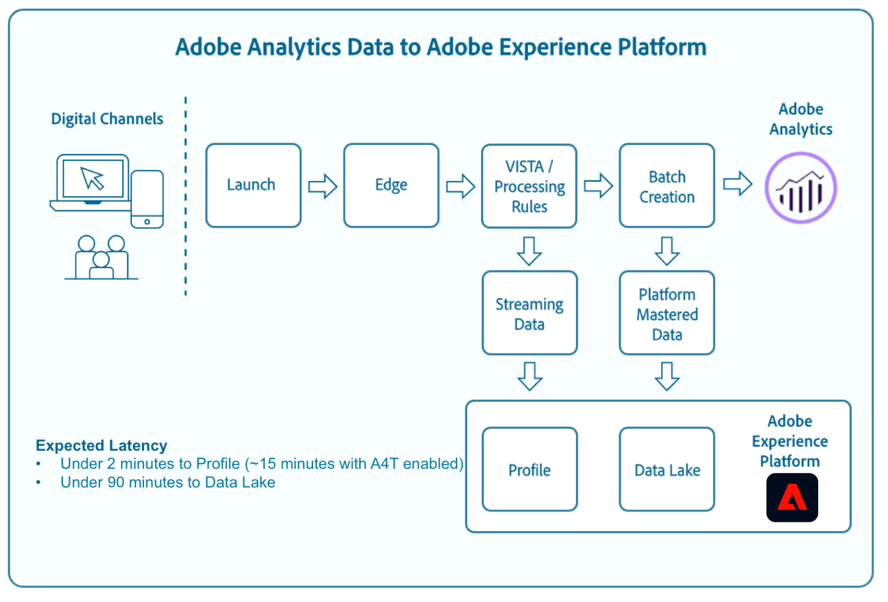

# Gegevensconnector Analytics

Met het Adobe Experience Platform kunt u Adobe Analytics-gegevens innemen via de Analytics Data Connector (ADC). ADC streamt gegevens die door Adobe Analytics in real-time naar Platform worden verzameld, waarbij gegevens van Analytics met SCDS-indeling worden omgezet in XDM-velden (Experience Data Model) voor gebruik door Platform.

Dit document biedt een overzicht van Adobe Analytics en beschrijft de gebruiksscenario&#39;s voor Analytics-gegevens.

## Gegevens van Adobe Analytics en Analytics

Adobe Analytics is een krachtige engine waarmee u meer kunt leren over uw klanten, hoe ze met uw wegeigenschappen werken, kunt zien waar uw uitgaven voor digitale marketing effectief zijn en verbeteringsgebieden kunt identificeren. Adobe Analytics verwerkt miljarden webtransacties per jaar en ADC stelt u in staat eenvoudig gebruik te maken van deze rijke gedragsgegevens en het Real-time Klantprofiel binnen enkele minuten te verrijken.

Op hoog niveau verzamelt Adobe Analytics gegevens via verschillende digitale kanalen en meerdere datacenters over de hele wereld. Zodra de gegevens zijn verzameld, worden de regels van Visitor Identification, Segmentation and Transformation Architecture (VISTA) en de verwerkingsregels toegepast om de inkomende gegevens vorm te geven. Nadat de ruwe gegevens door deze lichte verwerking zijn gegaan, wordt het dan beschouwd klaar voor consumptie door het Profiel van de Klant in real time. In een proces parallel aan het bovengenoemde, worden de zelfde verwerkte gegevens microbatched en opgenomen in de datasets van het Platform voor consumptie door de Werkruimte van de Wetenschap van Gegevens, de Dienst van de Vraag, en andere gegevens-ontdekkingstoepassingen.

Zie de volgende documenten voor meer informatie over VISTA en verwerkingsregels:
* [Overzicht van VISTA-regels](https://marketing.adobe.com/resources/help/en_US/reference/VISTA.html)
* [Overzicht van verwerkingsregels](https://docs.adobe.com/content/help/en/analytics/admin/admin-tools/processing-rules/processing-rules.html)

## Experience Data Model (XDM)

XDM is een openbaar gedocumenteerde specificatie die gemeenschappelijke structuren en definities voor een toepassing verstrekt om met de diensten op het Platform van de Ervaring van Adobe te communiceren.

Door te voldoen aan XDM-standaarden kunnen gegevens op uniforme wijze worden opgenomen, waardoor het eenvoudiger wordt om gegevens te leveren en informatie te verzamelen.

Zie het [XDM-systeemoverzicht](../../../xdm/home.md)voor meer informatie over XDM.

## Hoe worden velden van Adobe Analytics toegewezen aan XDM?

Wanneer een bronverbinding tot stand is gebracht voor het overbrengen van analysegegevens naar het ervaringsplatform via de gebruikersinterface van het platform, worden gegevensvelden automatisch toegewezen en opgenomen in het realtime-klantprofiel binnen enkele minuten. Zie de zelfstudie over de gegevensaansluiting [Analytics voor instructies over het maken van een bronverbinding met Adobe Analytics via de interface van het platform](../../tutorials/ui/create/adobe-applications/analytics.md).

Voor gedetailleerde informatie over de veldmapping die plaatsvindt tussen Analytics en Experience Platform, raadpleegt u de [handleiding voor het toewijzen](./analytics-mapping.md) van veldgegevens in Adobe Analytics.

## Wat is de verwachte latentie voor de Gegevens van Analytics op Platform?

| Analysegegevens | Verwachte vertraging |
| -------------- | ---------------- |
| Nieuwe gegevens naar Real-time klantprofiel (A4T **niet** ingeschakeld) | &lt; 2 minuten |
| Nieuwe gegevens naar Real-time klantprofiel (A4T **is** ingeschakeld) | &lt; 15 minuten |
| Nieuwe gegevens voor Data Lake | &lt; 45 minuten |
| Backfill-gegevens (13 maanden of 10 miljard gebeurtenissen, afhankelijk van welke waarde lager is) | &lt; 4 weken |

>[!NOTE] De latentie zal afhankelijk van klantenconfiguratie, gegevensvolumes, en de toepassingen van de consument variëren. Bijvoorbeeld, als de implementatie van Analytics met `A4T` de latentie aan Pijpleiding wordt gevormd zal tot 5-10 minuten stijgen.