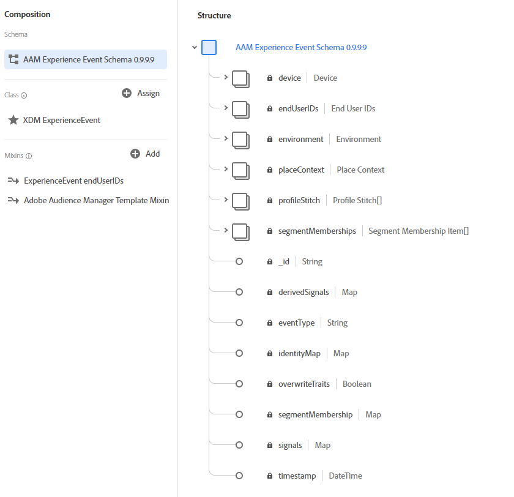

# Poortbeheeraansluiting

De gegevensverbindingsstromen van de Manager van de Publiek van Adobe de gegevens eerste partijgegevens die in de Manager van de Publiek van Adobe aan het Platform van de Ervaring van Adobe worden verzameld. De schakelaar van de Manager van de Publiek neemt drie categorieën gegevens aan Platform op:

- **Realtime gegevens:** Gegevens die in real time worden vastgelegd op de gegevensverzamelingsserver van Audience Manager. Deze gegevens worden gebruikt in de Manager van de Publiek om op regel gebaseerde eigenschappen te bevolken en zullen in Platform in de kortste latentietijd oppervlakten.
- **Gegevens aan boord (binnenkomend):** Dit zijn de bestanden die door een gebruiker zijn geüpload naar een Amazon S3-locatie die wordt gehost door Audience Manager. Audience Manager gebruikt deze gegevens om met de binnenkomende bestandsmethode onbemande traits te vullen en heeft enige vertraging.
- **Profielgegevens:** Audience Manager gebruikt realtime en onbeheerde gegevens om klantprofielen af te leiden. Deze profielen worden gebruikt om identiteitsgrafieken en eigenschappen op segmentrealisaties te bevolken.

De schakelaar van de Manager van de Publiek brengt deze gegevenscategorieën aan het schema van het Model van Gegevens van de Ervaring (XDM) in kaart en verzendt hen naar Platform. Realtime-gegevens en gegevens aan boord worden verzonden als XDM ExperienceEvent-gegevens, terwijl profielgegevens worden verzonden als XDM Individuele profielen.

Voor instructies over het maken van een verbinding met Adobe Audience Manager met behulp van de platforminterface raadpleegt u de [zelfstudie](../../tutorials/ui/create/adobe-applications/audience-manager.md)voor de aansluiting van Audience Manager.

## Wat is het Model van de Gegevens van de Ervaring (XDM)?

XDM is een openbaar gedocumenteerde specificatie die een gestandaardiseerd kader verstrekt waardoor het Platform gegevens van de klantenervaring organiseert.

Door zich aan XDM-standaarden te houden, kunnen gegevens voor klantervaring op uniforme wijze worden opgenomen, waardoor het eenvoudiger wordt om gegevens te leveren en informatie te verzamelen.

Voor meer informatie over hoe XDM in het Platform van de Ervaring wordt gebruikt, zie het overzicht [van het Systeem](../../../xdm/home.md)XDM. Meer over leren hoe de Schema&#39;s XDM zoals Profiel en ExperienceEvent gestructureerd zijn, zie de [grondbeginselen van schemacompositie](../../../xdm/schema/composition.md).

## Voorbeelden van XDM-schema&#39;s

Hieronder volgen voorbeelden van de structuur van Audience Manager die is toegewezen aan XDM ExperienceEvent en XDM Individual Profile in Platform.

### ExperienceEvent - voor Realtime-gegevens en onboard-gegevens

### Afzonderlijk XDM-profiel - voor profielgegevens

## Hoe worden velden toegewezen van Adobe Audience Manager aan XDM?

Zie de documentatie voor de toewijzingsvelden [van](./mapping/audience-manager.md) Audience Manager voor meer informatie.

## Gegevensbeheer op platform

### Gegevenssets

Datasets zijn een opslag- en beheerconstructie voor een verzameling gegevens, doorgaans een tabel, die schema (kolommen) en velden (rijen) bevat en beschikbaar wordt gesteld door een gegevensverbinding. De gegevens van de Manager van de publiek bestaan uit gegevens Realtime, Binnenkomende gegevens, en de gegevens van het Profiel. Om van uw datasets van de Manager van de Publiek de plaats te bepalen, gebruik de onderzoeksfunctie in UI met de verstrekte noemende overeenkomsten voor elk type van gegevens.

De datasets van de Manager van de Publiek worden onbruikbaar gemaakt voor Profiel door gebrek en de gebruikers hebben de capaciteit om datasets toe te laten of onbruikbaar te maken die op hun gebruiksgevallen worden gebaseerd. Het wordt niet geadviseerd om datasets onbruikbaar te maken die voor segmentlidmaatschap in Profiel zullen worden gebruikt.

| Naam gegevensset | Beschrijving |
| ------------ | ----------- |
| Realtime beheer van publiek | Deze dataset bevat gegevens die door directe treffers op DCS eindpunten van de Manager van de Publiek en identiteitskaarten voor de Profielen van de Manager van de Publiek worden verzameld. Laat deze gegevensset ingeschakeld voor het opnemen van profielen. |
| Updates van Realtime profiel van AudiManager | Deze dataset laat Realtime het richten van de eigenschappen en de segmenten van de Manager van de Publiek toe. Het omvat informatie voor het regionale verpletteren van de Rand, eigenschap, en segmentlidmaatschap. Laat deze gegevensset ingeschakeld voor het opnemen van profielen. |
| Apparaatgegevens van Audiontanager | Apparaatgegevens met ECID&#39;s en bijbehorende segmentrealisaties samengevoegd in Audience Manager. |
| Apparaatprofielgegevens van Soortbeheer | Gebruikt voor de schakelaardiagnostiek van de Manager van de Audience. |
| Voor authentiek verklaarde profielen van de Manager van het publiek | Deze dataset bevat voor authentiek verklaarde profielen van de Manager van de Audience. |
| Auditiebeheer geverifieerde metagegevens van profielen | Gebruikt voor de diagnostiek van de Verbinding van de Manager van de Audience. |
| Audience Manager Inbound {DataSource ID} **(afgekeurd)** | Deze dataset vertegenwoordigt onboard verslagen in de Manager van het Publiek via de binnenkomende dossiermethode. Deze gegevensstroom is afgekeurd en wordt in een volgende versie verwijderd. |
| Audience Manager Inbound Meta Data **(afgekeurd)** | Gebruikt voor de schakelaardiagnostiek van de Manager van de Audience. Deze gegevensstroom is afgekeurd en wordt in een volgende versie verwijderd. |

### Verbindingen

Adobe Audience Manager maakt één verbinding in Catalog: **Poortbeheerverbinding**. Catalog is het systeem van de verslagen voor gegevensplaats en lijn binnen het Platform van de Ervaring van Adobe. Een verbinding is een voorwerp van de Catalogus dat een klant-specifiek geval van Connectors is. Zie het overzicht [van de](../../../catalog/home.md) Catalogusservice voor meer informatie over Catalogus, verbindingen en connectors.

## Wat is de verwachte latentie voor de Gegevens van de Manager van de Audience op Platform?

| Gegevens van Auditiebeheer | Latentie | Notities |
| --- | --- | --- |
| Realtime gegevens | &lt; 35 minuten. | Tijd vanaf het vastleggen op het Real-time knooppunt tot het verschijnen op het Platform Data Lake. |
| Binnenkomende gegevens | &lt; 13 uur | Tijd van het worden gevangen op S3 emmers tot verschijnen op Platform Data Lake. |
| Profielgegevens | &lt; 2 dagen | Tijd vanaf het vastleggen vanaf Realtime/Inbound-gegevens tot het toevoegen aan een gebruikersprofiel en ten slotte verschijnen op Platform Data Lake. |