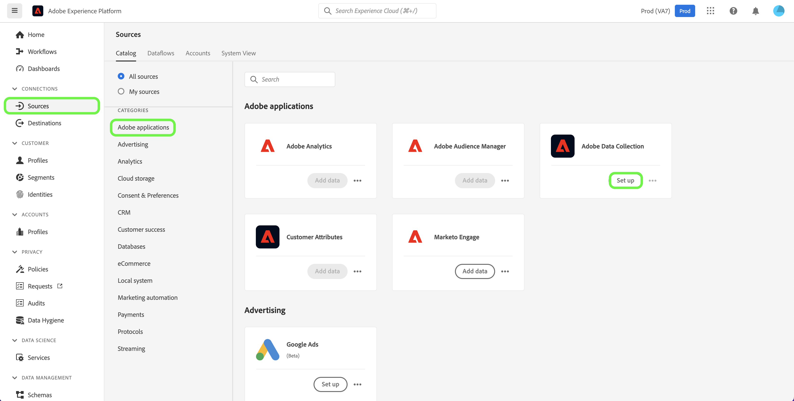

# Adobe-gegevensverzameling

Adobe Experience Platform biedt een reeks technologieën waarmee u gegevens van klanten-side bronnen kunt verzamelen en deze naar Adobe Experience Platform Edge Network kunt sturen waar ze kunnen worden verrijkt, getransformeerd en in enkele seconden naar Adobe- of niet-Adobe-bestemmingen kunnen worden gedistribueerd.

Dankzij de integratie van bronnen in Adobe Experience Platform Data Collection hebt u via de broncatalogus toegang tot uw gegevens op de Edge Network, waaronder Data Prep voor gegevensverzameling en verbeterde ondersteuning voor waarschuwingen.

## De werkruimte Bronnen gebruiken om toegang te krijgen tot Gegevensverzameling

Selecteer in de gebruikersinterface van Experience Platform de optie **[!UICONTROL Sources]** in de linkernavigatiebalk voor toegang tot de werkruimte van [!UICONTROL Sources] . In het scherm [!UICONTROL Catalog] worden diverse bronnen weergegeven waarmee u een account kunt maken.

U kunt de juiste categorie selecteren in de catalogus aan de linkerkant van het scherm. U kunt ook de specifieke bron vinden waarmee u wilt werken met de zoekoptie.

Selecteer onder de categorie [!UICONTROL Adobe applications] de optie **[!UICONTROL Adobe Data Collection]** en selecteer vervolgens **[!UICONTROL Set up]** .

De gebruikersinterface voor gegevensverzameling wordt weergegeven op het tabblad **[!UICONTROL Datastreams]** .

Een gegevensstroom is een configuratie die de Edge Network vertelt waar u uw gegevens wilt worden verzonden. Specifiek, specificeert een gegevensstroom welke producten van Experience Cloud u de gegevens naar wilt verzenden, en hoe u de gegevens wilt worden behandeld en in elk product worden opgeslagen.

Voor uitvoerige stappen op hoe te om gegevensinzameling in UI te vormen, zie [ Begonnen het worden met de de markeringsuitbreiding van SDK van het Web ](/help/tags/extensions/client/web-sdk/getting-started.md).

## Volgende stappen

Door dit document te lezen, hebt u geleerd hoe te om tot de Inzameling van Gegevens UI toegang te hebben gebruikend de bronwerkruimte. Voor meer informatie over de Inzameling van Gegevens, zie het [ overzicht van de Inzameling van Gegevens ](/help/collection/home.md).
