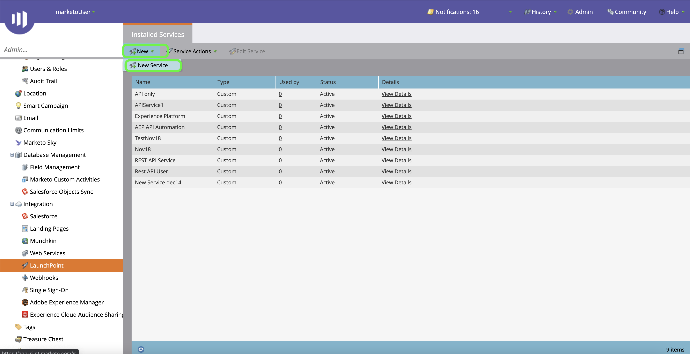

# (Bèta) verifieer uw [!DNL Marketo Engage] bronschakelaar

>[!IMPORTANT]
>
>De bron [!DNL Marketo Engage] bevindt zich momenteel in bèta. De kenmerken en de documentatie van het programma kunnen worden gewijzigd.

Voordat u een [!DNL Marketo Engage] (hierna &quot;[!DNL Marketo]&quot;genoemd) bronschakelaar kunt tot stand brengen, moet u eerst opstelling een douanedienst door de [!DNL Marketo] interface, evenals waarden voor uw Munchkin identiteitskaart, cliënt identiteitskaart, en cliëntgeheim terugwinnen.

In de onderstaande documentatie worden stappen beschreven voor het verkrijgen van verificatiegegevens om een [!DNL Marketo] bronconnector te maken.

## Een nieuwe rol instellen

De eerste stap in het verkrijgen van uw authentificatiegeloofsbrieven is aan opstelling een nieuwe rol door de [[!DNL Marketo]](https://app-sjint.marketo.com/#MM0A1) interface.

Meld u aan bij [!DNL Marketo] en selecteer **[!DNL Admin]** in de bovenste navigatiebalk.

De *[!DNL Users & Role]s* pagina bevat informatie over gebruikers, rollen, en login geschiedenissen. Als u een nieuwe rol wilt maken, selecteert u **[!DNL Roles]** in de bovenste kop en selecteert u **[!DNL New Role]**.

Het dialoogvenster **[!DNL Create New Role]** wordt weergegeven. Geef een naam en een beschrijving op en selecteer vervolgens de machtigingen die u voor deze rol wilt verlenen. De toestemmingen zijn beperkt tot specifieke werkruimten en de gebruikers kunnen slechts acties in werkruimten uitvoeren die zij toestemmingen binnen hebben.

Als u de machtigingen hebt geselecteerd die u wilt verlenen, selecteert u **[!DNL Create]**.

U kunt beperkte toestemmingen op API beheren wanneer het creëren van rollen met [!DNL Marketo]. In plaats van &quot;Toegang API&quot;te selecteren, kunt u een rol van het minimumniveau van toegang verstrekken door de volgende toestemmingen te selecteren:

* [!DNL Read-Only Activity]
* [!DNL Read-Only Assets]
* [!DNL Read-Only Campaign]
* [!DNL Read-Only Company]
* [!DNL Read-Only Custom Object]
* [!DNL Read-Only Custom Object Type]
* [!DNL Read-Only Named Account]
* [!DNL Read-Only Named Account List]
* [!DNL Read-Only Opportunity]
* [!DNL Read-Only Person]
* [!DNL Read-Only Sales Person]

## Nieuwe gebruiker instellen

Net als rollen kunt u een nieuwe gebruiker instellen op de pagina **[!DNL Users & Roles]**. De pagina **[!DNL Users]** bevat een lijst met actieve gebruikers die momenteel zijn ingericht in Marketo. Selecteer **[!DNL Invite New User]** om een nieuwe gebruiker op te richten.

Er wordt een pop-upmenu weergegeven. Geef de juiste gegevens op voor uw e-mail, voornaam, achternaam en reden. Tijdens deze stap kunt u ook een vervaldatum instellen voor de toegang tot de nieuwe gebruikersaccount die u uitnodigt. Selecteer **[!DNL Next]** als u klaar bent.

>[!IMPORTANT]
>
>Wanneer vestiging moet een nieuwe gebruiker, u toegang tot een gebruiker toewijzen die strikt aan de douanedienst wordt gewijd u creeert.

Selecteer de desbetreffende velden in de stap **[!DNL Permissions]** en schakel vervolgens het selectievakje **[!DNL API Only]** in om de nieuwe gebruiker een API-rol te geven. Selecteer **[!DNL Next]** om door te gaan.

Selecteer **[!DNL Send]** om het proces te voltooien.

## Een aangepaste service instellen

Nadat u een nieuwe gebruiker hebt ingesteld, kunt u een aangepaste service instellen om uw nieuwe referenties op te halen. Selecteer **[!DNL LaunchPoint]** op de beheerpagina.

De **[!DNL Installed services]** pagina bevat een lijst met bestaande services. Als u een nieuwe aangepaste service wilt maken, selecteert u **[!DNL New]** en selecteert u **[!DNL New Service]**.

Geef uw nieuwe service een beschrijvende weergavenaam en selecteer **[!DNL Custom]** in het vervolgkeuzemenu **[!DNL Service]**. Geef een geschikte beschrijving op en selecteer vervolgens de gebruiker die u wilt instellen in het vervolgkeuzemenu **[!DNL API Only User]**. Nadat u de benodigde gegevens hebt ingevuld, selecteert u **[!DNL Create]** om uw nieuwe aangepaste service te maken.

## Je client-id en clientgeheim ophalen

Als er een nieuwe aangepaste service wordt gemaakt, kunt u nu waarden voor uw client-id en clientgeheim ophalen. Zoek in het menu **[!DNL Installed Services]** de aangepaste service die u wilt openen en selecteer **[!DNL View Details]**.

Er wordt een dialoogvenster weergegeven met de client-id en het clientgeheim.

## Uw Munchkin-id ophalen

De laatste stap die u moet voltooien om uw [!DNL Marketo] bronschakelaar voor authentiek te verklaren moet uw Munchkin identiteitskaart terugwinnen. Selecteer **[!DNL Munchkin]** onder het deelvenster **[!DNL Integration]** op de beheerpagina.

De pagina *[!DNL Munchkin]* wordt weergegeven met uw unieke Munchkin-id boven in het deelvenster.

In combinatie met uw client-id en clientgeheim kunt u uw Munchkin-id gebruiken om een nieuwe account te configureren en [een nieuwe [!DNL Marketo] bronverbinding](../../../tutorials/ui/create/adobe-applications/marketo.md) op een Experience Platform maken.
