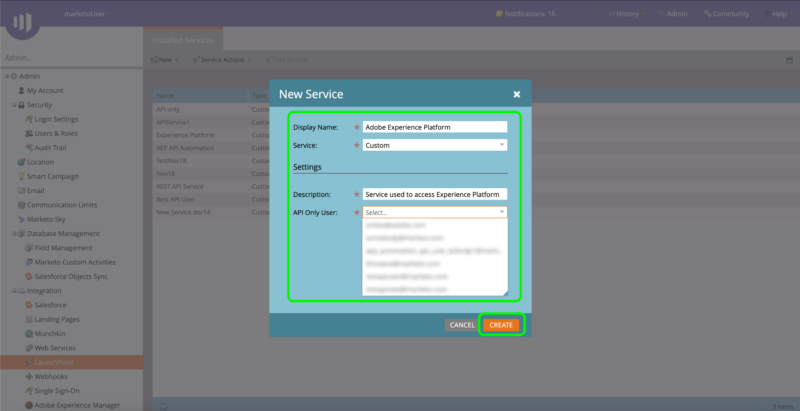

# Verifieer uw [!DNL Marketo Engage] bronaansluiting

Voordat u een [!DNL Marketo Engage] (hierna &quot;[!DNL Marketo]&quot;) bronschakelaar, moet u eerst opstelling een douanedienst door [!DNL Marketo] en ophalen waarden voor uw Munchkin-id, client-id en clientgeheim.

In de onderstaande documentatie vindt u stappen voor het verkrijgen van verificatiegegevens om een [!DNL Marketo] bronaansluiting.

## Een nieuwe rol instellen

De eerste stap in het verkrijgen van uw authentificatiegeloofsbrieven is opstelling een nieuwe rol door [[!DNL Marketo]](https://app-sjint.marketo.com/#MM0A1) interface.

Aanmelden bij [!DNL Marketo] en selecteert u **[!DNL Admin]** in de bovenste navigatiebalk.

De *[!DNL Users & Role]s* De pagina bevat informatie over gebruikers, rollen, en login geschiedenissen. Als u een nieuwe rol wilt maken, selecteert u **[!DNL Roles]** van de hoogste kopbal en selecteer dan **[!DNL New Role]**.

De **[!DNL Create New Role]** wordt weergegeven. Geef een naam en een beschrijving op en selecteer vervolgens de machtigingen die u voor deze rol wilt verlenen. De toestemmingen zijn beperkt tot specifieke werkruimten en de gebruikers kunnen slechts acties in werkruimten uitvoeren die zij toestemmingen binnen hebben.

Als u de machtigingen hebt geselecteerd die u wilt verlenen, selecteert u **[!DNL Create]**.

U kunt beperkte machtigingen voor de API beheren wanneer u rollen maakt met [!DNL Marketo]. In plaats van &quot;Toegang API&quot;te selecteren, kunt u een rol van het minimumniveau van toegang verstrekken door de volgende toestemmingen te selecteren:

* [!DNL Read-Only Activity]
* [!DNL Read-Only Assets]
* [!DNL Read-Only Campaign]
* [!DNL Read-Only Company]
* [!DNL Read-Only Custom Object]
* [!DNL Read-Only Custom Object Type]
* [!DNL Read-Only Named Account]
* [!DNL Read-Only Named Account List]
* [!DNL Read-Only Opportunity]
* [!DNL Read-Only Person]
* [!DNL Read-Only Sales Person]

## Nieuwe gebruiker instellen

Net als rollen kunt u een nieuwe gebruiker instellen via de **[!DNL Users & Roles]** pagina. De **[!DNL Users]** bevat een lijst met actieve gebruikers die momenteel zijn ingericht in Marketo. Selecteren **[!DNL Invite New User]** aan een nieuwe gebruiker.

Er wordt een pop-upmenu weergegeven. Geef de juiste gegevens op voor uw e-mail, voornaam, achternaam en reden. Tijdens deze stap kunt u ook een vervaldatum instellen voor de toegang tot de nieuwe gebruikersaccount die u uitnodigt. Als u klaar bent, selecteert u **[!DNL Next]**.

>[!IMPORTANT]
>
>Wanneer vestiging een nieuwe gebruiker, moet u toegang tot een gebruiker toewijzen die strikt aan de douanedienst wordt gewijd u creeert.

Selecteer de desbetreffende velden in het dialoogvenster **[!DNL Permissions]** en selecteert u vervolgens de **[!DNL API Only]** Schakel het selectievakje in om de nieuwe gebruiker een API-rol te geven. Selecteren **[!DNL Next]** om verder te gaan.

Selecteer **[!DNL Send]**.

## Een aangepaste service instellen

Nadat u een nieuwe gebruiker hebt ingesteld, kunt u een aangepaste service instellen om uw nieuwe referenties op te halen. Selecteer op de beheerpagina de optie **[!DNL LaunchPoint]**.

De **[!DNL Installed services]** De pagina bevat een lijst met bestaande services. Als u een nieuwe aangepaste service wilt maken, selecteert u **[!DNL New]** en selecteer vervolgens **[!DNL New Service]**.

Geef uw nieuwe service een beschrijvende weergavenaam en selecteer **[!DNL Custom]** van de **[!DNL Service]** vervolgkeuzemenu. Geef een geschikte beschrijving op en selecteer vervolgens de gebruiker die u van de **[!DNL API Only User]** vervolgkeuzemenu. Nadat u de benodigde gegevens hebt ingevuld, selecteert u **[!DNL Create]** om uw nieuwe aangepaste service te maken.

## Je client-id en clientgeheim ophalen

Als er een nieuwe aangepaste service wordt gemaakt, kunt u nu waarden voor uw client-id en clientgeheim ophalen. Van de **[!DNL Installed Services]** , zoekt u de aangepaste service die u wilt openen en selecteert u **[!DNL View Details]**.

Er wordt een dialoogvenster weergegeven met de client-id en het clientgeheim.

## Uw Munchkin-id ophalen

De laatste stap die u moet voltooien om uw [!DNL Marketo] de bronaansluiting moet uw Munchkin-id ophalen. Selecteer op de beheerpagina de optie **[!DNL Munchkin]** onder de **[!DNL Integration]** deelvenster.

De *[!DNL Munchkin]* wordt weergegeven, met uw unieke Munchkin-id boven in het deelvenster.

In combinatie met uw client-id en clientgeheim kunt u uw Munchkin-id gebruiken om een nieuwe account te configureren en [een nieuwe [!DNL Marketo] bronverbinding](../../../tutorials/ui/create/adobe-applications/marketo.md) op Experience Platform.
