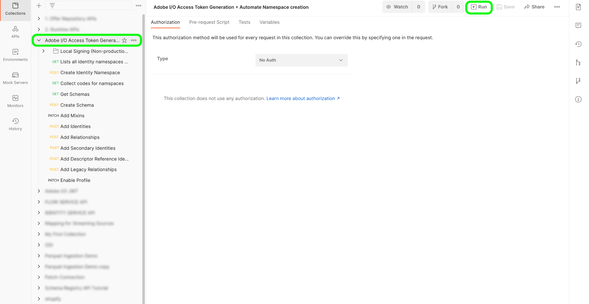

# (bèta) B2B-naamruimten en -schema&#39;s

>[!IMPORTANT]
>
>Deze functie is momenteel in bèta. De documentatie en functionaliteit kunnen worden gewijzigd.

Dit document bevat informatie over de onderliggende instelling voor de naamruimten en schema&#39;s die met B2B-bronnen moeten worden gebruikt. Dit document bevat ook informatie over het instellen van uw Postman-automatiseringsprogramma dat nodig is voor het genereren van B2B-naamruimten en -schema&#39;s.

## B2B-naamruimten instellen en hulpprogramma voor automatisch genereren van schema&#39;s

De eerste stap in het gebruiken van B2B namespace en schema auto-generatienut is aan opstelling uw console van de ontwikkelaar van het Platform en [!DNL Postman] milieu.

- U kunt de namespace en het schema auto-generatienutsinzameling en milieu van deze [bewaarplaats GitHub](https://github.com/adobe/experience-platform-postman-samples/tree/master/Postman%20Collections/CDP%20Namespaces%20and%20Schemas%20Utility) downloaden.
- Voor informatie bij het gebruiken van Platform APIs met inbegrip van details over hoe te om waarden voor vereiste kopballen te verzamelen en steekproefAPI vraag te lezen, zie de gids op [aan de slag met Platform APIs](../../../../landing/api-guide.md).
- Voor informatie over hoe te om uw geloofsbrieven voor Platform APIs te produceren, zie de zelfstudie over [het voor authentiek verklaren van en het toegang tot van Experience Platform APIs](../../../../landing/api-authentication.md).
- Voor informatie over hoe te opstelling [!DNL Postman] voor Platform APIs, zie de zelfstudie over [vestiging de console van de ontwikkelaar en [!DNL Postman]](../../../../landing/postman.md).

Met een Platform-ontwikkelaarsconsole en [!DNL Postman] opstelling, kunt u nu beginnen de aangewezen milieuwaarden op uw &lt;a1 toe te passen/> milieu.[!DNL Postman]

De volgende tabel bevat voorbeeldwaarden en aanvullende informatie over het vullen van de [!DNL Postman]-omgeving:

| Variabele | Beschrijving | Voorbeeld |
| --- | --- | --- |
| `CLIENT_SECRET` | Een unieke id die wordt gebruikt om uw `{ACCESS_TOKEN}` te genereren. Zie de zelfstudie over [het verifiëren van en de toegang tot van Experience Platform APIs](../../../../landing/api-authentication.md) voor informatie over hoe te om uw `{CLIENT_SECRET}` terug te winnen. | `{CLIENT_SECRET}` |
| `JWT_TOKEN` | JSON Web Token (JWT) is een verificatiereferentie die wordt gebruikt om uw {ACCESS_TOKEN} te genereren. Zie de zelfstudie over [het verifiëren van en de toegang tot van Experience Platform APIs](../../../../landing/api-authentication.md) voor informatie over hoe te om uw `{JWT_TOKEN}` te produceren. | `{JWT_TOKEN}` |
| `API_KEY` | Een unieke id die wordt gebruikt om aanroepen van Experience Platform-API&#39;s te verifiëren. Zie de zelfstudie over [het verifiëren van en de toegang tot van Experience Platform APIs](../../../../landing/api-authentication.md) voor informatie over hoe te om uw `{API_KEY}` terug te winnen. | `c8d9a2f5c1e03789bd22e8efdd1bdc1b` |
| `ACCESS_TOKEN` | Het toestemmingstoken dat wordt vereist om vraag aan Experience Platform APIs te voltooien. Zie de zelfstudie over [het verifiëren van en de toegang tot van Experience Platform APIs](../../../../landing/api-authentication.md) voor informatie over hoe te om uw `{ACCESS_TOKEN}` terug te winnen. | `Bearer {ACCESS_TOKEN}` |
| `META_SCOPE` | Met betrekking tot [!DNL Marketo] is deze waarde vast en altijd ingesteld op: `ent_dataservices_sdk`. | `ent_dataservices_sdk` |
| `CONTAINER_ID` | De `global` container houdt alle standaardAdobe en de partner van het Experience Platform verstrekte klassen, de groepen van het schemagebied, gegevenstypes, en schema&#39;s. Met betrekking tot [!DNL Marketo] is deze waarde vast en altijd ingesteld op `global`. | `global` |
| `PRIVATE_KEY` | Een referentie die wordt gebruikt om uw [!DNL Postman]-instantie te verifiëren voor Experience Platform-API&#39;s. Zie de zelfstudie over het instellen van de ontwikkelaarsconsole en [het instellen van de ontwikkelaarsconsole en [!DNL Postman]](../../../../landing/postman.md) voor instructies over het ophalen van uw {PRIVATE_KEY} . | `{PRIVATE_KEY}` |
| `TECHNICAL_ACCOUNT_ID` | Een referentie die wordt gebruikt om te integreren in Adobe I/O. | `D42AEVJZTTJC6LZADUBVPA15@techacct.adobe.com` |
| `IMS` | Het Identity Management System (IMS) biedt het framework voor verificatie van Adobe-services. Met betrekking tot [!DNL Marketo] is deze waarde vast en altijd ingesteld op: `ims-na1.adobelogin.com`. | `ims-na1.adobelogin.com` |
| `IMS_ORG` | Een onderneming die producten en diensten kan bezitten of in licentie kan geven en toegang kan verlenen tot haar leden. Zie de zelfstudie over [het instellen van de ontwikkelaarsconsole en [!DNL Postman]](../../../../landing/postman.md) voor instructies over het ophalen van uw `{IMS_ORG}`-informatie. | `ABCEH0D9KX6A7WA7ATQE0TE@adobeOrg` |
| `SANDBOX_NAME` | De naam van de virtuele sandboxpartitie die u gebruikt. | `prod` |
| `TENANT_ID` | Een id die wordt gebruikt om ervoor te zorgen dat de bronnen die u maakt, op de juiste wijze worden benoemd en zich binnen uw IMS-organisatie bevinden. | `b2bcdpproductiontest` |
| `PLATFORM_URL` | Het URL-eindpunt waarnaar u API-aanroepen maakt. Deze waarde is vast en wordt altijd ingesteld op: `http://platform.adobe.io/`. | `http://platform.adobe.io/` |

{style=&quot;table-layout:auto&quot;}

### Scripts uitvoeren

Met uw [!DNL Postman] inzameling en milieu opstelling, kunt u het manuscript door de [!DNL Postman] interface nu in werking stellen.

Selecteer in de interface [!DNL Postman] de hoofdmap van het hulpprogramma voor automatische generator en selecteer **[!DNL Run]** in de bovenste koptekst.

De interface [!DNL Runner] verschijnt. Van hier, zorg ervoor dat alle controledozen worden geselecteerd en dan **[!DNL Run Namespaces and Schemas Autogeneration Utility]** selecteren.

Een succesvol verzoek leidt tot namespaces en schema&#39;s die voor B2B worden vereist.

## B2B-naamruimten

Identiteitsnaamruimten zijn een component van [[!DNL Identity Service]](../../../../identity-service/home.md) die dienen om de context of het type van een identiteit te onderscheiden. Een volledig gekwalificeerde identiteit omvat een waarde van identiteitskaart en een namespace. Zie het [namespaces overzicht](../../../../identity-service/namespaces.md) voor meer informatie.

B2B-naamruimten worden gebruikt in de primaire identiteit van de entiteit.

De volgende tabel bevat informatie over de onderliggende instelling voor B2B-naamruimten.

>[!NOTE]
>
>Schuif naar links/rechts om de volledige inhoud van de tabel weer te geven.

| Weergavenaam | Identiteitssymbool | Identiteitstype |
| --- | --- | --- |
| B2B-persoon | `b2b_person` | `CROSS_DEVICE` |
| B2B-account | `b2b_account` | `B2B_ACCOUNT` |
| B2B-opportuniteit | `b2b_opportunity` | `B2B_OPPORTUNITY` |
| B2B-opportuniteitsrelatie | `b2b_opportunity_person_relation` | `B2B_OPPORTUNITY_PERSON` |
| B2B-campagne | `b2b_campaign` | `B2B_CAMPAIGN` |
| B2B Campagne-lid | `b2b_campaign_member` | `B2B_CAMPAIGN_MEMBER` |
| B2B-marketinglijst | `b2b_marketing_list` | `B2B_MARKETING_LIST` |
| B2B Marketing List Member | `b2b_marketing_list_member` | `B2B_MARKETING_LIST_MEMBER` |
| B2B Betrekking van rekeningpersoon | `b2b_account_person_relation` | `B2B_ACCOUNT_PERSON` |

{style=&quot;table-layout:auto&quot;}

## B2B-schema&#39;s

Het Experience Platform gebruikt schema&#39;s om de structuur van gegevens op een verenigbare en herbruikbare manier te beschrijven. Door gegevens consistent in verschillende systemen te definiëren, wordt het eenvoudiger om betekenis te behouden en zo waarde te verkrijgen van gegevens.

Voordat gegevens in Platform kunnen worden opgenomen, moet een schema zijn samengesteld om de gegevensstructuur te beschrijven en om beperkingen te bieden aan het type gegevens dat binnen elk veld kan worden opgenomen. De schema&#39;s bestaan uit een basisklasse en nul of meer groepen van het schemagebied.

Voor meer informatie over het model van de schemacompositie, met inbegrip van ontwerpprincipes en beste praktijken, zie [grondbeginselen van schemacompositie](../../../../xdm/schema/composition.md).

De volgende tabel bevat informatie over de onderliggende opstelling van B2B-schema&#39;s.

>[!NOTE]
>
>Schuif naar links/rechts om de volledige inhoud van de tabel weer te geven.

| Schemanaam | Basisklasse | Veldgroepen | [!DNL Profile] in Schema | Primaire identiteit | Primaire naamruimte | Secundaire identiteit | Secundaire naamruimte voor identiteit | Relatie | Notities |
| --- | --- | --- | --- | --- | --- | --- | --- | --- | --- |
| B2B-account | XDM Business Account | XDM-bedrijfsaccountgegevens | Ingeschakeld | `accountKey.sourceKey` in de basisklasse | B2B-account | `extSourceSystemAudit.externalKey.sourceKey` in de basisklasse | B2B-account | <ul><li>`accountParentKey.sourceKey` in XDM Business Account Details, veldgroep</li><li>Eigenschap van bestemming: `/accountKey/sourceKey`</li><li>Type: één-op-één</li><li>Referentieschema: B2B-account</li><li>Naamruimte: B2B-account</li></ul> |
| B2B-persoon | Afzonderlijk XDM-profiel | <ul><li>XDM Business Person Details</li><li>XDM Business Person-componenten</li><li>IdentityMap</li><li>Details van goedkeuring en voorkeur</li></ul> | Ingeschakeld | `b2b.personKey.sourceKey` in de XDM Business Person Details Field Group | B2B-persoon | <ol><li>`extSourceSystemAudit.externalKey.sourceKey` van XDM Business Person Details, veldgroep</li><li>`workEmail.address` van XDM Business Person Details, veldgroep</ol></li> | <ol><li>B2B-persoon</li><li>Email</li></ol> | <ul><li>`personComponents.sourceAccountKey.sourceKey` van XDM Business Person Components, veldgroep</li><li>Type: Veel-op-één</li><li>Referentieschema: B2B-account</li><li>Naamruimte: B2B-account</li><li>Eigenschap van bestemming: accountKey.sourceKey</li><li>Relatienaam uit huidig schema: Account</li><li>Relatienaam van referentieschema: Mensen</li></ul> |
| B2B-opportuniteit | XDM Business Opportunity | XDM Business Opportunity-gegevens | Ingeschakeld | `opportunityKey.sourceKey` in de basisklasse | B2B-opportuniteit | `extSourceSystemAudit.externalKey.sourceKey` in de basisklasse | B2B-opportuniteit | <ul><li>`accountKey.sourceKey` in de basisklasse</li><li>Type: Veel-op-één</li><li>Referentieschema: B2B-account</li><li>Naamruimte: B2B-account</li><li>Eigenschap van bestemming: `accountKey.sourceKey`</li><li>Relatienaam uit huidig schema: Account</li><li>Relatienaam van referentieschema: Kansen</li></ul> |
| B2B-opportuniteitsrelatie | XDM Business Opportunity Person Relatie | Geen | Ingeschakeld | `opportunityPersonKey.sourceKey` in de basisklasse | B2B-opportuniteitsrelatie | `extSourceSystemAudit.externalKey.sourceKey` in de basisklasse | B2B-opportuniteitsrelatie | **Eerste relatie**<ul><li>`personKey.sourceKey` in de basisklasse</li><li>Type: Veel-op-één</li><li>Referentieschema: B2B-persoon</li><li>Naamruimte: B2B-persoon</li><li>Eigenschap van bestemming: b2b.personKey.sourceKey</li><li>Relatienaam uit huidig schema: Persoon</li><li>Relatienaam van referentieschema: Kansen</li></ul>**Tweede relatie**<ul><li>`opportunityKey.sourceKey` in de basisklasse</li><li>Type: Veel-op-één</li><li>Referentieschema: B2B-opportuniteit </li><li>Naamruimte: B2B-opportuniteit </li><li>Eigenschap van bestemming: `opportunityKey.sourceKey`</li><li>Relatienaam uit huidig schema: Opportunity</li><li>Relatienaam van referentieschema: Mensen</li></ul> |
| B2B-campagne | XDM Business Campaign | XDM Business Campaign - details | Ingeschakeld | `campaignKey.sourceKey` in de basisklasse | B2B-campagne | `extSourceSystemAudit.externalKey.sourceKey` in de basisklasse | B2B-campagne |
| B2B Campagne-lid | XDM Business Campaign-lid | XDM Business Campagne Member Details | Ingeschakeld | `ccampaignMemberKey.sourceKey` in de basisklasse | B2B Campagne-lid | `extSourceSystemAudit.externalKey.sourceKey` in de basisklasse | B2B Campagne-lid | **Eerste relatie**<ul><li>`personKey.sourceKey` in de basisklasse</li><li>Type: Veel-op-één</li><li>Referentieschema: B2B-persoon</li><li>Naamruimte: B2B-persoon</li><li>Eigenschap van bestemming: `b2b.personKey.sourceKey`</li><li>Relatienaam uit huidig schema: Persoon</li><li>Relatienaam van referentieschema: Campagnes</li></ul>**Tweede relatie**<ul><li>`campaignKey.sourceKey` in de basisklasse</li><li>Type: Veel-op-één</li><li>Referentieschema: B2B-campagne</li><li>Naamruimte: B2B-campagne</li><li>Eigenschap van bestemming: `campaignKey.sourceKey`</li><li>Relatienaam uit huidig schema: Campagne</li><li>Relatienaam van referentieschema: Mensen</li></ul> |
| B2B-marketinglijst | XDM Business Marketing List | Geen | Ingeschakeld | `marketingListKey.sourceKey` in de basisklasse | B2B-marketinglijst | Geen | Geen | Geen | De statische Lijst wordt niet gesynchroniseerd van [!DNL Salesforce] en heeft daarom geen secundaire identiteit. |
| B2B Marketing List Member | Leden van XDM Business Marketing List | Geen | Ingeschakeld | `marketingListMemberKey.sourceKey` in de basisklasse | B2B Marketing List Member | Geen | Geen | **Eerste relatie**<ul><li>`PersonKey.sourceKey` in de basisklasse</li><li>Type: Veel-op-één</li><li>Referentieschema: B2B-persoon</li><li>Naamruimte: B2B-persoon</li><li>Eigenschap van bestemming: `b2b.personKey.sourceKey`</li><li>Relatienaam uit huidig schema: Persoon</li><li>Relatienaam van referentieschema: Marketinglijsten</li></ul>**Tweede relatie**<ul><li>`marketingListKey.sourceKey` in de basisklasse</li><li>Type: Veel-op-één</li><li>Referentieschema: B2B-marketinglijst</li><li>Naamruimte: B2B-marketinglijst</li><li>Eigenschap van bestemming: `marketingListKey.sourceKey`</li><li>Relatienaam uit huidig schema: Marketinglijst</li><li>Relatienaam van referentieschema: Mensen</li></ul> | Het statische lijstlid wordt niet gesynchroniseerd van [!DNL Salesforce] en heeft daarom geen secundaire identiteit. |
| B2B-activiteit | XDM ExperienceEvent | <ul><li>Webpagina bezoeken</li><li>Nieuwe lead</li><li>Regelafstand omzetten</li><li>Toevoegen aan lijst</li><li>Verwijderen uit lijst</li><li>Toevoegen aan opportunity</li><li>Verwijderen uit opportunity</li><li>Formulier ingevuld</li><li>Koppelingsklikken</li><li>E-mail bezorgd</li><li>E-mail geopend</li><li>E-mail geklikt</li><li>E-mail verzonden</li><li>Door e-mail teruggekaatst</li><li>E-mail niet geabonneerd</li><li>Gewijzigde score</li><li>Opportunity bijgewerkt</li><li>Status in gewijzigde campagnevoortgang</li><li>Persoon-id</li><li>Marketo-webURL</li><li>Interessant moment</li></ul> | Ingeschakeld | `personKey.sourceKey` van Person Identifier-veldgroep | B2B-persoon | Geen | Geen | **Eerste relatie**<ul><li>`listOperations.listKey.sourceKey` field</li><li>Type: één-op-één</li><li>Referentieschema: B2B-marketinglijst</li><li>Naamruimte: B2B-marketinglijst</li></ul>**Tweede relatie**<ul><li>`opportunityEvent.opportunityKey.sourceKey` field</li><li>Type: één-op-één</li><li>Referentieschema: B2B-opportuniteit</li><li>Naamruimte: B2B-opportuniteit</li></ul>**Derde relatie**<ul><li>`leadOperation.campaignProgression.campaignKey.sourceKey` field</li><li>Type: één-op-één</li><li>Referentieschema: B2B-campagne</li><li>Naamruimte: B2B-campagne</li></ul> | `ExperienceEvent` verschilt van entiteiten. De identiteitsgebeurtenis is de persoon die de activiteit heeft uitgevoerd. |
| B2B Betrekking van rekeningpersoon | XDM Zakelijke account Person Relatie | Identiteitskaart | Ingeschakeld | `accountPersonKey.sourceKey` in de basisklasse | B2B Betrekking van rekeningpersoon | Geen | Geen | **Eerste relatie**<ul><li>`personKey.sourceKey` in de basisklasse</li><li>Type: Veel-op-één</li><li>Referentieschema: B2B-persoon</li><li>Naamruimte: B2B-persoon</li><li>Eigenschap van bestemming: `b2b.personKey.SourceKey`</li><li>Relatienaam uit huidig schema: Mensen</li><li>Relatienaam van referentieschema: Account</li></ul>**Tweede relatie**<ul><li>`accountKey.sourceKey` in de basisklasse</li><li>Type: Veel-op-één</li><li>Referentieschema: B2B-account</li><li>Naamruimte: B2B-account</li><li>Eigenschap van bestemming: `accountKey.sourceKey`</li><li>Relatienaam uit huidig schema: Account</li><li>Relatienaam van referentieschema: Mensen</li></ul> |

{style=&quot;table-layout:auto&quot;}

## Volgende stappen

Leer hoe te om uw [!DNL Marketo] gegevens aan Platform aan te sluiten, zie de zelfstudie op [creërend een bron van Marketo schakelaar in UI](../../../tutorials/ui/create/adobe-applications/marketo.md).
