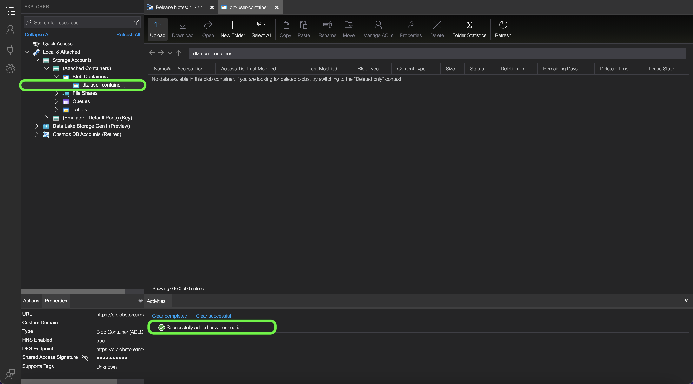

# [!DNL Data Landing Zone]

[!DNL Data Landing Zone] is een [!DNL Azure Blob] -opslaginterface die door Adobe Experience Platform is ingericht, zodat u toegang hebt tot een veilige, op de cloud gebaseerde opslagvoorziening voor bestanden om bestanden in Platform te brengen. U hebt toegang tot [!DNL Data Landing Zone] container per sandbox, en het totale gegevensvolume over alle containers is beperkt tot de totale gegevens die worden geleverd bij uw Platform Products and Services-licentie. Alle klanten van Platform en zijn toepassingsdiensten zoals [!DNL Customer Journey Analytics], [!DNL Journey Orchestration], [!DNL Intelligent Services], en [!DNL Adobe Real-Time Customer Data Platform] zijn voorzien van één [!DNL Data Landing Zone] container per sandbox. U kunt bestanden lezen en schrijven naar uw container via [!DNL Azure Storage Explorer] of uw opdrachtregelinterface.

[!DNL Data Landing Zone] biedt ondersteuning voor verificatie op basis van SAS en de bijbehorende gegevens zijn beveiligd met standaard [!DNL Azure Blob] beveiligingsmechanismen voor de opslag in rust en in doorvoer. Met SAS-verificatie hebt u veilig toegang tot uw [!DNL Data Landing Zone] via een openbare internetverbinding. Er zijn geen netwerkwijzigingen vereist voor toegang tot uw [!DNL Data Landing Zone] container, wat betekent u geen lijsten van gewenste personen of dwars-regio montages voor uw netwerk moet vormen. Platform past een strikte vervaltijd van zeven dagen toe op alle bestanden die naar een [!DNL Data Landing Zone] container. Alle bestanden worden na zeven dagen verwijderd.

## Naamgevingsbeperkingen voor bestanden en mappen

Hieronder volgt een lijst met beperkingen waarmee u rekening moet houden bij het benoemen van bestanden of mappen voor cloudopslag.

- Namen van mappen en bestandscomponenten mogen niet langer zijn dan 255 tekens.
- Directory- en bestandsnamen mogen niet eindigen met een slash (`/`). Indien beschikbaar wordt deze automatisch verwijderd.
- De volgende gereserveerde URL-tekens moeten correct worden beschermd: `! ' ( ) ; @ & = + $ , % # [ ]`
- De volgende tekens zijn niet toegestaan: `" \ / : | < > * ?`.
- Ongeldige URL-padtekens niet toegestaan. Codepunten zoals `\uE000`zijn, hoewel geldig in NTFS-bestandsnamen, geen geldige Unicode-tekens. Daarnaast zijn er sommige ASCII- of Unicode-tekens, zoals besturingstekens (zoals `0x00` tot `0x1F`, `\u0081`, enzovoort) zijn ook niet toegestaan. Voor regels die de koorden van Unicode in HTTP/1.1 bepalen zie [RFC 2616, punt 2.2: Basisregels](https://www.ietf.org/rfc/rfc2616.txt) en [RFC 3987](https://www.ietf.org/rfc/rfc3987.txt).
- De volgende bestandsnamen zijn niet toegestaan: LPT1, LPT2, LPT3, LPT4, LPT5, LPT6, LPT7, LPT8, LPT9, COM1, COM2, COM3, COM4, COM4, COM6, COM7, COM8, COM9, PRN, AUX, NUL, CON, CLOCK$, puntteken (..), en twee stiptekens (.).

## De inhoud van uw [!DNL Data Landing Zone]

U kunt [[!DNL Azure Storage Explorer]](https://azure.microsoft.com/en-us/features/storage-explorer/) om de inhoud van uw [!DNL Data Landing Zone] container.

In de [!DNL Azure Storage Explorer] UI, selecteer het verbindingspictogram in de linkernavigatie. De **Bron selecteren** wordt weergegeven, zodat u beschikt over opties voor het maken van een verbinding. Selecteren **[!DNL Blob container]** om verbinding te maken met [!DNL Data Landing Zone].


Selecteer vervolgens **URL voor gedeelde toegangshandtekening (SAS)** als uw verbindingsmethode, en selecteer dan **Volgende**.


Nadat u de verbindingsmethode hebt geselecteerd, moet u een **weergavenaam** en de **[!DNL Blob]SAS-URL van container** dat overeenkomt met uw [!DNL Data Landing Zone] container.

>[!TIP]
>
>U kunt uw [!DNL Data Landing Zone] referenties uit de broncatalogus in de gebruikersinterface van het Platform.

Geef uw [!DNL Data Landing Zone] SAS URL en selecteer dan **Volgende**


De **Samenvatting** wordt weergegeven en krijgt u een overzicht van uw instellingen, inclusief informatie over uw [!DNL Blob] eindpunt en machtigingen. Indien gereed, selecteert u **Verbinden**.


Een geslaagde verbinding werkt uw [!DNL Azure Storage Explorer] UI met uw [!DNL Data Landing Zone] container.



Met uw [!DNL Data Landing Zone] container verbonden met [!DNL Azure Storage Explorer]kunt u nu bestanden uploaden naar uw [!DNL Data Landing Zone] container. Selecteer **Uploaden** en selecteer vervolgens **Bestanden uploaden**.


Als u het bestand hebt geselecteerd dat u wilt uploaden, moet u vervolgens de [!DNL Blob] type dat u het als en uw gewenste bestemmingsfolder wilt uploaden. Als u klaar bent, selecteert u **Uploaden**.

| [!DNL Blob] typen | Beschrijving |
| --- | --- |
| Blok [!DNL Blob] | Blok [!DNL Blobs] zijn geoptimaliseerd voor het efficiënt uploaden van grote hoeveelheden gegevens. Blok [!DNL Blobs] zijn de standaardoptie voor [!DNL Data Landing Zone]. |
| Toevoegen [!DNL Blob] | Toevoegen [!DNL Blobs] zijn geoptimaliseerd voor het toevoegen van gegevens aan het einde van het bestand. |


## Bestanden uploaden naar uw [!DNL Data Landing Zone] het gebruiken van de interface van de bevellijn

U kunt ook de opdrachtregelinterface van uw apparaat gebruiken en uploadbestanden openen naar uw [!DNL Data Landing Zone].

### Een bestand uploaden met Bash

In het volgende voorbeeld worden Bash en cURL gebruikt om een bestand te uploaden naar een [!DNL Data Landing Zone] met de [!DNL Azure Blob Storage] REST API:

```shell
# Set Azure Blob-related settings
DATE_NOW=$(date -Ru | sed 's/\+0000/GMT/')
AZ_VERSION="2018-03-28"
AZ_BLOB_URL="<URL TO BLOB ACCOUNT>"
AZ_BLOB_CONTAINER="<BLOB CONTAINER NAME>"
AZ_BLOB_TARGET="${AZ_BLOB_URL}/${AZ_BLOB_CONTAINER}"
AZ_SAS_TOKEN="<SAS TOKEN, STARTING WITH ? AND ENDING WITH %3D>"

# Path to the file we wish to upload
FILE_PATH="</PATH/TO/FILE>"
FILE_NAME=$(basename "$FILE_PATH")

# Execute HTTP PUT to upload file (remove '-v' flag to suppress verbose output)
curl -v -X PUT \
   -H "Content-Type: application/octet-stream" \
   -H "x-ms-date: ${DATE_NOW}" \
   -H "x-ms-version: ${AZ_VERSION}" \
   -H "x-ms-blob-type: BlockBlob" \
   --data-binary "@${FILE_PATH}" "${AZ_BLOB_TARGET}/${FILE_NAME}${AZ_SAS_TOKEN}"
```

### Een bestand uploaden met Python

In het volgende voorbeeld wordt [!DNL Microsoft's] Python v12 SDK om een bestand te uploaden naar een [!DNL Data Landing Zone]:

>[!TIP]
>
>In het onderstaande voorbeeld wordt de volledige SAS URI gebruikt om verbinding te maken met een [!DNL Azure Blob] -container, kunt u andere methoden en bewerkingen gebruiken voor verificatie. Zie dit [[!DNL Microsoft] document over de Python v12 SDK](https://docs.microsoft.com/en-us/azure/storage/blobs/storage-quickstart-blobs-python) voor meer informatie .

```py
import os
from azure.storage.blob import ContainerClient

try:
    # Set Azure Blob-related settings
    sasUri = "<SAS URI>"
    srcFilePath = "<FULL PATH TO FILE>" 
    srcFileName = os.path.basename(srcFilePath)

    # Connect to container using SAS URI
    containerClient = ContainerClient.from_container_url(sasUri)

    # Upload file to Data Landing Zone with overwrite enabled
    with open(srcFilePath, "rb") as fileToUpload:
        containerClient.upload_blob(srcFileName, fileToUpload, overwrite=True)

except Exception as ex:
    print("Exception: " + ex.strerror)
```

### Een bestand uploaden met [!DNL AzCopy]

In het volgende voorbeeld wordt [!DNL Microsoft's] [!DNL AzCopy] hulpprogramma voor het uploaden van een bestand naar een [!DNL Data Landing Zone]:

>[!TIP]
>
>Terwijl het onderstaande voorbeeld de `copy` kunt u andere opdrachten en opties gebruiken om een bestand naar uw [!DNL Data Landing Zone], gebruiken [!DNL AzCopy]. Zie dit [[!DNL Microsoft AzCopy] document](https://docs.microsoft.com/en-us/azure/storage/common/storage-ref-azcopy?toc=/azure/storage/blobs/toc.json) voor meer informatie .

```bat
set sasUri=<FULL SAS URI, PROPERLY ESCAPED>
set srcFilePath=<PATH TO LOCAL FILE(S); WORKS WITH WILDCARD PATTERNS>

azcopy copy "%srcFilePath%" "%sasUri%" --overwrite=true --recursive=true
```

## Verbinden [!DNL Data Landing Zone] tot [!DNL Platform]

In de onderstaande documentatie vindt u informatie over de manier waarop u gegevens van uw [!DNL Data Landing Zone] aan Adobe Experience Platform toe met behulp van API&#39;s of de gebruikersinterface.

### API&#39;s gebruiken

- [Een [!DNL Data Landing Zone] bronverbinding met behulp van de Flow Service API](../../tutorials/api/create/cloud-storage/data-landing-zone.md)
- [Een gegevensstroom maken voor een cloudopslagbron met behulp van de Flow Service API](../../tutorials/api/collect/cloud-storage.md)

### De gebruikersinterface gebruiken

- [Verbinden [!DNL Data Landing Zone] naar Platform met behulp van de gebruikersinterface](../../tutorials/ui/create/cloud-storage/data-landing-zone.md)
- [Een gegevensstroom maken voor een verbinding voor cloudopslag in de gebruikersinterface](../../tutorials/ui/dataflow/batch/cloud-storage.md)
