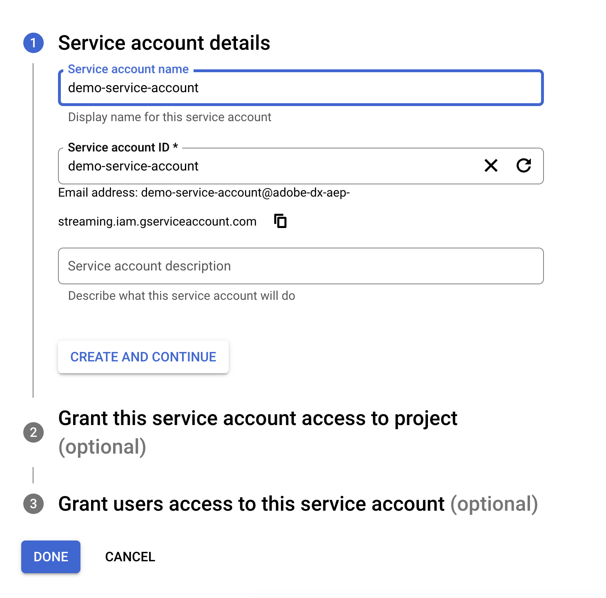

# [!DNL Google PubSub] bron

>[!IMPORTANT]
>
>De [!DNL Google PubSub] -bron is in de broncatalogus beschikbaar voor gebruikers die Real-Time CDP Ultimate hebben aangeschaft.

Adobe Experience Platform biedt native connectiviteit voor cloudproviders zoals [!DNL AWS] , [!DNL Google Cloud Platform] en [!DNL Azure] , zodat u gegevens van deze systemen naar Experience Platform kunt overbrengen voor gebruik in downstreamservices en -doelen.

Opslagbronnen in de cloud kunnen uw gegevens naar Experience Platform brengen zonder dat ze hoeven te worden gedownload, opgemaakt of geüpload. Ingebedde gegevens kunnen worden opgemaakt als XDM JSON, XDM Parquet, of afgebakend. Elke stap van het proces is geïntegreerd in de bronwerkstroom. Met Experience Platform kunt u gegevens van [!DNL Google PubSub] in real-time invoeren.

## Vereisten {#prerequisites}

In deze sectie worden de vereiste instellingen beschreven die u moet voltooien voordat u uw [!DNL Google PubSub] -account kunt verbinden met Experience Platform.

### Serviceaccount maken {#create-service-account}

A **de dienstrekening** is een type van rekening die vaak door een toepassing wordt gebruikt of werkbelasting verwerkt, eerder dan een persoon. Een serviceaccount wordt geïdentificeerd door het e-mailadres dat uniek is voor de account.

* Aan de ene kant zijn de de dienstrekeningen **principes** - u kunt de dienstrekeningen toegang tot [!DNL Google Cloud] middelen verlenen. Bijvoorbeeld, kon u een de dienstrekening de Compute rol van Admin `(roles/compute.admin)` op een bepaald project verlenen. Dit staat dan de de dienstrekening toe om de middelen van de Motor in dat bepaalde project te kunnen beheren.
* Anderzijds, zijn de dienstrekeningen ook middelen - u kunt andere hoofden toestemming geven om tot de de dienstrekening toegang te hebben. U kunt een gebruiker bijvoorbeeld de rol Gebruikers van serviceaccount `(roles/iam.serviceAccountUser)` op een serviceaccount geven, zodat de gebruiker die serviceaccount aan bronnen kan koppelen. U kunt een gebruiker ook de rol Serviceaccount Admin `(roles/iam.serviceAccountAdmin)` geven om de gebruiker in staat te stellen taken uit te voeren, zoals het weergeven, bewerken, uitschakelen en verwijderen van de serviceaccount.

Voor meer informatie bij het bepalen van het juiste authentificatietype voor uw gebruiksgeval, lees de [[!DNL Google]  gids op authentificatiemethodes ](https://cloud.google.com/docs/authentication).

Voer de onderstaande stappen uit om een serviceaccount te maken:

Navigeer eerst naar de [!DNL IAM] -pagina van de [!DNL Google Developer Console] -pagina en selecteer vervolgens **[!DNL Create Service Account]** .

Voer vervolgens een weergavenaam en een id voor uw serviceaccount in en selecteer **[!DNL Create and Continue]** .

### Servicetoetsen genereren {#generate-service-account-keys}

Om sleutels voor uw de dienstrekening te produceren, selecteer de sleutelkopbal in de pagina van de de dienstrekeningen. Selecteer vervolgens **[!DNL Add key]** en selecteer vervolgens **[!DNL Create new key]** in het vervolgkeuzemenu. U kunt dit deelvenster ook gebruiken om een bestaande sleutel te uploaden.

Als dit lukt, ontvangt u een bericht dat de persoonlijke sleutel op uw computer is opgeslagen en dat een bestand wordt gedownload. Vervolgens kunt u de inhoud van dit bestand als referenties gebruiken wanneer u uw [!DNL Google PubSub] -account op Experience Platform maakt.

### Rechten verlenen op onderwerp- en abonnementsniveau {#grant-permissions}

Om toestemmingen op het onderwerp en abonnementsniveau te verlenen, navigeer aan de pagina van de onderwerpconsole en selecteer dan **[!DNL Show info panel]**. Selecteer vervolgens onder het tabblad [!DNL Permissions] de optie [!DNL Add Principal] en voeg samen met de machtigingen de principal van de serviceaccount toe.

 kunt verlenen

## Configuraties voor optimale prestaties [!DNL Google PubSub usage] {#optimal-configurations}

In deze sectie worden configuraties beschreven die u kunt aanraden om het gebruik van de [!DNL Google PubSub] -bron op Experience Platform te optimaliseren.

### Eigenschappen voor abonnementen {#subscription-properties}

Gebruik [!DNL Google Developer Console] om **uw erkenningsdeadline** te verhogen. Hierdoor kan de [!DNL Google Publisher] op basis van de tijd die u configureert wachten voordat het bericht opnieuw wordt verzonden. Deze vertraging helpt onnodige belasting op abonneeniveau te verminderen.

Schakel **[!DNL exactly one delivery]** in. Deze configuratie informeert de [!DNL Google Publisher] om te garanderen dat berichten die naar het abonnement worden verzonden niet opnieuw worden verzonden voordat de deadline van de ontvangstbevestiging verloopt. U kunt deze instelling gebruiken om ervoor te zorgen dat bevestigingsberichten niet opnieuw naar het abonnement worden verzonden.

U kunt **[!DNL Retry after exponential backoff delay]** inschakelen om het risico te verminderen dat de server verder wordt overweldigd. U kunt deze configuratie in [!DNL Google Developer Console] toelaten om voorbijgaande mislukkingen (tijdelijke fouten die typisch zelf oplossen) beter te verlichten, door het systeem van meer tijd te voorzien om terug te krijgen alvorens een andere verbinding te proberen.

U moet **plaatsen uw het bewaarduur van het abonnementsbericht om 24 uur of meer** zijn om ervoor te zorgen dat de niet erkende gegevens niet tijdens piekladingen worden verloren. Bovendien, **laat een dood brievenonderwerp** toe om ervoor te zorgen dat het gegevensverlies niet zelfs tijdens zeldzame randgevallen gebeurt.

>[!IMPORTANT]
>
>U kunt slechts één brongegevensstroom maken per [!DNL Google PubSub] -abonnement. Als u een abonnement opnieuw gebruikt, zelfs in verschillende sandboxen, gaan er gegevens verloren.

## Verbinden [!DNL Google PubSub] met Experience Platform

>[!NOTE]
>
>Nadat u een streaming gegevensstroom hebt gemaakt of bijgewerkt, moet u de gegevensinvoer kort na vijf minuten pauzeren om te voorkomen dat gegevens verloren gaan of dat gegevens verloren gaan.

In de onderstaande documentatie vindt u informatie over het tot stand brengen van een verbinding tussen [!DNL Google PubSub] en Experience Platform via API&#39;s of de gebruikersinterface:

### API&#39;s gebruiken

* [Een Google PubSub-bronverbinding maken met de Flow Service API](../../tutorials/api/create/cloud-storage/google-pubsub.md)
* [Streaming gegevens verzamelen met de Flow Service API](../../tutorials/api/collect/streaming.md)

### UI gebruiken

* [Een Google PubSub-bronverbinding maken in de gebruikersinterface](../../tutorials/ui/create/cloud-storage/google-pubsub.md)
* [Een gegevensstroom configureren voor een verbinding voor cloudopslag in de gebruikersinterface](../../tutorials/ui/dataflow/streaming/cloud-storage-streaming.md)
