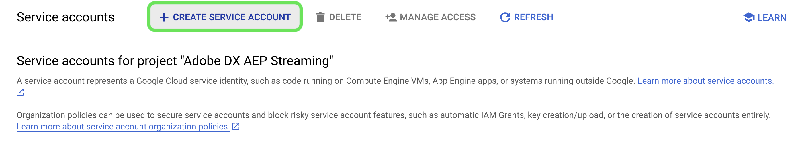

# [!DNL Google PubSub] bron

>[!IMPORTANT]
>
>De [!DNL Google PubSub] De bron is in de broncatalogus beschikbaar voor gebruikers die Real-time Customer Data Platform Ultimate hebben aangeschaft.

Adobe Experience Platform biedt native connectiviteit voor cloudproviders zoals [!DNL AWS], [!DNL Google Cloud Platform], en [!DNL Azure], zodat u gegevens van deze systemen kunt overbrengen naar Platform voor gebruik in downstreamservices en bestemmingen.

Met bronnen voor cloudopslag kunt u uw gegevens overbrengen naar Platform zonder dat u deze hoeft te downloaden, opmaken of uploaden. Ingebedde gegevens kunnen worden opgemaakt als XDM JSON, XDM Parquet, of afgebakend. Elke stap van het proces is geïntegreerd in de bronwerkstroom. Met Platform kunt u gegevens van [!DNL Google PubSub] in real time.

## Vereisten {#prerequisites}

In deze sectie worden de vereiste instellingen beschreven die u moet voltooien voordat u uw [!DNL Google PubSub] aan Experience Platform.

### Serviceaccount maken {#create-service-account}

A **serviceaccount** is een type account dat vaak wordt gebruikt door een toepassing of een rekenwerklast, in plaats van door een persoon. Een serviceaccount wordt geïdentificeerd door het e-mailadres dat uniek is voor de account.

* Aan de ene kant zijn serviceaccounts **hoofden** - u kunt serviceaccounts toegang geven tot [!DNL Google Cloud] middelen. Bijvoorbeeld, kon u een de dienstrekening verlenen de Compute rol Admin `(roles/compute.admin)` voor een bepaald project. Dit staat dan de de dienstrekening toe om de middelen van de Motor in dat bepaalde project te kunnen beheren.
* Anderzijds, zijn de dienstrekeningen ook middelen - u kunt andere hoofden toestemming geven om tot de de dienstrekening toegang te hebben. U kunt bijvoorbeeld een gebruiker de rol Gebruiker van de serviceaccount geven `(roles/iam.serviceAccountUser)` op een de dienstrekening om de gebruiker te laten die de dienstrekening aan middelen vastmaken. Alternatief, kunt u een gebruiker de rol van Admin van de Rekening van de Dienst verlenen `(roles/iam.serviceAccountAdmin)` om de gebruiker in staat te stellen taken uit te voeren, zoals het weergeven, bewerken, uitschakelen en verwijderen van de serviceaccount.

Voor meer informatie over het bepalen van het juiste authentificatietype voor uw gebruiksgeval, lees [[!DNL Google] handleiding over verificatiemethoden](https://cloud.google.com/docs/authentication).

Voer de onderstaande stappen uit om een serviceaccount te maken:

Ga eerst naar de [!DNL IAM] pagina van de [!DNL Google Developer Console] en selecteer vervolgens **[!DNL Create Service Account]**.

Voer vervolgens een weergavenaam en een id voor uw serviceaccount in en selecteer **[!DNL Create and Continue]**.

### Servicetoetsen genereren {#generate-service-account-keys}

Om sleutels voor uw de dienstrekening te produceren, selecteer de sleutelkopbal in de pagina van de de dienstrekeningen. Selecteer **[!DNL Add key]** en selecteer vervolgens **[!DNL Create new key]** in het vervolgkeuzemenu. U kunt dit deelvenster ook gebruiken om een bestaande sleutel te uploaden.

Als dit lukt, ontvangt u een bericht dat de persoonlijke sleutel op uw computer is opgeslagen en dat een bestand wordt gedownload. U kunt de inhoud van dit bestand vervolgens als referenties gebruiken wanneer u uw [!DNL Google PubSub] account op Experience Platform.

### Rechten verlenen op onderwerp- en abonnementsniveau {#grant-permissions}

Om toestemmingen op het onderwerp en abonnementsniveau te verlenen, navigeer aan de pagina van de onderwerpconsole en selecteer dan **[!DNL Show info panel]**. Volgende, onder de [!DNL Permissions] tab, selecteert u [!DNL Add Principal] en voeg dan het hoofd van de de dienstrekening samen met de toestemmingen toe.

## Configuraties voor optimale [!DNL Google PubSub usage] {#optimal-configurations}

In deze sectie worden configuraties beschreven die u kunt gebruiken voor het optimaliseren van het [!DNL Google PubSub] bron op Experience Platform.

### Eigenschappen voor abonnementen {#subscription-properties}

Gebruik de [!DNL Google Developer Console] tot **verhoog de deadline voor bevestiging**. Dit maakt het mogelijk [!DNL Google Publisher] om volgens de tijd te wachten die u vormt alvorens het bericht opnieuw te verzenden. Deze vertraging helpt onnodige belasting op abonneeniveau te verminderen.

Inschakelen **[!DNL exactly one delivery]**. Deze configuratie informeert de [!DNL Google Publisher] om ervoor te zorgen dat de berichten die naar het abonnement worden verzonden geen bezwaar krijgen vóór de erkenningsdeadline verloopt. U kunt deze instelling gebruiken om ervoor te zorgen dat bevestigingsberichten niet opnieuw naar het abonnement worden verzonden.

U kunt **[!DNL Retry after exponential backoff delay]** om het risico van verdere overweldiging van de server te verminderen. U kunt deze configuratie inschakelen in het dialoogvenster [!DNL Google Developer Console] om fouten van voorbijgaande aard (tijdelijke fouten die zich typisch oplossen) beter te verlichten, door het systeem van meer tijd te voorzien om terug te krijgen alvorens een andere verbinding te proberen.

U moet **de bewaarduur van het abonnementsbericht instellen op 24 uur of langer** om ervoor te zorgen dat niet-erkende gegevens tijdens piekbelastingen niet verloren gaan. Daarnaast **dode letter topic toelaten** om te voorkomen dat gegevens verloren gaan, zelfs in zeldzame gevallen.

>[!IMPORTANT]
>
>U kunt slechts één brongegevensstroom maken per [!DNL Google PubSub] abonnement. Als u een abonnement opnieuw gebruikt, zelfs in verschillende sandboxen, gaan er gegevens verloren.

## Verbinden [!DNL Google PubSub] naar Experience Platform

In de onderstaande documentatie vindt u informatie over de verbinding [!DNL Google PubSub] naar Platform met API&#39;s of de gebruikersinterface:

### API&#39;s gebruiken

* [Een Google PubSub-bronverbinding maken met de Flow Service API](../../tutorials/api/create/cloud-storage/google-pubsub.md)
* [Streaming gegevens verzamelen met de Flow Service API](../../tutorials/api/collect/streaming.md)

### UI gebruiken

* [Een Google PubSub-bronverbinding maken in de gebruikersinterface](../../tutorials/ui/create/cloud-storage/google-pubsub.md)
* [Een gegevensstroom configureren voor een verbinding voor cloudopslag in de gebruikersinterface](../../tutorials/ui/dataflow/streaming/cloud-storage-streaming.md)
