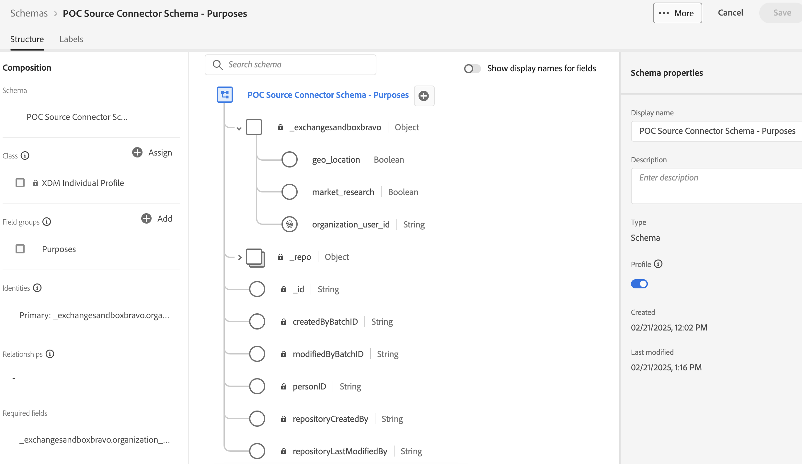

# [!DNL Didomi]

[!DNL Didomi] is een platform voor toestemmings- en voorkeursbeheer dat organisaties helpt bij het verzamelen, beheren en afdwingen van gebruikerskeuzes met betrekking tot persoonlijke gegevens op websites, apps en interne tools.

Adobe Experience Platform ondersteunt het opnemen van gegevens van een groot aantal externe systemen, zoals cloudopslag, databases en toepassingen zoals [!DNL Didomi] via een systeem van bronconnectors. Gebruik bronnen om externe systemen te verifiëren, gegevensstroom naar Experience Platform te beheren en consistente en gestructureerde inname van uw klantgegevens te garanderen.

Met de [!DNL Didomi] -bron kunt u gegevens over de toestemming en voorkeuren van gebruikers in real time vanuit het [!DNL Didomi] toestemmings- en voorkeurenbeheerplatform naar Experience Platform streamen. Via de [!DNL Didomi] -bron kunt u gegevens over uw toestemming centraliseren en op basis daarvan handelen in Experience Platform. Zo blijven uw klantprofielen en workflows in de toekomst compatibel en up-to-date.

## Vereisten

Voer de onderstaande stappen uit om uw [!DNL Didomi] -account met succes te verbinden met Experience Platform.

### IP adres lijst van gewenste personen

U moet gebied-specifieke IP adressen aan uw lijst van gewenste personen toevoegen alvorens uw bronnen aan Experience Platform aan te sluiten. Voor meer informatie, lees de gids op [ voegend op lijst van gewenste personen IP adressen om met Experience Platform ](../../ip-address-allow-list.md) voor meer informatie te verbinden.

### Machtigingen configureren voor Experience Platform

U moet zowel **[!UICONTROL View Sources]** - als **[!UICONTROL Manage Sources]** -machtigingen hebben ingeschakeld voor uw account om uw [!DNL Didomi] -account te kunnen verbinden met Experience Platform. Neem contact op met de productbeheerder om de benodigde machtigingen te verkrijgen. Voor meer informatie, lees de [ gids UI van de toegangscontrole ](../../../access-control/ui/overview.md).

### Referenties Adobe API verzamelen

Als u [!DNL Didomi] veilig wilt verbinden met Experience Platform, moet u verifiëren met uw Adobe API-referenties. Deze gegevens zijn essentieel voor het instellen van de webhaak en het configureren van gegevensinvoer.

Lees de gids op [ begonnen wordt met Experience Platform APIs ](../../../landing/api-authentication.md) voor informatie over hoe te met succes vraag aan Experience Platform APIs maken.

### Een Experience Platform-schema maken

>[!TIP]
>
>U kunt deze stap overslaan als u al een bestaand XDM-schema hebt.

Een **schema van de Gegevens van de Ervaring van het Model (XDM)** bepaalt de structuur van de gegevens u van [!DNL Didomi] (b.v., gebruiker IDs, toestemmingsdoeleinden) naar Experience Platform zult verzenden.

Als u een schema wilt maken, selecteert u [!UICONTROL Schemas] in de linkernavigatie van de gebruikersinterface van Experience Platform en selecteert u **[!UICONTROL Create schema]** . Selecteer vervolgens **[!UICONTROL Standard]** als schematype en selecteer **[!UICONTROL Manual]** om handmatig uw velden te maken. Selecteer een basisklasse voor uw schema en geef een naam op voor uw schema.

Als u het schema hebt gemaakt, werkt u het bij door de vereiste velden toe te voegen. Zorg ervoor dat ten minste één veld een [!UICONTROL Identity] veld is om Experience Platform te informeren over uw primaire identiteitswaarden. Zorg er ten slotte voor dat u de schakeloptie [!UICONTROL Profile] inschakelt om uw gegevens op te slaan.

Voor meer informatie, lees de gids op [ creërend schema&#39;s in UI ](../../../xdm/tutorials/create-schema-ui.md).

### Een gegevensset maken

>[!TIP]
>
>U kunt deze stap overslaan als u reeds een bestaande dataset hebt.

A **dataset** in Experience Platform wordt gebruikt om inkomende gegevens op te slaan die op het schema worden gebaseerd dat u bepaalt.

Als u een gegevensset wilt maken, selecteert u [!UICONTROL Datasets] in de linkernavigatie van de gebruikersinterface van Experience Platform en selecteert u vervolgens **[!UICONTROL Create dataset]** . Selecteer vervolgens **[!UICONTROL Create dataset from schema]** en selecteer het schema dat u aan de nieuwe gegevensset wilt koppelen.

## De HTTP Webhaak op de [!DNL Didomi] -console configureren

Met [!DNL Webhooks] kunt u zich abonneren op gebeurtenissen die op het [!DNL Didomi] -platform worden geactiveerd wanneer gebruikers werken met hun voorkeuren voor toestemming. Wanneer een relevante gebeurtenis plaatsvindt — bijvoorbeeld wanneer een gebruiker toestemming geeft of intrekt — verzendt [!DNL Didomi] een realtime HTTP POST-aanvraag met een JSON-payload naar het geconfigureerde [!DNL webhook] -eindpunt.

Voor compatibiliteit met Experience Platform moet uw webhaak aan de volgende vereisten voldoen.

| Veld | Beschrijving | Voorbeeld |
| --- | --- | --- | 
| Clientgeheim | De geheime sleutel die is gekoppeld aan uw Adobe API-referenties. | `d8f3b2e1-4c9a-4a7f-9b2e-8f1c3d2a1b6e` |
| API-sleutel | De openbare API-sleutel die wordt gebruikt voor het verifiëren van aanvragen bij Adobe-services. |
| Type subsidie | De methode waardoor een toepassing een toegangstoken van de vergunningsserver verkrijgt. Stel deze waarde in op `client_credentials` . | `client_credentials` |
| Bereik | Het machtigingsbereik definieert de specifieke machtigingen of toegangsniveaus die een toepassing aanvraagt bij de API-provider. | `openid,AdobeID,read_organizations,additional_info.projectedProductContext,session` |
| Verificatieheader | De extra headers die vereist zijn voor de Adobe-tokenaanvraag. | `{"Content-type": "application/x-www-form-urlencoded"}` |
| Token-URL | Uw het symbolische eindpunt van Adobe. | `https://ims-na1.adobelogin.com/ims/token/v3` |
| URL van eindpunt | De laatste URL voor de Adobe-connector (opgegeven aan het einde van de installatie). | `https://dcs.adobedc.net/collection/your-adobe-endpoint-id` |

{style="table-layout:auto"}

Configureer vervolgens de volgende opties voor uw [!DNL webhook] .

| Veld | Beschrijving | Waarde |
| ---| --- | --- | 
| Aanvraagkoppen | De aangepaste kopteksten voor de [!DNL webhook] . Zorg ervoor dat u de instructie `x-adobe-flow-id` opneemt. U kunt deze waarde terugwinnen nadat uw [ dataflow wordt gecreeerd ](../../tutorials/ui/create/consent-and-preferences/didomi.md#retrieve-the-streaming-endpoint-url). | `{"Content-Type": "application/json", "Cache-Control": "no-cache", "x-adobe-flow-id": "{DATAFLOW_ID}"}` |
| Afvlakken | Deze eigenschap moet worden gecontroleerd, omdat de [!DNL webhook] -gegevens als een vlak object worden verzonden. | Ingeschakeld |
| Gebeurtenistypen | Selecteer de specifieke groep [!DNL Didomi] -gebeurtenissen ( `event.*` of `user.*` ) die de gebeurtenis [!DNL webhook] moet activeren. Gebruik `event.*` om wijzigingen in toestemming of voorkeuren bij te houden en gebruik `user.*` om updates van gebruikersprofielen bij te houden. Deze selectie is vereist om ervoor te zorgen dat alleen compatibele gebeurtenissen naar Adobe worden verzonden. Adobe ondersteunt slechts één schema per gegevensstroom, dus als u beide gebeurtenistypen selecteert, kunnen insluitingsfouten optreden. | De lijst met ondersteunde gebeurtenistypen is: <ul><li>`Event.created`</li><li>`Event.updated`</li><li>`Event.deleted`</li><li>`User.created`</li><li>`User.updated`</li><li>`User.deleted`</li></ul> |

### Download het bestand met de voorbeeldlading {#download-the-sample-payload-file}

Gebaseerd op uw geselecteerde gebeurtenisgroep, download direct het aangewezen **dossier van de steekproeflading** van de [!DNL Didomi] Console. Dit bestand vertegenwoordigt de structuur van de gegevens en wordt gebruikt tijdens de schema- en toewijzingsstappen in Adobe.

| **de Groep van de Gebeurtenis** | **Te downloaden Dossier van de Steekproef** | **het Filtreren Optie** |
| --- | ---| --- |
| `event.*` | Een voorbeeld downloaden voor `event.created` | Alleen filteren voor `event.*` -gebeurtenissen |
| `user.*` | Een voorbeeld downloaden voor `user.created` | Alleen filteren voor `user.*` -gebeurtenissen |

## Sluit uw [!DNL Didomi] -account aan op Experience Platform

Lees de gids op [ verbindend  [!DNL Didomi]  met Experience Platform ](../../tutorials/ui/create/consent-and-preferences/didomi.md) om te leren hoe te om een bronverbinding tot stand te brengen en toestemmings en voorkeursgegevens van [!DNL Didomi] in Experience Platform in te voeren.