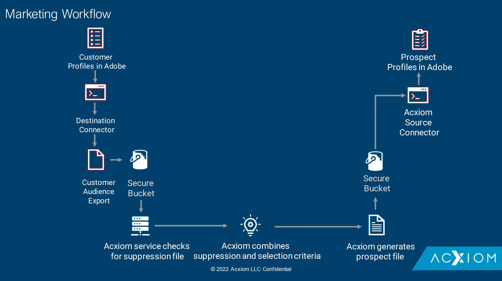

# [!DNL Acxiom Prospecting Data Import]

>[!NOTE]
>
>De bron [!DNL Acxiom Prospecting Data Import] is in bèta. Gelieve te lezen het [ overzicht van bronnen ](../../home.md#terms-and-conditions) voor meer informatie bij het gebruiken van bèta-geëtiketteerde bronnen.

Adobe Experience Platform biedt ondersteuning voor het opnemen van gegevens van een toepassing voor gegevenspartners. Ondersteuning voor gegevens- en identiteitspartners is inclusief [!DNL Acxiom Prospecting Data Import] .

De [!DNL Acxiom] -programma voor het doorvoeren van gegevens voor Adobe Real-time Customer Data Platform is een proces voor het bieden van het meest productieve mogelijke publiek. [!DNL Acxiom] gebruikt Real-Time CDP-gegevens van de eerste partij via een beveiligde exportbewerking en voert deze gegevens uit via een bekroond systeem voor het oplossen van hygiëne en identiteit. Een gegevensbestand dat als onderdrukkingslijst kan worden gebruikt wordt geproduceerd. Dit gegevensbestand wordt dan aangepast aan het [!DNL Acxiom Global] gegevensbestand, dat toelaat dat de perspectieflijsten worden aangepast voor de invoer.

U kunt de [!DNL Acxiom] -bron gebruiken om reacties van de [!DNL Acxiom] perspectiefservice op te halen en toe te wijzen met [!DNL Amazon S3] als een neerzetpunt.

Lees het onderstaande document voor informatie over hoe u uw [!DNL Acxiom Prospecting Data Import] bronaccount kunt instellen.

## Vereisten

Om tot uw emmer op Experience Platform toegang te hebben, moet u geldige waarden voor de volgende geloofsbrieven verstrekken:

| Credentials | Beschrijving |
| --- | --- |
| [!DNL Acxiom] verificatiesleutel | De verificatiesleutel. U kunt deze waarde ophalen van het team van [!DNL Acxiom] . |
| [!DNL Amazon S3] toegangstoets | De toegangs belangrijkste identiteitskaart voor uw emmer. U kunt deze waarde ophalen van het team van [!DNL Acxiom] . |
| [!DNL Amazon S3] geheime sleutel | De geheime sleutel-id voor uw emmer. U kunt deze waarde ophalen van het team van [!DNL Acxiom] . |
| Naam van emmertje | Dit is uw emmertje waar de dossiers zullen worden gedeeld. U kunt deze waarde ophalen van het team van [!DNL Acxiom] . |

## IP adres lijst van gewenste personen

Een lijst van IP adressen moet aan een lijst van gewenste personen worden toegevoegd alvorens met bronschakelaars te werken. Het niet toevoegen van uw regio-specifieke IP adressen aan uw lijst van gewenste personen kan tot fouten of niet-prestaties leiden wanneer het gebruiken van bronnen. Zie de ](../../ip-address-allow-list.md) pagina van de lijst van gewenste personen van het 0} IP adres {voor meer informatie.[

### Machtigingen configureren voor Experience Platform

U moet zowel **[!UICONTROL View Sources]** als **[!UICONTROL Manage Sources]** machtigingen hebben ingeschakeld voor uw account om uw [!DNL Acxiom Prospecting Data Import] -account aan Experience Platform te kunnen koppelen. Neem contact op met de productbeheerder om de benodigde machtigingen te verkrijgen. Voor meer informatie, lees de [ gids UI van de toegangscontrole ](../../../access-control/abac/ui/permissions.md).

## Naamgevingsbeperkingen voor bestanden en mappen

Met de onderstaande beperkingen moet rekening worden gehouden bij de naamgeving van uw cloudopslagbestand of -map:

- Namen van mappen en bestandscomponenten mogen niet langer zijn dan 255 tekens.
- De folder en de dossiernamen kunnen niet met een voorwaartse schuine streep (`/`) beëindigen. Indien beschikbaar wordt deze automatisch verwijderd.
- De volgende gereserveerde URL-tekens moeten correct worden beschermd: `! ' ( ) ; @ & = + $ , % # [ ]`
- De volgende tekens zijn niet toegestaan: `" \ / : | < > * ?` .
- Ongeldige URL-padtekens zijn niet toegestaan. Codepunten zoals `\uE000` zijn weliswaar geldig in NTFS-bestandsnamen, maar zijn geen geldige Unicode-tekens. Bovendien zijn sommige ASCII- of Unicode-tekens, zoals besturingstekens (0x00 tot 0x1F, \u0081, enz.), niet toegestaan. Voor regels die de koorden van Unicode in HTTP/1.1 bepalen zie [ RFC 2616, Sectie 2.2: BasisRegels ](https://www.ietf.org/rfc/rfc2616.txt) en [ RFC 3987 ](https://www.ietf.org/rfc/rfc3987.txt).
- De volgende bestandsnamen zijn niet toegestaan: LPT1, LPT2, LPT3, LPT4, LPT5, LPT6, LPT7, LPT8, LPT9, COM1, COM2, COM3, COM4, COM5, COM6, COM7, COM8, COM9, PRN, AUX, NUL, CON, CLOCK$, puntteken (.) en twee stippen ( ...).

## Volgende stappen

Door dit document te lezen, hebt u de vereiste instellingen voltooid die nodig zijn om gegevens van uw [!DNL Acxiom] -account naar het Experience Platform te kunnen verzenden. U kunt aan de gids nu te werk gaan op [ verbindend  [!DNL Acxiom Prospecting Data Import]  met Experience Platform gebruikend het gebruikersinterface ](../../tutorials/ui/create/data-partners/acxiom-prospecting-data-import.md).
