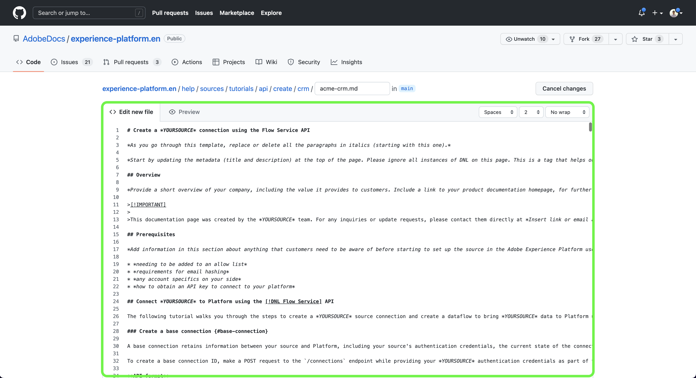

# Gebruik de het Webinterface van GitHub om een brondocumentatiepagina tot stand te brengen

Dit document verstrekt stappen op hoe te om de het Webinterface van GitHub aan auteursdocumentatie te gebruiken en een trekkingsverzoek (PR) voor te leggen.

>[!TIP]
>
>De volgende documenten uit de bijdragende gids van Adobe kunnen worden gebruikt om uw documentatieproces verder te steunen: <ul><li>[&#x200B; installeer Git en de Authoring hulpmiddelen van de Prijsverhoging &#x200B;](https://experienceleague.adobe.com/docs/contributor/contributor-guide/setup/install-tools.html?lang=nl-NL)</li><li>&lbrace;de plaats van de Git van de opstelling plaatselijk voor documentatie [&#128279;](https://experienceleague.adobe.com/docs/contributor/contributor-guide/setup/local-repo.html?lang=nl-NL)</li><li>[&#x200B; GitHub bijdragewerkschema voor belangrijkste veranderingen &#x200B;](https://experienceleague.adobe.com/docs/contributor/contributor-guide/setup/full-workflow.html?lang=nl-NL)</li></ul>

## Opstelling uw milieu GitHub

De eerste stap in vestiging uw milieu GitHub moet aan de [&#x200B; bewaarplaats van Adobe Experience Platform navigeren GitHub &#x200B;](https://github.com/AdobeDocs/experience-platform.nl-NL).

Daarna, uitgezochte **Vlek**.

Zodra de vork volledig is, uitgezochte **belangrijkste** en ga een naam voor uw nieuwe tak in het dropdown menu in dat verschijnt. Zorg ervoor dat u een beschrijvende naam voor uw tak verstrekt aangezien dit zal worden gebruikt om uw werk te bevatten, en selecteer dan **tak** creëren.

In de GitHub omslagstructuur van uw forked bewaarplaats, navigeer aan [`experience-platform.en/help/sources/tutorials/api/create/` &#x200B;](https://github.com/AdobeDocs/experience-platform.nl-NL/tree/main/help/sources/tutorials/api/create) en selecteer dan de aangewezen categorie voor uw bron van de lijst. Bijvoorbeeld, als u documentatie voor een nieuwe bron van CRM creeert, uitgezochte **crm**.

>[!TIP]
>
>Als u documentatie voor UI creeert, dan navigeer aan [`experience-platform.en/help/sources/tutorials/ui/create/` &#x200B;](https://github.com/AdobeDocs/experience-platform.nl-NL/tree/main/help/sources/tutorials/ui/create) en selecteer de aangewezen categorie voor uw bron. Als u afbeeldingen wilt toevoegen, navigeert u naar [`experience-platform.en/help/sources/images/tutorials/create/sdk` &#x200B;](https://github.com/AdobeDocs/experience-platform.nl-NL/tree/main/help/sources/images/tutorials/create) en voegt u uw schermafbeeldingen toe aan de map `sdk` .

Er wordt een map met bestaande CRM-bronnen weergegeven. Om documentatie voor een nieuwe bron toe te voegen, **voeg dossier** toe en selecteer dan **creeer nieuw dossier** van het drop-down menu dat verschijnt.

Geef het bronbestand een naam `YOURSOURCE.md` waarbij UURSOURCE de naam van uw bron in Experience Platform is. Als uw bedrijf bijvoorbeeld ACME CRM is, moet uw bestandsnaam `acme-crm.md` zijn.

## Auteur de documentatiepagina voor uw bron

Beginnen uw nieuwe bron te documenteren, kleef de inhoud van het [&#x200B; malplaatje van de brondocumentatie &#x200B;](./template.md) in de het Webredacteur van GitHub. U kunt het malplaatje [&#x200B; &#x200B;](../assets/api-template.zip) ook hier downloaden.

Met het malplaatje dat over aan de interface van de Webredacteur van GitHub wordt gekopieerd, volg de instructies die op het malplaatje worden geschetst en geef de waarden uit die relevante informatie voor uw bron bevatten.

Als u klaar bent, legt u het bestand in de vertakking vast.

## De documentatie ter controle verzenden

Nadat het bestand is toegewezen, kunt u een pull-verzoek (PR) openen om uw werkvertakking samen te voegen in de hoofdvertakking van de Adobe-documentatieopslagplaats. Zorg ervoor dat de tak u aan hebt gewerkt wordt geselecteerd, en selecteer dan **vergelijken &amp; trekken verzoek**.

Zorg ervoor dat de basis- en vergelijkingsvertakkingen correct zijn. Voeg een nota aan PR toe, beschrijvend uw update, en selecteer dan **trekken verzoek** creëren. Dit opent een PR om de werkende tak van uw werk in de belangrijkste tak van de bewaarplaats van Adobe samen te voegen.

>[!TIP]
>
>Verlaat **uitgeeft door instandhouders** geselecteerde checkbox toestaan om ervoor te zorgen dat het de documentatieteam van Adobe aan PR kan uitgeven.

Op dit moment wordt een melding weergegeven waarin u wordt gevraagd de Adobe Contributor License Agreement (CLA) te ondertekenen. Dit is een verplichte stap. Nadat u CLA ondertekent, vernieuw de PR pagina en verzend het trekkingsverzoek.

U kunt bevestigen dat het trekkingsverzoek is voorgelegd door het lusje van trekkingsverzoeken in https://github.com/AdobeDocs/experience-platform.nl-NL te inspecteren.

