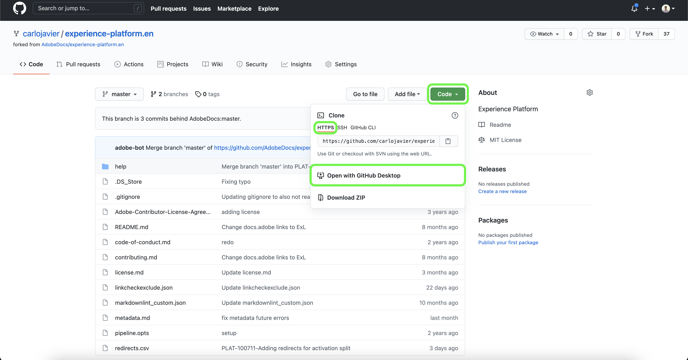
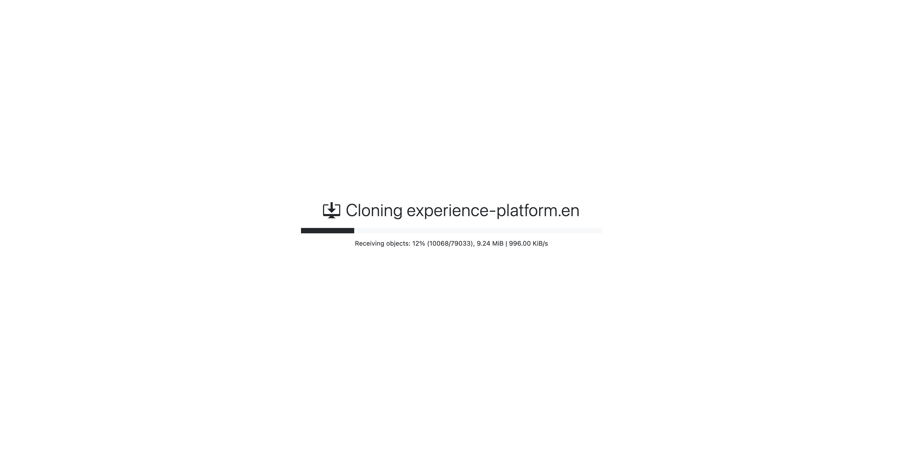

# Een teksteditor in uw lokale omgeving gebruiken om een documentatiepagina voor bronnen te maken

Dit document bevat stappen voor het gebruik van uw lokale omgeving bij het schrijven van documentatie voor uw bron en het indienen van een pull-verzoek (PR).

>[!TIP]
>
>De volgende documenten uit de Contribute-handleiding voor Adobe kunnen worden gebruikt ter ondersteuning van het documentatieproces: <ul><li>[Gereedschappen voor Git- en Markeringsontwerp installeren](https://experienceleague.adobe.com/docs/contributor/contributor-guide/setup/install-tools.html?lang=en)</li><li>[Git-opslagplaats lokaal instellen voor documentatie](https://experienceleague.adobe.com/docs/contributor/contributor-guide/setup/local-repo.html?lang=en)</li><li>[GitHub-bijdrageworkflow voor grote wijzigingen](https://experienceleague.adobe.com/docs/contributor/contributor-guide/setup/full-workflow.html?lang=en)</li></ul>

## Vereisten

Het volgende leerprogramma vereist dat u Desktop GitHub hebt die op uw lokale machine wordt geïnstalleerd. Als u geen Desktop GitHub hebt, kunt u de toepassing downloaden [hier](https://desktop.github.com/).

## Verbind met GitHub en opstelling uw lokale auteursmilieu

De eerste stap bij het instellen van uw lokale ontwerpomgeving is naar de [Adobe Experience Platform GitHub-opslagplaats](https://github.com/AdobeDocs/experience-platform.en).

Voor de belangrijkste pagina van de bewaarplaats van GitHub van het Platform, selecteer **Vork**.

Selecteer **Code**. Selecteer in het vervolgkeuzemenu dat wordt weergegeven de optie **HTTPS** en selecteert u vervolgens **Openen met GitHub Desktop**.

>[!TIP]
>
>Raadpleeg de zelfstudie voor meer informatie [Git-opslagplaats lokaal instellen voor documentatie](https://experienceleague.adobe.com/docs/contributor/contributor-guide/setup/local-repo.html?lang=en#create-a-local-clone-of-the-repository).

Daarna, sta een paar momenten voor Desktop GitHub toe om de `experience-platform.en` opslagplaats.

Zodra het het klonen proces volledig is, hoofd aan Desktop GitHub om een nieuwe tak tot stand te brengen. Selecteren **Master** van de hoogste navigatie en selecteer dan **Nieuwe vertakking**

Voer in het pop-upvenster dat wordt weergegeven een beschrijvende naam voor de vertakking in en selecteer vervolgens **Vertakking maken**.

Selecteer vervolgens **Vertakking publiceren**.

## Auteur de documentatiepagina voor uw bron

Als de opslagplaats aan uw lokale machine wordt gekloond en een nieuwe tak gecreeerd, kunt u nu beginnen de documentatiepagina voor uw nieuwe bron door [teksteditor van uw keuze](https://experienceleague.adobe.com/docs/contributor/contributor-guide/setup/install-tools.html?lang=en#understand-markdown-editors).

Adobe raadt u aan [Visual Studio-code](https://code.visualstudio.com/) en dat u de extensie Adobe Markdown Authoring installeert. Om de uitbreiding te installeren, lanceer de Code van Visual Studio, en selecteer dan **Extensies** van de linkernavigatie.

Volgende, typ `Adobe Markdown Authoring` in de zoekbalk en selecteer vervolgens **Installeren** van de pagina die wordt weergegeven.

Download de [source documentation template](../assets/template.zip) en extraheer het bestand naar `experience-platform.en/help/sources/tutorials/api/create/...` with [`...`] die de categorie van uw keuze vertegenwoordigt. Als u bijvoorbeeld een databasebron maakt, selecteert u de databasemap.

Volg ten slotte de instructies in de sjabloon en bewerk de sjabloon met de relevante informatie over de bron.

## De documentatie ter controle verzenden

Als u een pull-verzoek (PR) wilt maken en uw documentatie ter controle wilt verzenden, slaat u uw werk eerst op in [!DNL Visual Studio Code] (of de door u gekozen teksteditor). Daarna, gebruikend de Desktop van GitHub, ga een begaat bericht in en selecteer **Vastleggen om brondocumentatie te maken**.

Selecteer vervolgens **Oorsprong** om uw werk naar de externe vertakking te uploaden.

Selecteer **Uitvouwen verzoek maken**.

Zorg ervoor dat de basis- en vergelijkingsvertakkingen correct zijn. Voeg een notitie toe aan de PR, beschrijf de update en selecteer vervolgens **pull-verzoek maken**. Dit opent een PR om de werkende tak van uw werk in de master tak van de opslagplaats van de Adobe samen te voegen.

>[!TIP]
>
>Laat de **Bewerkingen door onderhoudsleiders toestaan** Schakel het selectievakje in om ervoor te zorgen dat het documentatieteam Adobe de PR kan bewerken.

U kunt bevestigen dat het trekkingsverzoek is voorgelegd door het lusje van trekkingsverzoeken in https://github.com/AdobeDocs/experience-platform.en te inspecteren.

