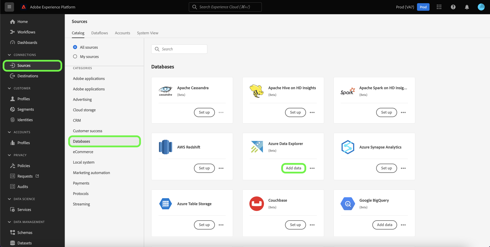

# Een *UURSOURCE* bronverbinding in de gebruikersinterface

*Terwijl u deze sjabloon doorloopt, vervangt of verwijdert u alle cursief gedrukte alinea&#39;s (te beginnen met deze alinea).*

*Begin door de meta-gegevens (titel en beschrijving) bij te werken bij de bovenkant van de pagina. Negeer alle exemplaren van UICONTROL op deze pagina. Dit is een label waarmee de pagina in de verschillende talen die wij ondersteunen correct wordt vertaald in onze computervertaalprocessen. Nadat u de documentatie hebt verzonden, voegen we codes aan de documentatie toe.*

Deze zelfstudie bevat stappen voor het maken van een *UURSOURCE* bronaansluiting die gebruikmaakt van de gebruikersinterface van het Platform.

## Overzicht

*Geef een kort overzicht van uw bedrijf, inclusief de waarde die het aan klanten biedt. Voeg een koppeling toe naar de startpagina van de productdocumentatie voor meer informatie.*

>[!IMPORTANT]
>
>Deze documentatiepagina is gemaakt door de *UURSOURCE* team. Voor vragen of verzoeken om updates kunt u rechtstreeks contact opnemen via *Koppeling of e-mailadres invoegen waar u voor updates kunt komen*.

## Vereisten

*Voeg in deze sectie informatie toe over alles waar klanten zich van bewust moeten zijn voordat ze de bron instellen in de Adobe Experience Platform-gebruikersinterface. Dit kan over zijn:*

* *moet aan een lijst van gewenste personen worden toegevoegd*
* *vereisten voor e-mailhashing*
* *accountdetails aan je kant*
* *hoe te om de authentificatiegeloofsbrieven te verkrijgen om met uw platform te verbinden*

### Vereiste referenties verzamelen

Om verbinding te maken *UURSOURCE* als u een Platform wilt maken, moet u waarden opgeven voor de volgende verbindingseigenschappen:

| Credentials | Beschrijving | Voorbeeld |
| --- | --- | --- |
| *referentie één* | *Voeg hier een korte beschrijving toe aan de verificatiereferentie van uw bron* | *Voeg hier een voorbeeld van de verificatiereferentie van uw bron toe* |
| *referentie twee* | *Voeg hier een korte beschrijving toe aan de verificatiereferentie van uw bron* | *Voeg hier een voorbeeld van de verificatiereferentie van uw bron toe* |
| *referentie drie* | *Voeg hier een korte beschrijving toe aan de verificatiereferentie van uw bron* | *Voeg hier een voorbeeld van de verificatiereferentie van uw bron toe* |

Voor meer informatie over deze geloofsbrieven, zie *UURSOURCE* verificatiedocumentatie. *Voeg hier een koppeling naar de verificatiedocumentatie van uw platform toe*.

## Verbind uw *UURSOURCE* account

Selecteer in de gebruikersinterface van het Platform de optie **[!UICONTROL Sources]** van de linkernavigatiebalk voor toegang tot de [!UICONTROL Sources] werkruimte. De [!UICONTROL Catalog] in het scherm worden diverse bronnen weergegeven waarmee u een account kunt maken.

U kunt de juiste categorie selecteren in de catalogus aan de linkerkant van het scherm. U kunt ook de specifieke bron vinden waarmee u wilt werken met de zoekoptie.

Onder de *DE CATEGORIE VAN UW BRON* categorie, selecteert u *UURSOURCE* en selecteer vervolgens **[!UICONTROL Add data]**.

>[!TIP]
>
>De onderstaande schermafbeeldingen zijn voorbeelden. Vervang de afbeeldingen bij het maken van de documentatie door schermafbeeldingen van de werkelijke bron. U kunt hetzelfde patroon en dezelfde kleur en dezelfde bestandsnamen gebruiken. Zorg ervoor dat uw schermafbeelding het volledige scherm van de gebruikersinterface van het Platform vastlegt. Zie de handleiding voor informatie over het uploaden van uw schermafbeeldingen [de documentatie ter controle verzenden](./github.md).

De **[!UICONTROL Connect YOURSOURCE account]** wordt weergegeven. Op deze pagina kunt u nieuwe of bestaande referenties gebruiken.

### Bestaande account

Als u een bestaande account wilt gebruiken, selecteert u de optie *UURSOURCE* account waarmee u een nieuwe gegevensstroom wilt maken, selecteert u **[!UICONTROL Next]** om verder te gaan.

### Nieuwe account

Als u een nieuwe account maakt, selecteert u **[!UICONTROL New account]** en geef vervolgens een naam, een optionele beschrijving en uw referenties op. Als u klaar bent, selecteert u **[!UICONTROL Connect to source]** en laat dan wat tijd voor de nieuwe verbinding tot stand brengen.

## Volgende stappen

*Workflows voor de overige stappen voor het maken van een gegevensstroom worden gemoduleerd. Als er om het even welke specifieke vraag-outs zijn u betreffende uw bron wilt maken, gelieve de extra middelensectie hieronder te zien.*

Aan de hand van deze zelfstudie hebt u een verbinding tot stand gebracht met uw *UURSOURCE* account. U kunt nu verdergaan met de volgende zelfstudie en [een gegevensstroom configureren om gegevens naar het Platform te brengen](https://experienceleague.adobe.com/docs/experience-platform/sources/ui-tutorials/dataflow/crm.html).

## Aanvullende bronnen

*Dit is een optionele sectie waar u verdere koppelingen naar de productdocumentatie of andere stappen, screenshots en nuances kunt toevoegen die u belangrijk vindt voor de klant om succesvol te zijn. U kunt deze sectie gebruiken om informatie over of tips voor de volledige workflow van uw bron toe te voegen, vooral als er bepaalde gotchas zijn die een eindgebruiker kan tegenkomen.*
