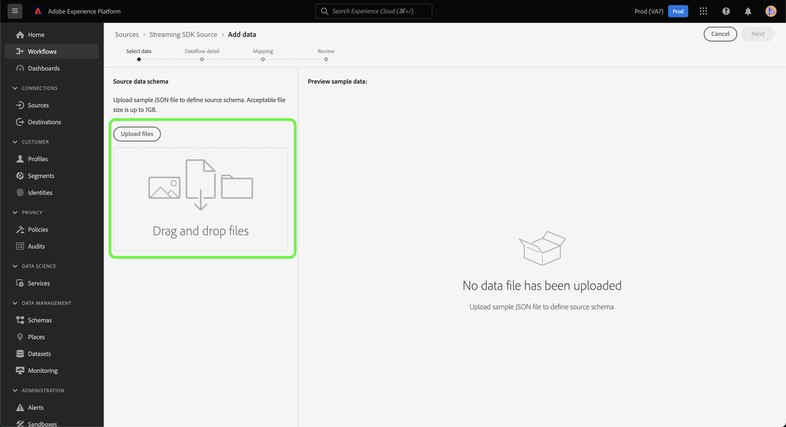

# Een bronverbinding en gegevensstroom maken *UURBRON* gegevens die de UI gebruiken

*Terwijl u deze sjabloon doorloopt, vervangt of verwijdert u alle cursief gedrukte alinea&#39;s (te beginnen met deze alinea).*

*Begin door de meta-gegevens (titel en beschrijving) bij te werken bij de bovenkant van de pagina. Negeer alle exemplaren van UICONTROL op deze pagina. Dit is een label waarmee de pagina in de verschillende talen die wij ondersteunen correct wordt vertaald in onze computervertaalprocessen. Nadat u de documentatie hebt verzonden, voegen we codes aan de documentatie toe.*

Deze zelfstudie bevat stappen voor het maken van een *UURBRON* bronschakelaar die het gebruikersinterface van het Platform gebruikt.

## Overzicht

*Geef een kort overzicht van uw bedrijf, inclusief de waarde die het aan klanten biedt. Voeg een koppeling toe naar de startpagina van de productdocumentatie voor meer informatie.*

>[!IMPORTANT]
>
>Deze bronschakelaar en documentatiepagina worden gecreeerd en gehandhaafd door *UURBRON* team. Voor vragen of verzoeken om updates kunt u rechtstreeks contact opnemen via *Koppeling of e-mailadres invoegen waar u voor updates kunt komen*.

## Vereisten

*Voeg in deze sectie informatie toe over alles waar klanten zich van bewust moeten zijn voordat ze de bron instellen in de Adobe Experience Platform-gebruikersinterface. Dit kan over zijn:*

* *moet aan een lijst van gewenste personen worden toegevoegd*
* *vereisten voor e-mailhashing*
* *accountdetails aan je kant*
* *hoe te om de authentificatiegeloofsbrieven te verkrijgen om met uw platform te verbinden*

### Vereiste referenties verzamelen

Om verbinding te maken *UURBRON* als u een Platform wilt maken, moet u waarden opgeven voor de volgende verbindingseigenschappen:

| Credentials | Beschrijving | Voorbeeld |
| --- | --- | --- |
| *referentie één* | *Voeg hier een korte beschrijving toe aan de verificatiegegevens van uw bron* | *Voeg hier een voorbeeld van de verificatiereferentie van uw bron toe* |
| *referentie twee* | *Voeg hier een korte beschrijving toe aan de verificatiegegevens van uw bron* | *Voeg hier een voorbeeld van de verificatiereferentie van uw bron toe* |
| *referentie drie* | *Voeg hier een korte beschrijving toe aan de verificatiegegevens van uw bron* | *Voeg hier een voorbeeld van de verificatiereferentie van uw bron toe* |

Voor meer informatie over deze geloofsbrieven, zie *UURBRON* verificatiedocumentatie. *Voeg hier een koppeling naar de verificatiedocumentatie van uw platform toe*.

### Integreren *UURBRON* met uw webhaak

*Voor Streaming SDK is uw bron vereist om webhaken te kunnen ondersteunen voor communicatie met het Experience Platform. In deze sectie moet u de stappen opgeven die uw gebruikers moeten uitvoeren om uw BRON met een webhaak te integreren.*

## Verbind uw *UURBRON* account

Selecteer in de gebruikersinterface van het Platform de optie **[!UICONTROL Sources]** van de linkernavigatiebalk voor toegang tot de [!UICONTROL Sources] werkruimte. De [!UICONTROL Catalog] in het scherm worden diverse bronnen weergegeven waarmee u een account kunt maken.

U kunt de juiste categorie selecteren in de catalogus aan de linkerkant van het scherm. U kunt ook de specifieke bron vinden waarmee u wilt werken met de zoekoptie.

Onder de **Streaming** categorie, selecteert u *UURBRON* en selecteer vervolgens **[!UICONTROL Add data]**.

>[!TIP]
>
>De onderstaande schermafbeeldingen zijn voorbeelden. Vervang de afbeeldingen bij het maken van de documentatie door schermafbeeldingen van de werkelijke bron. U kunt hetzelfde patroon en dezelfde kleur en dezelfde bestandsnamen gebruiken. Zorg ervoor dat uw schermafbeelding het volledige scherm van de gebruikersinterface van het Platform vastlegt. Zie de handleiding voor informatie over het uploaden van uw screenshots [de documentatie ter controle verzenden](../documentation/github.md).

## Gegevens selecteren

De **[!UICONTROL Select data]** wordt weergegeven, zodat u een interface hebt waarmee u de gegevens kunt selecteren die u naar het Platform verzendt.

* Het linkergedeelte van de interface is een browser waarmee u de beschikbare gegevensstromen binnen uw account kunt bekijken.
* In het rechtergedeelte van de interface kunt u maximaal 100 rijen gegevens uit een JSON-bestand voorvertonen.

Selecteren **[!UICONTROL Upload files]** om een JSON-bestand vanaf uw lokale systeem te uploaden. U kunt ook het JSON-bestand dat u wilt uploaden, slepen naar het [!UICONTROL Drag and drop files] deelvenster.

Nadat het bestand is geüpload, wordt de voorbeeldinterface bijgewerkt en wordt een voorvertoning weergegeven van het schema dat u hebt geüpload. Met de voorvertoningsinterface kunt u de inhoud en structuur van een bestand controleren. U kunt ook de opdracht [!UICONTROL Search field] nut om tot specifieke punten van binnen uw schema toegang te hebben.

Selecteer **[!UICONTROL Next]**.

## Gegevens

De **Gegevens** de stap verschijnt, die u van opties voorzien om een bestaande dataset te gebruiken of een nieuwe dataset voor uw gegevensstroom te vestigen, evenals een kans om een naam en een beschrijving voor uw gegevensstroom te verstrekken. Tijdens deze stap kunt u ook instellingen configureren voor het opnemen van profielen, foutdiagnose, gedeeltelijke inname en waarschuwingen.

Selecteer **[!UICONTROL Next]**.

## Toewijzing

De [!UICONTROL Mapping] de stap verschijnt, die u van een interface voorziet om de brongebieden van uw bronschema aan hun aangewezen doelXDM gebieden in het doelschema in kaart te brengen.

Platform biedt intelligente aanbevelingen voor automatisch toegewezen velden op basis van het doelschema of de gegevensset die u hebt geselecteerd. U kunt toewijzingsregels handmatig aanpassen aan uw gebruiksgevallen. Op basis van uw behoeften kunt u ervoor kiezen om velden rechtstreeks toe te wijzen of gegevens prep-functies te gebruiken om brongegevens om berekende of berekende waarden af te leiden. Voor uitvoerige stappen bij het gebruiken van de kaartperinterface en berekende gebieden, zie [UI-hulplijn voor gegevensvoorinstelling](https://experienceleague.adobe.com/docs/experience-platform/data-prep/ui/mapping.html).

Als de brongegevens zijn toegewezen, selecteert u **[!UICONTROL Next]**.

## Controleren

De **[!UICONTROL Review]** wordt weergegeven, zodat u de nieuwe gegevensstroom kunt controleren voordat deze wordt gemaakt. De details worden gegroepeerd in de volgende categorieën:

* **[!UICONTROL Connection]**: Hiermee geeft u het brontype, het relevante pad van het gekozen bronbestand en de hoeveelheid kolommen in dat bronbestand weer.
* **[!UICONTROL Assign dataset & map fields]**: Toont welke dataset de brongegevens worden opgenomen in, met inbegrip van het schema dat de dataset volgt.

Nadat u de gegevensstroom hebt gecontroleerd, klikt u op **[!UICONTROL Finish]** en laat enige tijd voor de gegevensstroom worden gecreeerd.

## Uw URL voor het streamingeindpunt ophalen

Wanneer uw streaminggegevens zijn gemaakt, kunt u nu de URL van het streamingeindpunt ophalen. Dit eindpunt zal worden gebruikt om aan uw webhaak in te tekenen, toestaand uw het stromen bron om met Experience Platform te communiceren.

Ga naar het tabblad [!UICONTROL Dataflow activity] pagina van de gegevensstroom die u enkel creeerde en het eindpunt van de bodem kopieert [!UICONTROL Properties] deelvenster.

## Volgende stappen

*Workflows voor de overige stappen voor het maken van een gegevensstroom worden gemoduleerd. Als er om het even welke specifieke vraag-outs zijn u betreffende uw bron wilt maken, gelieve de extra middelensectie hieronder te zien.*

Door deze zelfstudie te volgen, hebt u een verbinding tot stand gebracht met uw *UURBRON* account. U kunt nu verdergaan met de volgende zelfstudie en [een gegevensstroom configureren om gegevens naar het Platform te brengen](https://experienceleague.adobe.com/docs/experience-platform/sources/ui-tutorials/dataflow/crm.html).

## Aanvullende bronnen

*Dit is een optionele sectie waar u verdere koppelingen naar de productdocumentatie of andere stappen, screenshots en nuances kunt toevoegen die u belangrijk vindt voor de klant om succesvol te zijn. U kunt deze sectie gebruiken om informatie over of tips voor de volledige workflow van uw bron toe te voegen, vooral als er bepaalde gotchas zijn die een eindgebruiker kan tegenkomen.*
