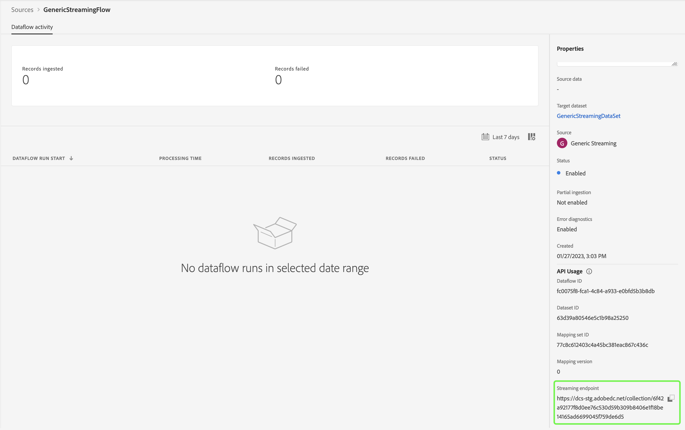

# De bron testen en verzenden

>[!NOTE]
>
>Self-Serve Sources Streaming SDK bevindt zich in bèta. Gelieve te lezen het [ overzicht van bronnen ](../../home.md#terms-and-conditions) voor meer informatie bij het gebruiken van bèta-geëtiketteerde bronnen.

De laatste stappen voor het integreren van uw nieuwe bron in Adobe Experience Platform met behulp van Self-Serve Sources (Streaming SDK) zijn het testen en verzenden van uw nieuwe bron. Nadat u de verbindingsspecificatie hebt voltooid en de streamingstroomspecificatie hebt bijgewerkt, kunt u de functionaliteit van uw bron testen via de API of de gebruikersinterface. Als dit lukt, kunt u de nieuwe bron verzenden door contact op te nemen met uw Adobe.

Het volgende document verstrekt stappen op hoe te om uw bron te testen en te zuiveren gebruikend [[!DNL Flow Service]  API ](https://www.adobe.io/experience-platform-apis/references/flow-service/).

## Aan de slag

* Voor informatie over hoe te om vraag aan Platform APIs met succes te maken, zie de gids op [ begonnen wordt met Platform APIs ](../../../landing/api-guide.md).
* Voor informatie over hoe te om uw geloofsbrieven voor Platform APIs te produceren, zie het leerprogramma op [ voor authentiek verklaren en tot Experience Platform APIs toegang heeft ](../../../landing/api-authentication.md).
* Voor informatie over hoe te opstelling [!DNL Postman] voor Platform APIs, zie het leerprogramma op [ vestiging de console van de ontwikkelaar en  [!DNL Postman]](../../../landing/postman.md).
* Om uw het testen en het zuiveren proces te helpen, download de [ Zelfbediening inzameling en het milieu van de Broncontrole hier ](../assets/sdk-verification.zip) en volg de hieronder geschetste stappen.

## De bron testen met de API

Om uw bron te testen die API gebruiken, moet u de [ Zelfbediening inzameling van de Broncontrole en het milieu ](../assets/sdk-verification.zip) op [!DNL Postman] in werking stellen terwijl het verstrekken van de aangewezen milieuvariabelen die tot uw bron behoren.

Als u wilt beginnen met testen, moet u eerst de verzameling en de omgeving instellen op [!DNL Postman] . Geef vervolgens de id van de verbindingsspecificatie op die u wilt testen.

>[!NOTE]
>
>Alle onderstaande voorbeeldvariabelen zijn plaatsaanduidingswaarden die u moet bijwerken, behalve `flowSpecificationId` en `targetConnectionSpecId` , die vaste waarden zijn.

| Parameter | Beschrijving | Voorbeeld |
| --- | --- | --- |
| `x-api-key` | Een unieke id die wordt gebruikt om aanroepen van Experience Platform-API&#39;s te verifiëren. Zie het leerprogramma op [ voor authentiek verklaren en tot Experience Platform APIs toegang heeft ](../../../landing/api-authentication.md) voor informatie over hoe te om uw `x-api-key` terug te winnen. | `c8d9a2f5c1e03789bd22e8efdd1bdc1b` |
| `x-gw-ims-org-id` | Een onderneming die producten en diensten kan bezitten of in licentie kan geven en toegang kan verlenen tot haar leden. Zie het leerprogramma op [ vestiging de console van de ontwikkelaar en  [!DNL Postman]](../../../landing/postman.md) voor instructies op hoe te om uw `x-gw-ims-org-id` informatie terug te winnen. | `ABCEH0D9KX6A7WA7ATQE0TE@adobeOrg` |
| `authorizationToken` | Het toestemmingstoken dat wordt vereist om vraag aan Experience Platform APIs te voltooien. Zie het leerprogramma op [ voor authentiek verklaren en tot Experience Platform APIs toegang heeft ](../../../landing/api-authentication.md) voor informatie over hoe te om uw `authorizationToken` terug te winnen. | `Bearer authorizationToken` |
| `schemaId` | Om de brongegevens in Platform te gebruiken, moet een doelschema worden gecreeerd om de brongegevens volgens uw behoeften te structureren. Voor gedetailleerde stappen op hoe te om een doelXDM schema tot stand te brengen, zie het leerprogramma op [ creërend een schema gebruikend API ](../../../xdm/api/schemas.md). | `https://ns.adobe.com/{TENANT_ID}.schemas.0ef4ce0d390f0809fad490802f53d30b` |
| `schemaVersion` | De unieke versie die overeenkomt met uw schema. | `application/vnd.adobe.xed-full-notext+json; version=1` |
| `schemaAltId` | De `meta:altId` die wordt geretourneerd naast de `schemaId` bij het maken van een nieuw schema. | `_{TENANT_ID}.schemas.0ef4ce0d390f0809fad490802f53d30b` |
| `dataSetId` | Voor gedetailleerde stappen op hoe te om een doeldataset tot stand te brengen, zie het leerprogramma op [ het creëren van een dataset gebruikend API ](../../../catalog/api/create-dataset.md). | `5f3c3cedb2805c194ff0b69a` |
| `mappings` | Toewijzingssets kunnen worden gebruikt om te definiëren hoe gegevens in een bronschema worden toegewezen aan dat van een doelschema. Voor gedetailleerde stappen op hoe te om een afbeelding tot stand te brengen, zie het leerprogramma bij [ het creëren van een mappingsreeks gebruikend API ](../../../data-prep/api/mapping-set.md). | `[{"destinationXdmPath":"person.name.firstName","sourceAttribute":"email.email_id","identity":false,"version":0},{"destinationXdmPath":"person.name.lastName","sourceAttribute":"email.activity.action","identity":false,"version":0}]` |
| `mappingId` | De unieke id die overeenkomt met uw toewijzingsset. | `bf5286a9c1ad4266baca76ba3adc9366` |
| `connectionSpecId` | De verbindingsspecificatie-id die overeenkomt met uw bron. Dit is identiteitskaart die u na [ creeerde het creëren van een nieuwe verbindingsspecificatie ](./create.md) produceerde. | `2e8580db-6489-4726-96de-e33f5f60295f` |
| `flowSpecificationId` | De flow specification-id van `GenericStreamingAEP`. **dit is een vaste waarde**. | `e77fde5a-22a8-11ed-861d-0242ac120002` |
| `targetConnectionSpecId` | De doel verbindingsID van het gegevens meer waar ingeslikte gegevens in landen. **dit is een vaste waarde**. | `c604ff05-7f1a-43c0-8e18-33bf874cb11c` |
| `verifyWatTimeInSecond` | Het opgegeven tijdsinterval dat moet worden gevolgd wanneer wordt gecontroleerd of een flow is voltooid. | `40` |
| `startTime` | De aangewezen begintijd voor uw gegevensstroom. De begintijd moet worden opgemaakt in unieke tijd. | `1597784298` |

Nadat u alle omgevingsvariabelen hebt opgegeven, kunt u de verzameling starten met de interface van [!DNL Postman] . In de [!DNL Postman] interface, selecteer de ellipsen (**...**) naast [!DNL Sources SSSs Verification Collection] en selecteer dan **inzameling van de Looppas**.

De interface [!DNL Runner] wordt weergegeven, zodat u de uitvoervolgorde van de gegevensstroom kunt configureren. Selecteer **de Verzameling van de Verificatie van SSS van de Looppas om de inzameling in werking te stellen.**

>[!NOTE]
>
>U kunt **Stroom van de Schrapping** van checklist van de looppasorde onbruikbaar maken als u verkiest om bronnen controledashboard in Platform UI te gebruiken. Als u echter klaar bent met testen, moet u ervoor zorgen dat de teststromen worden verwijderd.

## De bron testen met de gebruikersinterface

Als u de bron in de gebruikersinterface wilt testen, gaat u naar de broncatalogus van de sandbox van uw organisatie in de gebruikersinterface van het platform. Van hier, zou u uw nieuwe bron onder de *Streaming* categorie moeten zien.

Nu uw nieuwe bron nu beschikbaar is in uw sandbox, moet u de workflow voor bronnen volgen om de functionaliteit te testen. Selecteer eerst **[!UICONTROL Set up]** .

De stap [!UICONTROL Add data] wordt weergegeven. Om te testen dat uw bron gegevens kan stromen, gebruik de linkerkant van de interface om [ een steekproefJSON- gegevens ](../assets/testing/raw.json.zip) te uploaden. Zodra uw gegevens zijn geüpload, wordt de rechterkant van de interface bijgewerkt in een voorvertoning van de bestandshiërarchie van uw gegevens. Selecteer **[!UICONTROL Next]** om door te gaan.

Met de pagina [!UICONTROL Dataflow detail] kunt u selecteren of u een bestaande gegevensset of een nieuwe gegevensset wilt gebruiken. Tijdens dit proces kunt u ook uw gegevens configureren om in te voegen in Profiel en instellingen als [!UICONTROL Error diagnostics] en [!UICONTROL Partial ingestion] inschakelen.

Selecteer **[!UICONTROL New dataset]** voor testdoeleinden en geef een naam voor de uitvoergegevensset op. Tijdens deze stap, kunt u een facultatieve beschrijving ook verstrekken om verdere informatie aan uw dataset toe te voegen. Selecteer vervolgens het schema dat u wilt toewijzen met de optie [!UICONTROL Advanced search] of door door de lijst met bestaande schema&#39;s in het vervolgkeuzemenu te bladeren. Nadat u een schema hebt geselecteerd, geeft u een naam en een beschrijving voor de gegevensstroom op.

Selecteer **[!UICONTROL Next]** als u klaar bent.

De stap [!UICONTROL Mapping] verschijnt, die u van een interface voorziet om de brongebieden van uw bronschema aan hun aangewezen doelXDM gebieden in het doelschema in kaart te brengen.

Platform biedt intelligente aanbevelingen voor automatisch toegewezen velden op basis van het doelschema of de gegevensset die u hebt geselecteerd. U kunt toewijzingsregels handmatig aanpassen aan uw gebruiksgevallen. Op basis van uw behoeften kunt u ervoor kiezen om velden rechtstreeks toe te wijzen of gegevens prep-functies te gebruiken om brongegevens om berekende of berekende waarden af te leiden. Voor uitvoerige stappen bij het gebruiken van de kaartperinterface en berekende gebieden, zie de [ gids UI van de Prep van Gegevens ](../../../data-prep/ui/mapping.md)

Selecteer **[!UICONTROL Next]** wanneer de brongegevens correct zijn toegewezen.

De stap **[!UICONTROL Review]** wordt weergegeven, zodat u de nieuwe gegevensstroom kunt bekijken voordat deze wordt gemaakt. De details worden gegroepeerd in de volgende categorieën:

* **[!UICONTROL Connection]**: geeft de naam van uw account, het type bron en andere informatie weer die specifiek is voor de streamingbron voor cloudopslag die u gebruikt.
* **[!UICONTROL Assign dataset and map fields]**: geeft de doeldataset en het doelschema weer u voor uw gegevensstroom gebruikt.

Nadat u de gegevensstroom hebt gereviseerd, selecteert u **[!UICONTROL Finish]** en laat u enige tijd over om de gegevensstroom te maken.

Tot slot moet u het het stromen eindpunt van uw gegevensstroom terugwinnen. Dit eindpunt zal worden gebruikt om aan uw webhaak in te tekenen, toestaand uw het stromen bron om met Experience Platform te communiceren. Als u het streamingeindpunt wilt ophalen, gaat u naar de [!UICONTROL Dataflow activity] -pagina van de gegevensstroom die u net hebt gemaakt en kopieert u het eindpunt van de onderkant van het deelvenster [!UICONTROL Properties] .

## Uw bron verzenden

Zodra uw bron het volledige werkschema kan voltooien kunt u te werk gaan om uw vertegenwoordiger van de Adobe te contacteren en uw bron voor integratie over andere organisaties van de Experience Platform voor te leggen.
