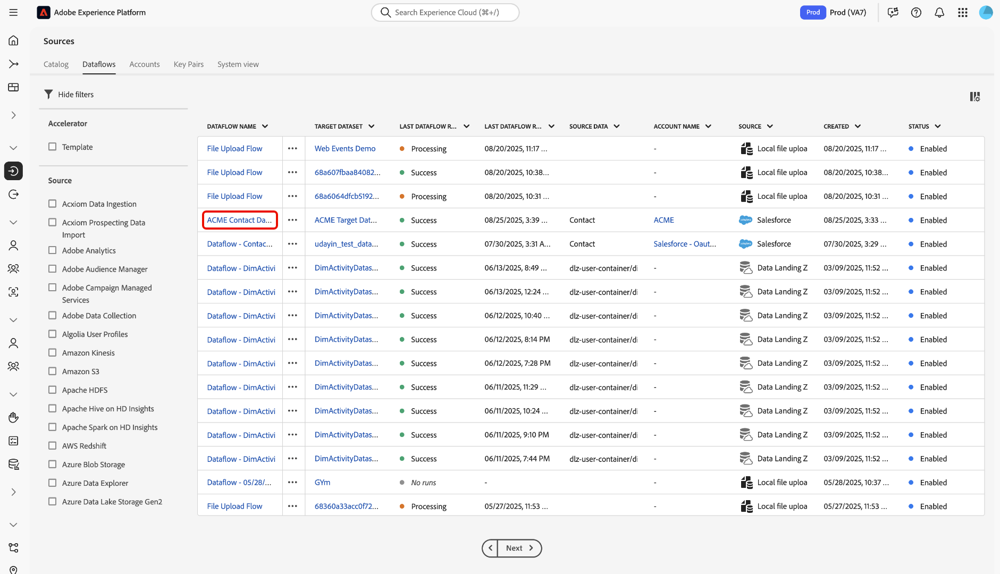

# Een gegevensstroom maken om gegevens uit een bron in te voeren

Lees deze gids om te leren hoe te om een dataflow tot stand te brengen en gegevens aan Adobe Experience Platform in te voeren gebruikend [[!DNL Flow Service]  API ](https://developer.adobe.com/experience-platform-apis/references/flow-service/).

## Aan de slag

Deze handleiding vereist een goed begrip van de volgende onderdelen van Experience Platform:

* [ Inname van de Partij ](../../../../ingestion/batch-ingestion/overview.md): Ontdek hoe u grote volumes van gegevens efficiënt in partijen kunt uploaden.
* [ de Dienst van de Catalogus ](../../../../catalog/datasets/overview.md): Organiseer en houd spoor van uw datasets binnen Experience Platform.
* [ Prep van Gegevens ](../../../../data-prep/home.md): Transformeer en breng uw inkomende gegevens in kaart om uw schemavereisten aan te passen.
* [ Dataflows ](../../../../dataflows/home.md): Opstelling en beheer de pijpleidingen die uw gegevens van bronnen aan bestemmingen bewegen.
* [ Schema&#39;s van de Gegevens van de Ervaring Model (XDM) ](../../../../xdm/home.md): Structuur uw gegevens gebruikend schema&#39;s XDM zodat is het klaar voor gebruik in Experience Platform.
* [ Sandboxen ](../../../../sandboxes/home.md): Test en ontwikkel veilig in geïsoleerde milieu&#39;s zonder productiegegevens te beïnvloeden.
* [ Bronnen ](../../../home.md): Leer hoe te om uw externe gegevensbronnen met Experience Platform te verbinden.

### Experience Platform API&#39;s gebruiken

Voor informatie over hoe te om vraag aan Experience Platform APIs met succes te maken, lees de gids op [ begonnen wordt met Experience Platform APIs ](../../../../landing/api-guide.md).

### Basisverbinding maken

U moet een volledig voor authentiek verklaarde bronrekening hebben en het overeenkomstige identiteitskaart van de basisverbinding is met succes om een dataflow voor uw bron tot stand te brengen. Als u dit identiteitskaart niet hebt, bezoek de [ broncatalogus ](../../../home.md) voor een lijst van bronnen die u een basisverbinding kunt tot stand brengen met.

### Een doel-XDM-schema maken {#target-schema}

Een schema van de Gegevens van de Ervaring van het Model (XDM) verstrekt een gestandaardiseerde manier om gegevens van de klantenervaring binnen Experience Platform te organiseren en te beschrijven. Om uw brongegevens in Experience Platform in te voeren, moet u eerst een doelXDM schema tot stand brengen dat de structuur en de soorten gegevens bepaalt u wilt opnemen. Dit schema dient als blauwdruk voor de dataset van Experience Platform waar uw opgenomen gegevens zullen verblijven.

Een doelXDM schema kan worden gecreeerd door een POST- verzoek aan de [ Registratie API van het Schema ](https://developer.adobe.com/experience-platform-apis/references/schema-registry/) uit te voeren. Lees de volgende hulplijnen voor gedetailleerde informatie over stappen voor het maken van een doel-XDM-schema:

* [ creeer een schema gebruikend API ](../../../../xdm/api/schemas.md).
* [ creeer een schema gebruikend UI ](../../../../xdm/tutorials/create-schema-ui.md).

Zodra gecreeerd, zal het doelXDM schema `$id` later voor uw doeldataset en afbeelding worden vereist.

### Een doelgegevensset maken {#target-dataset}

Een dataset is een opslag en beheersconstructie voor een inzameling van gegevens, typisch een lijst, die een schema (kolommen) en gebieden (rijen) bevat. De gegevens die met succes in Experience Platform worden opgenomen worden opgeslagen binnen het gegevensmeer als datasets. Tijdens deze stap, kunt u een nieuwe dataset tot stand brengen of een bestaande dataset gebruiken.

U kunt een doeldataset tot stand brengen door een POST- verzoek aan de [ Dienst API van de Catalogus ](https://developer.adobe.com/experience-platform-apis/references/catalog/) te doen, terwijl het verstrekken van identiteitskaart van het doelschema binnen de nuttige lading. Voor gedetailleerde stappen op hoe te om een doeldataset tot stand te brengen, lees de gids bij [ het creëren van een dataset gebruikend API ](../../../../catalog/api/create-dataset.md).

>[!TIP]
>
>Als u uw gegevens aan het Profiel van de Klant in real time wilt opnemen, dan moet u ervoor zorgen dat zowel uw doelXDM schema&#39;s als doeldataset voor Profiel worden toegelaten.

+++Selecteren om voorbeeld weer te geven

**API formaat**

```HTTP
POST /dataSets
```

**Verzoek**

Het volgende voorbeeld toont hoe te om een doeldataset tot stand te brengen die voor Echte - tijdInname van het Profiel van de Klant wordt toegelaten. In deze aanvraag wordt de eigenschap `unifiedProfile` ingesteld op `true` (onder het `tags` -object), die Experience Platform opgeeft deze gegevensset op te nemen in Real-Time Customer Profile.

```shell
curl -X POST \
  'https://platform.adobe.io/data/foundation/catalog/dataSets' \
  -H 'Authorization: Bearer {ACCESS_TOKEN}' \
  -H 'x-api-key: {API_KEY}' \
  -H 'x-gw-ims-org-id: {ORG_ID}' \
  -H 'x-sandbox-name: {SANDBOX_NAME}' \
  -H 'Content-Type: application/json' \
  -d '{
    "name": "ACME Target Dataset",
    "schemaRef": {
      "id": "https://ns.adobe.com/{TENANT_ID}/schemas/719c4e19184402c27595e65b931a142b",
      "contentType": "application/vnd.adobe.xed+json;version=1"
    },
    "tags": {
      "unifiedProfile": [
        "enabled: true"
      ]
    }
  }'
```

| Eigenschap | Beschrijving |
| --- | --- |
| `name` | Een beschrijvende naam voor uw doeldataset. Gebruik een duidelijke en unieke naam om het gemakkelijker te maken om uw dataset in toekomstige verrichtingen te identificeren en te beheren. |
| `schemaRef.id` | De id van uw doel-XDM-schema. |
| `tags.unifiedProfile` | Een Booleaanse waarde die Experience Platform laat weten of de gegevens moeten worden ingevoerd in Real-Time Customer Profile. |

**Reactie**

Een succesvolle reactie keert uw doeldataset ID terug. Deze id is later vereist om een doelverbinding te maken.

```json
[
    "@/dataSets/6889f4f89b982b2b90bc1207"
]
```

+++

## Een bronverbinding maken

Een bronverbinding definieert hoe gegevens vanuit een externe bron naar Experience Platform worden overgebracht. Het specificeert zowel het bronsysteem als het formaat van de inkomende gegevens, en het verwijst een basisverbinding die authentificatiedetails bevat. Elke bronverbinding is uniek voor uw organisatie.

* Voor bestandsgebaseerde bronnen (zoals cloudopslagbestanden) kan een bronverbinding instellingen bevatten zoals kolomscheidingsteken, coderingstype, compressietype, reguliere expressies voor bestandsselectie en of bestanden recursief moeten worden ingesloten.
* Voor op lijst-gebaseerde bronnen (zoals gegevensbestanden, CRMs, en de leveranciers van de marketing automatisering), kan een bronverbinding details zoals de lijstnaam en kolomafbeeldingen specificeren.

Als u een bronverbinding wilt maken, vraagt u een POST-aanvraag naar het `/sourceConnections` -eindpunt van de [!DNL Flow Service] API en geeft u de id van de basisverbinding, de verbindingsspecificatie-id en het pad naar het brongegevensbestand op.

**API formaat**

```http
POST /sourceConnections
```

**Verzoek**

```shell
curl -X POST \
  'https://platform.adobe.io/data/foundation/flowservice/sourceConnections' \
  -H 'Authorization: Bearer {ACCESS_TOKEN}' \
  -H 'x-api-key: {API_KEY}' \
  -H 'x-gw-ims-org-id: {ORG_ID}' \
  -H 'x-sandbox-name: {SANDBOX_NAME}' \
  -H 'Content-Type: application/json' \
  -d '{
    "name": "ACME source connection",
    "baseConnectionId": "6990abad-977d-41b9-a85d-17ea8cf1c0e4",
    "description": "A source connection for ACME contact data",
    "data": {
      "format": "tabular"
    },
    "params": {
      "tableName": "Contact",
      "columns": [
        {
          "name": "TestID",
          "type": "string",
          "xdm": {
            "type": "string"
          }
        },
        {
          "name": "Name",
          "type": "string",
          "xdm": {
            "type": "string"
          }
        },
        {
          "name": "Datefield",
          "type": "string",
          "meta:xdmType": "date-time",
          "xdm": {
            "type": "string",
            "format": "date-time"
          }
        }
      ],
      "cdcEnabled": true
    },
    "connectionSpec": {
      "id": "cfc0fee1-7dc0-40ef-b73e-d8b134c436f5",
      "version": "1.0"
    }
  }'
```

| Eigenschap | Beschrijving |
| --- | --- |
| `name` | Een beschrijvende naam voor de bronverbinding. Gebruik een duidelijke en unieke naam om het gemakkelijker te maken om uw verbinding in toekomstige bewerkingen te identificeren en te beheren. |
| `description` | Een optionele beschrijving die u kunt toevoegen voor extra informatie over de bronverbinding. |
| `baseConnectionId` | De `id` van uw basisverbinding. U kunt deze id ophalen door de bron te verifiëren bij Experience Platform met de API van [!DNL Flow Service] . |
| `data.format` | De indeling van de gegevens. Stel deze waarde in op `tabular` voor bronnen op basis van tabellen (zoals databases, CRM&#39;s en providers van marketingautomatisering). |
| `params.tableName` | De naam van de tabel in uw bronaccount die u aan Experience Platform wilt toevoegen. |
| `params.columns` | De specifieke tabelkolommen met gegevens die u aan Experience Platform wilt toevoegen. |
| `params.cdcEnabled` | Een booleaanse waarde die aangeeft of het vastleggen van de wijzigingshistorie is ingeschakeld. Deze eigenschap wordt ondersteund door de volgende databasebronnen: <ul><li>[!DNL Azure Databricks]</li><li>[!DNL Google BigQuery]</li><li>[!DNL Snowflake]</li></ul> Voor meer informatie, lees de gids bij het gebruiken van [ veranderingsgegevens vangen in bronnen ](../change-data-capture.md). |
| `connectionSpec.id` | De verbindingsspecificatie-id van de bron die u gebruikt. |

**Reactie**

Een succesvolle reactie keert identiteitskaart van uw bronverbinding terug. Deze id is vereist om een gegevensstroom te maken en uw gegevens in te voeren.

```json
{
    "id": "b7581b59-c603-4df1-a689-d23d7ac440f3",
    "etag": "\"ef05d265-0000-0200-0000-6019e0080000\""
}
```

## Een doelverbinding maken {#target-connection}

Een doelverbinding vertegenwoordigt de verbinding aan de bestemming waar de ingesloten gegevens binnen landen. Om een doelverbinding tot stand te brengen, moet u vaste identiteitskaart verstrekken van verbindingsspecificatie verbonden aan het meer van Gegevens. Deze verbindingsspecificatie-id is: `c604ff05-7f1a-43c0-8e18-33bf874cb11c` .

**API formaat**

```http
POST /targetConnections
```

**Verzoek**

```shell
curl -X POST \
  'https://platform.adobe.io/data/foundation/flowservice/targetConnections' \
  -H 'Authorization: Bearer {ACCESS_TOKEN}' \
  -H 'x-api-key: {API_KEY}' \
  -H 'x-gw-ims-org-id: {ORG_ID}' \
  -H 'x-sandbox-name: {SANDBOX_NAME}' \
  -H 'Content-Type: application/json' \
  -d '{
      "name": "ACME target connection",
      "description": "ACME target connection",
      "data": {
          "schema": {
              "id": "https://ns.adobe.com/{TENANT_ID}/schemas/52b59140414aa6a370ef5e21155fd7a686744b8739ecc168",
              "version": "application/vnd.adobe.xed-full+json;version=1"
          }
      },
      "params": {
          "dataSetId": "6889f4f89b982b2b90bc1207"
      },
      "connectionSpec": {
          "id": "c604ff05-7f1a-43c0-8e18-33bf874cb11c",
          "version": "1.0"
      }
    }'
```

| Eigenschap | Beschrijving |
| --- | --- |
| `name` | Een beschrijvende naam voor de doelverbinding. Gebruik een duidelijke en unieke naam om het gemakkelijker te maken om uw verbinding in toekomstige bewerkingen te identificeren en te beheren. |
| `description` | Een optionele beschrijving die u kunt toevoegen voor extra informatie over de doelverbinding. |
| `data.schema.id` | De id van uw doel-XDM-schema. |
| `params.dataSetId` | De id van uw doelgegevensset. |
| `connectionSpec.id` | De verbindingsspecificatie-id van data Lake. Deze id is vast: `c604ff05-7f1a-43c0-8e18-33bf874cb11c`. |

## Toewijzing {#mapping}

Daarna, moet u uw brongegevens aan het doelschema in kaart brengen dat uw doeldataset volgt aan. Om een afbeelding tot stand te brengen, doe een POST- verzoek aan het `mappingSets` eindpunt van [[!DNL Data Prep]  API ](https://developer.adobe.com/experience-platform-apis/references/data-prep/), verstrek uw doelXDM schema identiteitskaart en de details van de mappingsreeksen u wilt tot stand brengen.

**API formaat**

```http
POST /mappingSets
```

**Verzoek**

```shell
curl -X POST \
  'https://platform.adobe.io/data/foundation/conversion/mappingSets' \
  -H 'Authorization: Bearer {ACCESS_TOKEN}' \
  -H 'x-api-key: {API_KEY}' \
  -H 'x-gw-ims-org-id: {ORG_ID}' \
  -H 'x-sandbox-name: {SANDBOX_NAME}' \
  -H 'Content-Type: application/json' \
  -d '{
      "version": 0,
      "xdmSchema": "https://ns.adobe.com/{TENANT_ID}/schemas/52b59140414aa6a370ef5e21155fd7a686744b8739ecc168",
      "xdmVersion": "1.0",
      "id": null,
      "mappings": [
          {
              "destinationXdmPath": "_id",
              "sourceAttribute": "TestID",
              "identity": false,
              "identityGroup": null,
              "namespaceCode": null,
              "version": 0
          },
          {
              "destinationXdmPath": "person.name.fullName",
              "sourceAttribute": "Name",
              "identity": false,
              "identityGroup": null,
              "namespaceCode": null,
              "version": 0
          },
          {
              "destinationXdmPath": "person.birthDate",
              "sourceAttribute": "Datefield",
              "identity": false,
              "identityGroup": null,
              "namespaceCode": null,
              "version": 0
          }
      ]
  }'
```

| Eigenschap | Beschrijving |
| -------- | ----------- |
| `xdmSchema` | The `$id` of the target XDM schema. |

**Reactie**

Een succesvolle reactie keert details van de pas gecreëerde afbeelding met inbegrip van zijn uniek herkenningsteken (`id`) terug. Deze id is in een latere stap vereist om een gegevensstroom te maken.

```json
{
    "id": "93ddfa69c4864d978832b1e5ef6ec3b9",
    "version": 0,
    "createdDate": 1612309018666,
    "modifiedDate": 1612309018666,
    "createdBy": "{CREATED_BY}",
    "modifiedBy": "{MODIFIED_BY}"
}
```

## Gegevensstroomspecificaties ophalen

Voordat u een gegevensstroom kunt maken, moet u eerst de dataflow-specificaties ophalen die overeenkomen met uw bron. Als u deze informatie wilt ophalen, vraagt u GET het `/flowSpecs` -eindpunt van de [!DNL Flow Service] API aan.

**API formaat**

```http
GET /flowSpecs?property=name=="{NAME}"
```

| Query-parameter | Beschrijving |
| --- | --- |
| `property=name=="{NAME}"` | De naam van uw gegevensstroomspecificatie. <ul><li>Voor bestandsgebaseerde bronnen (zoals cloudopslag) stelt u deze waarde in op `CloudStorageToAEP` .</li><li>Voor op tabellen gebaseerde bronnen (zoals databases, CRM&#39;s en marketingautomatiseringsproviders) stelt u deze waarde in op `CRMToAEP` .</li></ul> |

**Verzoek**

```shell
curl -X GET \
  'https://platform.adobe.io/data/foundation/flowservice/flowSpecs?property=name=="CRMToAEP"' \
  -H 'x-api-key: {API_KEY}' \
  -H 'x-gw-ims-org-id: {ORG_ID}' \
  -H 'x-sandbox-name: {SANDBOX_NAME}'
```

**Reactie**

Een succesvolle reactie retourneert de details van de gegevensstroomspecificatie die verantwoordelijk zijn voor het plaatsen van gegevens van uw bron naar Experience Platform. De reactie bevat de unieke flowspecificatie `id` die is vereist om een nieuwe gegevensstroom te maken.

Controleer de array `items.sourceConnectionSpecIds` in de reactie om er zeker van te zijn dat u de juiste gegevensstroomspecificatie gebruikt. Controleer of de verbindingsspecificatie-id voor uw bron in deze lijst is opgenomen.

+++Selecteren voor weergave

```json
{
    "items": [
        {
            "id": "14518937-270c-4525-bdec-c2ba7cce3860",
            "name": "CRMToAEP",
            "providerId": "0ed90a81-07f4-4586-8190-b40eccef1c5a",
            "version": "1.0",
            "sourceConnectionSpecIds": [
                "3416976c-a9ca-4bba-901a-1f08f66978ff",
                "38ad80fe-8b06-4938-94f4-d4ee80266b07",
                "d771e9c1-4f26-40dc-8617-ce58c4b53702",
                "3c9b37f8-13a6-43d8-bad3-b863b941fedd",
                "cc6a4487-9e91-433e-a3a3-9cf6626c1806",
                "3000eb99-cd47-43f3-827c-43caf170f015",
                "26d738e0-8963-47ea-aadf-c60de735468a",
                "74a1c565-4e59-48d7-9d67-7c03b8a13137",
                "cfc0fee1-7dc0-40ef-b73e-d8b134c436f5",
                "4f63aa36-bd48-4e33-bb83-49fbcd11c708",
                "cb66ab34-8619-49cb-96d1-39b37ede86ea",
                "eb13cb25-47ab-407f-ba89-c0125281c563",
                "1f372ff9-38a4-4492-96f5-b9a4e4bd00ec",
                "37b6bf40-d318-4655-90be-5cd6f65d334b",
                "a49bcc7d-8038-43af-b1e4-5a7a089a7d79",
                "a8b6a1a4-5735-42b4-952c-85dce0ac38b5",
                "6a8d82bc-1caf-45d1-908d-cadabc9d63a6",
                "aac9bbd4-6c01-46ce-b47e-51c6f0f6db3f",
                "8e6b41a8-d998-4545-ad7d-c6a9fff406c3",
                "ecde33f2-c56f-46cc-bdea-ad151c16cd69",
                "09182899-b429-40c9-a15a-bf3ddbc8ced7",
                "0479cc14-7651-4354-b233-7480606c2ac3",
                "d6b52d86-f0f8-475f-89d4-ce54c8527328",
                "a8f4d393-1a6b-43f3-931f-91a16ed857f4",
                "fcad62f3-09b0-41d3-be11-449d5a621b69",
                "ea1c2a08-b722-11eb-8529-0242ac130003",
                "35d6c4d8-c9a9-11eb-b8bc-0242ac130003",
                "b2e08744-4f1a-40ce-af30-7abac3e23cf3",
                "2acf109f-9b66-4d5e-bc18-ebb2adcff8d5",
                "2fa8af9c-2d1a-43ea-a253-f00a00c74412",
                "e9d7ec6b-0873-4e57-ad21-b3a7c65e310b"
            ],
            "targetConnectionSpecIds": [
                "c604ff05-7f1a-43c0-8e18-33bf874cb11c"
            ],
            "optionSpec": {
                "name": "OptionSpec",
                "spec": {
                    "$schema": "http://json-schema.org/draft-07/schema#",
                    "type": "object",
                    "properties": {
                        "errorDiagnosticsEnabled": {
                            "title": "Error diagnostics.",
                            "description": "Flag to enable detailed and sample error diagnostics summary.",
                            "type": "boolean",
                            "default": false
                        },
                        "partialIngestionPercent": {
                            "title": "Partial ingestion threshold.",
                            "description": "Percentage which defines the threshold of errors allowed before the run is marked as failed.",
                            "type": "number",
                            "exclusiveMinimum": 0
                        }
                    }
                }
            },
            "transformationSpecs": [
                {
                    "name": "Copy",
                    "spec": {
                        "$schema": "http://json-schema.org/draft-07/schema#",
                        "type": "object",
                        "properties": {
                            "deltaColumn": {
                                "type": "object",
                                "properties": {
                                    "name": {
                                        "type": "string"
                                    },
                                    "dateFormat": {
                                        "type": "string"
                                    },
                                    "timezone": {
                                        "type": "string"
                                    }
                                },
                                "required": [
                                    "name"
                                ]
                            }
                        },
                        "required": [
                            "deltaColumn"
                        ]
                    }
                },
                {
                    "name": "Mapping",
                    "spec": {
                        "$schema": "http://json-schema.org/draft-07/schema#",
                        "type": "object",
                        "description": "defines various params required for different mapping from source to target",
                        "properties": {
                            "mappingId": {
                                "type": "string"
                            },
                            "mappingVersion": {
                                "type": "string"
                            }
                        }
                    }
                }
            ],
            "scheduleSpec": {
                "name": "PeriodicSchedule",
                "type": "Periodic",
                "spec": {
                    "$schema": "http://json-schema.org/draft-07/schema#",
                    "type": "object",
                    "properties": {
                        "startTime": {
                            "description": "epoch time",
                            "type": "integer"
                        },
                        "frequency": {
                            "type": "string",
                            "enum": [
                                "once",
                                "minute",
                                "hour",
                                "day",
                                "week"
                            ]
                        },
                        "interval": {
                            "type": "integer"
                        },
                        "backfill": {
                            "type": "boolean",
                            "default": true
                        }
                    },
                    "required": [
                        "startTime",
                        "frequency"
                    ],
                    "if": {
                        "properties": {
                            "frequency": {
                                "const": "once"
                            }
                        }
                    },
                    "then": {
                        "allOf": [
                            {
                                "not": {
                                    "required": [
                                        "interval"
                                    ]
                                }
                            },
                            {
                                "not": {
                                    "required": [
                                        "backfill"
                                    ]
                                }
                            }
                        ]
                    },
                    "else": {
                        "required": [
                            "interval"
                        ],
                        "if": {
                            "properties": {
                                "frequency": {
                                    "const": "minute"
                                }
                            }
                        },
                        "then": {
                            "properties": {
                                "interval": {
                                    "minimum": 15
                                }
                            }
                        },
                        "else": {
                            "properties": {
                                "interval": {
                                    "minimum": 1
                                }
                            }
                        }
                    }
                }
            },
            "runSpec": {
                "name": "ProviderParams",
                "spec": {
                    "$schema": "http://json-schema.org/draft-07/schema#",
                    "type": "object",
                    "description": "defines various params required for creating flow run.",
                    "properties": {
                        "startTime": {
                            "type": "integer",
                            "description": "An integer that defines the start time of the run. The value is represented in Unix epoch time."
                        },
                        "windowStartTime": {
                            "type": "integer",
                            "description": "An integer that defines the start time of the window against which data is to be pulled. The value is represented in Unix epoch time."
                        },
                        "windowEndTime": {
                            "type": "integer",
                            "description": "An integer that defines the end time of the window against which data is to be pulled. The value is represented in Unix epoch time."
                        },
                        "deltaColumn": {
                            "type": "object",
                            "description": "The delta column is required to partition the data and separate newly ingested data from historic data.",
                            "properties": {
                                "name": {
                                    "type": "string"
                                },
                                "dateFormat": {
                                    "type": "string"
                                },
                                "timezone": {
                                    "type": "string"
                                }
                            },
                            "required": [
                                "name"
                            ]
                        }
                    },
                    "required": [
                        "startTime",
                        "windowStartTime",
                        "windowEndTime",
                        "deltaColumn"
                    ]
                }
            },
            "attributes": {
                "recordTypeEnabled": true,
                "defaultRecordType": "profile",
                "isSourceFlow": true,
                "flacValidationSupported": true,
                "isDraftModeSupported": true,
                "frequency": "batch",
                "notification": {
                    "category": "sources",
                    "flowRun": {
                        "enabled": true
                    }
                }
            },
            "permissionsInfo": {
                "manage": [
                    {
                        "@type": "lowLevel",
                        "name": "EnterpriseSource",
                        "permissions": [
                            "write"
                        ]
                    }
                ],
                "view": [
                    {
                        "@type": "lowLevel",
                        "name": "EnterpriseSource",
                        "permissions": [
                            "read"
                        ]
                    }
                ]
            }
        }
    ]
}
```

+++

## Een gegevensstroom maken

Een dataflow is een gevormde pijpleiding die gegevens over de diensten van Experience Platform overbrengt. Het bepaalt hoe het gegeven uit externe bronnen (zoals gegevensbestanden, wolkenopslag, of APIs) wordt opgenomen, verwerkt, en verpletterd aan doeldatasets. Deze datasets worden dan gebruikt door de diensten zoals de Dienst van de Identiteit, het Profiel van de Klant in real time, en Doelen voor activering en analyse.

Als u een gegevensstroom wilt maken, moet u waarden hebben voor de volgende items:

* Source-verbinding-id
* Doel-verbindings-id
* Toewijzing-id
* Dataflow-specificatie-id

Tijdens deze stap, kunt u de volgende parameters in `scheduleParams` gebruiken om een innameschema voor uw gegevensstroom te vormen:

| Parameter plannen | Beschrijving |
| --- | --- |
| `startTime` | De epoche-tijd (in seconden) waarop de gegevensstroom moet worden gestart. |
| `frequency` | De frequentie van inname. Vorm frequentie om erop te wijzen hoe vaak dataflow zou moeten lopen. U kunt de frequentie instellen op: <ul><li>`once`: stel de frequentie in op `once` om een eenmalige opname te maken. Configuraties voor interval en backfill zijn niet beschikbaar wanneer u een eenmalige gegevensstroom maakt. Standaard wordt de planningsfrequentie ingesteld op één keer.</li><li>`minute`: stel de frequentie in op `minute` om de gegevensstroom te plannen en gegevens per minuut in te voeren.</li><li>`hour`: stel de frequentie in op `hour` om de gegevensstroom te plannen en gegevens per uur in te voeren.</li><li>`day`: stel de frequentie in op `day` om de gegevensstroom te plannen en gegevens per dag in te voeren.</li><li>`week`: stel de frequentie in op `week` om de gegevensstroom te plannen en gegevens per week in te voeren.</li></ul> |
| `interval` | Het interval tussen opeenvolgende inname (vereist voor alle frequenties behalve `once`). Vorm het interval plaatsen om het tijdkader tussen elke opname te vestigen. Bijvoorbeeld, als u uw frequentie aan dag plaatst en het interval aan 15 vormt, dan zal uw dataflow om de 15 dagen lopen. U kunt het interval niet instellen op nul. De minimaal toegestane intervalwaarde voor elke frequentie is als volgt:<ul><li>`once`: n.v.t.</li><li>`minute`: 15</li><li>`hour` : 1</li><li>`day` : 1</li><li>`week` : 1</li></ul> |
| `backfill` | Geeft aan of historische gegevens moeten worden ingevoerd vóór de `startTime` . |

{style="table-layout:auto"}


**API formaat**

```http
POST /flows
```

**Verzoek**

```shell
curl -X POST \
  'https://platform.adobe.io/data/foundation/flowservice/flows' \
  -H 'x-api-key: {API_KEY}' \
  -H 'x-gw-ims-org-id: {ORG_ID}' \
  -H 'x-sandbox-name: {SANDBOX_NAME}' \
  -H 'Content-Type: application/json' \
  -d '{
      "name": "ACME Contact Dataflow",
      "description": "A dataflow for ACME contact data",
      "flowSpec": {
          "id": "14518937-270c-4525-bdec-c2ba7cce3860",
          "version": "1.0"
      },
      "sourceConnectionIds": [
          "b7581b59-c603-4df1-a689-d23d7ac440f3"
      ],
      "targetConnectionIds": [
          "320f119a-5ac1-4ab1-88ea-eb19e674ea2e"
      ],
      "transformations": [
          {
              "name": "Copy",
              "params": {
                  "deltaColumn": {
                      "name": "Datefield",
                      "dateFormat": "YYYY-MM-DD",
                      "timezone": "UTC"
                  }
              }
          },
          {
              "name": "Mapping",
              "params": {
                  "mappingId": "93ddfa69c4864d978832b1e5ef6ec3b9",
                  "mappingVersion": 0
              }
          }
      ],
      "scheduleParams": {
          "startTime": "1612310466",
          "frequency":"minute",
          "interval":"15",
          "backfill": "true"
      }
  }'
```

| Eigenschap | Beschrijving |
| --- | --- |
| `name` | Een beschrijvende naam voor de gegevensstroom. Gebruik een duidelijke en unieke naam om het gemakkelijker te maken om uw gegevensstroom in toekomstige bewerkingen te identificeren en te beheren. |
| `description` | Een optionele beschrijving die u kunt toevoegen voor extra informatie over de gegevensstroom. |
| `flowSpec.id` | De id van de stroomspecificatie die overeenkomt met uw bron. |
| `sourceConnectionIds` | De bron verbindings-id die in een eerdere stap is gegenereerd. |
| `targetConnectionIds` | De doel-verbindings-id die in een eerdere stap is gegenereerd. |
| `transformations.params.deltaColum` | De opgegeven kolom die wordt gebruikt om onderscheid te maken tussen nieuwe en bestaande gegevens. Incrementele gegevens worden opgenomen op basis van het tijdstempel van de geselecteerde kolom. De ondersteunde indeling voor `deltaColumn` is `yyyy-MM-dd HH:mm:ss` . Voor [!DNL Microsoft Dynamics] is de ondersteunde indeling voor `deltaColumn` `yyyy-MM-ddTHH:mm:ssZ` . |
| `transformations.params.deltaColumn.dateFormat` | De datumnotatie die moet worden gevolgd voor de deltakolom. |
| `transformations.params.deltaColumn.timeZone` | De tijdzone die moet worden gebruikt bij het interpreteren van de waarden in de deltakolom. |
| `transformations.params.mappingId` | De toewijzing-id die in een eerdere stap is gegenereerd. |
| `scheduleParams.startTime` | De begintijd voor de dataflow in epoche tijd (seconden sinds Unix epoch). Bepaalt wanneer de dataflow met zijn eerste looppas zal beginnen. |
| `scheduleParams.frequency` | De frequentie waarmee de gegevensstroom zal lopen. Acceptabele waarden zijn: `once`, `minute`, `hour`, `day` of `week` . |
| `scheduleParams.interval` | Het interval tussen opeenvolgende dataflow loopt, die op de geselecteerde frequentie wordt gebaseerd. Dit moet een geheel getal zijn dat niet gelijk is aan nul. Een interval van bijvoorbeeld `15` met frequentie `minute` betekent dat de gegevensstroom elke 15 minuten wordt uitgevoerd. |
| `scheduleParams.backfill` | Een booleaanse waarde (`true` of `false` ) die bepaalt of historische gegevens (backfill) moeten worden ingevoerd wanneer de gegevensstroom voor het eerst wordt gemaakt. |

{style="table-layout:auto"}

**Reactie**

Een succesvolle reactie keert identiteitskaart (`id`) van nieuw gecreeerd dataflow terug.

```json
{
    "id": "ae0a9777-b322-4ac1-b0ed-48ae9e497c7e",
    "etag": "\"770029f8-0000-0200-0000-6019e7d40000\""
}
```

### De gebruikersinterface gebruiken om uw API-workflow te valideren

U kunt de gebruikersinterface van Experience Platform gebruiken om het maken van uw gegevensstroom te bevestigen. Navigeer naar de catalogus *[!UICONTROL Sources]* in de gebruikersinterface van Experience Platform en selecteer vervolgens **[!UICONTROL Dataflows]** op de tabbladen voor kopteksten. Vervolgens gebruikt u de kolom [!UICONTROL Dataflow Name] en zoekt u de gegevensstroom die u met de API [!DNL Flow Service] hebt gemaakt.



U kunt de gegevensstroom verder valideren via de interface van [!UICONTROL Dataflow activity] . Gebruik de rechterrail om de [!UICONTROL API usage] informatie van uw gegevensstroom te bekijken. Deze sectie toont zelfde gegevensstroom identiteitskaart, dataset identiteitskaart, en afbeelding identiteitskaart die tijdens het proces van de gegevensstroom in [!DNL Flow Service] werd geproduceerd.


## Volgende stappen

Deze zelfstudie begeleidde u door het proces voor het maken van een gegevensstroom in Experience Platform met behulp van de [!DNL Flow Service] API. U leerde hoe te om de noodzakelijke componenten, met inbegrip van het doelXDM schema, dataset, bronverbinding, doelverbinding, en dataflow zelf tot stand te brengen en te vormen. Door deze stappen te volgen, kunt u de opname van gegevens van externe bronnen in Experience Platform automatiseren, toelatend de stroomafwaartse diensten zoals het Profiel van de Klant in real time en Doelen om uw ingebedde gegevens voor geavanceerde gebruiksgevallen te gebruiken.

### Uw gegevensstroom controleren

Zodra uw gegevensstroom is gecreeerd, kunt u de gegevens controleren die door het worden opgenomen om informatie over innamesnelheden, succes, en fouten te bekijken. Voor meer informatie over hoe te om dataflow te controleren, bezoek het leerprogramma op [ controlerekeningen en dataflows ](../../../../dataflows/ui/monitor-sources.md).

### Uw gegevensstroom bijwerken

Om configuraties voor uw dataflows bij te werken die, afbeelding, en algemene informatie plannen, bezoek het leerprogramma op [ het bijwerken van bronnen dataflows ](../../api/update-dataflows.md).

## Uw gegevensstroom verwijderen

U kunt gegevensstromen verwijderen die niet meer nodig zijn of die onjuist zijn gemaakt met de functie **[!UICONTROL Delete]** die beschikbaar is in de **[!UICONTROL Dataflows]** -werkruimte. Voor meer informatie over hoe te om dataflows te schrappen, bezoek het leerprogramma bij [ het schrappen van dataflows ](../../api/delete.md).