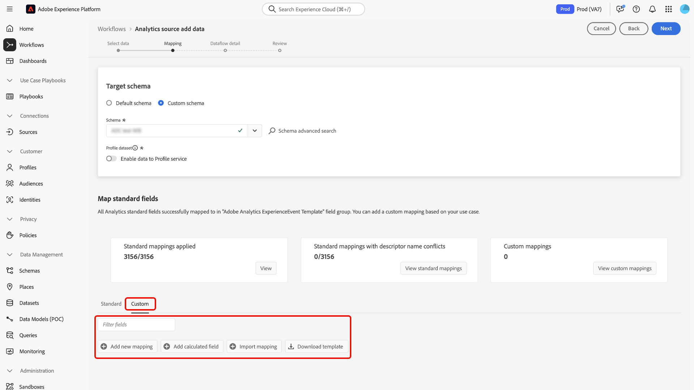
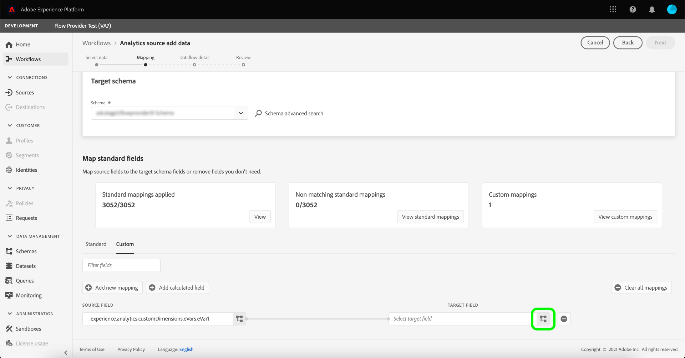

# Adobe Analytics verbinden met Experience Platform

Lees deze handleiding om te leren hoe u de Adobe Analytics-bron kunt gebruiken om uw gegevens van de Analytics-rapportensuite in Adobe Experience Platform in te voeren.

## Aan de slag

Deze zelfstudie vereist een goed begrip van de volgende onderdelen van Experience Platform:

* [&#x200B; Model van de Gegevens van de Ervaring (XDM) Systeem &#x200B;](../../../../../xdm/home.md): Het gestandaardiseerde kader waardoor Experience Platform gegevens van de klantenervaring organiseert.
* [&#x200B; Real-Time Profiel van de Klant &#x200B;](../../../../../profile/home.md): Verstrekt een verenigd, real-time consumentenprofiel dat op samengevoegde gegevens van veelvoudige bronnen wordt gebaseerd.
* [&#x200B; Sandboxes &#x200B;](../../../../../sandboxes/home.md): Experience Platform verstrekt virtuele zandbakken die één enkele instantie van Experience Platform in afzonderlijke virtuele milieu&#39;s verdelen helpen digitale ervaringstoepassingen ontwikkelen en ontwikkelen.

### Belangrijke terminologie

Het is belangrijk dat u de volgende belangrijke termen kent die in dit document worden gebruikt:

* **Standaard attributen**: De standaardattributen zijn om het even welk attribuut dat door Adobe vooraf wordt bepaald. Zij bevatten de zelfde betekenis voor alle klanten en zijn beschikbaar in de de brongegevens van de Analyse en het schemagebiedsgroepen van de Analyse.
* **attributen van de Douane**: De attributen van de Douane zijn om het even welk attribuut in de hiërarchie van de douanevariabele in Analytics. De attributen van de douane worden gebruikt binnen een implementatie van Adobe Analytics om specifieke informatie in een rapportreeks te vangen, en zij kunnen in hun gebruik van rapportreeks aan rapportreeks verschillen. Aangepaste kenmerken zijn onder andere eVars, props en lijsten. Zie de volgende [&#x200B; documentatie van Analytics over omzettingsvariabelen &#x200B;](https://experienceleague.adobe.com/docs/analytics/admin/admin-tools/conversion-variables/conversion-var-admin.html?lang=nl-NL) voor meer informatie over Vars.
* **om het even welk attribuut in de gebiedsgroepen van de Douane**: De attributen die uit gebiedsgroepen voortkomen die door klanten worden gecreeerd zijn allen user-defined en worden beschouwd als noch standaard noch douanekenmerken.

## Navigeren door de catalogus met bronnen

>[!NOTE]
>
>Wanneer u een bron van de Analyse gegevens in een productiesandbox creeert, worden twee gegevensstromen gecreeerd:
>
>* Een dataflow die een 13 maanden backfill van historische gegevens van de rapportreeks in gegevens meer doet. Deze gegevensstroom eindigt wanneer de backfill volledig is.
>* Een dataflow-flow die live-gegevens verzendt naar het data-meer en [!DNL Real-Time Customer Profile] . Deze gegevensstroom wordt voortdurend uitgevoerd.

Selecteer in de gebruikersinterface van Experience Platform de optie **[!UICONTROL Sources]** in de linkernavigatie voor toegang tot de werkruimte van [!UICONTROL Sources] . Selecteer in de categorie *[!UICONTROL Adobe applications]* de Adobe Analytics-kaart en selecteer vervolgens **[!UICONTROL Add data]** .

## Gegevens selecteren

>[!IMPORTANT]
>
>* De op het scherm vermelde rapportsuites kunnen uit verschillende regio&#39;s afkomstig zijn. U bent verantwoordelijk voor het begrijpen van de beperkingen en verplichtingen van uw gegevens en hoe u die gegevens gebruikt in Adobe Experience Platform-regio&#39;s. Controleer of dit door uw bedrijf is toegestaan.
>* Gegevens uit meerdere rapportsuites kunnen alleen voor realtime-klantprofiel worden ingeschakeld als er geen gegevensconflicten zijn, zoals twee aangepaste eigenschappen (eVars, lijsten en props) die een andere betekenis hebben.

Een rapportsuite is een container met gegevens die de basis vormt van analytische rapportage. Een organisatie kan vele rapportreeksen hebben, elk die verschillende datasets bevatten.

U kunt rapportsuites van om het even welk gebied (Verenigde Staten, Verenigd Koninkrijk, of Singapore) opnemen zolang zij aan de zelfde organisatie zoals de zandbakinstantie van Experience Platform worden in kaart gebracht waarin de bronverbinding wordt gecreeerd. Een rapportreeks kan worden opgenomen gebruikend slechts één enkele actieve dataflow. Als een rapportsuite grijs is en niet kan worden geselecteerd, is deze al opgenomen in de sandbox die u gebruikt of in een andere sandbox.

Er kunnen meerdere interne verbindingen worden gemaakt om meerdere rapportsuites over te brengen naar dezelfde sandbox. Als de rapportsuites verschillende schema&#39;s voor variabelen (zoals eVars of gebeurtenissen) hebben, zouden zij aan specifieke gebieden in de groepen van het douanegebied moeten worden in kaart gebracht en gegevensconflicten vermijden gebruikend [&#x200B; Prep van Gegevens &#x200B;](../../../../../data-prep/ui/mapping.md). Rapportsuites kunnen alleen aan één sandbox worden toegevoegd.

Selecteer **[!UICONTROL Report suite]** en gebruik vervolgens de *[!UICONTROL Analytics source add data]* -interface om door de lijst te navigeren en de Analytics-rapportsuite te identificeren die u aan Experience Platform wilt toevoegen. U kunt ook naar een specifieke rapportsuite zoeken. Selecteer **[!UICONTROL Next]** om door te gaan.

&lt;!—De Reeksen van het Rapport van Analytics kunnen voor één zandbak tegelijkertijd worden gevormd. Als u dezelfde rapportsuite in een andere sandbox wilt importeren, moet de gegevenssetstroom worden verwijderd en opnieuw worden geïnstantieerd via de configuratie voor een andere sandbox.—>

## Toewijzing {#mapping}

>[!IMPORTANT]
>
>Transformaties van de Prep van gegevens kunnen latentie aan algemene dataflow toevoegen. De extra toegevoegde latentie is afhankelijk van de complexiteit van de transformatielogica.

Voordat u de analysegegevens kunt toewijzen aan het doel-XDM-schema, moet u eerst bepalen of u een standaardschema of een aangepast schema gebruikt.

>[!BEGINTABS]

>[!TAB  Standaard schema ]

Een standaardschema leidt tot een nieuw schema namens u. Dit nieuwe schema bevat de veldgroep [!DNL Adobe Analytics ExperienceEvent Template] . Selecteer **[!UICONTROL Default schema]** als u een standaardschema wilt gebruiken.

>[!TAB  Schema van de Douane ]

Met een aangepast schema kunt u elk beschikbaar schema voor uw analysegegevens kiezen, zolang dat schema de veldgroep [!DNL Adobe Analytics ExperienceEvent Template] heeft. Selecteer **[!UICONTROL Custom schema]** als u een aangepast schema wilt gebruiken.

>[!ENDTABS]

Gebruik de *[!UICONTROL Mapping]* -interface om bronvelden toe te wijzen aan de desbetreffende doelschemavelden. U kunt aangepaste variabelen toewijzen aan nieuwe groepen schemavelden en berekeningen toepassen zoals wordt ondersteund door Gegevensvoorvoegsel. Selecteer een doelschema om het toewijzingsproces te starten.

>[!TIP]
>
>Alleen schema&#39;s met de veldgroep [!DNL Adobe Analytics ExperienceEvent Template] worden weergegeven in het menu Schema selecteren. Andere schema&#39;s worden weggelaten. Als er geen aangewezen schema&#39;s beschikbaar voor uw gegevens van de rapportreeks zijn, dan moet u een nieuw schema tot stand brengen. Voor gedetailleerde stappen bij het creëren van schema&#39;s, zie de gids bij [&#x200B; het creëren van en het uitgeven van schema&#39;s in UI &#x200B;](../../../../../xdm/ui/resources/schemas.md).

U kunt het deelvenster [!UICONTROL Map standard fields] raadplegen voor meetgegevens in uw [!UICONTROL Standard mappings applied] . [!UICONTROL Standard mappings with descriptor name conflicts] en [!DNL Custom mappings] .

| Standaardvelden toewijzen | Beschrijving |
| --- | --- |
| [!UICONTROL Standard mappings applied] | In het deelvenster [!UICONTROL Standard mappings applied] wordt het totale aantal toegewezen kenmerken weergegeven. Standaardtoewijzingen verwijzen naar toewijzingen tussen alle kenmerken in de bron-analysegegevens en de corresponderende kenmerken in de veldgroep Analytics. Deze zijn vooraf toegewezen en kunnen niet worden bewerkt. |
| [!UICONTROL Standard mappings with descriptor name conflicts] | Het deelvenster [!UICONTROL Standard mappings with descriptor name conflicts] verwijst naar het aantal toegewezen kenmerken die naamconflicten bevatten. Deze conflicten verschijnen wanneer u een schema opnieuw gebruikt dat reeds een bevolkte reeks gebiedsbeschrijvers van een verschillende rapportreeks heeft. U kunt doorgaan met de gegevensstroom van Analytics, zelfs met naamconflicten. |
| [!UICONTROL Custom mappings] | In het deelvenster [!UICONTROL Custom mappings] wordt het aantal toegewezen aangepaste kenmerken weergegeven, waaronder eVars, props en lijsten. Aangepaste toewijzingen verwijzen naar toewijzingen tussen aangepaste kenmerken in de gegevens en kenmerken van de bron-analyse in aangepaste veldgroepen die in het geselecteerde schema zijn opgenomen. |

### Standaardtoewijzingen {#standard-mappings}

Experience Platform detecteert automatisch de toewijzing voor naamconflicten. Als er geen conflicten zijn met de toewijzingen, selecteert u **[!UICONTROL Next]** om door te gaan.

>[!TIP]
>
>Als er naamconflicten zijn tussen uw bronrapportsuite en uw geselecteerde schema, kunt u toch doorgaan met de gegevensstroom van Analytics, waarbij u erkent dat de velddescriptors niet worden gewijzigd. U kunt er ook voor kiezen om een nieuw schema te maken met een lege set beschrijvingen.

## Aangepaste toewijzingen {#custom-mappings}

>[!CONTEXTUALHELP]
>id="platform_analytics_import_mapping"
>title="Sjabloon downloaden"
>abstract="Download de CSV-sjabloon om de toewijzing offline uit te voeren."
>additional-url="https://experienceleague.adobe.com/nl/docs/experience-platform/data-prep/ui/mapping#import-mapping" text="Toewijzing importeren"

U kunt de functies van de Prep van Gegevens gebruiken om nieuwe douanetoewijzingen of berekende gebieden voor douanekenmerken toe te voegen. Als u aangepaste toewijzingen wilt toevoegen, selecteert u **[!UICONTROL Custom]** .

* **[!UICONTROL Filter fields]**: gebruik de [!UICONTROL Filter fields] -tekstinvoer om te filteren op specifieke toewijzingsvelden in uw toewijzingen.
* **[!UICONTROL Add new mapping]**: Als u een nieuw bronveld en een nieuwe doelveldtoewijzing wilt toevoegen, selecteert u **[!UICONTROL Add new mapping]** .
* **[!UICONTROL Add calculated field]**: Indien nodig kunt u **[!UICONTROL Add calculated field]** selecteren om een nieuw berekend veld voor uw toewijzingen te maken.
* **[!UICONTROL Import mapping]**: U kunt de handmatige configuratietijd van het gegevensinvoerproces verkorten en fouten beperken door de functionaliteit voor importtoewijzing van Data Prep te gebruiken. Selecteer **[!UICONTROL Import mapping]** om toewijzingen uit een bestaande stroom of uit een geëxporteerd bestand te importeren. Voor meer informatie, lees [&#x200B; de gids bij het invoeren en het uitvoeren van afbeeldingen &#x200B;](../../../../../data-prep/ui/mapping.md#import-mapping).
* **[!UICONTROL Download template]**: U kunt ook een CSV-kopie van uw toewijzingen downloaden en uw toewijzingen configureren in uw lokale apparaat. Selecteer **[!UICONTROL Download template]** om een CSV-kopie van uw toewijzingen te downloaden. U moet ervoor zorgen dat u slechts de gebieden gebruikt die in uw brondossier en doelschema worden verstrekt.

Raadpleeg de volgende documentatie voor meer informatie over Data Prep.

* [Overzicht van Data Prep](../../../../../data-prep/home.md)
* [Toewijzingsfuncties van Data Prep](../../../../../data-prep/functions.md)
* [Berekende velden toevoegen](../../../../../data-prep/ui/mapping.md#calculated-fields)

<!-- 
To use Data Prep functions and add new mapping or calculated fields for custom attributes, select **[!UICONTROL View custom mappings]**.

Next, select **[!UICONTROL Add new mapping]**.

Depending on your needs, you can select either **[!UICONTROL Add new mapping]** or **[!UICONTROL Add calculated field]** from the options that appear. 

An empty mapping set appears. Select the mapping icon to add a source field.

You can use the interface to navigate through the source schema structure and identify the new source field that you want to use. Once you have selected the source field that you want to map, select **[!UICONTROL Select]**.

Next, select the mapping icon under [!UICONTROL Target Field] to map your selected source field to its appropriate target field.

Similar to the source schema, you can use the interface to navigate through the target schema structure and select the target field you want to map to. Once you have selected the appropriate target field, select **[!UICONTROL Select]**.

With your custom mapping set completed, select **[!UICONTROL Next]** to proceed.

 -->

## Filteren voor realtime-klantprofiel {#filtering-for-profile}

>[!CONTEXTUALHELP]
>id="platform_data_prep_analytics_filtering"
>title="Filterregels maken"
>abstract="Bepaal rij en kolom-vlakke het filtreren regels wanneer het verzenden van gegevens naar het Profiel van de Klant in real time. Het rij-vlakke filtreren van het gebruik om voorwaarden toe te passen en te dicteren welke gegevens aan **voor het opnemen van het Profiel** omvatten. Het kolom-vlakke filtreren van het gebruik om de kolommen van gegevens te selecteren die u voor de opname van het Profiel **wilt uitsluiten**. Filterregels zijn niet van toepassing op gegevens die naar een datumpeer worden verzonden."

Nadat u toewijzingen voor de gegevens van uw Analytics-rapportsuite hebt voltooid, kunt u filterregels en -voorwaarden toepassen om gegevens selectief op te nemen in of uit te sluiten van opname in het Real-Time Klantprofiel. Ondersteuning voor filteren is alleen beschikbaar voor analysegegevens en gegevens worden alleen gefilterd voordat u [!DNL Profile.] opgeeft. Alle gegevens worden in het datumpeer opgenomen.

>[!BEGINSHADEBOX]

**extra informatie over de Gegevens Prep en het filtreren Analysegegevens voor het Profiel van de Klant in real time**

* U kunt de het filtreren functionaliteit voor gegevens gebruiken die naar Profiel gaan, maar niet voor gegevens die naar gegevens meer gaan.
* U kunt filteren voor live-gegevens gebruiken, maar u kunt geen backfill-gegevens filteren.
   * Er wordt geen back-up gemaakt van gegevens in Profiel.
* Als u de configuraties van de Prep van Gegevens tijdens de aanvankelijke opstelling van een stroom Analytics gebruikt, worden die veranderingen toegepast ook op automatische 13 maanden backfill.
   * Dit is echter niet het geval voor filteren, omdat filteren alleen is gereserveerd voor live-gegevens.
* Gegevensvoorinstelling wordt toegepast op streaming- en batchinvoerpaden. Als u een bestaande configuratie van de Prep van Gegevens wijzigt, worden die veranderingen dan toegepast op nieuwe inkomende gegevens over zowel het stromen als de weg van de partijopname.
   * De configuraties van Data Prep zijn echter niet van toepassing op gegevens die al in Experience Platform zijn opgenomen, ongeacht of het om streaming- of batchgegevens gaat.
* Standaardkenmerken van Analytics worden altijd automatisch toegewezen. Daarom kunt u geen transformaties toepassen op standaardkenmerken.
   * U kunt standaardkenmerken echter wel uitfilteren zolang deze niet zijn vereist in Identiteitsservice of Profiel.
* U kunt filteren op kolomniveau niet gebruiken om vereiste velden en identiteitsvelden te filteren.
* Hoewel u secundaire identiteiten kunt uitfilteren, met name HULP en AACCustomID, kunt u ECID niet uitfilteren.
* Wanneer een transformatiefout optreedt, resulteert de corresponderende kolom in NULL.

>[!ENDSHADEBOX]

### Filteren op rijniveau

>[!IMPORTANT]
>
>Het rij-vlakke filtreren van het gebruik om voorwaarden toe te passen en te dicteren welke gegevens aan **voor het opnemen van het Profiel** omvatten. Het kolom-vlakke filtreren van het gebruik om de kolommen van gegevens te selecteren die u voor de opname van het Profiel **wilt uitsluiten**.

U kunt gegevens voor de opname van het Profiel op rij en kolom-niveau filtreren. Gebruik filter op rijniveau om criteria te definiëren, zoals een tekenreeks, is gelijk aan, begint of eindigt met. U kunt filteren op rijniveau ook gebruiken om voorwaarden te verbinden met `AND` en `OR` , en om voorwaarden te negeren met `NOT` .

Als u de analysegegevens op rijniveau wilt filteren, selecteert u **[!UICONTROL Row filter]** en gebruikt u de linkerrails om door de schemahiërarchie te navigeren en het schemakenmerk te identificeren dat u wilt selecteren.

Nadat u het kenmerk hebt geïdentificeerd dat u wilt configureren, selecteert u het kenmerk en sleept u het van de linkerspoorstaaf naar het filterdeelvenster.

Als u verschillende voorwaarden wilt configureren, selecteert u **[!UICONTROL equals]** en selecteert u vervolgens een voorwaarde in het vervolgkeuzevenster dat wordt weergegeven.

De lijst configureerbare voorwaarden omvat:

* [!UICONTROL equals]
* [!UICONTROL does not equal]
* [!UICONTROL starts with]
* [!UICONTROL ends with]
* [!UICONTROL does not end with]
* [!UICONTROL contains]
* [!UICONTROL does not contain]
* [!UICONTROL exists]
* [!UICONTROL does not exist]

Voer vervolgens de waarden in die u wilt opnemen op basis van het kenmerk dat u hebt geselecteerd. In het onderstaande voorbeeld worden [!DNL Apple] en [!DNL Google] geselecteerd voor opname als onderdeel van het kenmerk **[!UICONTROL Manufacturer]** .

Om uw het filtreren voorwaarden verder te specificeren, voeg een ander attribuut van het schema toe en voeg dan waarden toe die op dat attribuut worden gebaseerd. In het onderstaande voorbeeld wordt het kenmerk **[!UICONTROL Model]** toegevoegd en worden modellen zoals [!DNL iPhone 16] en [!DNL Google Pixel 9] gefilterd voor opname.

Als u een nieuwe container wilt toevoegen, selecteert u de ellipsen (`...`) rechtsboven in de filterinterface en selecteert u vervolgens **[!UICONTROL Add container]** .

Nadat een nieuwe container is toegevoegd, selecteert u **[!UICONTROL Include]** en vervolgens **[!UICONTROL Exclude]** in het vervolgkeuzemenu. Voeg de kenmerken en waarden toe die u wilt uitsluiten en selecteer **[!UICONTROL Next]** als u klaar bent.

### Filteren op kolomniveau

Selecteer **[!UICONTROL Column filter]** in de koptekst om filteren op kolomniveau toe te passen.

De pagina wordt bijgewerkt in een interactieve schemastructuur, die uw schemakenattributen op kolom-niveau toont. Van hier, kunt u de kolommen van gegevens selecteren die u van de opname van het Profiel zou willen uitsluiten. U kunt ook een kolom uitvouwen en specifieke kenmerken voor uitsluiting selecteren.

Standaard gaan alle Analytics naar Profile (Profiel) en bij dit proces kunnen vertakkingen van XDM-gegevens worden uitgesloten van het opnemen van Profile (Profiel).

### Secundaire identiteiten filteren

Gebruik een kolomfilter om secundaire identiteiten uit te sluiten van profielopname. Als u secundaire identiteiten wilt filteren, selecteert u **[!UICONTROL Column filter]** en selecteert u vervolgens **[!UICONTROL _identities]** .

Het filter is alleen van toepassing wanneer een identiteit als secundair wordt gemarkeerd. Als identiteiten zijn geselecteerd, maar een gebeurtenis aankomt met een van de identiteiten die als primair zijn gemarkeerd, worden deze niet uitgefilterd.

### Gegevens over gegevensstroom opgeven

De stap **[!UICONTROL Dataflow detail]** wordt weergegeven. Hier moet u een naam en een optionele beschrijving voor de gegevensstroom opgeven. Selecteer **[!UICONTROL Next]** wanneer u klaar bent.

### Controleren

De stap [!UICONTROL Review] wordt weergegeven, zodat u de nieuwe gegevens voor Analytics kunt bekijken voordat deze worden gemaakt. De details van de verbinding worden gegroepeerd per categorieën, die omvatten:

* [!UICONTROL Connection]: geeft het bronplatform van de verbinding weer.
* [!UICONTROL Data type]: geeft de geselecteerde rapportsuite en de bijbehorende rapportsuite-id weer.

>[!TIP]
>
>Volg deze beste praktijken om te vermijden overschrijdend uw vergunningsrechten en overweldigend uw totale opslag en gegevensrijkheidsmetriek:
>
>* Stel in het begin de bewaartijd-naar-live (TTL) retentietijd van de Experience Event Dataset in om het beheer van de gegevenslevenscyclus en de efficiëntie van de opslag te optimaliseren. Voor meer details, zie de gids op [&#x200B; het leiden het Behouden van de Dataset van de Gebeurtenis van de Ervaring in het gegevenshoop gebruikend TTL &#x200B;](../../../../../catalog/datasets/experience-event-dataset-retention-ttl-guide.md).
>
>* Wanneer u een bron van Analytics dataflow creeert, begin door de schakelaar te vormen om gegevens slechts in het gegevensmeer in te nemen. Na het bevestigen dat dataflow werkt, kunt u profielopname voor de dataset toelaten. Deze aanpak werkt het beste wanneer rij- en kolomfilters het gegevensvolume verminderen.

## Uw gegevensstroom controleren {#monitor-your-dataflow}

Wanneer de gegevensstroom is voltooid, kunt u de interface *[!UICONTROL Dataflows]* gebruiken om de status van de gegevensstroom voor Analytics te controleren.

Gebruik de interface [!UICONTROL Dataset activity] voor informatie over de voortgang van gegevens die van Analytics naar Experience Platform worden verzonden. De interface toont metriek zoals het totaal van verslagen in de vorige maand, het totaal van ingegeten verslagen in de laatste zeven dagen, en de grootte van gegevens in de vorige maand.

De bron concretiseert twee datasetstromen. De ene flow vertegenwoordigt de backfill-gegevens en de andere stroom is bedoeld voor live-gegevens. De gegevens van de backfill worden niet gevormd voor opname in het Profiel van de Klant in real time maar wordt verzonden naar het gegevenshoek voor analytische en gegevenswetenschappelijk gebruik-gevallen.

Voor meer informatie over backfill, levende gegevens, en hun respectieve latentie, lees het [&#x200B; bron overzicht van de Analyse &#x200B;](../../../../connectors/adobe-applications/analytics.md).

>[!NOTE]
>
>De pagina van de gegevenssetactiviteit toont geen informatie over partijen aangezien de de bronschakelaar van de Analyse volledig door Adobe wordt geleid. U kunt controleren dat de gegevens stromen door de metriek rond opgenomen verslagen te bekijken.

## Uw gegevensstroom verwijderen {#delete-dataflow}

>[!NOTE]
>
>U kunt een gegevensstroom voor Analytics niet uitschakelen. Om de stroom van de gegevens van Analytics tegen te houden, moet u **&#x200B;**&#x200B;volledig schrappen dataflow.

Als u de gegevensstroom Analytics wilt verwijderen, selecteert u **[!UICONTROL Dataflows]** in de bovenste koptekst van de werkruimte Bronnen. Gebruik de dataflows pagina om van de dataflow van Analytics de plaats te bepalen die u wilt schrappen en dan de ellipsen (`...`) naast het selecteren. Gebruik vervolgens het vervolgkeuzemenu en selecteer **[!UICONTROL Delete]** .

* Het schrappen van de levende Dataflow van Analytics zal ook zijn onderliggende dataset schrappen.
* Het schrappen van backfillAnalytics dataflow schrapt niet de onderliggende dataset, maar zal het backfill proces voor zijn overeenkomstige rapportreeks tegenhouden. Als u backfill dataflow schrapt, kunnen de ingebedde gegevens nog door de dataset worden bekeken.

## Volgende stappen en extra bronnen

Zodra de verbinding wordt gecreeerd, wordt de dataflow automatisch gecreeerd om de inkomende gegevens te bevatten en een dataset met uw geselecteerd schema te bevolken. Bovendien vindt de terugvulling van gegevens plaats en neemt deze tot 13 maanden aan historische gegevens in. Wanneer de eerste opname is voltooid, worden de analysegegevens gebruikt door de Experience Platform-services stroomafwaarts, zoals [!DNL Real-Time Customer Profile] en Segmentation Service. Raadpleeg de volgende documenten voor meer informatie:

* [[!DNL Real-Time Customer Profile]-overzicht](../../../../../profile/home.md)
* [[!DNL Segmentation Service]-overzicht](../../../../../segmentation/home.md)
* [[!DNL Data Science Workspace]-overzicht](../../../../../data-science-workspace/home.md)
* [[!DNL Query Service]-overzicht](../../../../../query-service/home.md)

De volgende video is bedoeld als ondersteuning voor uw inzicht in het opnemen van gegevens via de Adobe Analytics Source-connector:

>[!WARNING]
>
> De gebruikersinterface van [!DNL Experience Platform] in de volgende video is verouderd. Raadpleeg de bovenstaande documentatie voor de meest recente schermafbeeldingen en functionaliteit van de gebruikersinterface.

>[!VIDEO](https://video.tv.adobe.com/v/3430252?captions=dut&quality=12&learn=on)

