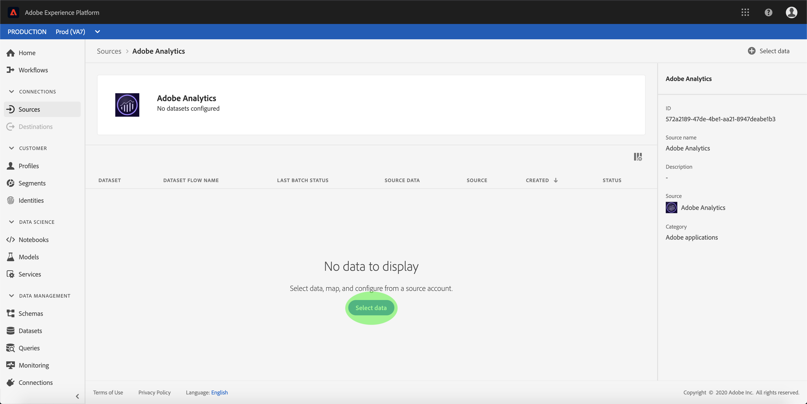

# Een Adobe Analytics-bronconnector maken in de gebruikersinterface

Deze zelfstudie bevat stappen voor het maken van een Adobe Analytics-bronconnector in de gebruikersinterface om consumentengegevens over te brengen naar het Adobe Experience Platform.

## Aan de slag

Voor deze zelfstudie is een goed begrip vereist van de volgende componenten van het Adobe Experience Platform:

* [XDM-systeem](../../../../../xdm/home.md)(Experience Data Model): Het gestandaardiseerde kader waardoor het Platform van de Ervaring gegevens van de klantenervaring organiseert.
* [Klantprofiel](../../../../../profile/home.md)in realtime: Verstrekt een verenigd, real-time consumentenprofiel dat op bijeengevoegde gegevens van veelvoudige bronnen wordt gebaseerd.
* [Sandboxen](../../../../../sandboxes/home.md): Het ervaringsplatform biedt virtuele sandboxen die één enkele instantie Platform in afzonderlijke virtuele omgevingen verdelen om toepassingen voor digitale ervaringen te ontwikkelen en te ontwikkelen.

## Een bronverbinding maken met Adobe Analytics

Meld u aan bij het <a href="https://platform.adobe.com" target="_blank">Adobe Experience Platform</a> en selecteer vervolgens **[!UICONTROL Sources]** in de linkernavigatiebalk om de werkruimte Bronnen te openen. Het scherm van de *Catalogus* toont beschikbare bronnen om binnenkomende verbindingen met tot stand te brengen, en elke bron toont het aantal bestaande rekeningen en datasetstromen verbonden aan hen.

U kunt de juiste categorie selecteren in de catalogus aan de linkerkant van het scherm. U kunt ook de specifieke bron vinden waarmee u wilt werken met de zoekoptie.

Selecteer onder de categorie *Adobe-toepassingen* de optie **[!UICONTROL Adobe Analytics]** om een informatiebalk aan de rechterkant van het scherm weer te geven. De informatiebalk bevat een korte beschrijving van de geselecteerde bron en opties voor het maken van verbinding met de bron of het bekijken van de documentatie. Selecteer **[!UICONTROL Accounts]**.

### Gegevens selecteren

De stap *Adobe Analytics* wordt weergegeven. Eerder ingestelde gegevenssetstromen voor Analytics worden vermeld op dit scherm. U kunt een nieuwe datasetstroom tot stand brengen door te klikken **[!UICONTROL Select data]**.

>[!NOTE] Er kunnen meerdere interne verbindingen met een bron worden gemaakt om verschillende gegevens in te voeren.

<!---Analytics report suites can be configured for one sandbox at a time. To import the same report suite into a different sandbox, the dataset flow will have to be deleted and instantiated again via configuration for a different sandbox.--->

Van de lijst van beschikbare rapportreeksen, selecteer één u in Platform wilt brengen en klikken **[!UICONTROL Next]**.

### Geef de gegevenssetstroom een naam

De stap met de details *van de* Dataset-stroom wordt weergegeven. Hier moet u een naam en een optionele beschrijving opgeven voor de gegevenssetstroom. Selecteer **[UICONTROL! Volgende]** als u klaar bent.

### De gegevenssetstroom controleren

De stap van het *Overzicht* verschijnt, toestaand u om uw nieuwe Analytics in-gebonden datasetstroom te herzien alvorens het wordt gecreeerd. De details van de verbinding worden gegroepeerd per categorieën, die omvatten:

* *Verbinding*: Toont het type van de bronverbinding en de geselecteerde rapportreeks.
* *Gegevensset- en kaartvelden* toewijzen: Wanneer het creëren van andere bronschakelaars, toont deze container welke dataset de brongegevens opnemen in, met inbegrip van het schema de dataset zich aan houdt. Het outputschema en de dataset worden automatisch gevormd voor de gegevenssetstromen van Analytics.

### De gegevenssetstroom controleren

Zodra uw datasetstroom is gecreeerd, kunt u de gegevens controleren die door het worden opgenomen. Selecteer in het scherm *Catalogus* de optie *Gegevensstromen* om een lijst weer te geven met bestaande stromen die zijn gekoppeld aan uw account Analytics.

Het scherm *Dataset-stromen* wordt weergegeven. Op deze pagina is een paar gegevenssetstromen, met inbegrip van informatie over hun naam, brongegevens, aanmaaktijd, en status.

De schakelaar concretiseert twee datasetstromen. De ene flow vertegenwoordigt de backfill-gegevens en de andere stroom is bedoeld voor live-gegevens. De gegevens van de backfill worden niet gevormd voor Profiel maar wordt verzonden naar het gegevensmeer voor analytische en gegeven-wetenschapsgebruik-gevallen.

Voor meer informatie over backfill, levende gegevens, en hun respectieve latentie, zie het Overzicht [van de Verbinding van Gegevens van de](../../../../connectors/adobe-applications/analytics.md)Analyse.

Selecteer de datasetstroom u wenst om van de lijst te bekijken.

De pagina *Dataset-activiteit* wordt weergegeven. Op deze pagina wordt de snelheid van berichten weergegeven die in de vorm van een grafiek worden gebruikt. Selecteer *Gegevensbeheer* in de bovenste koptekst om de labelvelden te openen.

U kunt de geërfte etiketten van een datasetstroom van het scherm van het *Beleid* van Gegevens bekijken. Als u specifieke labels wilt openen, selecteert u de knop Bewerken aan de rechterbovenzijde.

Het deelvenster *Regellabels* bewerken wordt weergegeven. Dit scherm staat u toe om tot het contract, de identiteit, en de gevoelige etiketten van een datasetstroom toegang te hebben en uit te geven.

Voor meer informatie over hoe te om gegevens te etiketteren die uit Analytics komen, bezoek de gids [van de etiketten van het](../../../../../data-governance/labels/user-guide.md)gegevensgebruik.

## Volgende stappen

Zodra de verbinding wordt gecreeerd, wordt een doelschema en datasetstroom automatisch gecreeerd om de inkomende gegevens te bevatten. Bovendien vindt de terugvulling van gegevens plaats en neemt deze tot 13 maanden aan historische gegevens in. Als de eerste opname is voltooid, worden de analysegegevens gebruikt door de services van het downstream Platform, zoals Real-time klantprofiel en Segmenteringsservice. Raadpleeg de volgende documenten voor meer informatie:

* [Overzicht van het realtime klantprofiel](../../../../../profile/home.md)
* [Overzicht van segmentatieservice](../../../../../segmentation/home.md)
* [Overzicht van de Data Science Workspace](../../../../../data-science-workspace/home.md)
* [Overzicht van Query Service](../../../../../query-service/home.md)
