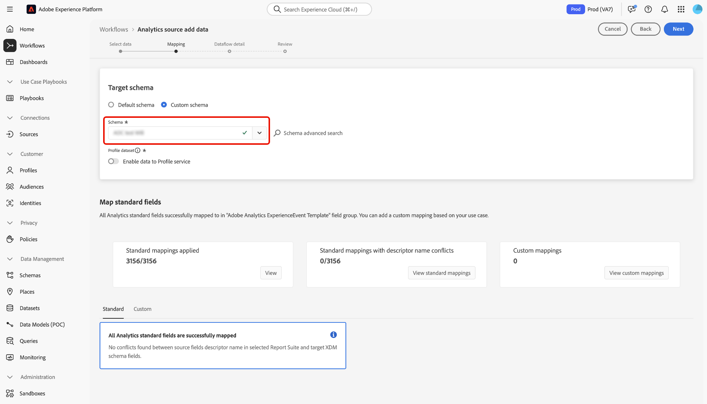

# Een Adobe Analytics-bronverbinding maken in de gebruikersinterface

Deze zelfstudie bevat stappen voor het maken van een Adobe Analytics-bronverbinding in de gebruikersinterface om Adobe Analytics-rapportsuite met gegevens naar Adobe Experience Platform te brengen.

## Aan de slag

Deze zelfstudie vereist een goed begrip van de volgende onderdelen van Experience Platform:

* [ Model van de Gegevens van de Ervaring (XDM) Systeem ](../../../../../xdm/home.md): Het gestandaardiseerde kader waardoor Experience Platform gegevens van de klantenervaring organiseert.
* [ Real-Time Profiel van de Klant ](../../../../../profile/home.md): Verstrekt een verenigd, real-time consumentenprofiel dat op samengevoegde gegevens van veelvoudige bronnen wordt gebaseerd.
* [ Sandboxes ](../../../../../sandboxes/home.md): Experience Platform verstrekt virtuele zandbakken die één enkele instantie van Experience Platform in afzonderlijke virtuele milieu&#39;s verdelen helpen digitale ervaringstoepassingen ontwikkelen en ontwikkelen.

### Belangrijke terminologie

Het is belangrijk dat u de volgende belangrijke termen kent die in dit document worden gebruikt:

* **Standaard attributen**: De standaardattributen zijn om het even welk attribuut dat door Adobe vooraf wordt bepaald. Ze bevatten dezelfde betekenis voor alle klanten en zijn beschikbaar in de [!DNL Analytics] brongegevens en [!DNL Analytics] -schemaveldgroepen.
* **attributen van de Douane**: De attributen van de Douane zijn om het even welk attribuut in de hiërarchie van de douanevariabele in [!DNL Analytics]. De attributen van de douane worden gebruikt binnen een implementatie van Adobe Analytics om specifieke informatie in een rapportreeks te vangen, en zij kunnen in hun gebruik van rapportreeks aan rapportreeks verschillen. Aangepaste kenmerken zijn onder andere eVars, props en lijsten. Zie de volgende [[!DNL Analytics]  documentatie over omzettingsvariabelen ](https://experienceleague.adobe.com/docs/analytics/admin/admin-tools/conversion-variables/conversion-var-admin.html) voor meer informatie over Vars.
* **om het even welk attribuut in de gebiedsgroepen van de Douane**: De attributen die uit gebiedsgroepen voortkomen die door klanten worden gecreeerd zijn allen user-defined en worden beschouwd als noch standaard noch douanekenmerken.
* **vriendschappelijke namen**: De vriendschappelijke namen zijn mens-verstrekte etiketten voor douanevariabelen in een [!DNL Analytics] implementatie. Zie de volgende [[!DNL Analytics]  documentatie over omzettingsvariabelen ](https://experienceleague.adobe.com/docs/analytics/admin/admin-tools/conversion-variables/conversion-var-admin.html) voor meer informatie over vriendschappelijke namen.

## Een bronverbinding maken met Adobe Analytics

>[!NOTE]
>
>Wanneer u een bron van de Analyse gegevens in een productiesandbox creeert, worden twee gegevensstromen gecreeerd:
>
>* Een dataflow die een 13 maanden backfill van historische gegevens van de rapportreeks in gegevens meer doet. Deze gegevensstroom eindigt wanneer de backfill volledig is.
>* Een dataflow-flow die live-gegevens verzendt naar het data-meer en [!DNL Real-Time Customer Profile] . Deze gegevensstroom wordt voortdurend uitgevoerd.

Selecteer in de gebruikersinterface van Experience Platform de optie **[!UICONTROL Sources]** in de linkernavigatie voor toegang tot de werkruimte van [!UICONTROL Sources] . In het scherm [!UICONTROL Catalog] worden diverse bronnen weergegeven waarmee u een account kunt maken.

U kunt de juiste categorie selecteren in de catalogus aan de linkerkant van het scherm. U kunt de zoekbalk ook gebruiken om de weergegeven bronnen te beperken.

Selecteer onder de categorie **[!UICONTROL Adobe applications]** de optie **[!UICONTROL Adobe Analytics]** en selecteer vervolgens **[!UICONTROL Add data]** .

### Gegevens selecteren

>[!IMPORTANT]
>
>De op het scherm vermelde rapportsuites kunnen uit verschillende regio&#39;s afkomstig zijn. U bent verantwoordelijk voor het begrijpen van de beperkingen en verplichtingen van uw gegevens en hoe u die gegevens gebruikt in Adobe Experience Platform-regio&#39;s. Controleer of dit door uw bedrijf is toegestaan.

De stap **[!UICONTROL Analytics source add data]** bevat een lijst met [!DNL Analytics] rapportsuite-gegevens waarmee u een bronverbinding kunt maken.

Een rapportsuite is een container met gegevens die de basis vormt voor [!DNL Analytics] -rapportage. Een organisatie kan vele rapportreeksen hebben, elk die verschillende datasets bevatten.

U kunt rapportsuites van om het even welk gebied (Verenigde Staten, Verenigd Koninkrijk, of Singapore) opnemen zolang zij aan de zelfde organisatie zoals de zandbakinstantie van Experience Platform worden in kaart gebracht waarin de bronverbinding wordt gecreeerd. Een rapportreeks kan worden opgenomen gebruikend slechts één enkele actieve dataflow. Er is al een rapportsuite die niet selecteerbaar is, opgenomen in de sandbox die u gebruikt of in een andere sandbox.

Er kunnen meerdere interne verbindingen worden gemaakt om meerdere rapportsuites over te brengen naar dezelfde sandbox. Als de rapportsuites verschillende schema&#39;s voor variabelen (zoals eVars of gebeurtenissen) hebben, zouden zij aan specifieke gebieden in de groepen van het douanegebied moeten worden in kaart gebracht en gegevensconflicten vermijden gebruikend [ Prep van Gegevens ](../../../../../data-prep/ui/mapping.md). Rapportsuites kunnen alleen aan één sandbox worden toegevoegd.

>[!NOTE]
>
>Gegevens uit meerdere rapportsuites kunnen alleen voor realtime-klantprofiel worden ingeschakeld als er geen gegevensconflicten zijn, zoals twee aangepaste eigenschappen (eVars, lijsten en props) die een andere betekenis hebben.

Als u een [!DNL Analytics] -bronverbinding wilt maken, selecteert u een rapportsuite en selecteert u **[!UICONTROL Next]** om door te gaan.

&lt;!—De Reeksen van het Rapport van Analytics kunnen voor één zandbak tegelijkertijd worden gevormd. Als u dezelfde rapportsuite in een andere sandbox wilt importeren, moet de gegevenssetstroom worden verwijderd en opnieuw worden geïnstantieerd via de configuratie voor een andere sandbox.—>

### Toewijzing

>[!IMPORTANT]
>
>Transformaties van de Prep van gegevens kunnen latentie aan algemene dataflow toevoegen. De extra toegevoegde latentie is afhankelijk van de complexiteit van de transformatielogica.

Voordat u de [!DNL Analytics] -gegevens kunt toewijzen aan het doel-XDM-schema, moet u eerst opgeven of u een standaardschema of een aangepast schema gebruikt.

Met een standaardschema wordt namens u een nieuw schema gemaakt dat de veldgroep [!DNL Adobe Analytics ExperienceEvent Template] bevat. Selecteer **[!UICONTROL Default schema]** als u een standaardschema wilt gebruiken.

Met een aangepast schema kunt u elk beschikbaar schema voor uw [!DNL Analytics] -gegevens kiezen, zolang dat schema de [!DNL Adobe Analytics ExperienceEvent Template] -veldgroep bevat. Selecteer **[!UICONTROL Custom schema]** als u een aangepast schema wilt gebruiken.

De pagina [!UICONTROL Mapping] biedt een interface om bronvelden toe te wijzen aan hun juiste doelschemavelden. Van hier, kunt u douanevariabelen aan nieuwe groepen van het schemagebied in kaart brengen en berekeningen toepassen zoals die door de Prep van Gegevens worden gesteund. Selecteer een doelschema om het toewijzingsproces te starten.

>[!TIP]
>
>Alleen schema&#39;s met de veldgroep [!DNL Adobe Analytics ExperienceEvent Template] worden weergegeven in het menu Schema selecteren. Andere schema&#39;s worden weggelaten. Als er geen aangewezen schema&#39;s beschikbaar voor uw gegevens van de Reeks van het Rapport zijn, dan moet u een nieuw schema tot stand brengen. Voor gedetailleerde stappen bij het creëren van schema&#39;s, zie de gids bij [ het creëren van en het uitgeven van schema&#39;s in UI ](../../../../../xdm/ui/resources/schemas.md).

In de sectie [!UICONTROL Map standard fields] worden deelvensters voor [!UICONTROL Standard mappings applied] , [!UICONTROL Non matching standard mappings] en [!UICONTROL Custom mappings] weergegeven. Zie de volgende tabel voor specifieke informatie over elke categorie:

| Standaardvelden toewijzen | Beschrijving |
| --- | --- |
| [!UICONTROL Standard mappings applied] | In het deelvenster [!UICONTROL Standard mappings applied] wordt het totale aantal toegewezen kenmerken weergegeven. Standaardtoewijzingen hebben betrekking op toewijzingssets tussen alle kenmerken in de [!DNL Analytics] -brongegevens en de bijbehorende kenmerken in de [!DNL Analytics] -veldgroep. Deze zijn vooraf toegewezen en kunnen niet worden bewerkt. |
| [!UICONTROL Non matching standard mappings] | Het deelvenster [!UICONTROL Non matching standard mappings] verwijst naar het aantal toegewezen kenmerken die conflicten met vriendschappelijke namen bevatten. Deze conflicten verschijnen wanneer u een schema opnieuw gebruikt dat reeds een bevolkte reeks gebiedsbeschrijvers van een verschillende Reeks van het Rapport heeft. U kunt doorgaan met uw [!DNL Analytics] -gegevensstroom, zelfs met conflicten met vriendelijke namen. |
| [!UICONTROL Custom mappings] | In het deelvenster [!UICONTROL Custom mappings] wordt het aantal toegewezen aangepaste kenmerken weergegeven, waaronder eVars, props en lijsten. Aangepaste toewijzingen hebben betrekking op sets van toewijzingen tussen aangepaste kenmerken in de brongegevens [!DNL Analytics] en kenmerken in aangepaste veldgroepen die in het geselecteerde schema zijn opgenomen. |

Selecteer **[!UICONTROL View]** in het deelvenster [!UICONTROL Standard mappings applied] om een voorvertoning van de veldgroep met het [!DNL Analytics] ExperienceEvent-sjabloonschema weer te geven.

De pagina [!UICONTROL Adobe Analytics ExperienceEvent Template Schema Field Group] biedt u een interface voor het inspecteren van de structuur van uw schema. Selecteer **[!UICONTROL Close]** als u klaar bent.

Experience Platform detecteert automatisch uw sets met toewijzingen voor eventuele conflicten met vriendschappelijke namen. Als er geen conflicten zijn met uw toewijzingsets, selecteert u **[!UICONTROL Next]** om door te gaan.

>[!TIP]
>
>Als er vriendschappelijke naamconflicten zijn tussen uw bronRapport Suite en uw geselecteerde schema, kunt u nog steeds doorgaan met uw [!DNL Analytics] dataflow, erkennend dat de gebiedsbeschrijvers niet zullen worden veranderd. U kunt er ook voor kiezen om een nieuw schema te maken met een lege set beschrijvingen.

#### Aangepaste toewijzingen

U kunt de functies van de Prep van Gegevens gebruiken om nieuwe douanetoewijzing of berekende gebieden voor douaneattributen toe te voegen. Als u aangepaste toewijzingen wilt toevoegen, selecteert u **[!UICONTROL Custom]** .

Afhankelijk van uw behoeften kunt u ofwel **[!UICONTROL Add new mapping]** ofwel **[!UICONTROL Add calculated field]** selecteren en doorgaan met het maken van aangepaste toewijzingen voor uw aangepaste kenmerken. Voor uitvoerige stappen op hoe te om de functies van de Prep van Gegevens te gebruiken, te lezen gelieve de [ gids UI van de Prep van Gegevens ](../../../../../data-prep/ui/mapping.md).

De volgende documentatie verstrekt verdere middelen bij het begrip Prep van Gegevens, berekende gebieden, en kaartfuncties:

* [Overzicht van Data Prep](../../../../../data-prep/home.md)
* [Toewijzingsfuncties van Data Prep](../../../../../data-prep/functions.md)
* [Berekende velden toevoegen](../../../../../data-prep/ui/mapping.md#calculated-fields)

<!-- 
To use Data Prep functions and add new mapping or calculated fields for custom attributes, select **[!UICONTROL View custom mappings]**.

Next, select **[!UICONTROL Add new mapping]**.

Depending on your needs, you can select either **[!UICONTROL Add new mapping]** or **[!UICONTROL Add calculated field]** from the options that appear. 

An empty mapping set appears. Select the mapping icon to add a source field.

You can use the interface to navigate through the source schema structure and identify the new source field that you want to use. Once you have selected the source field that you want to map, select **[!UICONTROL Select]**.

Next, select the mapping icon under [!UICONTROL Target Field] to map your selected source field to its appropriate target field.

Similar to the source schema, you can use the interface to navigate through the target schema structure and select the target field you want to map to. Once you have selected the appropriate target field, select **[!UICONTROL Select]**.

With your custom mapping set completed, select **[!UICONTROL Next]** to proceed.

 -->

## Filteren voor realtime-klantprofiel {#filtering-for-profile}

>[!CONTEXTUALHELP]
>id="platform_data_prep_analytics_filtering"
>title="Filterregels maken"
>abstract="Bepaal rij en kolom-vlakke het filtreren regels wanneer het verzenden van gegevens naar het Profiel van de Klant in real time. Het rij-vlakke filtreren van het gebruik om voorwaarden toe te passen en te dicteren welke gegevens aan **voor het opnemen van het Profiel** omvatten. Het kolom-vlakke filtreren van het gebruik om de kolommen van gegevens te selecteren die u voor de opname van het Profiel **wilt uitsluiten**. Filterregels zijn niet van toepassing op gegevens die naar een datumpeer worden verzonden."

Nadat u toewijzingen voor de gegevens van uw [!DNL Analytics] -rapportsuite hebt voltooid, kunt u filterregels en -voorwaarden toepassen om gegevens selectief op te nemen in of uit te sluiten van opname naar het Real-Time klantprofiel. Ondersteuning voor filteren is alleen beschikbaar voor [!DNL Analytics] -gegevens en gegevens worden alleen gefilterd voordat u [!DNL Profile.] invoert. Alle gegevens worden in het datumpomeer opgenomen.

>[!BEGINSHADEBOX]

**extra informatie over de Gegevens Prep en het filtreren Analysegegevens voor het Profiel van de Klant in real time**

* U kunt de het filtreren functionaliteit voor gegevens gebruiken die naar Profiel gaan, maar niet voor gegevens die naar gegevens meer gaan.
* U kunt filteren voor live-gegevens gebruiken, maar u kunt geen backfill-gegevens filteren.
   * Er wordt geen back-up gemaakt van gegevens in het profiel van de [!DNL Analytics] -bron.
* Als u de configuraties van de Prep van Gegevens tijdens de aanvankelijke opstelling van een [!DNL Analytics] stroom gebruikt, worden die veranderingen ook toegepast op automatische 13 maanden backfill.
   * Dit is echter niet het geval voor filteren, omdat filteren alleen is gereserveerd voor live-gegevens.
* Gegevensvoorinstelling wordt toegepast op streaming- en batchinvoerpaden. Als u een bestaande configuratie van de Prep van Gegevens wijzigt, worden die veranderingen dan toegepast op nieuwe inkomende gegevens over zowel het stromen als de weg van de partijopname.
   * De configuraties van Data Prep zijn echter niet van toepassing op gegevens die al in Experience Platform zijn opgenomen, ongeacht of het om streaming- of batchgegevens gaat.
* Standaardkenmerken van Analytics worden altijd automatisch toegewezen. Daarom kunt u geen transformaties toepassen op standaardkenmerken.
   * U kunt standaardkenmerken echter wel uitfilteren zolang deze niet zijn vereist in Identiteitsservice of Profiel.
* U kunt filteren op kolomniveau niet gebruiken om vereiste velden en identiteitsvelden te filteren.
* Hoewel u secundaire identiteiten kunt uitfilteren, met name HULP en AACCustomID, kunt u ECID niet uitfilteren.
* Wanneer een transformatiefout optreedt, resulteert de corresponderende kolom in NULL.

>[!ENDSHADEBOX]

### Filteren op rijniveau

>[!IMPORTANT]
>
>Het rij-vlakke filtreren van het gebruik om voorwaarden toe te passen en te dicteren welke gegevens aan **voor het opnemen van het Profiel** omvatten. Het kolom-vlakke filtreren van het gebruik om de kolommen van gegevens te selecteren die u voor de opname van het Profiel **wilt uitsluiten**.

U kunt gegevens filteren voor opname in [!DNL Profile] op rijniveau en op kolomniveau. Door het filteren op rijniveau kunt u criteria definiëren, zoals tekenreeksen bevatten, gelijk zijn aan, beginnen of eindigen met. U kunt filteren op rijniveau ook gebruiken om voorwaarden te verbinden met `AND` en `OR` , en om voorwaarden te negeren met `NOT` .

Als u de [!DNL Analytics] -gegevens op rijniveau wilt filteren, selecteert u **[!UICONTROL Row filter]** .

Gebruik het linkerspoor om door de schemahiërarchie te navigeren en de schemaattributen van uw keus te selecteren om een bepaald schema verder te boren.

Nadat u het kenmerk hebt geïdentificeerd dat u wilt configureren, selecteert u het kenmerk en sleept u het van de linkerspoorstaaf naar het filterdeelvenster.

Als u verschillende voorwaarden wilt configureren, selecteert u **[!UICONTROL equals]** en selecteert u vervolgens een voorwaarde in het vervolgkeuzevenster dat wordt weergegeven.

De lijst configureerbare voorwaarden omvat:

* [!UICONTROL equals]
* [!UICONTROL does not equal]
* [!UICONTROL starts with]
* [!UICONTROL ends with]
* [!UICONTROL does not end with]
* [!UICONTROL contains]
* [!UICONTROL does not contain]
* [!UICONTROL exists]
* [!UICONTROL does not exist]

Voer vervolgens de waarden in die u wilt opnemen op basis van het kenmerk dat u hebt geselecteerd. In het onderstaande voorbeeld worden [!DNL Apple] en [!DNL Google] geselecteerd voor opname als onderdeel van het kenmerk **[!UICONTROL Manufacturer]** .

Om uw het filtreren voorwaarden verder te specificeren, voeg een ander attribuut van het schema toe en voeg dan waarden toe die op dat attribuut worden gebaseerd. In het onderstaande voorbeeld wordt het kenmerk **[!UICONTROL Model]** toegevoegd en worden modellen zoals [!DNL iPhone 13] en [!DNL Google Pixel 6] gefilterd voor opname.

Als u een nieuwe container wilt toevoegen, selecteert u de ellipsen (`...`) rechtsboven in de filterinterface en selecteert u vervolgens **[!UICONTROL Add container]** .

Wanneer een nieuwe container is toegevoegd, selecteert u **[!UICONTROL Include]** en selecteert u vervolgens **[!UICONTROL Exclude]** in het vervolgkeuzevenster dat wordt weergegeven.

 uit

Voltooi vervolgens hetzelfde proces door de schemakenmerken te slepen en de bijbehorende waarden toe te voegen die u niet wilt filteren. In het onderstaande voorbeeld worden [!DNL iPhone 12] , [!DNL iPhone 12 mini] en [!DNL Google Pixel 5] allemaal gefilterd van uitsluiting van het kenmerk **[!UICONTROL Model]** , wordt landschap uitgesloten van het kenmerk **[!UICONTROL Screen orientation]** en wordt modelnummer [!DNL A1633] uitgesloten van **[!UICONTROL Model number]** .

Selecteer **[!UICONTROL Next]** als u klaar bent.

### Filteren op kolomniveau

Selecteer **[!UICONTROL Column filter]** in de koptekst om filteren op kolomniveau toe te passen.

De pagina wordt bijgewerkt in een interactieve schemastructuur, die uw schemakenattributen op kolom-niveau toont. Van hier, kunt u de kolommen van gegevens selecteren die u van [!DNL Profile] opname zou willen uitsluiten. U kunt ook een kolom uitvouwen en specifieke kenmerken voor uitsluiting selecteren.

Standaard gaat [!DNL Analytics] naar [!DNL Profile] en met dit proces kunnen vertakkingen van XDM-gegevens worden uitgesloten van [!DNL Profile] -invoer.

Selecteer **[!UICONTROL Next]** als u klaar bent.

### Secundaire identiteiten filteren

Gebruik een kolomfilter om secundaire identiteiten uit te sluiten van profielopname. Als u secundaire identiteiten wilt filteren, selecteert u **[!UICONTROL Column filter]** en selecteert u vervolgens **[!UICONTROL _identities]** .

Het filter is alleen van toepassing wanneer een identiteit als secundair wordt gemarkeerd. Als identiteiten zijn geselecteerd, maar een gebeurtenis aankomt met een van de identiteiten die als primair zijn gemarkeerd, worden deze niet uitgefilterd.

### Gegevens over gegevensstroom opgeven

De stap **[!UICONTROL Dataflow detail]** wordt weergegeven. Hier moet u een naam en een optionele beschrijving voor de gegevensstroom opgeven. Selecteer **[!UICONTROL Next]** wanneer u klaar bent.

### Controleren

De stap [!UICONTROL Review] wordt weergegeven, zodat u de nieuwe gegevens voor Analytics kunt bekijken voordat deze worden gemaakt. De details van de verbinding worden gegroepeerd per categorieën, die omvatten:

* [!UICONTROL Connection]: geeft het bronplatform van de verbinding weer.
* [!UICONTROL Data type]: geeft de geselecteerde rapportsuite en de bijbehorende rapportsuite-id weer.

## Uw gegevensstroom controleren {#monitor-your-dataflow}

Wanneer de gegevensstroom is voltooid, selecteert u **[!UICONTROL Dataflows]** in de broncatalogus om de activiteit en status van de gegevens te controleren.

Er wordt een lijst weergegeven met bestaande analytische gegevens in uw organisatie. Van hier, selecteer een doeldataset om zijn respectieve insluitingsactiviteit te bekijken.

De pagina [!UICONTROL Dataset activity] bevat informatie over de voortgang van gegevens die van Analytics naar Experience Platform worden verzonden. De interface toont metriek zoals het totaal van verslagen in de vorige maand, het totaal van ingegeten verslagen in de laatste zeven dagen, en de grootte van gegevens in de vorige maand.

De bron concretiseert twee datasetstromen. De ene flow vertegenwoordigt de backfill-gegevens en de andere stroom is bedoeld voor live-gegevens. De gegevens van de backfill worden niet gevormd voor opname in het Profiel van de Klant in real time maar wordt verzonden naar het gegevenshoek voor analytische en gegevenswetenschappelijk gebruik-gevallen.

Voor meer informatie over backfill, levende gegevens, en hun respectieve latentie, lees het [ bron overzicht van de Analyse ](../../../../connectors/adobe-applications/analytics.md).

>[!NOTE]
>
>De pagina van de gegevenssetactiviteit toont geen informatie over partijen aangezien de de bronschakelaar van de Analyse volledig door Adobe wordt geleid. U kunt controleren dat de gegevens stromen door de metriek rond opgenomen verslagen te bekijken.

## Uw gegevensstroom verwijderen {#delete-dataflow}

Als u de gegevensstroom Analytics wilt verwijderen, selecteert u **[!UICONTROL Dataflows]** in de bovenste koptekst van de werkruimte Bronnen. Gebruik de dataflows pagina om van de dataflow van Analytics de plaats te bepalen die u wilt schrappen en dan de ellipsen (`...`) naast het selecteren. Gebruik vervolgens het vervolgkeuzemenu en selecteer **[!UICONTROL Delete]** .

* Het schrappen van de levende Dataflow van Analytics zal ook zijn onderliggende dataset schrappen.
* Het schrappen van backfillAnalytics dataflow schrapt niet de onderliggende dataset, maar zal het backfill proces voor zijn overeenkomstige rapportreeks tegenhouden. Als u backfill dataflow schrapt, kunnen de ingebedde gegevens nog door de dataset worden bekeken.

## Volgende stappen en extra bronnen

Zodra de verbinding wordt gecreeerd, wordt de dataflow automatisch gecreeerd om de inkomende gegevens te bevatten en een dataset met uw geselecteerd schema te bevolken. Bovendien vindt de terugvulling van gegevens plaats en neemt deze tot 13 maanden aan historische gegevens in. Wanneer de eerste opname is voltooid, [!DNL Analytics] -gegevens en wordt deze gebruikt door downstream Experience Platform-services, zoals [!DNL Real-Time Customer Profile] en Segmentation Service. Raadpleeg de volgende documenten voor meer informatie:

* [[!DNL Real-Time Customer Profile]-overzicht](../../../../../profile/home.md)
* [[!DNL Segmentation Service]-overzicht](../../../../../segmentation/home.md)
* [[!DNL Data Science Workspace]-overzicht](../../../../../data-science-workspace/home.md)
* [[!DNL Query Service]-overzicht](../../../../../query-service/home.md)

De volgende video is bedoeld als ondersteuning voor uw inzicht in het opnemen van gegevens via de Adobe Analytics Source-connector:

>[!WARNING]
>
> De gebruikersinterface van [!DNL Experience Platform] in de volgende video is verouderd. Raadpleeg de bovenstaande documentatie voor de meest recente schermafbeeldingen en functionaliteit van de gebruikersinterface.

>[!VIDEO](https://video.tv.adobe.com/v/29687?quality=12&learn=on)
