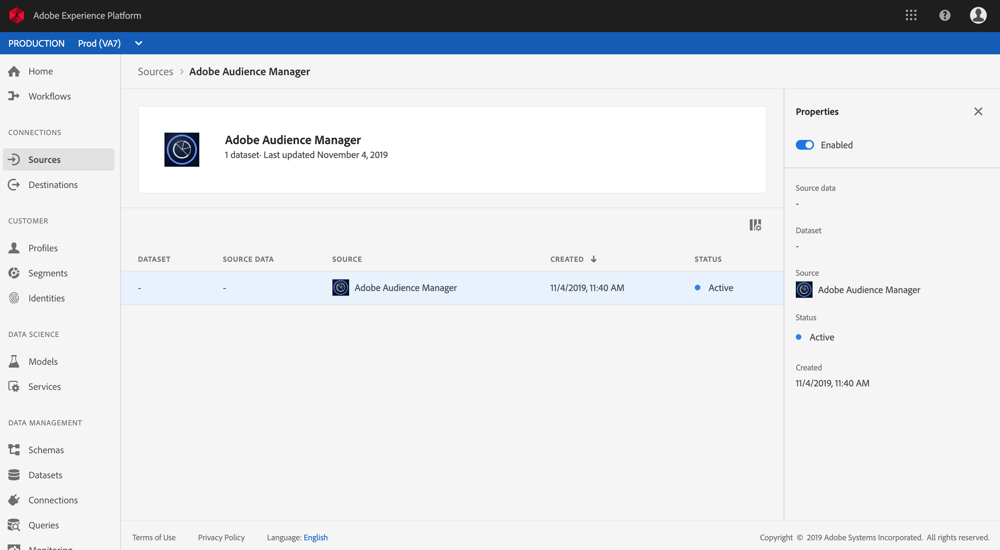
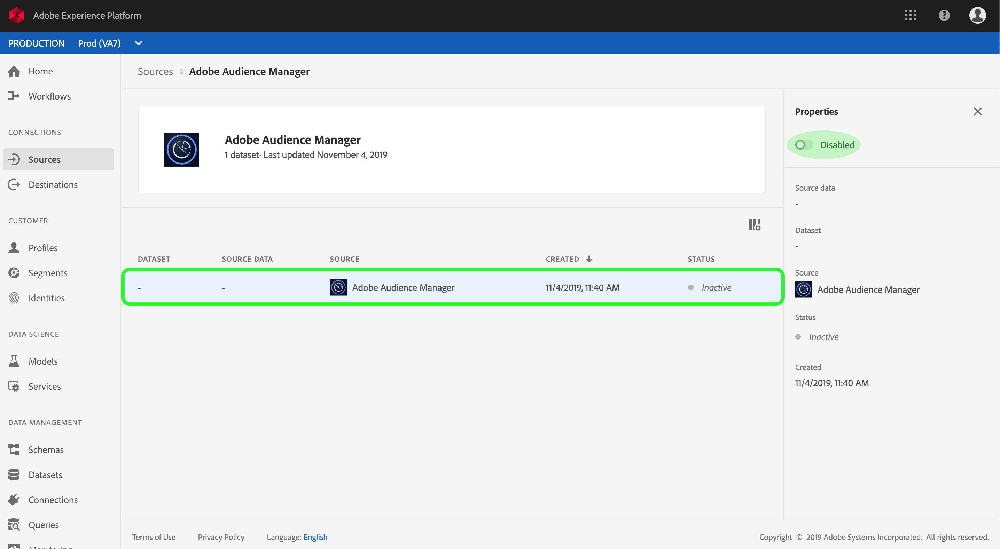

# Een Adobe Audience Manager-bronaansluiting maken in de gebruikersinterface

Deze zelfstudie begeleidt u door de stappen om een bronschakelaars voor de Manager van de Audience van Adobe tot stand te brengen om de gegevens van de Gebeurtenis van de Consumentenervaring in Platform in te brengen gebruikend het gebruikersinterface.

## Een bronverbinding maken met Adobe Audience Manager

Meld u aan bij <a href="https://platform.adobe.com" target="_blank">Adobe Experience Platform</a> en selecteer vervolgens **Bronnen** in de linkernavigatiebalk voor toegang tot de werkruimte Bronnen. In het scherm *Catalogus* worden diverse bronnen weergegeven waarmee u bronverbindingen kunt maken. Elke bron toont het aantal bestaande verbindingen dat aan deze bronnen is gekoppeld.

Selecteer onder de categorie *Adobe-toepassingen* de optie **Adobe Audience Manager** om een informatiebalk aan de rechterkant van het scherm weer te geven. De informatiebalk bevat een korte beschrijving van de geselecteerde bron en opties voor het weergeven van de documentatie of het maken van een verbinding met de bron.

Als u een nieuwe bronaansluiting voor Adobe Audience Manager wilt maken, klikt u op **Connect-bron**.

Er wordt een dialoogvenster weergegeven. Klik op **Verbinden** om de verbinding te maken.

Als een bronverbinding met Adobe Audience Manager tot stand is gebracht, wordt de pagina met *bronactiviteit* voor de aansluiting van Audience Manager weergegeven.

Als u binnenkomende gegevens van Audience Manager wilt pauzeren, kunt u dit doen door op de dataflow-lijst te klikken en de *Status* van de gegevens van een knevel te voorzien van de juiste kolom van *Eigenschappen* .

## Volgende stappen

Terwijl een gegevensstroom van de Manager van de Publiek actief is, worden de inkomende gegevens automatisch opgenomen in de Profielen van de Klant in real time. U kunt deze inkomende gegevens nu gebruiken en publiekssegmenten maken met de Platform Segmentation Service. Raadpleeg de volgende documenten voor meer informatie:

- [Overzicht van het realtime klantprofiel](../../../../../profile/home.md)
- [Overzicht van segmentatieservice](../../../../../segmentation/home.md)