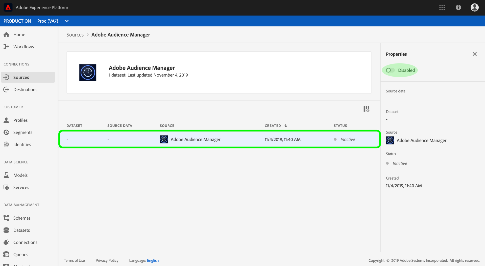

# Een Adobe Audience Manager-bronaansluiting maken in de gebruikersinterface

Deze zelfstudie begeleidt u door de stappen om een bronschakelaars voor Adobe Audience Manager tot stand te brengen om de gegevens van de Gebeurtenis van de Consumentenervaring in Platform te brengen gebruikend het gebruikersinterface.

## Een bronverbinding maken met Adobe Audience Manager

Meld u aan bij [Adobe Experience Platform](https://platform.adobe.com) en selecteer vervolgens **Bronnen** in de linkernavigatiebalk voor toegang tot de werkruimte Bronnen. In het scherm *Catalogus* worden diverse bronnen weergegeven waarmee u bronverbindingen kunt maken. Elke bron toont het aantal bestaande verbindingen dat aan deze bronnen is gekoppeld.

Selecteer onder de categorie *Adobe-toepassingen* de optie **Adobe Audience Manager** om een informatiebalk aan de rechterkant van het scherm weer te geven. De informatiebalk bevat een korte beschrijving van de geselecteerde bron en opties voor het weergeven van de documentatie of het maken van een verbinding met de bron.

Als u een nieuwe bronaansluiting voor Adobe Audience Manager wilt maken, klikt u op Gegevens **** toevoegen.

Er wordt een dialoogvenster weergegeven. Klik op **Verbinden** om de verbinding te maken.

Als een bronverbinding met Adobe Audience Manager wordt gevestigd, wordt de pagina van de *Bron activiteit* voor de schakelaar van de Audience Manager getoond.

Als u binnenkomende gegevens van de Audience Manager wilt pauzeren, kunt u dit doen door de dataflow lijst te klikken en zijn *Status* van de juiste kolom van *Eigenschappen* van een knevel te voorzien.

## Volgende stappen

Terwijl een gegevensstroom van de Audience Manager actief is, worden de inkomende gegevens automatisch opgenomen in de Profielen van de Klant in real time. U kunt deze inkomende gegevens nu gebruiken en publiekssegmenten maken met de Dienst van de Segmentatie van het Platform. Raadpleeg de volgende documenten voor meer informatie:

- [Overzicht van het realtime klantprofiel](../../../../../profile/home.md)
- [Overzicht van segmentatieservice](../../../../../segmentation/home.md)