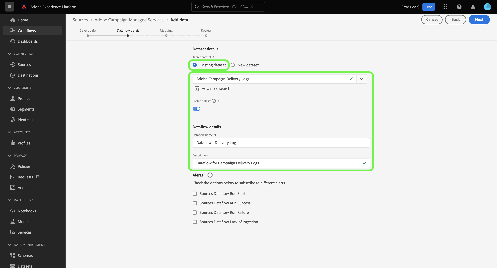
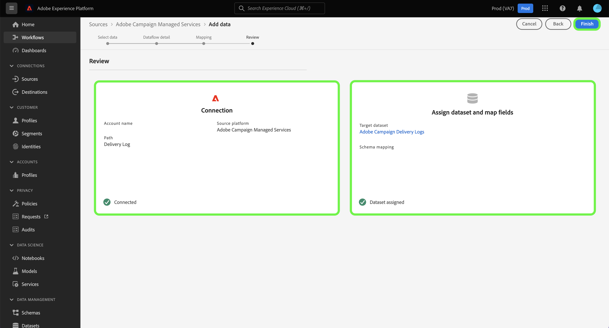

# Een Adobe Campaign Managed Cloud Services-bronverbinding maken met de gebruikersinterface van het Platform

Deze zelfstudie bevat stappen om een bronverbinding te maken waarmee uw Adobe Campaign Managed Cloud Services-gegevens naar Adobe Experience Platform worden overgebracht.

## Aan de slag

Deze gids vereist een werkend inzicht in de volgende componenten van Experience Platform:

* [Bronnen](../../../../home.md): Met Platform kunnen gegevens uit verschillende bronnen worden ingepakt en kunt u inkomende gegevens structureren, labelen en verbeteren met behulp van de services van Platforms.
* [[!DNL Experience Data Model (XDM)] Systeem](../../../../../xdm/home.md): Het gestandaardiseerde kader waardoor het Experience Platform gegevens van de klantenervaring organiseert.
   * [Basisbeginselen van de schemacompositie](../../../../../xdm/schema/composition.md): Leer over de basisbouwstenen van schema&#39;s XDM, met inbegrip van zeer belangrijke principes en beste praktijken in schemacompositie.
   * [Zelfstudie Schema Editor](../../../../../xdm/tutorials/create-schema-ui.md): Leer hoe te om douaneschema&#39;s tot stand te brengen gebruikend de Redacteur UI van het Schema.
* [Sandboxen](../../../../../sandboxes/home.md): Platform biedt virtuele sandboxen die één Platform-instantie in afzonderlijke virtuele omgevingen verdelen om toepassingen voor digitale ervaringen te ontwikkelen en te ontwikkelen.

## Adobe Campaign Managed Cloud Services verbinden met Platform

Selecteer in de gebruikersinterface van het Platform de optie **[!UICONTROL Sources]** van de linkernavigatie om tot [!UICONTROL Sources] werkruimte. De [!UICONTROL Catalog] in het scherm worden diverse bronnen weergegeven waarmee u een account kunt maken.

U kunt de juiste categorie selecteren in de catalogus aan de linkerkant van het scherm. U kunt de zoekbalk ook gebruiken om de weergegeven bronnen te beperken.

Onder de **[!UICONTROL Adobe applications]** categorie, selecteert u **[!UICONTROL Adobe Campaign Managed Cloud Services]** en selecteer vervolgens **[!UICONTROL Add data]**.

### Gegevens selecteren {#select-data}

>[!CONTEXTUALHELP]
>id="platform_sources_campaign_instance"
>title="Adobe Campaign-milieu-instantie"
>abstract="De naam van de Adobe Campaign-omgeving die u wilt gebruiken."
>text="Learn more in documentation"

>[!CONTEXTUALHELP]
>id="platform_sources_campaign_mapping"
>title="Targettoewijzing"
>abstract="De afbeeldingen van het doel zijn technische voorwerpen die door Campagne worden gebruikt om berichten te leveren, en bevatten alle technische montages die worden vereist om leveringen (adressen, telefoonaantallen, opt-in indicatoren, extra herkenningstekens..) te verzenden."
>text="Learn more in documentation"

>[!CONTEXTUALHELP]
>id="platform_sources_campaign_schema"
>title="Schemanaam"
>abstract="De naam van de entiteit die is gedefinieerd in de Adobe Campaign-database."
>text="Learn more in documentation"

De [!UICONTROL Select data] de stap verschijnt, die u van een interface voorzien om uw te vormen [!UICONTROL Adobe Campaign instance], [!UICONTROL Target mapping], en [!UICONTROL Schema name].

| Eigenschap | Beschrijving |
| --- | --- |
| Adobe Campaign-exemplaar | De naam van de Adobe Campaign-omgevingsinstantie die u gebruikt. |
| Targettoewijzing | De technische voorwerpen die door Campaign worden gebruikt om berichten te leveren, en bevatten alle technische montages die worden vereist om leveringen te verzenden. |
| Schemanaam | De naam van de schemaentiteit die u aan Platform brengt. De opties omvatten het Logboek van de Levering en het Volgen Logboek. |

Zodra u waarden voor uw instantie van de Campagne, doelafbeelding, en schemanaam hebt verstrekt, werkt het scherm bij om een voorproef van uw schema evenals een steekproefdataset te tonen. Als u klaar bent, selecteert u **[!UICONTROL Next]**.

### Een bestaande gegevensset gebruiken

De [!UICONTROL Dataflow detail] De pagina staat u toe om te selecteren of u een bestaande dataset wilt gebruiken of een nieuwe dataset voor uw dataflow vormen.

Als u een bestaande gegevensset wilt gebruiken, selecteert u **[!UICONTROL Existing dataset]**. U kunt of een bestaande dataset terugwinnen gebruikend [!UICONTROL Advanced search] of door door de lijst van bestaande datasets in het dropdown menu te scrollen.

Selecteer een gegevensset en geef een naam op voor de gegevensstroom en een optionele beschrijving.

### Een nieuwe gegevensset gebruiken

Als u een nieuwe gegevensset wilt gebruiken, selecteert u **[!UICONTROL New dataset]** en geef vervolgens een naam voor de uitvoergegevensset en een optionele beschrijving op. Selecteer vervolgens het schema waaraan u wilt toewijzen [!UICONTROL Advanced search] of door door de lijst van bestaande schema&#39;s in het dropdown menu te scrollen. Als u klaar bent, selecteert u **[!UICONTROL Next]**.

### Waarschuwingen inschakelen

U kunt waarschuwingen inschakelen om meldingen te ontvangen over de status van uw gegevensstroom. Selecteer een waarschuwing in de lijst om u te abonneren en meldingen te ontvangen over de status van uw gegevensstroom. Voor meer informatie over waarschuwingen raadpleegt u de handleiding over [abonneren op berichten voor bronnen met behulp van de gebruikersinterface](../../alerts.md).

Wanneer u klaar bent met het opgeven van details voor uw gegevensstroom, selecteert u **[!UICONTROL Next]**.

### Gegevensvelden toewijzen aan een XDM-schema

De [!UICONTROL Mapping] de stap verschijnt, die u van een interface voorziet om de brongebieden van uw bronschema aan hun aangewezen doelXDM gebieden in het doelschema in kaart te brengen.

Platform biedt intelligente aanbevelingen voor automatisch toegewezen velden op basis van het doelschema of de gegevensset die u hebt geselecteerd. U kunt toewijzingsregels handmatig aanpassen aan uw gebruiksgevallen. Op basis van uw behoeften kunt u ervoor kiezen om velden rechtstreeks toe te wijzen of gegevens prep-functies te gebruiken om brongegevens om berekende of berekende waarden af te leiden. Voor uitvoerige stappen bij het gebruiken van de kaartperinterface en berekende gebieden, zie [UI-hulplijn voor gegevensvoorinstelling](../../../../../data-prep/ui/mapping.md).

>[!IMPORTANT]
>
>Wanneer u uw bronvelden toewijst aan doel-XDM-velden, moet u ervoor zorgen dat u het toegewezen primaire identiteitsveld toewijst aan het juiste doel-XDM-veld.

Als de brongegevens eenmaal zijn toegewezen, selecteert u **[!UICONTROL Next]**.

### Controleer uw gegevensstroom

De **[!UICONTROL Review]** wordt weergegeven, zodat u de nieuwe gegevensstroom kunt controleren voordat deze wordt gemaakt. De details worden gegroepeerd in de volgende categorieën:

* **[!UICONTROL Connection]**: Toont het brontype, de relevante weg van het gekozen brondossier, en de hoeveelheid kolommen binnen dat brondossier.
* **[!UICONTROL Assign dataset & map fields]**: Toont welke dataset de brongegevens worden opgenomen in, met inbegrip van het schema dat de dataset zich aan houdt.

Nadat u de gegevensstroom hebt gecontroleerd, selecteert u **[!UICONTROL Finish]** en laat enige tijd voor de gegevensstroom worden gecreeerd.

### Uw gegevenssetactiviteit controleren

Zodra uw gegevensstroom is gecreeerd, kunt u de gegevens controleren die door het worden opgenomen om informatie over ingebedde tarieven en succesvolle en ontbroken partijen te zien.

Als u uw gegevenssetactiviteit wilt bekijken, selecteert u **[!UICONTROL Dataflows]** in de broncatalogus.

Selecteer vervolgens de doeldataset in de lijst met gegevensstromen die worden weergegeven.

De pagina met gegevenssetactiviteiten wordt weergegeven. Van hier, kunt u informatie over de prestaties van uw gegevensstroom zien, met inbegrip van tarief van opname, succesvolle partijen, en ontbroken partijen.

Deze pagina voorziet u ook van een interface om de meta-gegevensbeschrijving van uw gegevensstroom bij te werken, gedeeltelijke opname en foutendiagnostiek toe te laten, evenals nieuwe gegevens toe te voegen aan uw dataset.

## Volgende stappen

Door deze zelfstudie te volgen, hebt u met succes een dataflow gemaakt om uw de leveringslogboeken van de Berichten van de Campagne v8 en het volgen logboekgegevens aan Platform te brengen. Inkomende gegevens kunnen nu worden gebruikt door downstreamdiensten voor Platforms, zoals [!DNL Real-time Customer Profile] en [!DNL Data Science Workspace]. Raadpleeg de volgende documenten voor meer informatie:

* [[!DNL Real-time Customer Profile] - overzicht](../../../../../profile/home.md)
* [[!DNL Data Science Workspace] - overzicht](../../../../../data-science-workspace/home.md)
