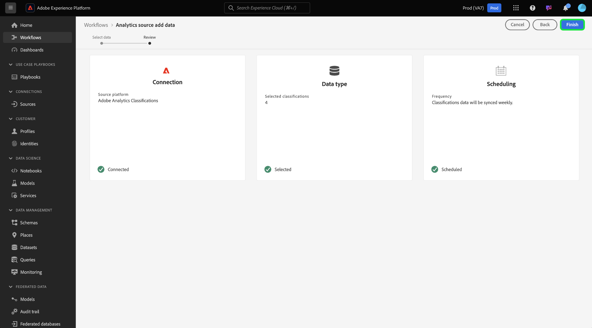

# Een Adobe Analytics Classifications Data-connector maken in de gebruikersinterface

Deze zelfstudie bevat stappen voor het maken van een Adobe Analytics Classifications Data-connector in de gebruikersinterface om classificatiegegevens over te brengen naar Adobe Experience Platform.

## Aan de slag

Deze zelfstudie vereist een goed begrip van de volgende onderdelen van Adobe Experience Platform:

* [[!DNL Experience Data Model (XDM)] Systeem](../../../../../xdm/home.md): Het gestandaardiseerde kader waardoor het Experience Platform gegevens van de klantenervaring organiseert.
* [[!DNL Real-time Customer Profile]](../../../../../profile/home.md): Verstrekt een verenigd, real-time consumentenprofiel dat op bijeengevoegde gegevens van veelvoudige bronnen wordt gebaseerd.
* [[!DNL Sandboxes]](../../../../../sandboxes/home.md): Experience Platform biedt virtuele sandboxen die één Platform-instantie in afzonderlijke virtuele omgevingen verdelen om toepassingen voor digitale ervaringen te ontwikkelen en te ontwikkelen.

Voor de gegevensverbinding Analytics Classifications moeten uw gegevens zijn gemigreerd naar de nieuwe [!DNL Classifications] infrastructuur van Adobe Analytics voordat ze kunnen worden gebruikt. Neem contact op met uw Adobe Customer Success Manager om de migratiestatus van uw gegevens te bevestigen.

## Uw classificaties selecteren

Meld u aan bij [Adobe Experience Platform](https://platform.adobe.com) en selecteer vervolgens **[!UICONTROL Bronnen]** in de linkernavigatiebalk voor toegang tot de werkruimte Bronnen. In het scherm **[!UICONTROL Catalog]** worden beschikbare bronnen weergegeven om binnenkomende verbindingen met te maken. Elke bronkaart bevat een optie waarmee u een nieuw account kunt configureren of gegevens kunt toevoegen aan een bestaand account.

U kunt de juiste categorie selecteren in de catalogus aan de linkerkant van het scherm. U kunt ook de specifieke bron vinden waarmee u wilt werken met de zoekoptie.

Selecteer onder de categorie **[!UICONTROL Adobe-toepassingen]** de **[!UICONTROL Adobe Analytics]** -kaart en selecteer vervolgens Gegevens **** toevoegen om te gaan werken met Gegevens uit analytische classificaties.

De **[!UICONTROL bron Analytics voegt gegevensstap]** toe verschijnt. Selecteer **[!UICONTROL Classificaties]** van de hoogste kopbal om een lijst van [!DNL Classifications] datasets, met inbegrip van informatie over hun afmeting ID, de naam van de rapportsuite, en identiteitskaart van de rapportreeks te zien.

Elke pagina toont tot tien verschillende [!DNL Classifications] datasets u van kunt kiezen. Selecteer **[!UICONTROL Volgende]** onder aan de pagina om naar meer opties te bladeren. Het paneel op het recht toont het totale aantal [!DNL Classifications] datasets u selecteerde, evenals hun namen. In dit deelvenster kunt u ook gegevenssets verwijderen die u per ongeluk hebt geselecteerd of alle selecties wissen met één actie. [!DNL Classifications]

U kunt tot 30 verschillende [!DNL Classifications] datasets selecteren om in te brengen [!DNL Platform].

Nadat u de [!DNL Classifications] gegevenssets hebt geselecteerd, selecteert u **[!UICONTROL Volgende]** rechtsboven op de pagina.

## Uw classificaties bekijken

De stap **[!UICONTROL Revisie]** wordt weergegeven, zodat u uw geselecteerde [!DNL Classifications] gegevenssets kunt controleren voordat deze worden gemaakt. De details worden gegroepeerd in de volgende categorieën:

* **[!UICONTROL Verbinding]**: Toont het bronplatform en de status van de verbinding.
* **[!UICONTROL Gegevenstype]**: Hier wordt het aantal geselecteerde items weergegeven [!DNL Classifications].
* **[!UICONTROL Planning]**: Hiermee geeft u de synchronisatiefrequentie voor [!DNL Classifications] gegevens weer.

Nadat u de gegevensstroom hebt gereviseerd, klikt u op **[!UICONTROL Voltooien]** en laat u enige tijd over tot de gegevensstroom.

## Uw classificatiegegevens controleren

Zodra uw gegevensstroom is gecreeerd, kunt u de gegevens controleren die door het worden opgenomen. Selecteer in het scherm **[!UICONTROL Catalogus]** de optie **[!UICONTROL Dataflows]** om een lijst weer te geven met bestaande stromen die aan uw [!DNL Classifications] account zijn gekoppeld.

Het **[!UICONTROL venster Gegevensstroom]** wordt weergegeven. Op deze pagina vindt u een lijst met gegevensstromen, inclusief informatie over hun naam, brongegevens en status van de gegevensstroom. Rechts bevindt zich het deelvenster **[!UICONTROL Eigenschappen]** dat metagegevens bevat over uw [!DNL Classifications] gegevensstroom.

Selecteer de **[!UICONTROL gegevensset]** van het Doel waartoe u toegang wilt hebben.

De **[!UICONTROL de activiteitenpagina]** van de Dataset toont informatie over de doeldataset u selecteerde, met inbegrip van details over zijn partijstatus, dataset identiteitskaart, en schema.

>[!IMPORTANT]
>
>Terwijl het schrappen van datasets voor andere bronschakelaars mogelijk is, wordt het momenteel niet gesteund voor de schakelaar van Gegevens van de Classificaties van Analytics. Neem contact op met de klantenservice van Adobe als u per ongeluk een gegevensset verwijdert.

## Volgende stappen

Door dit leerprogramma te volgen, hebt u een schakelaar van Gegevens van de Classificaties van Analytics gecreeerd die [!DNL Classifications] gegevens in brengt [!DNL Platform]. Raadpleeg de volgende documenten voor meer informatie over [!DNL Analytics] en [!DNL Classifications] gegevens:

* [Overzicht gegevensconnector Analyse](../../../../connectors/adobe-applications/analytics.md)
* [Een gegevensconnector voor Analytics maken in de gebruikersinterface](./analytics.md)
* [Informatie over classificaties](https://docs.adobe.com/content/help/en/analytics/components/classifications/c-classifications.html#)