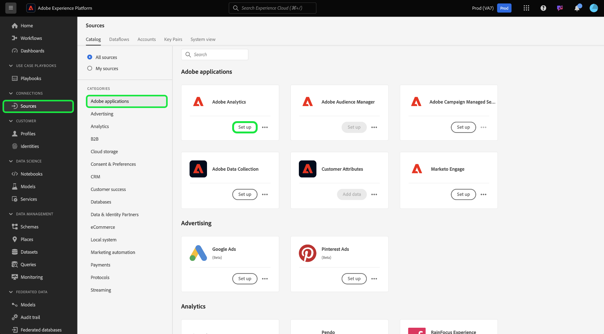

# Een Adobe Analytics-bronverbinding maken voor classificatiegegevens in de gebruikersinterface

>[!TIP]
>
>Standaard worden Adobe Analytics-classificatiegegevens wekelijks bijgewerkt. Gegevensinvoer voor uw classificatiegegevens wordt zeven dagen na de eerste configuratie van uw gegevensstroom verwerkt. De eerste lading neemt de volledige gegevens op en de volgende wekelijkse inname stelt stijgende gegevens in werking.

Lees deze zelfstudie voor stappen over hoe u uw Adobe Analytics-classificatiegegevens via de gebruikersinterface in Adobe Experience Platform kunt opnemen.

## Aan de slag

Deze zelfstudie vereist een goed begrip van de volgende onderdelen van Adobe Experience Platform:

* [[!DNL Experience Data Model (XDM)]  Systeem &#x200B;](../../../../../xdm/home.md): Het gestandaardiseerde kader waardoor Experience Platform gegevens van de klantenervaring organiseert.
* [[!DNL Real-Time Customer Profile]](../../../../../profile/home.md): biedt een uniform, real-time consumentenprofiel dat is gebaseerd op geaggregeerde gegevens van meerdere bronnen.
* [[!DNL Sandboxes]](../../../../../sandboxes/home.md): Experience Platform biedt virtuele sandboxen die één Experience Platform-instantie in afzonderlijke virtuele omgevingen verdelen om toepassingen voor digitale ervaringen te ontwikkelen en te ontwikkelen.

De bronconnector voor analytische classificaties vereist dat uw gegevens zijn gemigreerd naar de nieuwe classificatieinfrastructuur van Adobe Analytics voordat ze kunnen worden gebruikt. Neem contact op met uw Adobe-accountteam om de migratiestatus van uw gegevens te bevestigen.

## Uw classificaties selecteren

Selecteer in de gebruikersinterface van Experience Platform de optie **[!UICONTROL Sources]** in de linkernavigatie voor toegang tot de werkruimte van [!UICONTROL Sources] . U kunt de juiste categorie selecteren in de catalogus aan de linkerkant van het scherm. U kunt ook de specifieke bron vinden waarmee u wilt werken met de zoekoptie.

Onder de *de toepassingen van Adobe* categorie, selecteer **[!UICONTROL Adobe Analytics]**, en selecteer dan **[!UICONTROL Set up]**.

>[!TIP]
>
>Bronnen in de broncatalogus geven de optie **[!UICONTROL Set up]** weer als er geen geverifieerde account is. Als een account eenmaal is geverifieerd, verandert de optie in **[!UICONTROL Add data]** .

Selecteer vervolgens [!UICONTROL Classifications] en selecteer de gegevenssets voor classificaties die u aan Experience Platform wilt toevoegen. U kunt ook zoeken gebruiken om te filteren en te selecteren voor specifieke classificaties.

U kunt tot 30 verschillende classificatiedatasets selecteren om in Experience Platform te brengen. Alle gegevenssets die u selecteert, worden weergegeven in de rechterrail. Als u klaar bent, selecteert u [!UICONTROL Next] om door te gaan.

## Uw classificaties bekijken

De stap **[!UICONTROL Review]** verschijnt, die u toestaat om uw geselecteerde classificatiedatasets te herzien alvorens het wordt gecreeerd. De details worden gegroepeerd in de volgende categorieën:

* **[!UICONTROL Connection]**: geeft het bronplatform en de status van de verbinding weer.
* **[!UICONTROL Data type]** - Geeft het aantal geselecteerde classificaties weer.
* **[!UICONTROL Scheduling]**: geeft de synchronisatiefrequentie voor classificatiegegevens weer. **Nota**: De gegevens van classificaties worden bijgewerkt wekelijks.

Nadat u de gegevensstroom hebt gereviseerd, klikt u op **[!UICONTROL Finish]** en laat u enige tijd over tot de gegevensstroom.

## Volgende stappen

Door deze zelfstudie te volgen, hebt u een de classificatieconnector van Analytics gecreeerd die classificatiegegevens in Experience Platform brengt. Zie de volgende documenten voor meer informatie over [!DNL Analytics] en classificatiegegevens:

* [Overzicht van Adobe Analytics-bronconnector](../../../../connectors/adobe-applications/analytics.md)
* [Creeer een Analytics bronverbinding voor rapportgegevens in UI](./analytics.md)
* [&#x200B; Ongeveer classificaties &#x200B;](https://experienceleague.adobe.com/docs/analytics/components/classifications/c-classifications.html)
