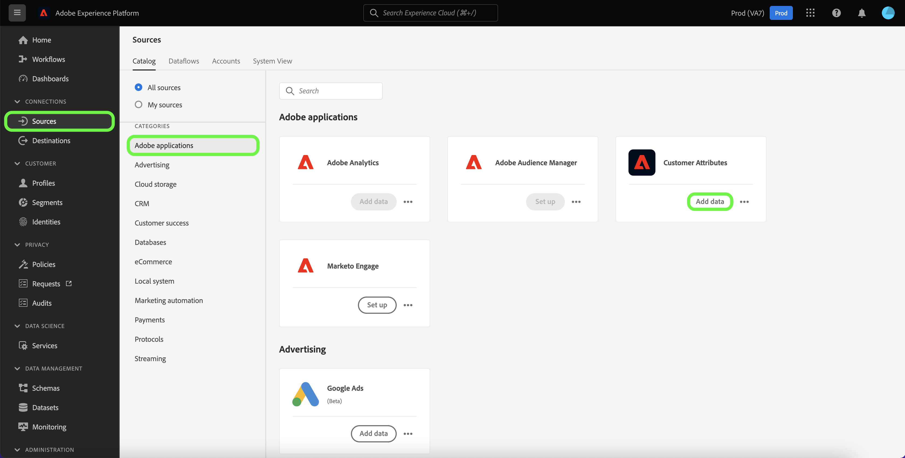
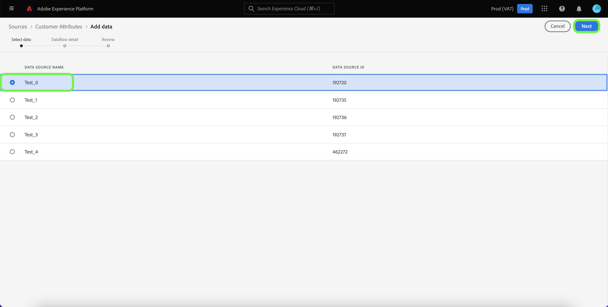

# Een bronverbinding voor klantkenmerken maken in de gebruikersinterface

Deze zelfstudie bevat stappen voor het maken van een bronverbinding in de gebruikersinterface voor het verzamelen van klantkenmerkprofielgegevens naar Adobe Experience Platform. Voor meer informatie over de Attributen van de Klant, zie [Overzicht van de Attributen van de Klant](https://experienceleague.adobe.com/docs/core-services/interface/customer-attributes/attributes.html).

>[!IMPORTANT]
>
>De functies voor het uitschakelen, inschakelen en verwijderen van gegevensstromen worden momenteel niet ondersteund voor de bron Klantkenmerken.

## Een bronverbinding maken

Selecteer **[!UICONTROL Sources]** in de gebruikersinterface van het Platform in de linkernavigatie om de werkruimte [!UICONTROL Sources] te openen. In het scherm [!UICONTROL Catalog] worden diverse bronnen weergegeven waarmee u een verbinding kunt maken.

U kunt de juiste categorie selecteren in de catalogus aan de linkerkant van het scherm. U kunt ook de specifieke bron vinden waarmee u wilt werken met de zoekbalk.

Selecteer [!UICONTROL Adobe applications] onder de categorie **[!UICONTROL Customer Attributes]** en selecteer **[!UICONTROL Add data]**.

>[!NOTE]
>
>Als u al een bronverbinding hebt gemaakt voor de profielgegevens van Klantkenmerken, is de optie om verbinding te maken met de bron uitgeschakeld.

In het scherm [!UICONTROL Add data] worden alle beschikbare gegevensbronnen voor Klantkenmerken weergegeven. Als u een nieuwe verbinding wilt maken, selecteert u een gegevensbron in de lijst en selecteert u **[!UICONTROL Next]**.

>[!NOTE]
>
>Er kan slechts één gegevensset worden geselecteerd per bronverbinding Klantkenmerken.

De stap [!UICONTROL Dataflow detail] wordt weergegeven, zodat u een naam kunt geven en een korte beschrijving kunt geven voor de nieuwe gegevensstroom.

Tijdens dit proces kunt u [!UICONTROL Partial ingestion] en [!UICONTROL Error diagnostics] ook inschakelen. [!UICONTROL Partial ingestion] biedt de mogelijkheid om gegevens met fouten in te voeren tot een bepaalde drempel die u kunt instellen, terwijl u details  [!UICONTROL Error diagnostics] opgeeft over onjuiste gegevens die afzonderlijk in een batch worden opgeslagen. Voor meer informatie, zie [gedeeltelijk partijingesinzicht overzicht](../../../../../ingestion/batch-ingestion/partial.md).

De stap [!UICONTROL Review] wordt weergegeven, zodat u de nieuwe gegevensstroom kunt controleren voordat deze wordt gemaakt. De details worden gegroepeerd in de volgende categorieën:

* **[!UICONTROL Connection]**: Toont het brontype, de relevante weg van het gekozen brondossier, en het aantal kolommen binnen dat brondossier.
* **[!UICONTROL Assign dataset & map fields]**: Toont welke dataset de brongegevens worden opgenomen in, met inbegrip van het schema dat de dataset zich aan houdt.

## Volgende stappen

Zodra de verbinding wordt gecreeerd, wordt een doelschema en een dataset automatisch gecreeerd om de inkomende gegevens te bevatten. Wanneer de eerste opname is voltooid, kunnen de profielgegevens van klantkenmerken worden gebruikt door downstreamservices voor Platforms zoals [!DNL Real-time Customer Profile] en [!DNL Segmentation Service]. Raadpleeg de volgende documenten voor meer informatie:

* [[!DNL Real-time Customer Profile] overzicht](../../../../../profile/home.md)
* [[!DNL Segmentation Service] overzicht](../../../../../segmentation/home.md)
