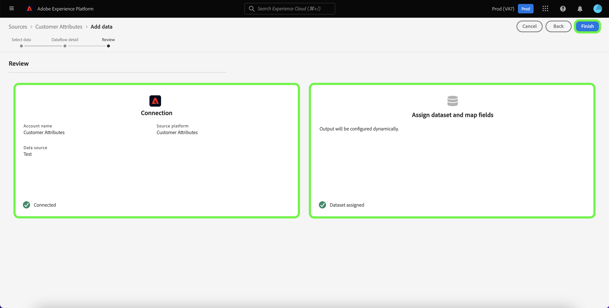

# Een bronverbinding voor klantkenmerken maken in de gebruikersinterface

Deze zelfstudie bevat stappen voor het maken van een bronverbinding in de gebruikersinterface om profielgegevens van klantkenmerken over te brengen naar Adobe Experience Platform. Voor meer informatie over de Attributen van de Klant, zie [Overzicht van klantkenmerken](https://experienceleague.adobe.com/docs/core-services/interface/customer-attributes/attributes.html).

>[!IMPORTANT]
>
>De bron Klantkenmerken ondersteunt momenteel niet het in- of uitschakelen van gegevensstromen.

## Een bronverbinding maken

>[!NOTE]
>
>Als u al een bronverbinding hebt gemaakt voor de profielgegevens van Klantkenmerken, is de optie om verbinding te maken met de bron uitgeschakeld.

Selecteer in de gebruikersinterface van het Platform de optie **[!UICONTROL Sources]** van de linkernavigatie om tot [!UICONTROL Sources] werkruimte. De [!UICONTROL Catalog] in het scherm worden diverse bronnen weergegeven waarmee u een verbinding kunt maken.

U kunt de juiste categorie selecteren in de catalogus aan de linkerkant van het scherm. U kunt ook de specifieke bron vinden waarmee u wilt werken met de zoekbalk.

Onder de [!UICONTROL Adobe applications] categorie, selecteert u **[!UICONTROL Customer Attributes]** en selecteer vervolgens **[!UICONTROL Add data]**.

### Gegevensbron van klantkenmerken selecteren

De [!UICONTROL Add data] het scherm maakt een lijst van alle beschikbare gegevensbronnen voor de Attributen van de Klant. Er kan slechts één gegevensset worden geselecteerd per bronverbinding Klantkenmerken.

>[!NOTE]
>
>De groepen van het gebied, de schema&#39;s, en de datasets worden gecreeerd uit-van-doos als deel van stroomlevering. Ze blijven ongewijzigd en u moet ze indien nodig handmatig verwijderen.

De evolutie van het schema wordt niet gesteund door de bron van klantenattributen. Als de schemainput van een klant gegevensbron van attributen wordt veranderd, dan zou het onverenigbaar met Platform worden. Als alternerende actie, kunt u een bestaande gegevensstroom van klantenattributen, samen met zijn bijbehorende dataset, schema, en gebiedsgroep schrappen, en dan nieuwe creëren met het bijgewerkte schema en de gegevensbron.

>[!IMPORTANT]
>
>Terwijl u een gegevens van klantenattributen kunt schrappen dataflow, zal zijn overeenkomstige dataset zelfs na schrapping van dataflow blijven. Zie de handleiding op [verwijderen, gegevensset](../../../../../catalog/datasets/user-guide.md) voor stappen op hoe te om een dataset manueel te schrappen.

Als u een nieuwe verbinding wilt maken, selecteert u een gegevensbron in de lijst en selecteert u **[!UICONTROL Next]**.

### Gegevens over gegevensstroom opgeven

De [!UICONTROL Dataflow detail] wordt weergegeven, zodat u een naam en een korte beschrijving voor de gegevensstroom kunt opgeven. Tijdens dit proces kunt u ook instellingen configureren voor [!UICONTROL Error diagnostics], [!UICONTROL Partial ingestion], en [!UICONTROL Alerts].

[!UICONTROL Error diagnostics] laat gedetailleerde foutenmelding generatie voor om het even welke onjuiste verslagen toe die in uw dataflow voorkomen, terwijl [!UICONTROL Partial ingestion] kunt u gegevens met fouten opnemen tot een bepaalde drempel die u handmatig definieert. Zie de [gedeeltelijke batch-opname, overzicht](../../../../../ingestion/batch-ingestion/partial.md) voor meer informatie .

U kunt waarschuwingen inschakelen om meldingen te ontvangen over de status van uw gegevensstroom. Selecteer een waarschuwing in de lijst om u te abonneren op meldingen over de status van uw gegevensstroom. Voor meer informatie over waarschuwingen raadpleegt u de handleiding over [abonneren op berichten voor bronnen met behulp van de gebruikersinterface](../../alerts.md).

Wanneer u klaar bent met het opgeven van details voor uw gegevensstroom, selecteert u **[!UICONTROL Next]**.

### Gegevensstroom controleren

De [!UICONTROL Review] wordt weergegeven, zodat u de nieuwe gegevensstroom kunt controleren voordat deze wordt gemaakt. De details worden gegroepeerd in de volgende categorieën:

* **[!UICONTROL Connection]**: Toont het brontype, de relevante weg van het gekozen brondossier, en het aantal kolommen binnen dat brondossier.
* **[!UICONTROL Assign dataset & map fields]**: Toont welke dataset de brongegevens worden opgenomen in, met inbegrip van het schema dat de dataset zich aan houdt.

## Volgende stappen

Zodra de verbinding wordt gecreeerd, wordt een doelschema en een dataset automatisch gecreeerd om de inkomende gegevens te bevatten. Wanneer de aanvankelijke opname voltooit, kunnen de gegevens van het klantenkenmerkprofiel door de stroomafwaartse diensten van het Platform zoals worden gebruikt [!DNL Real-time Customer Profile] en [!DNL Segmentation Service]. Raadpleeg de volgende documenten voor meer informatie:

* [[!DNL Real-time Customer Profile] - overzicht](../../../../../profile/home.md)
* [[!DNL Segmentation Service] - overzicht](../../../../../segmentation/home.md)
