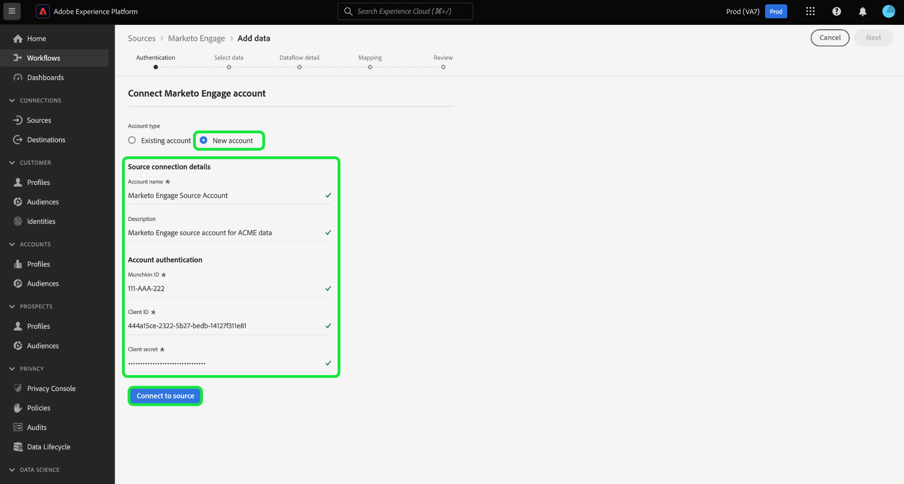
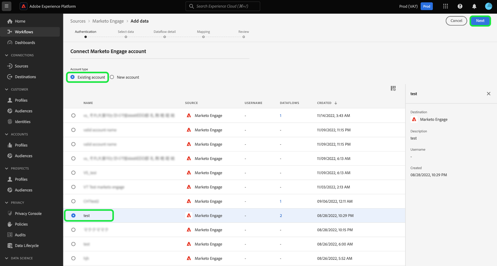
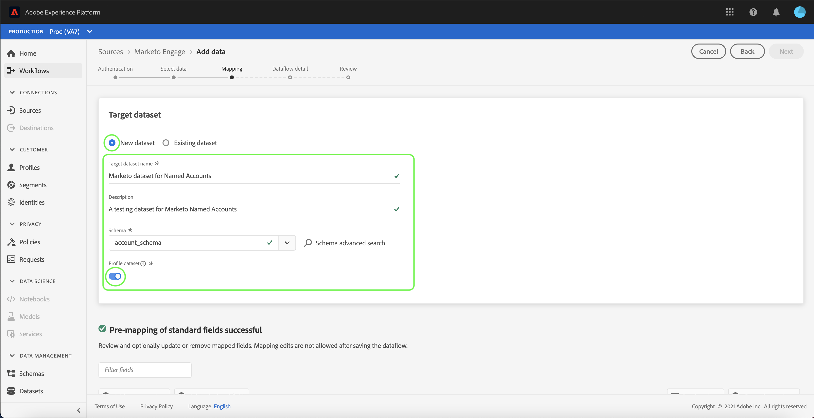

# (Bèta) creeer een [!DNL Marketo Engage] bronschakelaar in UI

>[!IMPORTANT]
>
>De bron [!DNL Marketo Engage] bevindt zich momenteel in bèta. Het kenmerk en de documentatie worden gewijzigd door het onderwerp. Bovendien moet u ervoor zorgen dat u een niet-productiesandbox wanneer het gebruiken van de schakelaar tijdens het bètaprogramma gebruikt. Raadpleeg de [Sandboxdocumentatie](https://experienceleague.adobe.com/docs/experience-platform/sandbox/home.html?lang=en#understanding-sandboxes) voor meer informatie over sandboxen.

Deze zelfstudie biedt stappen voor het maken van een [!DNL Marketo Engage]-bronconnector (hierna &quot;[!DNL Marketo]&quot; genoemd) in de gebruikersinterface om consumentengegevens naar Adobe Experience Platform te brengen.

## Aan de slag

Deze zelfstudie vereist een goed begrip van de volgende onderdelen van Adobe Experience Platform:

* [Bronnen](../../../../home.md): Met Experience Platform kunnen gegevens uit verschillende bronnen worden ingepakt en kunt u inkomende gegevens structureren, labelen en verbeteren met behulp van de services van Platforms.
* [XDM (Experience Data Model)](../../../../../xdm/home.md): Het gestandaardiseerde kader waardoor het Experience Platform gegevens van de klantenervaring organiseert.
   * [Schema&#39;s maken en bewerken in de gebruikersinterface](../../../../../xdm/ui/resources/schemas.md): Leer om schema&#39;s in UI tot stand te brengen en uit te geven.
* [Naamruimten](../../../../../identity-service/namespaces.md) van identiteit: Identiteitsnaamruimten zijn een component van  [!DNL Identity Service] die dienen als indicatoren van de context waarop een identiteit betrekking heeft. Een volledig gekwalificeerde identiteit omvat een waarde van identiteitskaart en een namespace.
* [[!DNL Real-time Customer Profile]](../../../../../profile/home.md): Verstrekt een verenigd, real-time consumentenprofiel dat op bijeengevoegde gegevens van veelvoudige bronnen wordt gebaseerd.
* [Sandboxen](../../../../../sandboxes/home.md): Experience Platform biedt virtuele sandboxen die één Platform-instantie in afzonderlijke virtuele omgevingen verdelen om toepassingen voor digitale ervaringen te ontwikkelen en te ontwikkelen.

### Vereiste referenties verzamelen

Als u toegang wilt krijgen tot uw [!DNL Marketo]-account op Platform, moet u de volgende waarden opgeven:

| Credentials | Beschrijving |
| ---------- | ----------- |
| `munchkinId` | De Munchkin-id is de unieke id voor een specifieke [!DNL Marketo]-instantie. |
| `clientId` | De unieke client-id van uw [!DNL Marketo]-exemplaar. |
| `clientSecret` | Het unieke clientgeheim van uw [!DNL Marketo]-instantie. |

Raadpleeg de [[!DNL Marketo] verificatiegids](../../../../connectors/adobe-applications/marketo/marketo-auth.md) voor meer informatie over het ophalen van deze waarden.

Nadat u de vereiste gegevens hebt verzameld, kunt u de stappen in de volgende sectie volgen.

## Uw [!DNL Marketo]-account aansluiten

Selecteer **[!UICONTROL Sources]** in de gebruikersinterface van het Platform in de linkernavigatiebalk voor toegang tot de werkruimte [!UICONTROL Sources]. In het scherm [!UICONTROL Catalog] worden diverse bronnen weergegeven waarmee u een account kunt maken.

U kunt de juiste categorie selecteren in de catalogus aan de linkerkant van het scherm. U kunt ook de specifieke bron vinden waarmee u wilt werken met de zoekbalk.

Selecteer **[!UICONTROL Marketo Engage]** onder de categorie [!UICONTROL Adobe applications]. Selecteer vervolgens **[!UICONTROL Add data]** om een nieuwe [!DNL Marketo]-gegevensstroom te maken.

De pagina **[!UICONTROL Connect to Marketo Engage]** wordt weergegeven. Op deze pagina kunt u een nieuw account gebruiken of een bestaand account openen.

### Nieuwe account

Als u een nieuwe account maakt, selecteert u **[!UICONTROL New account]**. Geef op het invoerformulier dat wordt weergegeven een accountnaam, een optionele beschrijving en uw [!DNL Marketo] verificatiegegevens op. Wanneer gebeëindigd, selecteer **[!UICONTROL Connect to source]** en laat dan wat tijd voor de nieuwe verbinding toe om te vestigen.

### Bestaande account

Als u een gegevensstroom met een bestaande account wilt maken, selecteert u **[!UICONTROL Existing account]** en selecteert u vervolgens de [!DNL Marketo]-account die u wilt gebruiken. Selecteer **[!UICONTROL Next]** om door te gaan.

## Een gegevensset selecteren

Na het creëren van uw [!DNL Marketo] rekening, verstrekt de volgende stap een interface voor u om [!DNL Marketo] datasets te onderzoeken.

De linkerhelft van de interface is een folderbrowser, die 10 [!DNL Marketo] datasets toont. Voor een volledig functionerende [!DNL Marketo]-bronverbinding is de opname van de negen verschillende gegevenssets vereist. Als u ook [!DNL Marketo's] account-based marketing (ABM) eigenschap gebruikt, dan moet u een tiende dataflow ook creëren om [!UICONTROL Named Accounts] dataset in te voeren.

>[!NOTE]
>
>Voor de beknoptheid wordt in de volgende zelfstudie [!UICONTROL Named Acccounts] als voorbeeld gebruikt, maar de onderstaande stappen zijn van toepassing op alle 10 [!DNL Marketo]-gegevenssets.

Selecteer eerst de gegevensset die u wilt invoeren en selecteer vervolgens **[!UICONTROL Next]**.

## Gegevensvelden toewijzen aan een XDM-schema

De [!UICONTROL Mapping] stap verschijnt, die een interface verstrekken om de [!DNL Marketo] dataset aan een dataset van het Platform in kaart te brengen.

Kies een dataset voor binnenkomende gegevens waarin moeten worden opgenomen. U kunt of een bestaande dataset gebruiken of een nieuwe dataset tot stand brengen.

### Een bestaande gegevensset gebruiken

Om gegevens in een bestaande dataset in te voeren, selecteer **[!UICONTROL Use existing dataset]**, dan het datasetpictogram.

Het dialoogvenster **[!UICONTROL Select dataset]** wordt weergegeven. Zoek de dataset met het aangewezen schema u wenst te gebruiken, het te selecteren, dan **[!UICONTROL Confirm]** te selecteren.

### Een nieuwe gegevensset gebruiken

Om gegevens in een nieuwe dataset in te voeren, selecteer **[!UICONTROL Create new dataset]** en ga een naam en een beschrijving voor de dataset op de verstrekte gebieden in.

U kunt naar een schema zoeken door zijn naam in **[!UICONTROL Select schema]** onderzoeksbar in te gaan. U kunt ook het vervolgkeuzepictogram selecteren om een lijst met bestaande schema&#39;s weer te geven. U kunt ook **[!UICONTROL Advanced search]** selecteren om toegang te krijgen tot een pagina met bestaande schema&#39;s, inclusief de respectievelijke details.

Schakel de knop **[!UICONTROL Profile dataset]** in of uit om uw doelgegevensset in te schakelen voor [!DNL Profile], zodat u een holistische weergave van de kenmerken en het gedrag van een entiteit kunt maken. Gegevens van alle [!DNL Profile]-ingeschakelde datasets worden opgenomen in [!DNL Profile] en wijzigingen worden toegepast wanneer u uw gegevensstroom opslaat.

Nadat u een schema hebt geselecteerd, schuift u omlaag om het toewijzingsdialoogvenster weer te geven en de [!DNL Marketo]-gegevenssetvelden toe te wijzen aan hun juiste doel-XDM-velden.

### Uw [!DNL Marketo] gegevenssetbronvelden toewijzen aan doel-XDM-velden

Elke [!DNL Marketo] dataset heeft zijn eigen specifieke kaartregels om te volgen. Zie het volgende voor meer informatie over hoe te om [!DNL Marketo] datasets aan XDM in kaart te brengen:

* [Activiteiten](../../../../connectors/adobe-applications/mapping/marketo.md#activities)
* [Programma&#39;s](../../../../connectors/adobe-applications/mapping/marketo.md#programs)
* [Lidmaatschap van programma](../../../../connectors/adobe-applications/mapping/marketo.md#program-memberships)
* [Bedrijven](../../../../connectors/adobe-applications/mapping/marketo.md#companies)
* [Statische lijsten](../../../../connectors/adobe-applications/mapping/marketo.md#static-lists)
* [Statische lijstlidmaatschap](../../../../connectors/adobe-applications/mapping/marketo.md#static-list-memberships)
* [Benoemde accounts](../../../../connectors/adobe-applications/mapping/marketo.md#named-accounts)
* [Kansen](../../../../connectors/adobe-applications/mapping/marketo.md#opportunities)
* [Contactrollen opportunity](../../../../connectors/adobe-applications/mapping/marketo.md#opportunity-contact-roles)
* [Personen](../../../../connectors/adobe-applications/mapping/marketo.md#persons)

Selecteer **[!UICONTROL Preview data]** om toewijzingsresultaten te zien die op uw geselecteerde dataset worden gebaseerd.

De [!UICONTROL Preview] popover verstrekt u een interface om afbeeldingsresultaten van maximaal 100 rijen steekproefgegevens van de geselecteerde dataset te onderzoeken.

Wanneer de bronvelden zijn toegewezen aan de desbetreffende doelvelden, selecteert u **[!UICONTROL Close]**.

## Gegevens over gegevensstroom opgeven

De stap [!UICONTROL Dataflow detail] verschijnt, die u toestaat om een naam en een korte beschrijving over uw nieuwe gegevensstroom te verstrekken.

Schakel de schakeloptie **[!UICONTROL Error diagnostics]** in om gedetailleerde foutberichten te genereren voor nieuw opgenomen batches, die u kunt downloaden met de API.

De [!DNL Marketo] schakelaar gebruikt partijingestie om alle historische verslagen in te gaan en gebruikt het stromen ingestie voor updates in real time. Hierdoor kan de connector doorgaan met streamen terwijl onjuiste records worden ingeslikt. Schakel de schakeloptie **[!UICONTROL Partial ingestion]** in en stel [!UICONTROL Error threshold %] in op maximaal om te voorkomen dat de gegevensstroom mislukt.

**[!UICONTROL Partial ingestion]** biedt de mogelijkheid om gegevens met fouten tot een bepaalde drempel in te voeren. Voor meer informatie, zie [gedeeltelijk partijingesinzicht overzicht](../../../../../ingestion/batch-ingestion/partial.md).

Nadat u de gegevens hebt ingevoerd en de foutdrempel hebt ingesteld op max., selecteert u **[!UICONTROL Next]**.

## Controleer uw gegevensstroom

De stap **[!UICONTROL Review]** wordt weergegeven, zodat u de nieuwe gegevensstroom kunt controleren voordat deze wordt gemaakt. De details worden gegroepeerd in de volgende categorieën:

* **[!UICONTROL Connection]**: Toont het brontype, de relevante weg van het gekozen brondossier, en de hoeveelheid kolommen binnen dat brondossier.
* **[!UICONTROL Assign dataset & map fields]**: Toont welke dataset de brongegevens worden opgenomen in, met inbegrip van het schema dat de dataset zich aan houdt.

Nadat u de gegevensstroom hebt gereviseerd, selecteert u **[!UICONTROL Finish]** en laat u enige tijd over om de gegevensstroom te maken.

## Uw gegevensstroom controleren

Zodra uw gegevensstroom is gecreeerd, kunt u de gegevens controleren die door het worden opgenomen om informatie over innamepercentages, succes, en fouten te zien. Voor meer informatie over hoe te om dataflows te controleren, zie de zelfstudie over [controledataflows in UI](../../../../../dataflows/ui/monitor-sources.md).

## Uw kenmerken verwijderen

Aangepaste kenmerken in gegevenssets kunnen niet retroactief worden verborgen of verwijderd. Als u een douaneattribuut van een bestaande dataset wilt verbergen of verwijderen, dan moet u een nieuwe dataset zonder dit douaneattribuut, een nieuw schema XDM tot stand brengen, en een nieuwe dataflow voor de nieuwe dataset vormen die u creeert. U moet de originele dataflow ook onbruikbaar maken of schrappen die uit de dataset met de douaneattributen bestaat u wilt verbergen of verwijderen.

## Uw gegevensstroom verwijderen

U kunt gegevensstromen schrappen die niet meer noodzakelijk of verkeerd gecreeerd gebruikend de functie **[!UICONTROL Delete]** beschikbaar in de [!UICONTROL Dataflows] werkruimte zijn. Voor meer informatie over hoe te om dataflows te schrappen, zie de zelfstudie over [het schrappen van gegevensstromen in UI](../../delete.md).

## Volgende stappen

Door deze zelfstudie te volgen, hebt u met succes een dataflow gemaakt om [!DNL Marketo] gegevens in te brengen. Binnenkomende gegevens kunnen nu worden gebruikt door downstreamservices voor Platforms zoals [!DNL Real-time Customer Profile] en [!DNL Data Science Workspace]. Raadpleeg de volgende documenten voor meer informatie:

* [[!DNL Real-time Customer Profile] overzicht](../../../../profile/home.md)
* [[!DNL Data Science Workspace] overzicht](../../../../data-science-workspace/home.md)
