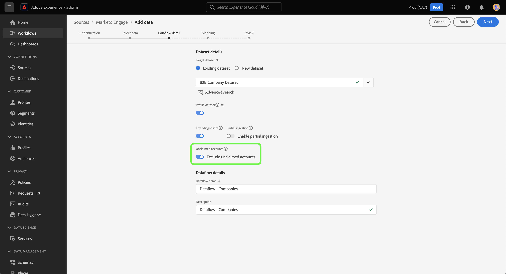

# Een [!DNL Marketo Engage] bronverbinding en gegevensstroom maken in de gebruikersinterface

>[!IMPORTANT]
>
>Alvorens een [!DNL Marketo Engage] bronverbinding en een dataflow te creëren, moet u eerst ervoor zorgen dat u [ uw identiteitskaart van de Organisatie van de Adobe ](https://experienceleague.adobe.com/docs/marketo/using/product-docs/core-marketo-concepts/miscellaneous/set-up-adobe-organization-mapping.html) in kaart hebt gebracht in [!DNL Marketo]. Voorts moet u ook verzekeren dat u [ auto-bevolkt uw  [!DNL Marketo]  B2B namespaces en schema&#39;s ](../../../../connectors/adobe-applications/marketo/marketo-namespaces.md) voorafgaand aan het creëren van een bronverbinding en een dataflow hebt voltooid.

Deze zelfstudie biedt stappen voor het maken van een [!DNL Marketo Engage] (hierna &quot;[!DNL Marketo]&quot; genoemd) bronconnector in de UI om B2B-gegevens naar Adobe Experience Platform te brengen.

## Aan de slag

Deze zelfstudie vereist een goed begrip van de volgende onderdelen van Adobe Experience Platform:

* [ B2B namespaces en schema auto-generatienut ](../../../../connectors/adobe-applications/marketo/marketo-namespaces.md): Het B2B namespaces en schema auto-generatienut staat u toe om [!DNL Postman] te gebruiken om waarden voor uw B2B namespaces en schema&#39;s auto-produceren. U moet eerst de B2B-naamruimten en -schema&#39;s voltooien voordat u een [!DNL Marketo] -bronverbinding en -gegevensstroom maakt.
* [ Bronnen ](../../../../home.md): Experience Platform staat gegevens toe om van diverse bronnen worden opgenomen terwijl het voorzien van u van de capaciteit om, inkomende gegevens te structureren te etiketteren en te verbeteren gebruikend de diensten van het Platform.
* [ Model van de Gegevens van de Ervaring (XDM) ](../../../../../xdm/home.md): Het gestandaardiseerde kader waardoor het Experience Platform gegevens van de klantenervaring organiseert.
   * [ creeer en geef schema&#39;s in UI ](../../../../../xdm/ui/resources/schemas.md) uit: Leer hoe te om schema&#39;s in UI tot stand te brengen en uit te geven.
* [ Identiteitsnaamruimten ](../../../../../identity-service/features/namespaces.md): Identiteitsnaamruimten zijn een component van [!DNL Identity Service] die als indicatoren van de context dienen waarop een identiteit betrekking heeft. Een volledig gekwalificeerde identiteit omvat een waarde van identiteitskaart en een namespace.
* [[!DNL Real-Time Customer Profile]](/help/profile/home.md): biedt een uniform, real-time consumentenprofiel dat is gebaseerd op geaggregeerde gegevens van meerdere bronnen.
* [ Sandboxes ](../../../../../sandboxes/home.md): Experience Platform verstrekt virtuele zandbakken die één enkele instantie van het Platform in afzonderlijke virtuele milieu&#39;s verdelen helpen digitale ervaringstoepassingen ontwikkelen en ontwikkelen.

### Vereiste referenties verzamelen

Als u toegang wilt krijgen tot uw [!DNL Marketo] -account op Experience Platform, moet u de volgende waarden opgeven:

| Credentials | Beschrijving |
| ---- | ---- |
| `munchkinId` | De Munchkin-id is de unieke id voor een specifieke [!DNL Marketo] -instantie. |
| `clientId` | De unieke client-id van uw [!DNL Marketo] -instantie. |
| `clientSecret` | Het unieke clientgeheim van uw [!DNL Marketo] -instantie. |

Voor meer informatie bij het verwerven van deze waarden, verwijs naar de [[!DNL Marketo]  authentificatiegids ](../../../../connectors/adobe-applications/marketo/marketo-auth.md).

Nadat u de vereiste gegevens hebt verzameld, kunt u de stappen in de volgende sectie volgen.

## Sluit uw [!DNL Marketo] -account aan

Selecteer in de gebruikersinterface van het platform de optie **[!UICONTROL Sources]** in de linkernavigatie voor toegang tot de werkruimte van [!UICONTROL Sources] . U kunt de juiste categorie selecteren in de catalogus aan de linkerkant van het scherm. U kunt ook de specifieke bron vinden waarmee u wilt werken met de zoekoptie.

Onder de *categorie van de Adobe 0} toepassingen {, selecteer **[!UICONTROL Marketo Engage]**, en selecteer dan **[!UICONTROL Add data]**.*

>[!TIP]
>
>Bronnen in de catalogus met bronnen geven de optie **[!UICONTROL Set up]** weer wanneer een bepaalde bron nog geen geverifieerde account heeft. Zodra een geverifieerd account bestaat, verandert deze optie in **[!UICONTROL Add data]** .

De pagina **[!UICONTROL Connect Marketo Engage account]** wordt weergegeven. Op deze pagina kunt u een nieuw account gebruiken of een bestaand account openen.

>[!BEGINTABS]

>[!TAB  creeer een nieuwe rekening ]

Als u een nieuwe account wilt maken, selecteert u **[!UICONTROL New account]** en geeft u een naam, een optionele beschrijving en uw referenties op.

Als u klaar bent, selecteert u **[!UICONTROL Connect to source]** en laat u de nieuwe verbinding enige tijd tot stand brengen.

>[!TAB  Gebruik een bestaande rekening ]

Als u een bestaande account wilt gebruiken, selecteert u **[!UICONTROL Existing account]** en selecteert u vervolgens de account die u wilt gebruiken in de bestaande accountcatalogus.

Selecteer **[!UICONTROL Next]** om door te gaan.

>[!ENDTABS]

## Een gegevensset selecteren

Nadat u uw [!DNL Marketo] -account hebt gemaakt, biedt de volgende stap een interface waarmee u [!DNL Marketo] -gegevenssets kunt verkennen.

De linkerhelft van de interface is een directorybrowser waarin de 10 [!DNL Marketo] datasets worden weergegeven. Een volledig functionerende [!DNL Marketo] bronverbinding vereist de opname van de negen verschillende datasets. Als u ook de functie [!DNL Marketo] account-based marketing (ABM) gebruikt, moet u ook een tiende gegevensstroom maken om de [!UICONTROL Named Accounts] dataset in te voeren.

>[!NOTE]
>
>Voor de beknoptheid wordt in de volgende zelfstudie [!UICONTROL Opportunities] als voorbeeld gebruikt, maar de onderstaande stappen zijn van toepassing op alle 10 [!DNL Marketo] -gegevenssets.

Selecteer de dataset die u wilt opnemen. Dit werkt de interface bij om een voorproef van uw dataset te tonen. Selecteer **[!UICONTROL Next]** als u klaar bent.

## Gegevensset en gegevens over gegevensstroom opgeven {#provide-dataset-and-dataflow-details}

Daarna, moet u informatie over uw dataset en uw gegevensstroom verstrekken.

### Gegevens over gegevensset {#dataset-details}

Een dataset is een opslag en beheersconstructie voor een inzameling van gegevens, typisch een lijst, die een schema (kolommen) en gebieden (rijen) bevat. De gegevens die met succes in Experience Platform worden opgenomen worden opgeslagen binnen het gegevensmeer als datasets. Tijdens deze stap, kunt u een nieuwe dataset tot stand brengen of een bestaande dataset gebruiken.

>[!BEGINTABS]

>[!TAB  Gebruik een nieuwe dataset ]

Als u een nieuwe gegevensset wilt gebruiken, selecteert u **[!UICONTROL New dataset]** en geeft u een naam en een optionele beschrijving voor de gegevensset op. U moet ook een schema van het Model van de Gegevens van de Ervaring (XDM) selecteren dat uw dataset volgt aan.

>[!TAB  Gebruik een bestaande dataset ]

Als u al een bestaande dataset hebt, selecteert u **[!UICONTROL Existing dataset]** en gebruikt u vervolgens de optie **[!UICONTROL Advanced search]** om een venster weer te geven met alle datasets in uw organisatie, inclusief de respectievelijke details, zoals of deze zijn ingeschakeld voor opname in het realtime-klantprofiel.

>[!ENDTABS]

### Dataflow-configuraties {#dataflow-configurations}

>[!IMPORTANT]
>
>De bron [!DNL Marketo] gebruikt batch-opname om alle historische records in te voeren en gebruikt streaming opname voor realtime updates. Hierdoor kan de bron doorgaan met streamen terwijl onjuiste records worden ingeslikt. Schakel de **[!UICONTROL Partial ingestion]** -schakeloptie in en stel de [!UICONTROL Error threshold %] in op maximaal om te voorkomen dat de gegevensstroom mislukt.

Als uw dataset voor het Profiel van de Klant in real time wordt toegelaten, dan tijdens deze stap, kunt u **[!UICONTROL Profile dataset]** van een knevel voorzien om uw gegevens voor Profiel-opname toe te laten. U kunt deze stap ook gebruiken om **[!UICONTROL Error diagnostics]** en **[!UICONTROL Partial ingestion]** in te schakelen.

* **[!UICONTROL Error diagnostics]**: Selecteer **[!UICONTROL Error diagnostics]** om de bron de instructie te geven foutdiagnostiek te produceren waarnaar u later kunt verwijzen bij het controleren van de gegevenssetactiviteit en de status van de gegevensstroom.
* **[!UICONTROL Partial ingestion]**: [ Gedeeltelijke partijingestie ](../../../../../ingestion/batch-ingestion/partial.md) is de capaciteit om gegevens in te voeren die fouten bevatten, tot een bepaalde configureerbare drempel. Met deze functie kunt u al uw nauwkeurige gegevens in het Experience Platform opnemen, terwijl al uw onjuiste gegevens afzonderlijk worden opgeslagen met informatie over waarom deze niet geldig zijn.

Tijdens deze stap kunt u **[!UICONTROL Sample dataflow]** in staat stellen de gegevensinvoer te beperken en extra kosten te vermijden die gepaard gaan met het opnemen van alle historische gegevens, waaronder persoonlijke identiteiten.

>[!BEGINSHADEBOX]

**Snelle gids bij het gebruiken van steekproefgegevens**

Voorbeeldgegevensstroom is een configuratie die u voor uw [!DNL Marketo] gegevensstroom kunt instellen om de opnamesnelheid te beperken en vervolgens de functies van het Experience Platform uit te proberen zonder dat u grote hoeveelheden gegevens hoeft in te voeren.

* Schakel voorbeeldgegevensstroom in om historische gegevens te beperken door maximaal 100 k (van de grootste record-id) records op te nemen of tot de laatste 10 dagen van activiteit tijdens de back-uptaak.
* Wanneer het gebruiken van de configuratie van de steekproefgegevens voor alle B2B entiteiten, moet u in overweging nemen dat het mogelijk is dat sommige verwante verslagen kunnen ontbreken omdat de volledige geschiedenis van de brongegevens niet wordt opgenomen.

>[!ENDSHADEBOX]

Als u bovendien gegevens uit de bedrijfsgegevens opneemt, kunt u **[!UICONTROL Exclude unclaimed accounts]** inschakelen om niet-geclaimde accounts uit te sluiten van inname.

Wanneer individuen een formulier invullen, maakt [!DNL Marketo] een fantoomaccountrecord op basis van de bedrijfsnaam die geen andere gegevens bevat. Voor nieuwe gegevensstromen, wordt de knevel om niet geclaimde rekeningen uit te sluiten toegelaten door gebrek. Voor bestaande gegevensstromen, kunt u de eigenschap toelaten of onbruikbaar maken, met veranderingen die op nieuw opgenomen gegevens en niet bestaande gegevens van toepassing zijn.

 uit

## Wijs uw [!DNL Marketo] gegevenssetbronvelden toe aan doel-XDM-velden

De stap [!UICONTROL Mapping] verschijnt, die u van een interface voorziet om de brongebieden van uw bronschema aan hun aangewezen doelXDM gebieden in het doelschema in kaart te brengen.

Elke [!DNL Marketo] dataset heeft zijn eigen specifieke in kaart te brengen regels om te volgen. Zie het volgende voor meer informatie over hoe u [!DNL Marketo] datasets aan XDM in kaart brengt:

* [Activiteiten](../../../../connectors/adobe-applications/mapping/marketo.md#activities)
* [Programma&#39;s](../../../../connectors/adobe-applications/mapping/marketo.md#programs)
* [Lidmaatschap van programma](../../../../connectors/adobe-applications/mapping/marketo.md#program-memberships)
* [Bedrijven](../../../../connectors/adobe-applications/mapping/marketo.md#companies)
* [Statische lijsten](../../../../connectors/adobe-applications/mapping/marketo.md#static-lists)
* [Statische lijstlidmaatschappen](../../../../connectors/adobe-applications/mapping/marketo.md#static-list-memberships)
* [Benoemde accounts](../../../../connectors/adobe-applications/mapping/marketo.md#named-accounts)
* [Kansen](../../../../connectors/adobe-applications/mapping/marketo.md#opportunities)
* [Contactrollen opportunity](../../../../connectors/adobe-applications/mapping/marketo.md#opportunity-contact-roles)
* [Personen](../../../../connectors/adobe-applications/mapping/marketo.md#persons)

Op basis van uw behoeften kunt u ervoor kiezen om velden rechtstreeks toe te wijzen of gegevens prep-functies te gebruiken om brongegevens om berekende of berekende waarden af te leiden. Voor uitvoerige stappen bij het gebruiken van de kaartinterface, zie de [ gids UI van de Prep van Gegevens ](../../../../../data-prep/ui/mapping.md).

Als uw sets met toewijzingen gereed zijn, selecteert u **[!UICONTROL Next]** en laat u enkele ogenblikken de nieuwe gegevensstroom toe.

## Controleer uw gegevensstroom

De stap **[!UICONTROL Review]** wordt weergegeven, zodat u de nieuwe gegevensstroom kunt bekijken voordat deze wordt gemaakt. De details worden gegroepeerd in de volgende categorieën:

* **[!UICONTROL Connection]**: geeft het brontype, het relevante pad van de gekozen bronentiteit en de hoeveelheid kolommen in die bronentiteit weer.
* **[!UICONTROL Assign dataset & map fields]**: Toont welke dataset de brongegevens worden opgenomen in, met inbegrip van het schema dat de dataset volgt aan.

Nadat u de gegevensstroom hebt gereviseerd, selecteert u **[!UICONTROL Save & ingest]** en laat u enige tijd over om de gegevensstroom te maken.

## Uw gegevensstroom controleren

Zodra uw gegevensstroom is gecreeerd, kunt u de gegevens controleren die door het worden opgenomen om informatie over innamepercentages, succes, en fouten te zien. Voor meer informatie over hoe te om dataflows te controleren, zie het leerprogramma op [ controledataflows in UI ](../../../../../dataflows/ui/monitor-sources.md).

## Uw kenmerken verwijderen

Aangepaste kenmerken in gegevenssets kunnen niet retroactief worden verborgen of verwijderd. Als u een douaneattribuut van een bestaande dataset wilt verbergen of verwijderen, dan moet u een nieuwe dataset zonder dit douaneattribuut, een nieuw schema XDM tot stand brengen, en een nieuwe dataflow voor de nieuwe dataset vormen die u creeert. U moet de originele dataflow ook onbruikbaar maken of schrappen die uit de dataset met de douanekenmerken bestaat u wilt verbergen of verwijderen.

## Uw gegevensstroom verwijderen

U kunt gegevensstromen verwijderen die niet meer nodig zijn of die onjuist zijn gemaakt met de functie **[!UICONTROL Delete]** die beschikbaar is in de [!UICONTROL Dataflows] -werkruimte. Voor meer informatie over hoe te om dataflows te schrappen, zie het leerprogramma bij [ het schrappen van dataflows in UI ](../../delete.md).

## Volgende stappen

Aan de hand van deze zelfstudie hebt u een gegevensstroom gemaakt voor het invoeren van B2B-gegevens van uw [!DNL Marketo Engage] -bron naar Experience Platform.

## Bijlage {#appendix}

De volgende secties bevatten aanvullende richtlijnen die u kunt volgen wanneer u de [!DNL Marketo] -bron gebruikt.

### Foutberichten in de gebruikersinterface {#error-messages}

De volgende foutberichten worden weergegeven in de gebruikersinterface wanneer Platform problemen detecteert met uw installatie:

#### [!DNL Munchkin ID] is niet toegewezen aan de juiste organisatie

De verificatie wordt geweigerd als de [!DNL Munchkin ID] niet is toegewezen aan de organisatie Platform die u gebruikt. Vorm de afbeelding tussen uw [!DNL Munchkin ID] en uw organisatie gebruikend de [[!DNL Marketo]  interface ](https://app-sjint.marketo.com/#MM0A1).

#### Primaire identiteit ontbreekt

Een dataflow kan niet worden opgeslagen en opgenomen als een primaire identiteit ontbreekt. Zorg ervoor dat [ een primaire identiteit binnen uw schema XDM ](../../../../../xdm/tutorials/create-schema-ui.md) bestaat, alvorens te proberen om een dataflow te vormen.

