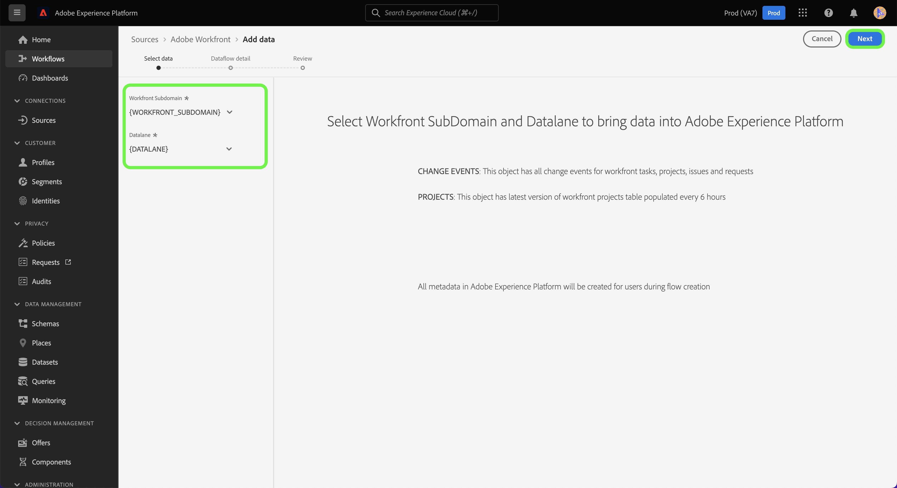

# Een Adobe Workfront-bronverbinding maken in de gebruikersinterface

Deze zelfstudie bevat stappen voor het maken van een Adobe Workfront-bronverbinding waarmee uw Workfront-gegevens via de gebruikersinterface naar Adobe Experience Platform worden overgebracht.

## Aan de slag

>[!IMPORTANT]
>
>U moet als beheerder in de Adobe Admin Console worden gevormd om tot de bron van Workfront toegang te hebben.

Deze zelfstudie vereist een goed begrip van de volgende onderdelen van het Experience Platform:

* [XDM-systeem (Experience Data Model)](../../../../../xdm/home.md): Het gestandaardiseerde kader waardoor het Experience Platform gegevens van de klantenervaring organiseert.
* [Klantprofiel in realtime](../../../../../profile/home.md): Verstrekt een verenigd, real-time consumentenprofiel dat op bijeengevoegde gegevens van veelvoudige bronnen wordt gebaseerd.
* [Sandboxen](../../../../../sandboxes/home.md): Experience Platform biedt virtuele sandboxen die één Platform-instantie in afzonderlijke virtuele omgevingen verdelen om toepassingen voor digitale ervaringen te ontwikkelen en te ontwikkelen.

## Een Workfront-bronverbinding maken in de gebruikersinterface

Selecteer in de gebruikersinterface van het Platform de optie **[!UICONTROL Sources]** van de linkernavigatie om tot [!UICONTROL Sources] werkruimte. De [!UICONTROL Catalog] op het scherm worden diverse bronnen weergegeven die kunnen worden gebruikt om een account te maken.

U kunt de juiste categorie selecteren in de catalogus aan de linkerkant van het scherm. U kunt de zoekbalk ook gebruiken om de weergegeven bronnen te beperken.

Onder de **[!UICONTROL Adobe applications]** categorie, selecteert u **[!UICONTROL Adobe Workfront]** en selecteer vervolgens **[!UICONTROL Add data]**.

## Gegevens selecteren

De [!UICONTROL Select data] wordt weergegeven. Hier, moet u waarden voor uw subdomain van Workfront en Datalane verstrekken. Uw Workfront-subdomein is dezelfde URL die u gebruikt om toegang te krijgen tot uw Workfront-instantie, bijvoorbeeld `https://acme.workfront.com/`, terwijl uw datalane de werkfront milieu vertegenwoordigt die u wilt gebruiken.

Nadat u het subdomein en de database hebt toegevoegd, selecteert u **[!UICONTROL Next]**.

## Gegevens over gegevensstroom opgeven

Met de stap met details voor gegevensstroom kunt u een naam en een optionele beschrijving voor de gegevensstroom opgeven. Tijdens deze stap kunt u zich ook abonneren op waarschuwingen om meldingen te ontvangen over de status van uw gegevensstroom. Ga voor meer informatie over waarschuwingen naar de zelfstudie over [abonneren op waarschuwingen in de interface voor bronnen](../../alerts.md).

Nadat u gegevens over de gegevensstroom hebt opgegeven en de gewenste waarschuwingsinstellingen hebt geconfigureerd, selecteert u **[!UICONTROL Next]**.

## Controleren

De **[!UICONTROL Review]** wordt weergegeven, zodat u de nieuwe gegevensstroom kunt controleren voordat deze wordt gemaakt. De details worden gegroepeerd in de volgende categorieën:

* **[!UICONTROL Connection]**: Toont het brontype, de relevante weg van het gekozen brondossier, en de hoeveelheid kolommen binnen dat brondossier.
* **[!UICONTROL Assign dataset & map fields]**: Toont welke dataset de brongegevens worden opgenomen in, met inbegrip van het schema dat de dataset zich aan houdt.

Nadat u de gegevensstroom hebt gecontroleerd, selecteert u **[!UICONTROL Finish]** en laat enige tijd voor de gegevensstroom worden gecreeerd.

## Aanhangsel

In de volgende secties vindt u aanvullende informatie over de Workfront-bron.

### Workfront Change Event-schema

Workfront-gegevens in Platform worden weergegeven als recordgegevens uit tijdreeksen, waarbij elke rij in de gegevens een tijdstempel heeft die weergeeft wanneer de gebeurtenis heeft plaatsgevonden en de kenmerken die aan die gebeurtenis zijn gerelateerd.

Tijdens de installatie wordt een schema gemaakt met de naam Workfront Change Events from Flow.

| Schema, veld | Beschrijving |
| --- | --- |
| `timestamp` | De tijd waarin de geselecteerde gebeurtenis heeft plaatsgevonden. Het tijdstempel wordt weergegeven in GTM-tijdzone. |
| `_workfront.objectType` | Het objecttype. Beschikbare waarden kunnen `project`, `task`, `portfolio`en andere opties, afhankelijk van het object dat is gewijzigd of gemaakt. |
| `_workfront.objectID` | De id die overeenkomt met het objecttype. |
| `_workfront.created` | Deze waarde is ingesteld op `1` als de gebeurtenis een objectontwerp vertegenwoordigt. |
| `_workfront.deleted` | Deze waarde is ingesteld op `1` als het object wordt verwijderd. |
| `_worfkront.updated` | Deze waarde is ingesteld op `1` als het object is bijgewerkt. |
| `_workfront.completed` | Deze waarde is ingesteld op `1` als het object is gemarkeerd als voltooid. |
| `_workfront.parentObjectType` | (Optioneel) Het objecttype dat overeenkomt met het bovenliggende element van het object. |
| `_workfront.parentID` | De id van het bovenliggende object. |
| `_workfront.customData` | Een kaart met alle aangepaste formuliervelden en waarden die tijdens de gebeurtenis zijn ingevuld. |

>[!IMPORTANT]
>
>Alleen kenmerken die zijn gewijzigd of gemaakt als onderdeel van een gebeurtenis, worden gevuld. Als u bijvoorbeeld alleen de naam van het object wijzigt, worden alleen de volgende velden ingevuld:<ul><li>`timestamp`</li><li>`_workfront.update (=1)`</li><li>`_workfront.objectType`</li><li>`_workfront.objectID`</li><li>`_workfront.objectName`</li></ul>

## Volgende stappen

Door deze zelfstudie te volgen, hebt u nu een gegevensstroom gemaakt om uw gegevens van Workfront naar Experience Platform te brengen. U kunt nu services gebruiken zoals [Query-service](../../../../../query-service/home.md) voor verdere analyse van uw gegevens. Lees voor meer informatie over Workfront de [Workfront-overzicht](../../../../connectors/adobe-applications/workfront.md).