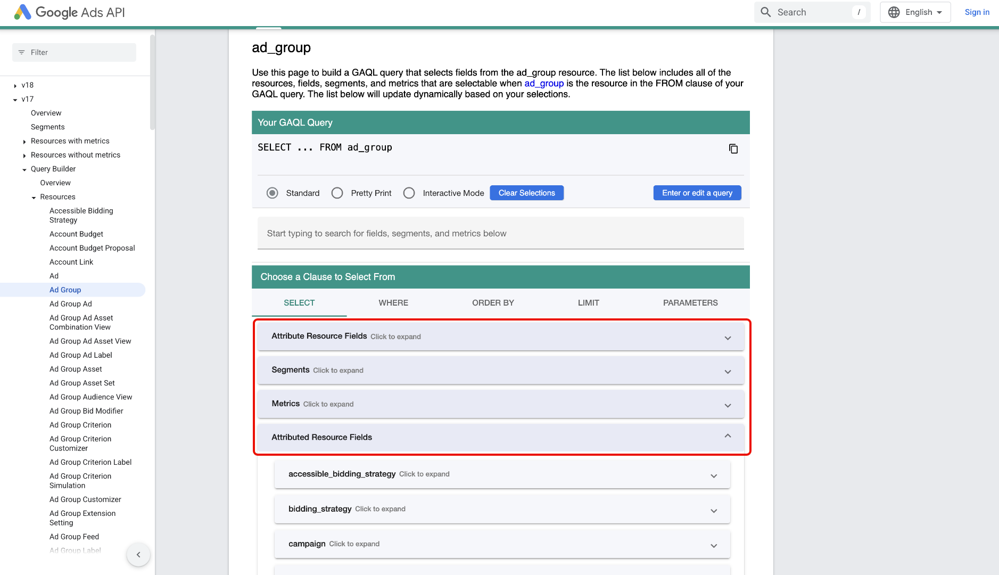

# Verbinding maken [!DNL Google Ads] met Experience Platform via de gebruikersinterface

>[!NOTE]
>
>De bron [!DNL Google Ads] is in bèta. Zie het [ Overzicht van Bronnen ](../../../../home.md#terms-and-conditions) voor meer informatie bij het gebruiken van bèta-geëtiketteerde bronnen.

Lees deze handleiding voor informatie over hoe u uw [!DNL Google Ads] -account kunt verbinden met Adobe Experience Platform via de werkruimte voor bronnen in de gebruikersinterface van Experience Platform.

## Aan de slag

Deze zelfstudie vereist een goed begrip van de volgende onderdelen van Experience Platform:

* [[!DNL Experience Data Model (XDM)]  Systeem ](../../../../../xdm/home.md): Het gestandaardiseerde kader waardoor Experience Platform gegevens van de klantenervaring organiseert.
   * [ Grondbeginselen van schemacompositie ](../../../../../xdm/schema/composition.md): Leer over de basisbouwstenen van schema&#39;s XDM, met inbegrip van zeer belangrijke principes en beste praktijken in schemacompositie.
   * [ het leerprogramma van de Redacteur van het Schema ](../../../../../xdm/tutorials/create-schema-ui.md): Leer hoe te om douaneschema&#39;s tot stand te brengen gebruikend de Redacteur UI van het Schema.
* [[!DNL Real-Time Customer Profile]](../../../../../profile/home.md): biedt een uniform, real-time consumentenprofiel dat is gebaseerd op geaggregeerde gegevens van meerdere bronnen.

Als u reeds een geldige [!DNL Google Ads] verbinding hebt, kunt u de rest van dit document overslaan en aan het leerprogramma te werk gaan op [ vormend een dataflow ](../../dataflow/advertising.md)

### Vereiste referenties verzamelen

Voor informatie over authentificatie, lees het [[!DNL Google Ads]  bronoverzicht ](../../../../connectors/advertising/ads.md).

## Een Google Ads-account verbinden

Selecteer in de gebruikersinterface van Experience Platform de optie **[!UICONTROL Sources]** in de linkernavigatie voor toegang tot de werkruimte van *[!UICONTROL Sources]* . U kunt de juiste categorie selecteren in het deelvenster *[!UICONTROL Categories]* . U kunt ook de zoekbalk gebruiken om naar de specifieke bron te navigeren die u wilt gebruiken.

Als u [!DNL Google Ads] wilt gebruiken, selecteert u de **[!UICONTROL Google Ads]** bronkaart onder *[!UICONTROL Advertising]* en selecteert u vervolgens **[!UICONTROL Add data]** .

.

### Bestaande account

Als u een bestaande account wilt gebruiken, selecteert u **[!UICONTROL Existing account]** en selecteert u vervolgens de account die u wilt gebruiken in de lijst met accounts in de interface.

Nadat u uw account hebt geselecteerd, selecteert u **[!UICONTROL Next]** om door te gaan naar de volgende stap.

### Nieuwe account

Als u geen bestaand account hebt, moet u een nieuw account maken door de vereiste verificatiereferenties op te geven die overeenkomen met uw bron.

Als u een nieuwe account wilt maken, selecteert u **[!UICONTROL New account]** en geeft u vervolgens een accountnaam en optioneel een beschrijving voor uw accountgegevens. Geef vervolgens de juiste verificatiewaarden op om uw bron te verifiëren op basis van Experience Platform:

* **Clientklant identiteitskaart van de Cliënt**: De cliënt identiteitskaart is het rekeningsaantal dat met de [!DNL Google Ads] cliëntrekening beantwoordt die u met [!DNL Google Ads] API wilt beheren. Deze id volgt de sjabloon van `123-456-7890` .
* **Login klant identiteitskaart**: De login cliënt identiteitskaart is het rekeningsaantal dat met uw [!DNL Google Ads] managerrekening beantwoordt en wordt gebruikt om rapportgegevens van een specifieke werkende klant te halen. Voor meer informatie over login klant identiteitskaart, lees de [[!DNL Google Ads]  API documentatie ](https://developers.google.com/search-ads/reporting/concepts/login-customer-id).
* **het teken van de Ontwikkelaar**: Het ontwikkelaarstoken staat u toe om tot [!DNL Google Ads] API toegang te hebben. Met dezelfde ontwikkelaarstoken kunt u aanvragen indienen voor al uw [!DNL Google Ads] -accounts. Haal uw ontwikkelaarstoken door [ het programma openen aan uw managerrekening ](https://ads.google.com/home/tools/manager-accounts/) op en navigeert dan aan de pagina van het Centrum API.
* **verfrist teken**: Het vernieuwt teken maakt deel uit van [!DNL OAuth2] authentificatie. Dit teken staat u toe om uw toegangstokens na het verlopen opnieuw te produceren.
* **identiteitskaart van de Cliënt**: Cliënt ID wordt gebruikt in combinatie met het cliëntgeheim als deel van [!DNL OAuth2] authentificatie. Met de client-id en het clientgeheim kan uw toepassing samen namens uw account werken door uw toepassing aan te duiden op [!DNL Google] .
* **het geheim van de Cliënt**: Het cliëntgeheim wordt gebruikt in combinatie met cliëntidentiteitskaart als deel van [!DNL OAuth2] authentificatie. Met de client-id en het clientgeheim kan uw toepassing samen namens uw account werken door uw toepassing aan te duiden op [!DNL Google] .
* **[!DNL Google Ads]API-versie** : De huidige API-versie wordt ondersteund door [!DNL Google Ads] . De meest recente versie is `v18` , maar de meest recente ondersteunde versie op Experience Platform is `v17` .

Nadat u uw referenties hebt ingevoerd, selecteert u **[!UICONTROL Connect to source]** en laat u de verbinding enkele ogenblikken verwerken. Selecteer **[!UICONTROL Next]** als u klaar bent.

## Gegevens selecteren {#select-data}

Met [!DNL Google Ads] moet u een lijst met kenmerken opgeven voor opname tijdens de fase van gegevensselectie van de workflow. Om deze attributen terug te winnen, moet u [[!DNL Google Ads Query Builder] gebruiken ](https://developers.google.com/google-ads/api/fields/v17/overview_query_builder).

In [!DNL Google Ads Query Builder], navigeer aan het middeltype dat u wilt gebruiken en dan de attributenselecteur gebruiken om uw attributen, segmenten, en metriek te selecteren.

De kenmerken die u selecteert, vullen het deelvenster [!DNL Google Ads Query Language] . Zorg ervoor dat u de modus [!DNL Standard] gebruikt en selecteer vervolgens **[!DNL Enter or edit a query]** .

Selecteer vervolgens **[!DNL Validate Query]** om uw [!DNL Google Ads] -query te valideren.

Als dit gelukt is, retourneert de [!DNL Google Ads Query Builder] een bericht dat aangeeft dat de query geldig is. Daarna, exemplaar **slechts de attributen** van binnen de vraag.

Navigeer terug naar de fase van de gegevensselectie van de workflow voor bronnen in de gebruikersinterface van Experience Platform en plak de kenmerken in het deelvenster *[!UICONTROL List attributes]* .

Selecteer **[!UICONTROL Preview]** om een voorvertoning van de gegevens weer te geven en selecteer vervolgens **[!UICONTROL Next]** om door te gaan.

## Een gegevensstroom maken voor het opnemen van advertentiegegevens

Aan de hand van deze zelfstudie hebt u een verbinding tot stand gebracht met uw Google Ads-account. U kunt nu aan het volgende leerprogramma verdergaan en [ een dataflow vormen om reclamegegevens in Platform ](../../dataflow/advertising.md) te brengen.
