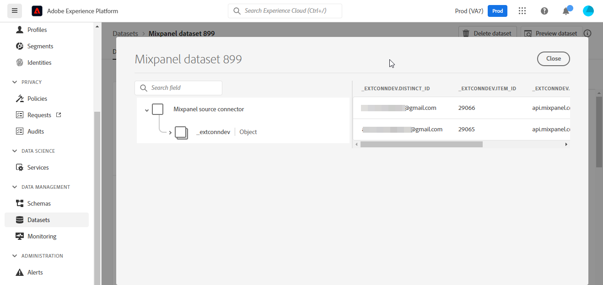

# (Beta) Maak een [!DNL Mixpanel] bronverbinding in de gebruikersinterface

>[!NOTE]
>
>De [!DNL Mixpanel] De bron is in bèta. Zie de [overzicht van bronnen](../../../../home.md#terms-and-conditions) voor meer informatie over het gebruik van bronnen met een bètalabel.

Deze zelfstudie bevat stappen voor het maken van een [!DNL Mixpanel] bronverbinding via de gebruikersinterface van Adobe Experience Platform Platform.

## Aan de slag

Deze zelfstudie vereist een goed begrip van de volgende onderdelen van het Experience Platform:

* [[!DNL Experience Data Model (XDM)] Systeem](../../../../../xdm/home.md): Het gestandaardiseerde kader waardoor [!DNL Experience Platform] organiseert de gegevens van de klantenervaring.
   * [Basisbeginselen van de schemacompositie](../../../../../xdm/schema/composition.md): Leer over de basisbouwstenen van schema&#39;s XDM, met inbegrip van zeer belangrijke principes en beste praktijken in schemacompositie.
   * [Zelfstudie Schema Editor](../../../../../xdm/tutorials/create-schema-ui.md): Leer hoe te om douaneschema&#39;s tot stand te brengen gebruikend de Redacteur UI van het Schema.
* [[!DNL Real-time Customer Profile]](../../../../../profile/home.md): Verstrekt een verenigd, real-time consumentenprofiel dat op bijeengevoegde gegevens van veelvoudige bronnen wordt gebaseerd.

### Vereiste referenties verzamelen

Om verbinding te maken [!DNL Mixpanel] als u een Platform wilt maken, moet u waarden opgeven voor de volgende verbindingseigenschappen:

| Credentials | Beschrijving | Voorbeeld |
| --- | --- | --- |
| Gebruikersnaam | De gebruikersnaam van de serviceaccount die overeenkomt met uw [!DNL Mixpanel] account. Zie de [[!DNL Mixpanel] serviceaccountdocumentatie](https://developer.mixpanel.com/reference/service-accounts#authenticating-with-a-service-account) voor meer informatie . | `Test8.6d4ee7.mp-service-account` |
| Wachtwoord | Het wachtwoord voor de serviceaccount dat overeenkomt met uw [!DNL Mixpanel] account. | `dLlidiKHpCZtJhQDyN2RECKudMeTItX1` |
| Project-id | Uw [!DNL Mixpanel] project-id. Deze id is vereist om een bronverbinding te maken. Zie de [[!DNL Mixpanel] documentatie over projectinstellingen](https://help.mixpanel.com/hc/en-us/articles/115004490503-Project-Settings) en de [[!DNL Mixpanel] gids over het maken en beheren van projecten](https://help.mixpanel.com/hc/en-us/articles/115004505106-Create-and-Manage-Projects) voor meer informatie . | `2384945` |
| Tijdzone | De tijdzone die overeenkomt met uw [!DNL Mixpanel] project. Tijdzone is vereist om een bronverbinding te maken. Zie de [Documentatie over projectinstellingen in Mixpanel](https://help.mixpanel.com/hc/en-us/articles/115004490503-Project-Settings) voor meer informatie . | `Pacific Standard Time` |

Voor meer informatie over het verifiëren van uw [!DNL Mixpanel] bron, zie [[!DNL Mixpanel] bronoverzicht](../../../../connectors/analytics/mixpanel.md).

## Verbind uw [!DNL Mixpanel] account

Selecteer in de gebruikersinterface van het Platform de optie **[!UICONTROL Sources]** van de linkernavigatiebalk voor toegang tot de [!UICONTROL Sources] werkruimte. De [!UICONTROL Catalog] in het scherm worden diverse bronnen weergegeven waarmee u een account kunt maken.

U kunt de juiste categorie selecteren in de catalogus aan de linkerkant van het scherm. U kunt ook de specifieke bron vinden waarmee u wilt werken met de zoekoptie.

Onder de *Analyse* categorie, selecteert u [!DNL Mixpanel]en selecteer vervolgens **[!UICONTROL Add data]**.

De **[!UICONTROL Connect Mixpanel account]** wordt weergegeven. Op deze pagina kunt u nieuwe of bestaande referenties gebruiken.

### Bestaande account

Als u een bestaande account wilt gebruiken, selecteert u de optie [!DNL Mixpanel] account waarmee u een nieuwe gegevensstroom wilt maken, selecteert u **[!UICONTROL Next]** om verder te gaan.

### Nieuwe account

Als u een nieuwe account maakt, selecteert u **[!UICONTROL New account]** en geef vervolgens een naam, een optionele beschrijving en uw referenties op. Als u klaar bent, selecteert u **[!UICONTROL Connect to source]** en laat dan wat tijd voor de nieuwe verbinding tot stand brengen.

## Selecteer uw project-id en tijdzone {#project-id-and-timezone}

>[!CONTEXTUALHELP]
>id="platform_sources_mixpanel_timezone"
>title="Tijdzone instellen voor opnemen in Mixpanel"
>abstract="De tijdzone moet hetzelfde zijn als de tijdzone-instelling van uw Mixpanel-profiel, omdat Platform de toegewezen projecttijdzone gebruikt om relevante gegevens van Mixpanel in te voeren. Mixpanel zal zijn timezone aanpassen om met uw projecttimezone te coördineren alvorens de gebeurtenis aan een Mixpanel gegevensopslag te registreren."
>additional-url="https://experienceleague.adobe.com/docs/experience-platform/sources/ui-tutorials/create/analytics/mixpanel.html?lang=en#project-id-and-timezone" text="Meer informatie in documentatie"

Zodra uw bron voor authentiek wordt verklaard, verstrek uw project identiteitskaart en timezone en selecteer dan **[!UICONTROL Select]**.

De tijdzone die u aanwijst voorafgaand aan het opnemen van uw [!DNL Mixpanel] de gegevens aan Platform moeten het zelfde zijn als uw [!DNL Mixpanel] tijdzone-instelling profiel. Om het even welke veranderingen in de tijdzone van uw gegevens zullen slechts op nieuwe gebeurtenissen worden toegepast en de oude gebeurtenissen zullen in timezone blijven die u eerder specificeerde. [!DNL Mixpanel] past zomertijd aan en past uw tijdstempel voor inname op de juiste wijze aan. Voor meer informatie over hoe tijdzones uw gegevens beïnvloeden, raadpleegt u de [!DNL Mixpanel] hulplijn aan [beheer van tijdzones voor projecten](https://help.mixpanel.com/hc/en-us/articles/115004547203-Manage-Timezones-for-Projects-in-Mixpanel).

Na enkele ogenblikken wordt de juiste interface bijgewerkt naar een voorvertoningsvenster, zodat u uw schema kunt inspecteren voordat u een gegevensstroom maakt. Als u klaar bent, selecteert u **[!UICONTROL Next]**.

## Volgende stappen

Aan de hand van deze zelfstudie hebt u een verbinding tot stand gebracht met uw [!DNL Mixpanel] account. U kunt nu verdergaan met de volgende zelfstudie en [een gegevensstroom configureren om analysegegevens in Platform te brengen](../../dataflow/analytics.md).

## Aanvullende bronnen {#additional-resources}

In de volgende secties vindt u aanvullende bronnen waarnaar u kunt verwijzen wanneer u de [!DNL Mixpanel] bron.

### Validatie {#validation}

De volgende contourstappen die u kunt uitvoeren om te controleren of de verbinding met uw [!DNL Mixpanel] bron en [!DNL Mixpanel] gebeurtenissen worden aan het Platform toegevoegd.

Selecteer in de gebruikersinterface van het Platform de optie **[!UICONTROL Datasets]** van de linkernavigatiebalk voor toegang tot de [!UICONTROL Datasets] werkruimte. De [!UICONTROL Dataset Activity] worden de details van uitvoeringen weergegeven.

Vervolgens selecteert u de uitvoerings-id van de gegevensstroom die u wilt weergeven voor specifieke details over de gegevensstroom die wordt uitgevoerd.

Tot slot selecteert u **[!UICONTROL Preview dataset]** om de gegevens weer te geven die zijn ingevoerd.

U kunt deze gegevens controleren aan de hand van de gegevens op het tabblad [!DNL Mixpanel] > [!DNL Events] pagina. Zie de [[!DNL Mixpanel] document over gebeurtenissen](https://help.mixpanel.com/hc/en-us/articles/4402837164948-Events-formerly-Live-View-) voor meer informatie .

### Schema van Mixpanel

In de onderstaande tabel staan de ondersteunde toewijzingen die moeten worden ingesteld voor [!DNL Mixpanel].

>[!TIP]
>
>Zie [Event Export API > Download](https://developer.mixpanel.com/reference/raw-event-export) voor meer informatie over de API.

| Bron | Type |
|---|---|
| `distinct_id` | string |
| `event_name` | string |
| `import` | boolean |
| `insert_id` | string |
| `item_id` | string |
| `item_name` | string |
| `item_price` | string |
| `mp_api_endpoint` | string |
| `mp_api_timestamp_ms` | integer |
| `mp_processing_time_ms` | integer |
| `time` | integer |

### Limieten {#limits}

* U hebt een maximum van 100 gezamenlijke vragen en 60 vragen per uur zoals vermeld op [Limieten voor de exportsnelheid van API](https://help.mixpanel.com/hc/en-us/articles/115004602563-Rate-Limits-for-API-Endpoints).
