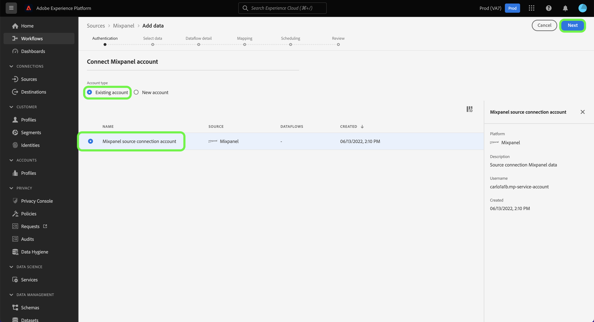
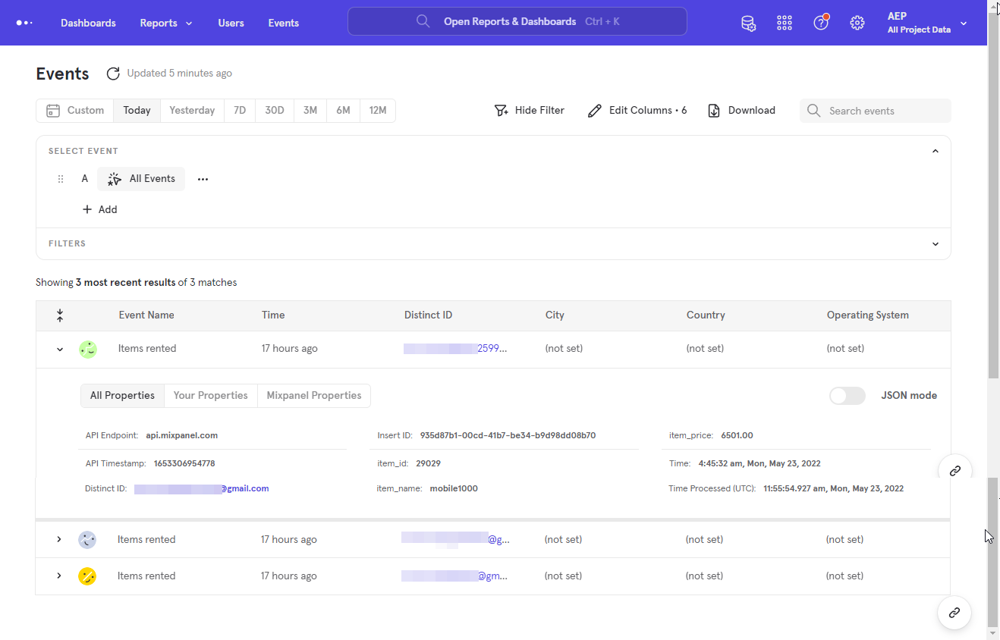

# Een [!DNL Mixpanel] bronverbinding maken in de gebruikersinterface

Deze zelfstudie bevat stappen voor het maken van een [!DNL Mixpanel] -bronverbinding met de Adobe Experience Platform Experience Platform-gebruikersinterface.

## Aan de slag

Deze zelfstudie vereist een goed begrip van de volgende onderdelen van Experience Platform:

* [[!DNL Experience Data Model (XDM)]  Systeem &#x200B;](../../../../../xdm/home.md): Het gestandaardiseerde kader waardoor [!DNL Experience Platform] gegevens van de klantenervaring organiseert.
   * [&#x200B; Grondbeginselen van schemacompositie &#x200B;](../../../../../xdm/schema/composition.md): Leer over de basisbouwstenen van schema&#39;s XDM, met inbegrip van zeer belangrijke principes en beste praktijken in schemacompositie.
   * [&#x200B; het leerprogramma van de Redacteur van het Schema &#x200B;](../../../../../xdm/tutorials/create-schema-ui.md): Leer hoe te om douaneschema&#39;s tot stand te brengen gebruikend de Redacteur UI van het Schema.
* [[!DNL Real-Time Customer Profile]](../../../../../profile/home.md): biedt een uniform, real-time consumentenprofiel dat is gebaseerd op geaggregeerde gegevens van meerdere bronnen.

### Vereiste referenties verzamelen

Als u [!DNL Mixpanel] wilt verbinden met Experience Platform, moet u waarden opgeven voor de volgende verbindingseigenschappen:

| Credentials | Beschrijving | Voorbeeld |
| --- | --- | --- |
| Gebruikersnaam | De gebruikersnaam van het serviceaccount die overeenkomt met uw [!DNL Mixpanel] -account. Zie de [[!DNL Mixpanel]  documentatie van de de dienstrekeningen &#x200B;](https://developer.mixpanel.com/reference/service-accounts#authenticating-with-a-service-account) voor meer informatie. | `Test8.6d4ee7.mp-service-account` |
| Wachtwoord | Het wachtwoord voor de serviceaccount dat overeenkomt met uw [!DNL Mixpanel] -account. | `dLlidiKHpCZtJhQDyN2RECKudMeTItX1` |
| Project-id | Uw [!DNL Mixpanel] project-id. Deze id is vereist om een bronverbinding te maken. Zie de [[!DNL Mixpanel]  documentatie van projectmontages &#x200B;](https://help.mixpanel.com/hc/en-us/articles/115004490503-Project-Settings) en de [[!DNL Mixpanel]  gids bij het creëren van en het leiden van projecten &#x200B;](https://help.mixpanel.com/hc/en-us/articles/115004505106-Create-and-Manage-Projects) voor meer informatie. | `2384945` |
| Tijdzone | De tijdzone die overeenkomt met uw [!DNL Mixpanel] -project. Tijdzone is vereist om een bronverbinding te maken. Zie de [&#x200B; documentatie van het het projectmontages van het Mixpaneelproject &#x200B;](https://help.mixpanel.com/hc/en-us/articles/115004490503-Project-Settings) voor meer informatie. | `Pacific Standard Time` |

Voor meer informatie bij het voor authentiek verklaren van uw [!DNL Mixpanel] bron, zie het [[!DNL Mixpanel]  bronoverzicht &#x200B;](../../../../connectors/analytics/mixpanel.md).

## Sluit uw [!DNL Mixpanel] -account aan

Selecteer in de gebruikersinterface van Experience Platform de optie **[!UICONTROL Sources]** in de linkernavigatiebalk voor toegang tot de werkruimte van [!UICONTROL Sources] . In het scherm [!UICONTROL Catalog] worden diverse bronnen weergegeven waarmee u een account kunt maken.

U kunt de juiste categorie selecteren in de catalogus aan de linkerkant van het scherm. U kunt ook de specifieke bron vinden waarmee u wilt werken met de zoekoptie.

Onder de **&#x200B; categorie van Analytics, selecteer [!DNL Mixpanel], en selecteer dan &#x200B;** [!UICONTROL Add data]**.

De pagina **[!UICONTROL Connect Mixpanel account]** wordt weergegeven. Op deze pagina kunt u nieuwe of bestaande referenties gebruiken.

### Bestaande account

Als u een bestaande account wilt gebruiken, selecteert u de [!DNL Mixpanel] -account waarmee u een nieuwe gegevensstroom wilt maken en selecteert u vervolgens **[!UICONTROL Next]** om door te gaan.

### Nieuwe account

Als u een nieuwe account maakt, selecteert u **[!UICONTROL New account]** en geeft u een naam, een optionele beschrijving en uw referenties op. Als u klaar bent, selecteert u **[!UICONTROL Connect to source]** en laat u de nieuwe verbinding enige tijd tot stand brengen.

## Selecteer uw project-id en tijdzone {#project-id-and-timezone}

>[!CONTEXTUALHELP]
>id="platform_sources_mixpanel_timezone"
>title="Tijdzone instellen voor opnemen in Mixpanel"
>abstract="De tijdzone moet hetzelfde zijn als de tijdzone-instelling van uw Mixpanel-profiel, omdat Experience Platform de toegewezen projecttijdzone gebruikt om relevante gegevens in te voeren vanuit Mixpanel. Mixpanel zal zijn timezone aanpassen om met uw projecttimezone te coördineren alvorens de gebeurtenis aan een Mixpanel gegevensopslag te registreren."
>additional-url="https://experienceleague.adobe.com/docs/experience-platform/sources/ui-tutorials/create/analytics/mixpanel.html#project-id-and-timezone" text="Meer informatie in documentatie"

Nadat de bron is geverifieerd, geeft u uw project-id en tijdzone op en selecteert u **[!UICONTROL Select]** .

De tijdzone die u aanwijst voordat u uw [!DNL Mixpanel] -gegevens naar Experience Platform importeert, moet gelijk zijn aan de instelling voor de tijdzone van uw [!DNL Mixpanel] -profiel. Om het even welke veranderingen in de tijdzone van uw gegevens zullen slechts op nieuwe gebeurtenissen worden toegepast en de oude gebeurtenissen zullen in timezone blijven die u eerder specificeerde. [!DNL Mixpanel] past zomertijd aan en past uw tijdstempel voor inname dienovereenkomstig aan. Voor meer informatie over hoe de tijdzones uw gegevens beïnvloeden, zie de [!DNL Mixpanel] gids over [&#x200B; het beheren van tijdzones voor projecten &#x200B;](https://help.mixpanel.com/hc/en-us/articles/115004547203-Manage-Timezones-for-Projects-in-Mixpanel).

Na enkele ogenblikken wordt de juiste interface bijgewerkt naar een voorvertoningsvenster, zodat u uw schema kunt inspecteren voordat u een gegevensstroom maakt. Selecteer **[!UICONTROL Next]** als u klaar bent.

## Volgende stappen

Aan de hand van deze zelfstudie hebt u een verbinding tot stand gebracht met uw [!DNL Mixpanel] -account. U kunt nu aan het volgende leerprogramma verdergaan en [&#x200B; een dataflow vormen om analysegegevens in Experience Platform &#x200B;](../../dataflow/analytics.md) te brengen.

## Aanvullende bronnen {#additional-resources}

De onderstaande secties bevatten aanvullende bronnen waarnaar u kunt verwijzen wanneer u de [!DNL Mixpanel] -bron gebruikt.

### Validatie {#validation}

In de volgende contourstappen kunt u controleren of u de [!DNL Mixpanel] -bron hebt verbonden en of [!DNL Mixpanel] -gebeurtenissen worden opgenomen in Experience Platform.

Selecteer in de gebruikersinterface van Experience Platform de optie **[!UICONTROL Datasets]** in de linkernavigatiebalk voor toegang tot de werkruimte van [!UICONTROL Datasets] . In het scherm [!UICONTROL Dataset Activity] worden de details van uitvoeringen weergegeven.

Vervolgens selecteert u de uitvoerings-id van de gegevensstroom die u wilt weergeven voor specifieke details over de gegevensstroom die wordt uitgevoerd.

Selecteer ten slotte **[!UICONTROL Preview dataset]** om de gegevens weer te geven die zijn ingevoerd.

U kunt deze gegevens controleren aan de hand van de gegevens op de pagina [!DNL Mixpanel] > [!DNL Events] . Zie het [[!DNL Mixpanel]  document op Gebeurtenissen &#x200B;](https://help.mixpanel.com/hc/en-us/articles/4402837164948-Events-formerly-Live-View-) voor meer informatie.

### Schema van Mixpanel

In de onderstaande tabel staan de ondersteunde toewijzingen die moeten worden ingesteld voor [!DNL Mixpanel] .

>[!TIP]
>
>Zie [&#x200B; de Uitvoer API van de Gebeurtenis > Download &#x200B;](https://developer.mixpanel.com/reference/raw-event-export) voor meer informatie over API.

| Bron | Type |
|---|---|
| `distinct_id` | string |
| `event_name` | string |
| `import` | boolean |
| `insert_id` | string |
| `item_id` | string |
| `item_name` | string |
| `item_price` | string |
| `mp_api_endpoint` | string |
| `mp_api_timestamp_ms` | integer |
| `mp_processing_time_ms` | integer |
| `time` | integer |

### Limieten {#limits}

* U hebt een maximum van 100 gezamenlijke vragen en 60 vragen per uur zoals vermeld op [&#x200B; de Grenswaarden van het Uitvoer API &#x200B;](https://help.mixpanel.com/hc/en-us/articles/115004602563-Rate-Limits-for-API-Endpoints).
