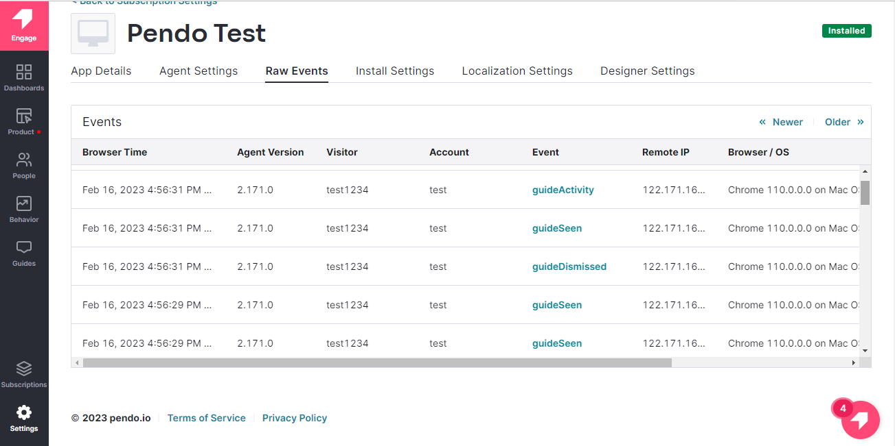

# Een [!DNL Pendo] bronverbindingsgegevens en in de gebruikersinterface

>[!NOTE]
>
>De [!DNL Pendo] De bron is in bèta. Lees de [overzicht van bronnen](../../../../home.md#terms-and-conditions) voor meer informatie over het gebruik van bronnen met een bètalabel.

Deze zelfstudie bevat stappen voor het maken van een [!DNL Pendo] bronverbinding en gegevensstroom via de Adobe Experience Platform-gebruikersinterface.

## Aan de slag {#getting-started}

Deze zelfstudie vereist een goed begrip van de volgende onderdelen van het Experience Platform:

* [[!DNL Experience Data Model (XDM)] Systeem](../../../../../xdm/home.md): Het gestandaardiseerde kader waarbinnen [!DNL Experience Platform] organiseert de gegevens van de klantenervaring.
   * [Basisbeginselen van de schemacompositie](../../../../../xdm/schema/composition.md): Leer over de basisbouwstenen van schema&#39;s XDM, met inbegrip van zeer belangrijke principes en beste praktijken in schemacompositie.
   * [Zelfstudie Schema-editor](../../../../../xdm/tutorials/create-schema-ui.md): Leer hoe u aangepaste schema&#39;s maakt met de gebruikersinterface van de Schema-editor.
* [[!DNL Real-Time Customer Profile]](../../../../../profile/home.md): Biedt een uniform, real-time consumentenprofiel dat is gebaseerd op geaggregeerde gegevens van meerdere bronnen.

## Vereisten {#prerequisites}

De volgende sectie bevat informatie over voorwaarden die moeten worden voltooid voordat u een [!DNL Pendo] bronverbinding.

### Voorbeeld-JSON om het bronschema te definiëren voor [!DNL Pendo] {#prerequisites-json-schema}

Voordat u een [!DNL Pendo] bronverbinding, zult u een bronschema vereisen om worden verstrekt. U kunt de JSON hieronder gebruiken.

```
{
  "accountId": "58f79ee324d3f",
  "timestamp": 1673372516,
  "visitorId": "test@test.com",
  "uniqueId": "166e50cdf40930fe1367e4d44795c9c74d88b83a",
  "properties": {
    "guideProperties": {
  "name": "Guide Conversion Test"
  }
}
}
```

Lees voor meer informatie de [[!DNL Pendo] gids over webhaken](https://support.pendo.io/hc/en-us/articles/360032285012-Webhooks).

### Een platformschema maken voor [!DNL Pendo] {#create-platform-schema}

U moet er ook voor zorgen dat u eerst een platformschema maakt dat u voor uw bron kunt gebruiken. Zie de zelfstudie aan [een platformschema maken](../../../../../xdm/schema/composition.md) voor uitvoerige stappen op hoe te om een schema tot stand te brengen.


## Verbind uw [!DNL Pendo] account {#connect-account}

Selecteer in de interface Platform de optie **[!UICONTROL Sources]** van de linkernavigatie om tot [!UICONTROL Sources] en bekijk een catalogus met bronnen die beschikbaar zijn in het Experience Platform.

Gebruik de *[!UICONTROL Categories]* om bronnen op categorie te filteren. U kunt ook een bronnaam invoeren in de zoekbalk om een specifieke bron uit de catalogus te zoeken.

Ga naar de [!UICONTROL Analytics] categorie om de [!DNL Pendo] bronkaart. Selecteer **[!UICONTROL Add data]**.


## Gegevens selecteren {#select-data}

De **[!UICONTROL Select data]** wordt weergegeven, zodat u een interface hebt waarmee u de gegevens kunt selecteren die u naar het platform wilt verzenden.

* Het linkergedeelte van de interface is een browser waarmee u de beschikbare gegevensstromen binnen uw account kunt bekijken.
* In het rechtergedeelte van de interface kunt u maximaal 100 rijen gegevens uit een JSON-bestand voorvertonen.

Selecteren **[!UICONTROL Upload files]** om een JSON-bestand vanaf uw lokale systeem te uploaden. U kunt ook het JSON-bestand dat u wilt uploaden, slepen naar het [!UICONTROL Drag and drop files] deelvenster.


Nadat het bestand is geüpload, wordt de voorbeeldinterface bijgewerkt en wordt een voorvertoning weergegeven van het schema dat u hebt geüpload. Met de voorvertoningsinterface kunt u de inhoud en structuur van een bestand controleren. U kunt ook de opdracht [!UICONTROL Search field] nut om tot specifieke punten van binnen uw schema toegang te hebben.

Selecteer **[!UICONTROL Next]**.


## Gegevens {#dataflow-detail}

De **Gegevens** de stap verschijnt, die u van opties voorzien om een bestaande dataset te gebruiken of een nieuwe dataset voor uw gegevensstroom te vestigen, evenals een kans om een naam en een beschrijving voor uw gegevensstroom te verstrekken. Tijdens deze stap kunt u ook instellingen configureren voor het opnemen van profielen, foutdiagnose, gedeeltelijke inname en waarschuwingen.

Selecteer **[!UICONTROL Next]**.


## Toewijzing {#mapping}

De [!UICONTROL Mapping] de stap verschijnt, die u van een interface voorziet om de brongebieden van uw bronschema aan hun aangewezen doelXDM gebieden in het doelschema in kaart te brengen.

Platform biedt intelligente aanbevelingen voor automatisch toegewezen velden op basis van het doelschema of de gegevensset die u hebt geselecteerd. U kunt toewijzingsregels handmatig aanpassen aan uw gebruiksgevallen. Op basis van uw behoeften kunt u ervoor kiezen om velden rechtstreeks toe te wijzen of gegevens prep-functies te gebruiken om brongegevens om berekende of berekende waarden af te leiden. Voor uitvoerige stappen bij het gebruiken van de kaartperinterface en berekende gebieden, zie [UI-hulplijn voor gegevensvoorinstelling](../../../../../data-prep/ui/mapping.md).

De onderstaande toewijzingen zijn verplicht en moeten worden ingesteld voordat u verdergaat met de [!UICONTROL Review] in het werkgebied.

| Doelveld | Beschrijving |
| --- | --- |
| `uniqueId` | De [!DNL Pendo] id voor de gebeurtenis. |

Als de brongegevens zijn toegewezen, selecteert u **[!UICONTROL Next]**.


## Controleren {#review}

De **[!UICONTROL Review]** wordt weergegeven, zodat u de nieuwe gegevensstroom kunt controleren voordat deze wordt gemaakt. De details worden gegroepeerd in de volgende categorieën:

* **[!UICONTROL Connection]**: Hiermee geeft u het brontype, het relevante pad van het gekozen bronbestand en de hoeveelheid kolommen in dat bronbestand weer.
* **[!UICONTROL Assign dataset & map fields]**: Toont welke dataset de brongegevens worden opgenomen in, met inbegrip van het schema dat de dataset volgt.

Nadat u de gegevensstroom hebt gecontroleerd, selecteert u **[!UICONTROL Finish]** en laat enige tijd voor de gegevensstroom worden gecreeerd.


## Uw URL voor het streamingeindpunt ophalen {#get-streaming-endpoint-url}

Wanneer uw streaminggegevens zijn gemaakt, kunt u nu de URL van het streamingeindpunt ophalen. Dit eindpunt zal worden gebruikt om aan uw webhaak in te tekenen, toestaand uw het stromen bron om met Experience Platform te communiceren.

Om URL te construeren die wordt gebruikt om webhaak te vormen op [!DNL Pendo] u moet het volgende terugwinnen:

* **[!UICONTROL Dataflow ID]**
* **[!UICONTROL Streaming endpoint]**

Om uw **[!UICONTROL Dataflow ID]** en **[!UICONTROL Streaming endpoint]**, ga naar de [!UICONTROL Dataflow activity] pagina van de gegevensstroom die u net creeerde en kopieer de details van de bodem van [!UICONTROL Properties] deelvenster.


Zodra u uw het stromen eindpunt en dataflow identiteitskaart hebt teruggewonnen, bouw een URL die op het volgende patroon wordt gebaseerd: ```{STREAMING_ENDPOINT}?x-adobe-flow-id={DATAFLOW_ID}```. Een geconstrueerde URL voor een webhaak ziet er bijvoorbeeld als volgt uit: ```https://dcs.adobedc.net/collection/0c61859cc71939a0caf01123f91b2fc52589018800ad46b6c76c2dff3595ee95```

## Webhaak instellen in [!DNL Pendo] {#set-up-webhook}

Meld u vervolgens aan bij uw account op [[!DNL Pendo]](https://pendo.io/) en maakt u een webhaak. Ga als volgt te werk om een webhaak te maken: [!DNL Pendo] gebruikersinterface, gelieve te verwijzen naar [[!DNL Pendo] handleiding voor het maken van webhaak](https://support.pendo.io/hc/en-us/articles/360032285012-Webhooks#create-a-webhook-0-4).

Wanneer uw webhaak is gemaakt, navigeert u naar de instellingenpagina van uw [!DNL Pendo] Webhaak en voer uw URL van de webhaak in in [!DNL URL] veld.


>[!TIP]
>
>U kunt zich abonneren op verschillende gebeurtenissencategorieën om te bepalen welk soort gebeurtenissen u van uw wilt verzenden [!DNL Pendo] -instantie naar Platform. Voor meer informatie over de verschillende gebeurtenissen raadpleegt u de [[!DNL Pendo] documentatie](https://support.pendo.io/hc/en-us/articles/360032285012-Webhooks#create-a-webhook-0-4).

## Volgende stappen {#next-steps}

Aan de hand van deze zelfstudie hebt u een streaminggegevensstroom geconfigureerd om uw [!DNL Pendo] gegevens naar Experience Platform. Als u de gegevens wilt controleren die worden ingevoerd, raadpleegt u de handleiding op [streaming gegevens controleren met behulp van platforminterface](../../monitor-streaming.md).

## Aanvullende bronnen {#additional-resources}

In de volgende secties vindt u aanvullende bronnen die u kunt raadplegen wanneer u de [!DNL Pendo] bron.

### Validatie {#validation}

Om te controleren of u de bron correct hebt ingesteld en [!DNL Pendo] de berichten worden opgenomen, volg de stappen hieronder:

* U kunt de [!DNL Pendo] **[!UICONTROL Reports]** > **[!UICONTROL Chat History]** pagina om de gebeurtenissen te identificeren waarop [!DNL Pendo].



* Selecteer in de interface Platform de optie **[!UICONTROL View Dataflows]** naast de [!DNL Pendo] kaartmenu in de broncatalogus. Selecteer vervolgens **[!UICONTROL Preview dataset]** om de gegevens te verifiëren die voor de webhaken werden opgenomen die u binnen hebt gevormd [!DNL Pendo].


### Fouten en problemen oplossen {#errors-and-troubleshooting}

Bij het controleren van een gegevensstroomuitvoering kan het volgende foutbericht optreden: `The message can't be validated ... uniqueID:expected minLength:1, actual 0].`


Om deze fout te bevestigen, moet u verifiëren dat *uniqueID* toewijzing is ingesteld. Zie voor aanvullende informatie de [Mapping](#mapping) sectie.

Ga voor meer informatie naar de [[!DNL Pendo] Help Center](https://www.pendo.io/help-center/).
