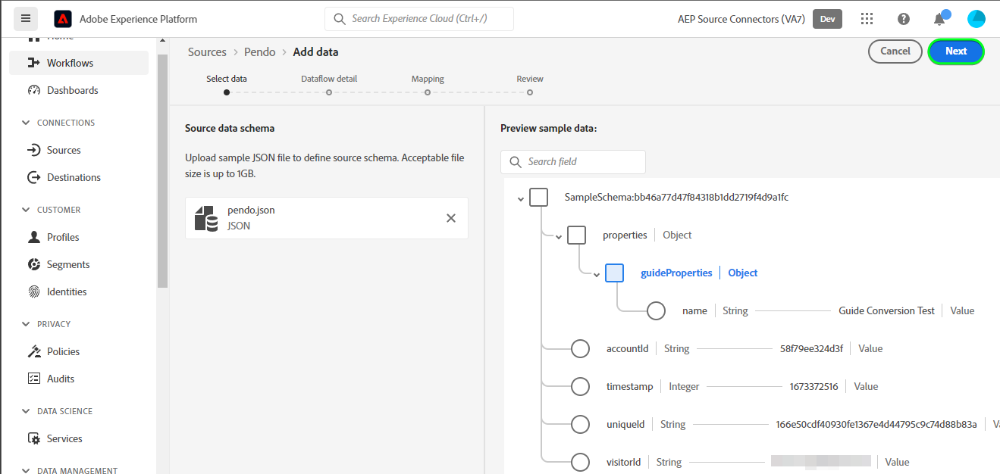

# Een [!DNL Pendo] bronverbindingsgegevensstroom en in de gebruikersinterface maken

>[!NOTE]
>
>De bron [!DNL Pendo] is in bèta. Gelieve te lezen het [ overzicht van bronnen ](../../../../home.md#terms-and-conditions) voor meer informatie bij het gebruiken van bèta-geëtiketteerde bronnen.

Deze zelfstudie bevat stappen voor het maken van een [!DNL Pendo] bronverbinding en gegevensstroom via de Adobe Experience Platform-gebruikersinterface.

## Aan de slag {#getting-started}

Deze zelfstudie vereist een goed begrip van de volgende onderdelen van het Experience Platform:

* [[!DNL Experience Data Model (XDM)]  Systeem ](../../../../../xdm/home.md): Het gestandaardiseerde kader waardoor [!DNL Experience Platform] gegevens van de klantenervaring organiseert.
   * [ Grondbeginselen van schemacompositie ](../../../../../xdm/schema/composition.md): Leer over de basisbouwstenen van schema&#39;s XDM, met inbegrip van zeer belangrijke principes en beste praktijken in schemacompositie.
   * [ het leerprogramma van de Redacteur van het Schema ](../../../../../xdm/tutorials/create-schema-ui.md): Leer hoe te om douaneschema&#39;s tot stand te brengen gebruikend de Redacteur UI van het Schema.
* [[!DNL Real-Time Customer Profile]](../../../../../profile/home.md): biedt een uniform, real-time consumentenprofiel dat is gebaseerd op geaggregeerde gegevens van meerdere bronnen.

## Vereisten {#prerequisites}

In de volgende sectie vindt u informatie over voorwaarden die moeten worden voltooid voordat u een [!DNL Pendo] bronverbinding kunt maken.

### Voorbeeld-JSON om het bronschema voor [!DNL Pendo] te definiëren {#prerequisites-json-schema}

Voordat u een [!DNL Pendo] -bronverbinding maakt, moet u een bronschema opgeven. U kunt de JSON hieronder gebruiken.

```
{
  "accountId": "58f79ee324d3f",
  "timestamp": 1673372516,
  "visitorId": "test@test.com",
  "uniqueId": "166e50cdf40930fe1367e4d44795c9c74d88b83a",
  "properties": {
    "guideProperties": {
  "name": "Guide Conversion Test"
  }
}
}
```

Voor meer informatie, lees de [[!DNL Pendo]  gids op webhooks ](https://support.pendo.io/hc/en-us/articles/360032285012-Webhooks).

### Een platformschema maken voor [!DNL Pendo] {#create-platform-schema}

U moet er ook voor zorgen dat u eerst een platformschema maakt dat u voor uw bron kunt gebruiken. Zie het leerprogramma op [ creërend een schema van het Platform ](../../../../../xdm/schema/composition.md) voor uitvoerige stappen op hoe te om een schema tot stand te brengen.


## Sluit uw [!DNL Pendo] -account aan {#connect-account}

Selecteer in de gebruikersinterface van het platform **[!UICONTROL Sources]** in de linkernavigatie voor toegang tot de werkruimte van [!UICONTROL Sources] en bekijk een catalogus met bronnen die beschikbaar zijn in het Experience Platform.

Gebruik het menu *[!UICONTROL Categories]* om bronnen op categorie te filteren. U kunt ook een bronnaam invoeren in de zoekbalk om een specifieke bron uit de catalogus te zoeken.

Ga naar de categorie [!UICONTROL Analytics] om de [!DNL Pendo] bronkaart te zien. Selecteer eerst **[!UICONTROL Add data]** .


## Gegevens selecteren {#select-data}

De stap **[!UICONTROL Select data]** wordt weergegeven en biedt een interface waarmee u de gegevens kunt selecteren die u naar Platform wilt verzenden.

* Het linkergedeelte van de interface is een browser waarmee u de beschikbare gegevensstromen binnen uw account kunt bekijken.
* In het rechtergedeelte van de interface kunt u maximaal 100 rijen gegevens uit een JSON-bestand voorvertonen.

Selecteer **[!UICONTROL Upload files]** om een JSON-bestand van uw lokale systeem te uploaden. U kunt ook het JSON-bestand dat u wilt uploaden naar het deelvenster [!UICONTROL Drag and drop files] slepen.


Nadat het bestand is geüpload, wordt de voorbeeldinterface bijgewerkt en wordt een voorvertoning weergegeven van het schema dat u hebt geüpload. Met de voorvertoningsinterface kunt u de inhoud en structuur van een bestand controleren. U kunt het hulpprogramma [!UICONTROL Search field] ook gebruiken om toegang te krijgen tot specifieke items binnen uw schema.

Selecteer **[!UICONTROL Next]** als u klaar bent.



## Gegevens {#dataflow-detail}

De **Dataflow detailstap** verschijnt, die u van opties voorzien om een bestaande dataset te gebruiken of een nieuwe dataset voor uw dataflow te vestigen, evenals een kans om een naam en een beschrijving voor uw dataflow te verstrekken. Tijdens deze stap kunt u ook instellingen configureren voor het opnemen van profielen, foutdiagnose, gedeeltelijke inname en waarschuwingen.

Selecteer **[!UICONTROL Next]** als u klaar bent.


## Toewijzing {#mapping}

De stap [!UICONTROL Mapping] verschijnt, die u van een interface voorziet om de brongebieden van uw bronschema aan hun aangewezen doelXDM gebieden in het doelschema in kaart te brengen.

Platform biedt intelligente aanbevelingen voor automatisch toegewezen velden op basis van het doelschema of de gegevensset die u hebt geselecteerd. U kunt toewijzingsregels handmatig aanpassen aan uw gebruiksgevallen. Op basis van uw behoeften kunt u ervoor kiezen om velden rechtstreeks toe te wijzen of gegevens prep-functies te gebruiken om brongegevens om berekende of berekende waarden af te leiden. Voor uitvoerige stappen bij het gebruiken van de kaartperinterface en berekende gebieden, zie de [ gids UI van de Prep van Gegevens ](../../../../../data-prep/ui/mapping.md).

De onderstaande toewijzingen zijn verplicht en moeten worden ingesteld voordat u naar het [!UICONTROL Review] -werkgebied gaat.

| Doelveld | Beschrijving |
| --- | --- |
| `uniqueId` | De [!DNL Pendo] -id voor de gebeurtenis. |

Selecteer **[!UICONTROL Next]** wanneer de brongegevens correct zijn toegewezen.


## Controleren {#review}

De stap **[!UICONTROL Review]** wordt weergegeven, zodat u de nieuwe gegevensstroom kunt bekijken voordat deze wordt gemaakt. De details worden gegroepeerd in de volgende categorieën:

* **[!UICONTROL Connection]**: geeft het brontype, het relevante pad van het gekozen bronbestand en de hoeveelheid kolommen in dat bronbestand weer.
* **[!UICONTROL Assign dataset & map fields]**: Toont welke dataset de brongegevens worden opgenomen in, met inbegrip van het schema dat de dataset volgt aan.

Nadat u de gegevensstroom hebt gereviseerd, selecteert u **[!UICONTROL Finish]** en laat u enige tijd over om de gegevensstroom te maken.


## Uw URL voor het streamingeindpunt ophalen {#get-streaming-endpoint-url}

Wanneer uw streaminggegevens zijn gemaakt, kunt u nu de URL van het streamingeindpunt ophalen. Dit eindpunt zal worden gebruikt om aan uw webhaak in te tekenen, toestaand uw het stromen bron om met Experience Platform te communiceren.

Als u de URL wilt maken die wordt gebruikt om de webhaak op [!DNL Pendo] te configureren, moet u het volgende ophalen:

* **[!UICONTROL Dataflow ID]**
* **[!UICONTROL Streaming endpoint]**

Als u de gegevens **[!UICONTROL Dataflow ID]** en **[!UICONTROL Streaming endpoint]** wilt ophalen, gaat u naar de [!UICONTROL Dataflow activity] pagina van de gegevensstroom die u net hebt gemaakt en kopieert u de gegevens onder aan het deelvenster [!UICONTROL Properties] .


Wanneer u het streamingeindpunt en de dataflow-id hebt opgehaald, maakt u een URL op basis van het volgende patroon: ```{STREAMING_ENDPOINT}?x-adobe-flow-id={DATAFLOW_ID}``` . Een geconstrueerde URL voor een webhaak ziet er bijvoorbeeld als volgt uit: ```https://dcs.adobedc.net/collection/0c61859cc71939a0caf01123f91b2fc52589018800ad46b6c76c2dff3595ee95```

## Webhaak instellen in [!DNL Pendo] {#set-up-webhook}

Meld u vervolgens aan bij uw account op [[!DNL Pendo] ](https://pendo.io/) en maak een webhaak. Voor stappen op hoe te om een webhaak tot stand te brengen die het [!DNL Pendo] gebruikersinterface gebruiken, gelieve te verwijzen naar de [[!DNL Pendo]  gids bij het creëren van webhaak ](https://support.pendo.io/hc/en-us/articles/360032285012-Webhooks#create-a-webhook-0-4).

Nadat u de webhaak hebt gemaakt, navigeert u naar de instellingenpagina van de [!DNL Pendo] webhaak en voert u de URL van de webhaak in het veld [!DNL URL] in.


>[!TIP]
>
>U kunt zich abonneren op verschillende categorieën gebeurtenissen om het type gebeurtenissen te bepalen dat u van uw [!DNL Pendo] -instantie naar Platform wilt verzenden. Voor meer informatie over de verschillende gebeurtenissen, gelieve te verwijzen naar de [[!DNL Pendo]  documentatie ](https://support.pendo.io/hc/en-us/articles/360032285012-Webhooks#create-a-webhook-0-4).

## Volgende stappen {#next-steps}

Aan de hand van deze zelfstudie hebt u een streaminggegevensstroom geconfigureerd om uw [!DNL Pendo] -gegevens naar het Experience Platform te brengen. Om de gegevens te controleren die worden opgenomen, verwijs naar de gids bij [ controle die dataflows gebruikend Platform UI ](../../monitor-streaming.md) stromen.

## Aanvullende bronnen {#additional-resources}

De onderstaande secties bevatten aanvullende bronnen waarnaar u kunt verwijzen wanneer u de [!DNL Pendo] -bron gebruikt.

### Validatie {#validation}

Voer de onderstaande stappen uit om te controleren of u de bron juist hebt ingesteld en of [!DNL Pendo] -berichten worden ingevoerd:

* U kunt de pagina [!DNL Pendo] **[!UICONTROL Reports]** > **[!UICONTROL Chat History]** controleren om de gebeurtenissen te identificeren die door [!DNL Pendo] worden vastgelegd.

{het schermschot van 0} van de Buigmachine UI die praatjegeschiedenis toont ](../../../../images/tutorials/create/analytics-pendo-webhook/pendo-events.png)![

* Selecteer in de interface Platform de optie **[!UICONTROL View Dataflows]** naast het kaartmenu [!DNL Pendo] in de catalogus met bronnen. Selecteer vervolgens **[!UICONTROL Preview dataset]** om de gegevens te verifiëren die zijn ingevoerd voor de webhooks die u hebt geconfigureerd in [!DNL Pendo] .

{het schermschot van het platform UI die ingebedde gebeurtenissen ](../../../../images/tutorials/create/analytics-pendo-webhook/platform-dataset.png) tonen![

### Fouten en problemen oplossen {#errors-and-troubleshooting}

Bij het controleren van een gegevensstroomuitvoering kan het volgende foutbericht optreden: `The message can't be validated ... uniqueID:expected minLength:1, actual 0].`

{het schermschot van het platform UI die fout toont.](../../../../images/tutorials/create/analytics-pendo-webhook/error.png) sectie.

Voor meer informatie bezoek het [[!DNL Pendo]  Centrum van de Hulp ](https://www.pendo.io/help-center/).
