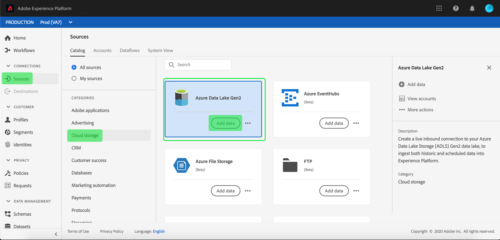

# Een [!DNL Azure Data Lake Storage Gen2]-bronverbinding maken in de gebruikersinterface

De bronschakelaars in Adobe Experience Platform verstrekken de capaciteit om van buitenaf afkomstige gegevens op een geplande basis in te voeren. Deze zelfstudie bevat stappen voor het verifiëren van een [!DNL Azure Data Lake Storage Gen2] (hierna &quot;[!DNL ADLS Gen2]&quot; genoemd) bronconnector met behulp van de [!DNL Platform]-gebruikersinterface.

## Aan de slag

Deze zelfstudie vereist een goed begrip van de volgende onderdelen van Adobe Experience Platform:

- [[!DNL Experience Data Model (XDM)] Systeem](../../../../../xdm/home.md): Het gestandaardiseerde kader waardoor de gegevens van de  [!DNL Experience Platform] klantenervaring worden georganiseerd.
   - [Basisbeginselen van de schemacompositie](../../../../../xdm/schema/composition.md): Leer over de basisbouwstenen van schema&#39;s XDM, met inbegrip van zeer belangrijke principes en beste praktijken in schemacompositie.
   - [Zelfstudie](../../../../../xdm/tutorials/create-schema-ui.md) Schema-editor: Leer hoe te om douaneschema&#39;s tot stand te brengen gebruikend de Redacteur UI van het Schema.
- [[!DNL Real-time Customer Profile]](../../../../../profile/home.md): Verstrekt een verenigd, real-time consumentenprofiel dat op bijeengevoegde gegevens van veelvoudige bronnen wordt gebaseerd.

Als u reeds een geldige verbinding van ADLS Gen2 hebt, kunt u de rest van dit document overslaan en aan het leerprogramma te werk gaan op [vormend een dataflow](../../dataflow/batch/cloud-storage.md).

### Vereiste referenties verzamelen

Om uw [!DNL ADLS Gen2] bronschakelaar voor authentiek te verklaren, moet u waarden voor de volgende verbindingseigenschappen verstrekken:

| Credentials | Beschrijving |
| ---------- | ----------- |
| `url` | Het eindpunt voor [!DNL ADLS Gen2]. |
| `servicePrincipalId` | De client-id van de toepassing. |
| `servicePrincipalKey` | De sleutel van de toepassing. |
| `tenant` | De huurdersinformatie die uw toepassing bevat. |

Raadpleeg [this [!DNL ADLS Gen2] document](https://docs.microsoft.com/en-us/azure/data-factory/connector-azure-data-lake-storage) voor meer informatie over deze waarden.

## Uw [!DNL ADLS Gen2]-account aansluiten

Nadat u de vereiste gegevens hebt verzameld, kunt u de onderstaande stappen volgen om uw [!DNL ADLS Gen2]-account te koppelen aan [!DNL Platform].

Meld u aan bij [Adobe Experience Platform](https://platform.adobe.com) en selecteer **[!UICONTROL Bronnen]** in de linkernavigatiebalk om de werkruimte **[!UICONTROL Bronnen]** te openen. Het scherm **[!UICONTROL Catalog]** toont een verscheidenheid van bronnen waarvoor u een rekening kunt tot stand brengen met.

U kunt de juiste categorie selecteren in de catalogus aan de linkerkant van het scherm. U kunt ook de specifieke bron vinden waarmee u wilt werken met de zoekoptie.

Selecteer **[!UICONTROL Azure Data Lake Gen2]** onder de categorie **[!UICONTROL Databases]**. Als dit uw eerste keer gebruikend deze schakelaar is, uitgezocht **[!UICONTROL vorm]**. Anders selecteert u **[!UICONTROL Gegevens toevoegen]** om een nieuwe ADLS Gen2-connector te maken.

Het dialoogvenster **[!UICONTROL Verbinden met Azure Data Lake Gen2]** wordt weergegeven. Op deze pagina kunt u nieuwe of bestaande referenties gebruiken.

### Nieuwe account

Als u nieuwe geloofsbrieven gebruikt, selecteer **[!UICONTROL Nieuwe Rekening]**. Geef in het invoerformulier dat wordt weergegeven een naam, een optionele beschrijving en uw [!DNL ADLS Gen2]-referenties op. Selecteer **[!UICONTROL Connect]** als u klaar bent en wacht dan enige tijd tot de nieuwe verbinding tot stand is gebracht.

### Bestaande account

Als u een bestaande account wilt verbinden, selecteert u de [!DNL ADLS Gen2]-account waarmee u verbinding wilt maken en selecteert u **[!UICONTROL Volgende]** om door te gaan.

## Volgende stappen

Aan de hand van deze zelfstudie hebt u een verbinding tot stand gebracht met uw [!DNL ADLS Gen2]-account. U kunt nu verdergaan naar de volgende zelfstudie en [een gegevensstroom configureren om gegevens van uw cloudopslag over te brengen naar [!DNL Platform]](../../dataflow/batch/cloud-storage.md).