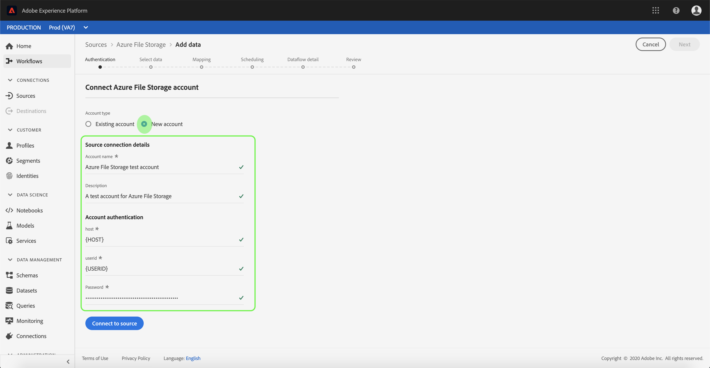

# Creeer een [!DNL Azure File Storage] bronschakelaar in UI

>[!NOTE]
>De [!DNL Azure File Storage] connector is in bèta. Zie het [Bronoverzicht](../../../../home.md#terms-and-conditions) voor meer informatie bij het gebruiken van bèta-geëtiketteerde schakelaars.

De bronschakelaars in Adobe Experience Platform verstrekken de capaciteit om van buitenaf afkomstige gegevens op een geplande basis in te voeren. Deze zelfstudie bevat stappen voor het verifiëren van een [!DNL Azure File Storage] bronaansluiting met behulp van de [!DNL Platform] gebruikersinterface.

## Aan de slag

Deze zelfstudie vereist een goed begrip van de volgende onderdelen van het Adobe Experience Platform:

- [XDM-systeem](../../../../../xdm/home.md)(Experience Data Model): Het gestandaardiseerde kader waardoor de gegevens van de klantenervaring worden [!DNL Experience Platform] georganiseerd.
   - [Basisbeginselen van de schemacompositie](../../../../../xdm/schema/composition.md): Leer over de basisbouwstenen van schema&#39;s XDM, met inbegrip van zeer belangrijke principes en beste praktijken in schemacompositie.
   - [Zelfstudie](../../../../../xdm/tutorials/create-schema-ui.md)Schema-editor: Leer hoe te om douaneschema&#39;s tot stand te brengen gebruikend de Redacteur UI van het Schema.
- [Klantprofiel](../../../../../profile/home.md)in realtime: Verstrekt een verenigd, real-time consumentenprofiel dat op bijeengevoegde gegevens van veelvoudige bronnen wordt gebaseerd.

Als u al een verbinding van de Opslag van het Dossier hebt, kunt u de rest van dit document overslaan en aan het leerprogramma te werk gaan bij het [vormen van een gegevensstroom](../../dataflow/batch/cloud-storage.md).

### Vereiste referenties verzamelen

Om uw [!DNL Azure File Storage] bronschakelaar voor authentiek te verklaren, moet u waarden voor de volgende verbindingseigenschappen verstrekken:

| Credentials | Beschrijving |
| ---------- | ----------- |
| `host` | Het eindpunt van de [!DNL Azure File Storage] instantie waartoe u toegang hebt. |
| `userId` | De gebruiker met voldoende toegang tot het [!DNL Azure File Storage] eindpunt. |
| `password` | De [!DNL Azure File Storage] toegangstoets. |

Raadpleeg [dit Azure File Storage-document](https://docs.microsoft.com/en-us/azure/storage/files/storage-how-to-use-files-windows)voor meer informatie over hoe u aan de slag gaat.

## Uw [!DNL Azure File Storage] account verbinden

Nadat u de vereiste gegevens hebt verzameld, voert u de onderstaande stappen uit om een nieuw [!DNL Azure File Storage] account te maken waarmee u verbinding kunt maken [!DNL Platform].

Login aan [Adobe Experience Platform](https://platform.adobe.com) en selecteer dan **[!UICONTROL Bronnen]** van de linkernavigatiebar om tot de werkruimte van *[!UICONTROL Bronnen]* toegang te hebben. In het scherm *[!UICONTROL Catalogus]* worden diverse bronnen weergegeven waarmee u een binnenkomende account kunt maken. Elke bron toont het aantal bestaande accounts en gegevensstromen dat aan deze accounts is gekoppeld.

U kunt de juiste categorie selecteren in de catalogus aan de linkerkant van het scherm. U kunt ook de specifieke bron vinden waarmee u wilt werken met de zoekoptie.

Selecteer onder de categorie *[!UICONTROL Databases]* de optie **[!UICONTROL Azure File Storage]** ( **Azure-bestandsopslag)** op het plus-pictogram (+)om een nieuwe Azure File Storage-connector te maken.

De pagina *[!UICONTROL Connect to Azure File Storage]* wordt weergegeven. Op deze pagina kunt u nieuwe of bestaande referenties gebruiken.

### Nieuwe account

Selecteer **[!UICONTROL Nieuw account]** als u nieuwe referenties gebruikt. Geef in het invoerformulier dat wordt weergegeven, de verbinding een naam, een optionele beschrijving en de gegevens voor de bestandsopslag op. Als u klaar bent, selecteert u **[!UICONTROL Connect]** en laat u de nieuwe account enige tijd beginnen.

### Bestaande account

Als u een bestaande account wilt verbinden, selecteert u de [!DNL Azure File Storage] account waarmee u verbinding wilt maken en selecteert u **[!UICONTROL Volgende]** om door te gaan.

## Volgende stappen

Aan de hand van deze zelfstudie hebt u een verbinding met uw [!DNL Azure File Storage] account tot stand gebracht. U kunt nu verdergaan met de volgende zelfstudie en een gegevensstroom [configureren om gegevens van uw cloudopslag naar het Platform](../../dataflow/batch/cloud-storage.md)te brengen.