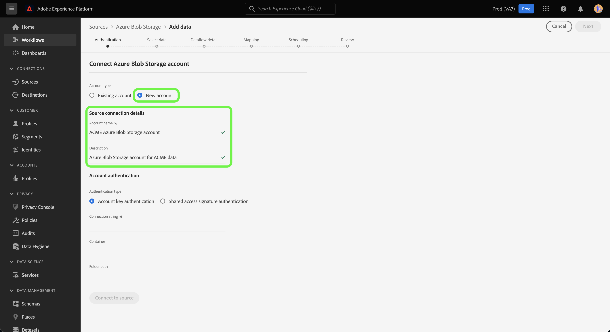

# Creeer een [!DNL Azure Blob] bronschakelaar in UI

De bronschakelaars in Adobe Experience Platform verstrekken de capaciteit om van buitenaf afkomstige gegevens op een geplande basis in te voeren. Deze zelfstudie bevat stappen voor het maken van een [!DNL Azure Blob] blob met behulp van de [!DNL Platform] gebruikersinterface.

## Aan de slag

Deze zelfstudie vereist een goed begrip van de volgende onderdelen van Adobe Experience Platform:

- [XDM-systeem](../../../../../xdm/home.md)(Experience Data Model): Het gestandaardiseerde kader waardoor het Experience Platform gegevens van de klantenervaring organiseert.
   - [Basisbeginselen van de schemacompositie](../../../../../xdm/schema/composition.md): Leer over de basisbouwstenen van schema&#39;s XDM, met inbegrip van zeer belangrijke principes en beste praktijken in schemacompositie.
   - [Zelfstudie](../../../../../xdm/tutorials/create-schema-ui.md)Schema-editor: Leer hoe te om douaneschema&#39;s tot stand te brengen gebruikend de Redacteur UI van het Schema.
- [Klantprofiel](../../../../../profile/home.md)in realtime: Verstrekt een verenigd, real-time consumentenprofiel dat op bijeengevoegde gegevens van veelvoudige bronnen wordt gebaseerd.

Als u al een basisverbinding van het Blob hebt, kunt u de rest van dit document overslaan en aan het leerprogramma te werk gaan bij het [vormen van een gegevensstroom](../../dataflow/batch/cloud-storage.md).

### Ondersteunde bestandsindelingen

[!DNL Experience Platform] ondersteunt de volgende bestandsindelingen die door externe opslagmedia moeten worden ingevoerd:

- Door scheidingstekens gescheiden waarden (DSV): De ondersteuning voor gegevensbestanden met DSV-indeling is momenteel beperkt tot door komma&#39;s gescheiden waarden. De waarde van veldkoppen in bestanden met DSV-indeling mag alleen bestaan uit alfanumerieke tekens en onderstrepingstekens. Algemene DSV-bestanden worden in de toekomst ondersteund.
- JavaScript Object Notation (JSON): Gegevensbestanden met JSON-indeling moeten XDM-compatibel zijn.
- Apache Parquet: Gegevensbestanden met Parketindeling moeten XDM-compatibel zijn.

### Vereiste referenties verzamelen

Als u toegang wilt krijgen tot uw blob-opslag op [!DNL Platform], moet u een geldige waarde opgeven voor de volgende referentie:

| Credentials | Beschrijving |
| ---------- | ----------- |
| `connectionString` | De verbindingstekenreeks die is vereist voor toegang tot gegevens in de blob-opslag. Het patroon van de Blob-verbindingstekenreeks is: `DefaultEndpointsProtocol=https;AccountName={ACCOUNT_NAME};AccountKey={ACCOUNT_KEY}`. |

Voor meer informatie over aan de slag gaan, bezoek [dit Azure Blob-document](https://docs.microsoft.com/en-us/azure/storage/common/storage-configure-connection-string).

## Uw Blob-account verbinden

Nadat u de vereiste gegevens hebt verzameld, voert u de onderstaande stappen uit om een nieuw Blob-account te maken waarmee u verbinding kunt maken [!DNL Platform].

Meld u aan bij [Adobe Experience Platform](https://platform.adobe.com) en selecteer vervolgens **[!UICONTROL Bronnen]** in de linkernavigatiebalk voor toegang tot de werkruimte *[!UICONTROL Bronnen]* . In het scherm *[!UICONTROL Catalogus]* worden diverse bronnen weergegeven waarmee u een binnenkomende account kunt maken. Elke bron toont het aantal bestaande accounts en gegevensstromen dat aan deze accounts is gekoppeld.

U kunt de juiste categorie selecteren in de catalogus aan de linkerkant van het scherm. U kunt ook de specifieke bron vinden waarmee u wilt werken met de zoekoptie.

Selecteer onder de categorie *[!UICONTROL Databases]* de optie **[!UICONTROL Azure Blob Storage]** gevolgd door gegevens **** toevoegen om een nieuwe [!DNL Blob]aansluiting te maken.

De pagina *[!UICONTROL Connect to Azure Blob Storage]* wordt weergegeven. Op deze pagina kunt u nieuwe of bestaande referenties gebruiken.

### Nieuwe account

Selecteer **[!UICONTROL Nieuw account]** als u nieuwe referenties gebruikt. Geef in het invoerformulier dat wordt weergegeven, de verbinding een naam, een optionele beschrijving en uw [!DNL Blob] referenties. Als u klaar bent, selecteert u **[!UICONTROL Connect]** en laat u de nieuwe account enige tijd beginnen.

### Bestaande account

Als u een bestaande account wilt verbinden, selecteert u de [!DNL Blob] account waarmee u verbinding wilt maken en selecteert u **[!UICONTROL Volgende]** om door te gaan.

## Volgende stappen en extra bronnen

Aan de hand van deze zelfstudie hebt u een verbinding met uw [!DNL Blob] account tot stand gebracht. U kunt nu verdergaan met de volgende zelfstudie en een gegevensstroom [configureren om gegevens van uw cloudopslag naar het Platform](../../dataflow/batch/cloud-storage.md)te brengen.