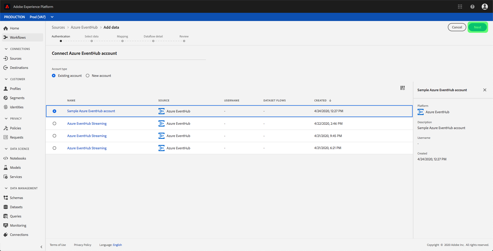

# Creeer een Azure de bronschakelaar van de Hubs van de Gebeurtenis in UI

>[!NOTE]
> De Azure Event Hubs-connector is in bèta. De functies en documentatie kunnen worden gewijzigd.

De bronschakelaars in het Platform van de Ervaring van Adobe verstrekken de capaciteit om van buitenaf afkomstige gegevens op een geplande basis in te voeren. Deze zelfstudie biedt stappen voor het verifiëren van een Azure Event Hubs (hierna &quot;EventHub&quot; genoemd) bronschakelaar die de gebruikersinterface van het Platform gebruikt.

## Aan de slag

Voor deze zelfstudie is een goed begrip vereist van de volgende componenten van het Adobe Experience Platform:

- [XDM-systeem](../../../../../xdm/home.md)(Experience Data Model): Het gestandaardiseerde kader waardoor het Platform van de Ervaring gegevens van de klantenervaring organiseert.
   - [Basisbeginselen van de schemacompositie](../../../../../xdm/schema/composition.md): Leer over de basisbouwstenen van schema&#39;s XDM, met inbegrip van zeer belangrijke principes en beste praktijken in schemacompositie.
   - [Zelfstudie](../../../../../xdm/tutorials/create-schema-ui.md)Schema-editor: Leer hoe te om douaneschema&#39;s tot stand te brengen gebruikend de Redacteur UI van het Schema.
- [Klantprofiel](../../../../../profile/home.md)in realtime: Verstrekt een verenigd, real-time consumentenprofiel dat op bijeengevoegde gegevens van veelvoudige bronnen wordt gebaseerd.

Als u reeds een rekening EventHub hebt, kunt u de rest van dit document overslaan en aan het leerprogramma te werk gaan bij het [vormen van een dataflow](../../dataflow/streaming/cloud-storage.md).

### Vereiste referenties verzamelen

Om uw EventHub bronschakelaar voor authentiek te verklaren, moet u waarden voor de volgende verbindingseigenschappen verstrekken:

| Credentials | Beschrijving |
| ---------- | ----------- |
| `sasKeyName` | De naam van de machtigingsregel, ook wel de SAS-sleutelnaam genoemd. |
| `sasKey` | De gegenereerde handtekening voor gedeelde toegang. |
| `namespace` | De naamruimte van de EventHub waartoe u toegang hebt. |

Voor meer informatie over deze waarden, verwijs naar [dit document](https://docs.microsoft.com/en-us/azure/event-hubs/authenticate-shared-access-signature)EventHub.

## Sluit uw EventHub-account aan

Zodra u uw vereiste geloofsbrieven hebt verzameld, kunt u de stappen hieronder volgen om uw rekening EventHub aan Platform te verbinden.

Meld u aan bij [Adobe Experience Platform](https://platform.adobe.com) en selecteer vervolgens **Bronnen** in de linkernavigatiebalk voor toegang tot de werkruimte *Bronnen* . Op het tabblad *Catalogus* worden diverse bronnen weergegeven die u kunt verbinden met Platform. Elke bron toont het aantal bestaande rekeningen verbonden aan hen.

Onder de categorie *Cloud Storage* selecteert u de optie **Azure Event Hubs** en klikt u **op het plusteken (+)** om een nieuwe EventHub-connector te maken.

Het dialoogvenster *Connect to Azure Event Hubs* wordt weergegeven. Op deze pagina kunt u nieuwe of bestaande referenties gebruiken.

### Nieuwe account

Selecteer **Nieuw account** als u nieuwe referenties gebruikt. Voor de inputvorm die verschijnt, verstrek een naam, een facultatieve beschrijving, en uw geloofsbrieven EventHub. Wanneer u klaar bent, selecteert u **Connect** en laat u de nieuwe verbinding enige tijd tot stand brengen.

### Bestaande account

Als u een bestaande account wilt verbinden, selecteert u de EventHub-account waarmee u verbinding wilt maken en selecteert u **Volgende** om door te gaan.

## Volgende stappen

Door dit leerprogramma te volgen, hebt u uw rekening EventHub met Platform verbonden. U kunt nu verdergaan met de volgende zelfstudie en een gegevensstroom [configureren om gegevens van uw cloudopslag over te brengen naar Platform](../../dataflow/streaming/cloud-storage.md).