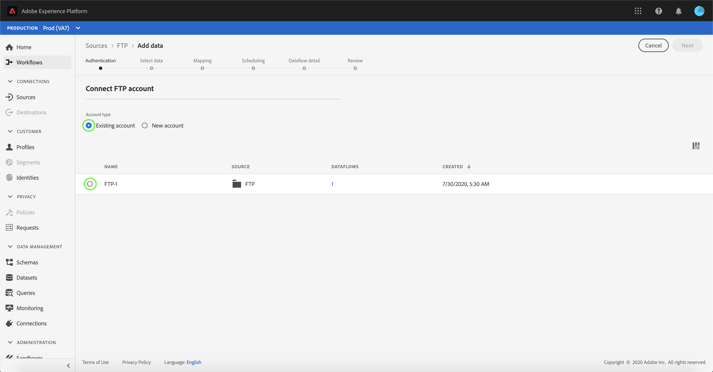

# Een FTP-bronconnector maken in de gebruikersinterface

>[!NOTE]
>
>De FTP-connector bevindt zich in bèta. Zie het [Bronoverzicht](../../../../home.md#terms-and-conditions) voor meer informatie bij het gebruiken van bèta-geëtiketteerde schakelaars.

Deze zelfstudie bevat stappen voor het maken van een FTP-bronconnector via de gebruikersinterface van het Platform.

## Aan de slag

Deze zelfstudie vereist een goed begrip van de volgende onderdelen van Adobe Experience Platform:

* [[!DNL Experience Data Model (XDM)] Systeem](../../../../../xdm/home.md): Het gestandaardiseerde kader waardoor het Experience Platform gegevens van de klantenervaring organiseert.
   * [Basisbeginselen van de schemacompositie](../../../../../xdm/schema/composition.md): Leer over de basisbouwstenen van schema&#39;s XDM, met inbegrip van zeer belangrijke principes en beste praktijken in schemacompositie.
   * [Zelfstudie](../../../../../xdm/tutorials/create-schema-ui.md)Schema-editor: Leer hoe te om douaneschema&#39;s tot stand te brengen gebruikend de Redacteur UI van het Schema.
* [[!DNL Real-time Customer Profile]](../../../../../profile/home.md): Verstrekt een verenigd, real-time consumentenprofiel dat op bijeengevoegde gegevens van veelvoudige bronnen wordt gebaseerd.

Als u al een geldige FTP-verbinding hebt, kunt u de rest van dit document overslaan en doorgaan naar de zelfstudie over het [configureren van een gegevensstroom](../../dataflow/batch/cloud-storage.md).

### Vereiste referenties verzamelen

Als u verbinding wilt maken met FTP, moet u waarden opgeven voor de volgende verbindingseigenschappen:

| Credentials | Beschrijving |
| ---------- | ----------- |
| `host` | De naam of het IP-adres dat aan uw FTP-server is gekoppeld. |
| `username` | De gebruikersnaam met toegang tot uw FTP-server. |
| `password` | Het wachtwoord voor uw FTP-server. |

## Verbinding maken met uw FTP-server

Nadat u de vereiste gegevens hebt verzameld, voert u de onderstaande stappen uit om een nieuwe FTP-account te maken waarmee u verbinding kunt maken met het Platform.

Meld u aan bij [Adobe Experience Platform](https://platform.adobe.com) en selecteer vervolgens **[!UICONTROL Bronnen]** in de linkernavigatiebalk voor toegang tot de werkruimte [!UICONTROL Bronnen] . In het scherm [!UICONTROL Catalogus] worden diverse bronnen weergegeven waarmee u een binnenkomende account kunt maken.

U kunt de juiste categorie selecteren in de catalogus aan de linkerkant van het scherm. U kunt ook de specifieke bron vinden waarmee u wilt werken met de zoekoptie.

Selecteer in de categorie [!UICONTROL Cloud-opslag] de optie **[!UICONTROL FTP]**. Als dit uw eerste keer gebruikend deze schakelaar is, uitgezocht **[!UICONTROL vorm]**. Anders selecteert u Gegevens **** toevoegen om een nieuwe FTP-verbinding te maken.

De pagina **[!UICONTROL Verbinding maken met FTP]** wordt weergegeven. Op deze pagina kunt u nieuwe of bestaande referenties gebruiken.

### Nieuwe account

Selecteer **[!UICONTROL Nieuw account]** als u nieuwe referenties gebruikt. Voer in het invoerformulier dat wordt weergegeven een naam, een optionele beschrijving en uw referenties in. Wanneer u klaar bent, selecteert u **[!UICONTROL Connect]** en laat u de nieuwe verbinding enige tijd tot stand brengen.

### Bestaande account

Als u een bestaande account wilt verbinden, selecteert u de FTP-account waarmee u verbinding wilt maken en selecteert u **[!UICONTROL Volgende]** om door te gaan.

## Volgende stappen

Aan de hand van deze zelfstudie hebt u een verbinding met uw FTP-account tot stand gebracht. U kunt nu verdergaan met de volgende zelfstudie en een gegevensstroom [configureren om gegevens van uw cloudopslag naar het Platform](../../dataflow/batch/cloud-storage.md)te brengen.