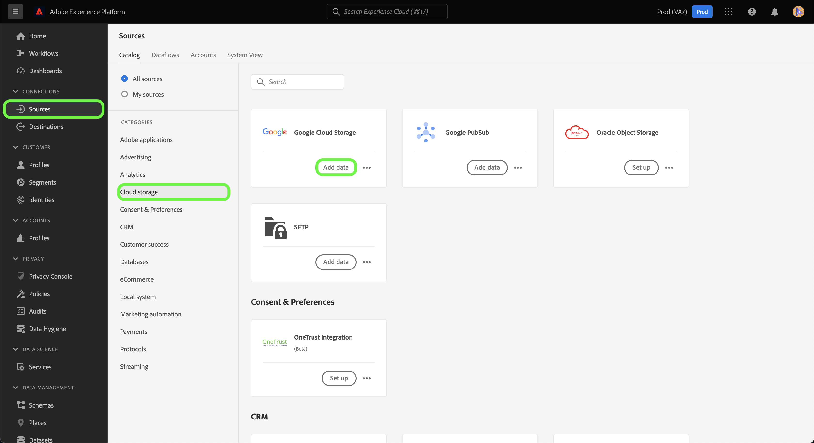

# Een [!DNL Google Cloud Storage] bronverbinding in de gebruikersinterface

De bronschakelaars in Adobe Experience Platform verstrekken de capaciteit om van buitenaf afkomstige gegevens op een geplande basis in te voeren. Deze zelfstudie bevat stappen voor het maken van een [!DNL Google Cloud Storage] (hierna &quot;GCS&quot; genoemd) bronaansluiting met behulp van de [!DNL Platform] gebruikersinterface.

## Aan de slag

Deze zelfstudie vereist een goed begrip van de volgende onderdelen van Adobe Experience Platform:

* [[!DNL Experience Data Model (XDM)] Systeem](../../../../../xdm/home.md): Het gestandaardiseerde kader waardoor het Experience Platform gegevens van de klantenervaring organiseert.
   * [Basisbeginselen van de schemacompositie](../../../../../xdm/schema/composition.md): Leer over de basisbouwstenen van schema&#39;s XDM, met inbegrip van zeer belangrijke principes en beste praktijken in schemacompositie.
   * [Zelfstudie Schema Editor](../../../../../xdm/tutorials/create-schema-ui.md): Leer hoe te om douaneschema&#39;s tot stand te brengen gebruikend de Redacteur UI van het Schema.
* [[!DNL Real-Time Customer Profile]](../../../../../profile/home.md): Verstrekt een verenigd, real-time consumentenprofiel dat op bijeengevoegde gegevens van veelvoudige bronnen wordt gebaseerd.

Als u al een geldige GCS-verbinding hebt, kunt u de rest van dit document overslaan en doorgaan naar de zelfstudie op [configureren, gegevensstroom](../../dataflow/batch/cloud-storage.md).

### Ondersteunde bestandsindelingen

[!DNL Experience Platform] ondersteunt de volgende bestandsindelingen die door externe opslagmedia moeten worden ingevoerd:

* Door scheidingstekens gescheiden waarden (DSV): De ondersteuning voor gegevensbestanden met DSV-indeling is momenteel beperkt tot door komma&#39;s gescheiden waarden. De waarde van veldkoppen in bestanden met DSV-indeling mag alleen bestaan uit alfanumerieke tekens en onderstrepingstekens. Algemene DSV-bestanden worden in de toekomst ondersteund.
* JavaScript Object Notation (JSON): Gegevensbestanden met JSON-indeling moeten XDM-compatibel zijn.
* Apache Parquet: Gegevensbestanden met Parketindeling moeten XDM-compatibel zijn.

### Vereiste referenties verzamelen

Om toegang te krijgen tot uw GCS-gegevens op [!DNL Platform]moet u de volgende waarden opgeven:

| Credentials | Beschrijving |
| ---------- | ----------- |
| Toegangstoets-id | Een alfanumerieke tekenreeks van 61 tekens die wordt gebruikt voor het verifiëren van uw [!DNL Google Cloud Storage] aan Platform. |
| Geheime toegangstoets | Een tekenreeks van 40 tekens met een basiscodering van 64 tekens die wordt gebruikt voor de verificatie van uw [!DNL Google Cloud Storage] aan Platform. |

Voor meer informatie over deze waarden raadpleegt u de [HMAC-sleutels voor Google Cloud Storage](https://cloud.google.com/storage/docs/authentication/hmackeys#overview) hulplijn. Raadpleeg voor meer informatie over het genereren van uw eigen toegangstoets-id en geheime toegangstoets de [[!DNL Google Cloud Storage] overzicht](../../../../connectors/cloud-storage/google-cloud-storage.md).

## Verbind uw [!DNL Google Cloud Storage] account

Nadat u de vereiste gegevens hebt verzameld, kunt u de onderstaande stappen volgen om uw GCS-account te koppelen aan [!DNL Platform].

Aanmelden bij [Adobe Experience Platform](https://platform.adobe.com) en selecteer vervolgens **[!UICONTROL Sources]** van de linkernavigatiebalk voor toegang tot de **[!UICONTROL Sources]** werkruimte. De **[!UICONTROL Catalog]** in het scherm worden diverse bronnen weergegeven waarmee u een account kunt maken.

U kunt de juiste categorie selecteren in de catalogus aan de linkerkant van het scherm. U kunt ook de specifieke bron vinden waarmee u wilt werken met de zoekoptie.

Onder de **[!UICONTROL Databases]** categorie, selecteert u **[!UICONTROL Google Cloud Storage]**. Als dit de eerste keer is met deze connector, selecteert u **[!UICONTROL Configure]**. Anders selecteert u **[!UICONTROL Add data]** om een nieuwe GCS-connector te maken.

De **[!UICONTROL Connect to Google Cloud Storage]** wordt weergegeven. Op deze pagina kunt u nieuwe of bestaande referenties gebruiken.

### Nieuwe account

Als u nieuwe referenties gebruikt, selecteert u **[!UICONTROL New account]**. Geef in het invoerformulier dat wordt weergegeven een naam, een optionele beschrijving en uw GCS-referenties op. Als u klaar bent, selecteert u **[!UICONTROL Connect]** en laat dan wat tijd voor de nieuwe verbinding tot stand brengen.

### Bestaande account

Als u een bestaande account wilt verbinden, selecteert u de GCS-account waarmee u verbinding wilt maken en selecteert u **[!UICONTROL Next]** om verder te gaan.

## Volgende stappen

Aan de hand van deze zelfstudie hebt u een verbinding met uw GCS-account tot stand gebracht. U kunt nu verdergaan met de volgende zelfstudie en [een gegevensstroom configureren om gegevens van uw cloudopslag over te brengen naar [!DNL Platform]](../../dataflow/batch/cloud-storage.md).
