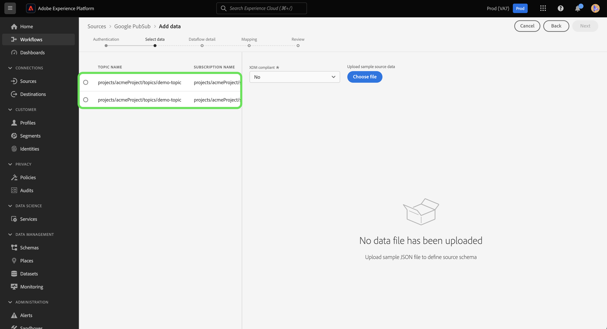

# Een [!DNL Google PubSub] bronverbinding maken in de gebruikersinterface

>[!IMPORTANT]
>
>De [!DNL Google PubSub] -bron is in de broncatalogus beschikbaar voor gebruikers die Real-Time Customer Data Platform Ultimate hebben aangeschaft.

Deze zelfstudie bevat stappen voor het maken van een [!DNL Google PubSub] (hierna &quot;[!DNL PubSub]&quot; genoemd) met behulp van de Experience Platform-gebruikersinterface.

## Aan de slag

Deze zelfstudie vereist een goed begrip van de volgende onderdelen van Adobe Experience Platform:

* [ Bronnen ](../../../../home.md): Experience Platform staat gegevens toe om van diverse bronnen worden opgenomen terwijl het voorzien van u van de capaciteit om, inkomende gegevens te structureren te etiketteren en te verbeteren gebruikend de diensten van Experience Platform.
* [ Sandboxes ](../../../../../sandboxes/home.md): Experience Platform verstrekt virtuele zandbakken die één enkele instantie van Experience Platform in afzonderlijke virtuele milieu&#39;s verdelen helpen digitale ervaringstoepassingen ontwikkelen en ontwikkelen.

Als u reeds een geldige [!DNL PubSub] verbinding hebt, kunt u de rest van dit document overslaan en aan het leerprogramma te werk gaan op [ vormend een dataflow ](../../dataflow/batch/cloud-storage.md).

### Vereiste referenties verzamelen

U moet waarden opgeven voor de verbindingseigenschappen die hieronder worden beschreven om uw [!DNL PubSub] -account aan te sluiten op Experience Platform. Voor meer informatie over authentificatie en eerste vereiste opstelling, lees het [[!DNL PubSub source]  overzicht ](../../../../connectors/cloud-storage/google-pubsub.md#prerequisites).

>[!BEGINTABS]

>[!TAB  op project-gebaseerde authentificatie ]

| Credentials | Beschrijving |
| --- | --- |
| Project-id | De project-id die is vereist voor verificatie [!DNL PubSub] . |
| Credentials | De referentie die is vereist voor verificatie [!DNL PubSub]. U moet ervoor zorgen dat u het volledige JSON-bestand plaatst nadat u de witruimten uit uw referenties hebt verwijderd. |

>[!TAB  Onderwerp en op abonnement-Gebaseerde authentificatie ]

| Credentials | Beschrijving |
| --- | --- |
| Credentials | De referentie die is vereist voor verificatie [!DNL PubSub]. U moet ervoor zorgen dat u het volledige JSON-bestand plaatst nadat u de witruimten uit uw referenties hebt verwijderd. |
| Onderwerpnaam | De naam van uw [!DNL PubSub] -abonnement. In [!DNL PubSub], staan de abonnementen u toe om berichten te ontvangen, door aan het onderwerp in te tekenen waarin de berichten zijn gepubliceerd aan. **Nota**: Één enkel [!DNL PubSub] abonnement kan slechts voor één dataflow worden gebruikt. Als u meerdere gegevensstromen wilt maken, hebt u meerdere abonnementen nodig. |
| Abonnementsnaam | De naam van uw [!DNL PubSub] -abonnement. In [!DNL PubSub], staan de abonnementen u toe om berichten te ontvangen, door aan het onderwerp in te tekenen waarin de berichten zijn gepubliceerd aan. |

>[!ENDTABS]

Voor meer informatie over deze waarden, zie het volgende ](https://cloud.google.com/pubsub/docs/authentication) document PubSub authentificatie [. Als u de dienst op rekening-gebaseerde authentificatie gebruikt, zie de volgende [ gids PubSub ](https://cloud.google.com/docs/authentication/production#create_service_account) voor stappen op hoe te om uw geloofsbrieven te produceren.

>[!TIP]
>
>Als u de op rekening-gebaseerde authentificatie van de dienst gebruikt, zorg ervoor dat u voldoende gebruikerstoegang tot uw de dienstrekening hebt verleend en dat er geen extra witte ruimten in JSON zijn, wanneer het kopiëren en het kleven van uw geloofsbrieven.

Nadat u de vereiste gegevens hebt verzameld, kunt u de onderstaande stappen volgen om uw [!DNL PubSub] -account te koppelen aan Experience Platform.

## Sluit uw [!DNL PubSub] -account aan

Selecteer in de gebruikersinterface van Experience Platform de optie **[!UICONTROL Sources]** in de linkernavigatie voor toegang tot de werkruimte van [!UICONTROL Sources] . In het scherm [!UICONTROL Catalog] worden diverse bronnen weergegeven waarmee u een account kunt maken.

U kunt de juiste categorie selecteren in de catalogus aan de linkerkant van het scherm. U kunt ook de specifieke bron vinden waarmee u wilt werken met de zoekoptie.

Selecteer onder de categorie [!UICONTROL Cloud storage] de optie **[!UICONTROL Google PubSub]** en selecteer vervolgens **[!UICONTROL Add data]** .

De pagina **[!UICONTROL Connect to Google PubSub]** wordt weergegeven. Op deze pagina kunt u nieuwe of bestaande referenties gebruiken.

### Bestaande account

Als u een bestaande account wilt gebruiken, selecteert u de [!DNL PubSub] -account waarmee u een nieuwe gegevensstroom wilt maken en selecteert u vervolgens **[!UICONTROL Next]** om door te gaan.

### Nieuwe account

>[!TIP]
>
>* Wanneer u een account met beperkte toegang maakt, moet u ten minste een van uw onderwerpnaam of abonnementsnaam opgeven. Verificatie mislukt als beide waarden ontbreken.
>* Nadat u een [!DNL Google PubSub] basisverbinding hebt gemaakt, kunt u het verificatietype niet wijzigen. Als u het verificatietype wilt wijzigen, moet u een nieuwe basisverbinding maken.

Als u een nieuwe account maakt, selecteert u **[!UICONTROL New account]** en geeft u een naam en een optionele beschrijving voor uw nieuwe [!DNL PubSub] -account.

Met de bron [!DNL PubSub] kunt u het type toegang opgeven dat u wilt toestaan tijdens verificatie. U kunt opstelling uw rekening om of op project-gebaseerde authentificatie of onderwerp en op abonnement-gebaseerde authentificatie te hebben. De op project-gebaseerde authentificatie staat u toe om toegang tot het wortel-vlakke project in uw rekening te verlenen, terwijl het onderwerp en op abonnement-gebaseerde authentificatie u toestaat om toegang tot een bepaald [!DNL PubSub] onderwerp en een abonnement te beperken.

>[!BEGINTABS]

>[!TAB  op project-gebaseerde authentificatie ]

Een account maken met toegang tot de hoofdprojectmap van [!DNL PubSub] . Selecteer **[!UICONTROL Google PubSub authentication credentials]** als verificatietype en geef uw project-id en referenties op. Als u klaar bent, selecteert u **[!UICONTROL Connect to source]** en laat u de nieuwe verbinding enige tijd tot stand brengen.

>[!TAB  Onderwerp en op abonnement-Gebaseerde authentificatie ]

Als u een account wilt maken met beperkte toegang tot alleen een bepaald [!DNL PubSub] -onderwerp en -abonnement, selecteert u **[!UICONTROL Google PubSub Scoped authentication credentials]** en geeft u vervolgens uw referenties, onderwerpnaam en/of abonnementsnaam op. Als u klaar bent, selecteert u **[!UICONTROL Connect to source]** en laat u de nieuwe verbinding enige tijd tot stand brengen.

>[!ENDTABS]

>[!NOTE]
>
>Hoofd (rollen) die aan een [!DNL PubSub] project worden toegewezen worden geërft in alle onderwerpen en abonnementen die binnen een [!DNL PubSub] project worden gecreeerd. Als u een hoofd (rol) toegang tot een specifiek onderwerp wilt hebben, dan moet dat hoofd (rol) ook aan het overeenkomstige abonnement van het onderwerp worden toegevoegd. Voor meer informatie, lees de [[!DNL PubSub]  documentatie over toegangsbeheer ](<https://cloud.google.com/pubsub/docs/access-control>).

## Gegevens selecteren

Een geslaagde verificatie brengt u naar de stap [!UICONTROL Select data] , waar u door de gegevenshiërarchie van [!DNL PubSub] kunt navigeren en de gegevens kunt selecteren die u naar Experience Platform wilt verzenden.

>[!BEGINTABS]

>[!TAB  op project-gebaseerde authentificatie ]

Als u met op project-gebaseerde toegang voor authentiek hebt verklaard, zal de [!UICONTROL Select data] interface alle abonnementen binnen uw project tonen dat een onderwerp in bijlage aan hen heeft.

>[!TAB  Onderwerp en op abonnement-Gebaseerde authentificatie ]

Als u met een onderwerp en op abonnement-gebaseerde toegang voor authentiek hebt verklaard, kan de [!UICONTROL Select data] interfacevertoning afhankelijk van de informatie variëren die u verstrekte.

* Als u slechts de onderwerpnaam verstrekt, dan toont de interface alle onderwerp-abonnement paren die aan het verstrekte onderwerp beantwoorden.
* Als u slechts de abonnementsnaam verstrekt, dan toont de interface alle onderwerp-abonnement paren die aan de verstrekte abonnementsnaam beantwoorden.
* Als zowel het onderwerp als de abonnementsnamen worden verstrekt, dan toont de interface het onderwerp-abonnement paar dat met beide verstrekte waarden beantwoordt.

>[!ENDTABS]

## Volgende stappen

Aan de hand van deze zelfstudie hebt u een verbinding gemaakt tussen uw [!DNL PubSub] -account en Experience Platform. U kunt nu aan het volgende leerprogramma verdergaan en [ een dataflow vormen om het stromen gegevens van uw wolkenopslag in Experience Platform ](../../dataflow/streaming/cloud-storage-streaming.md) te brengen.
