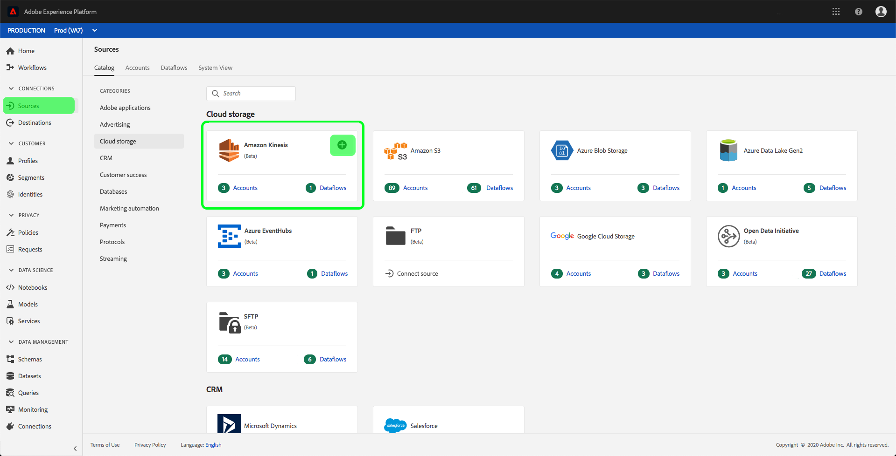

# Een Amazon Kinesis-bronconnector maken in de gebruikersinterface

>[!NOTE]
>De Amazon Kinesis-connector is in bèta. Zie het [Bronoverzicht](../../../../home.md#terms-and-conditions) voor meer informatie bij het gebruiken van bèta-geëtiketteerde schakelaars.

De bronschakelaars in Adobe Experience Platform verstrekken de capaciteit om extern gesourceerde gegevens op een geplande basis in te voeren. Deze zelfstudie bevat stappen voor het verifiëren van een Amazon Kinesis-bronconnector (hierna &quot;Kinesis&quot; genoemd) via de gebruikersinterface van het Platform.

## Aan de slag

Deze zelfstudie vereist een goed begrip van de volgende onderdelen van het Adobe Experience Platform:

- [XDM-systeem](../../../../../xdm/home.md)(Experience Data Model): Het gestandaardiseerde kader waardoor het Experience Platform gegevens van de klantenervaring organiseert.
   - [Basisbeginselen van de schemacompositie](../../../../../xdm/schema/composition.md): Leer over de basisbouwstenen van schema&#39;s XDM, met inbegrip van zeer belangrijke principes en beste praktijken in schemacompositie.
   - [Zelfstudie](../../../../../xdm/tutorials/create-schema-ui.md)Schema-editor: Leer hoe te om douaneschema&#39;s tot stand te brengen gebruikend de Redacteur UI van het Schema.
- [Klantprofiel](../../../../../profile/home.md)in realtime: Verstrekt een verenigd, real-time consumentenprofiel dat op bijeengevoegde gegevens van veelvoudige bronnen wordt gebaseerd.

Als u reeds een rekening Kinesis hebt, kunt u de rest van dit document overslaan en aan het leerprogramma te werk gaan bij het [vormen van een gegevensstroom](../../dataflow/streaming/cloud-storage.md).

### Vereiste referenties verzamelen

Als u de Kinesis-bronconnector wilt verifiëren, moet u waarden opgeven voor de volgende verbindingseigenschappen:

| Credentials | Beschrijving |
| ---------- | ----------- |
| `accessKeyId` | De toegangs sleutel-id voor uw Kinesis-account. |
| `Secret access key` | De geheime toegangstoets voor uw Kinesis-account. |
| `region` | Het gebied van uw AWS-server. |

Raadpleeg [dit Kinesis-document](https://docs.aws.amazon.com/streams/latest/dev/getting-started.html)voor meer informatie over deze waarden.

## Uw Kinesis-account verbinden

Nadat u de vereiste gegevens hebt verzameld, kunt u de onderstaande stappen volgen om uw Kinesis-account te koppelen aan het Platform.

Login aan [Adobe Experience Platform](https://platform.adobe.com) en selecteer dan **Bronnen** van de linkernavigatiebar om tot de werkruimte van *Bronnen* toegang te hebben. Op het tabblad *Catalogus* worden diverse bronnen weergegeven die met het Platform kunnen worden verbonden. Elke bron toont het aantal bestaande rekeningen verbonden aan hen.

Selecteer in de categorie *Cloud Storage* de optie **Amazon Kinesis** en klik **op het plus-pictogram (+)** om een nieuwe Kinesis-connector te maken.

Het dialoogvenster *Verbinding maken met Amazon Kinesis* wordt weergegeven. Op deze pagina kunt u nieuwe of bestaande referenties gebruiken.

### Nieuwe account

Selecteer **Nieuw account** als u nieuwe referenties gebruikt. Geef in het invoerformulier dat wordt weergegeven een naam, een optionele beschrijving en uw Kinesis-referenties op. Wanneer u klaar bent, selecteert u **Connect** en laat u de nieuwe verbinding enige tijd tot stand brengen.

### Bestaande account

Als u een bestaande account wilt verbinden, selecteert u de Kinesis-account waarmee u verbinding wilt maken en selecteert u **Volgende** om door te gaan.

## Volgende stappen

Door deze zelfstudie te volgen, hebt u verbinding gemaakt met uw Kinesis-account met Platform. U kunt nu verdergaan met de volgende zelfstudie en een gegevensstroom [configureren om gegevens van uw cloudopslag naar het Platform](../../dataflow/streaming/cloud-storage.md)te brengen.