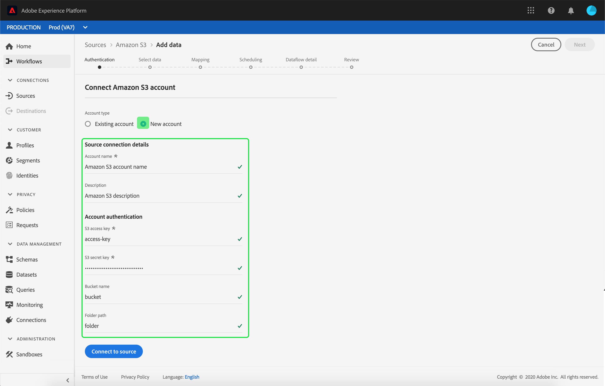

# Een S3-bronverbinding maken in de gebruikersinterface[!DNL Amazon]

De bronschakelaars in Adobe Experience Platform verstrekken de capaciteit om van buitenaf afkomstige gegevens op een geplande basis in te voeren. Deze zelfstudie biedt stappen voor het maken van een [!DNL Amazon] S3-bronconnector (hierna &quot;S3&quot; genoemd) met behulp van de [!DNL Platform]-gebruikersinterface.

## Aan de slag

Deze zelfstudie vereist een goed begrip van de volgende onderdelen van Adobe Experience Platform:

- [[!DNL Experience Data Model (XDM)] Systeem](../../../../../xdm/home.md): Het gestandaardiseerde kader waardoor het Experience Platform gegevens van de klantenervaring organiseert.
   - [Basisbeginselen van de schemacompositie](../../../../../xdm/schema/composition.md): Leer over de basisbouwstenen van schema&#39;s XDM, met inbegrip van zeer belangrijke principes en beste praktijken in schemacompositie.
   - [Zelfstudie](../../../../../xdm/tutorials/create-schema-ui.md) Schema-editor: Leer hoe te om douaneschema&#39;s tot stand te brengen gebruikend de Redacteur UI van het Schema.
- [[!DNL Real-time Customer Profile]](../../../../../profile/home.md): Verstrekt een verenigd, real-time consumentenprofiel dat op bijeengevoegde gegevens van veelvoudige bronnen wordt gebaseerd.

Als u reeds een geldige S3 verbinding hebt, kunt u de rest van dit document overslaan en aan het leerprogramma te werk gaan op [vormend een dataflow](../../dataflow/batch/cloud-storage.md).

### Ondersteunde bestandsindelingen

[!DNL Experience Platform] ondersteunt de volgende bestandsindelingen die door externe opslagmedia moeten worden ingevoerd:

- Door scheidingstekens gescheiden waarden (DSV): De ondersteuning voor gegevensbestanden met DSV-indeling is momenteel beperkt tot door komma&#39;s gescheiden waarden. De waarde van veldkoppen in bestanden met DSV-indeling mag alleen bestaan uit alfanumerieke tekens en onderstrepingstekens. Algemene DSV-bestanden worden in de toekomst ondersteund.
- JavaScript Object Notation (JSON): Gegevensbestanden met JSON-indeling moeten XDM-compatibel zijn.
- Apache Parquet: Gegevensbestanden met Parketindeling moeten XDM-compatibel zijn.

### Vereiste referenties verzamelen

Om tot uw S3 emmertje op [!DNL Platform] toegang te hebben, moet u geldige waarden voor de volgende geloofsbrieven verstrekken:

| Credentials | Beschrijving |
| ---------- | ----------- |
| `s3AccessKey` | De toegangs belangrijkste identiteitskaart voor uw S3 opslag. |
| `s3SecretKey` | De geheime zeer belangrijke identiteitskaart voor uw S3 opslag. |

Voor meer informatie over aan de slag gaan, surf naar [dit AWS-document](https://aws.amazon.com/blogs/security/wheres-my-secret-access-key/).

## Sluit uw S3-account aan

Zodra u uw vereiste geloofsbrieven hebt verzameld, kunt u de stappen volgen hieronder om uw S3 rekening aan [!DNL Platform] te verbinden.

Meld u aan bij [Adobe Experience Platform](https://platform.adobe.com) en selecteer **[!UICONTROL Bronnen]** in de linkernavigatiebalk om de werkruimte **[!UICONTROL Bronnen]** te openen. Het scherm **[!UICONTROL Catalog]** toont een verscheidenheid van bronnen waarvoor u een rekening kunt tot stand brengen met.

U kunt de juiste categorie selecteren in de catalogus aan de linkerkant van het scherm. U kunt ook de specifieke bron vinden waarmee u wilt werken met de zoekoptie.

Selecteer **[!UICONTROL Amazon S3]** onder de categorie **[!UICONTROL Databases]**. Als dit uw eerste keer gebruikend deze schakelaar is, uitgezocht **[!UICONTROL vorm]**. Anders, uitgezocht **[!UICONTROL voeg gegevens]** toe om een nieuwe S3 schakelaar tot stand te brengen.

De pagina **[!UICONTROL Verbinding maken met Amazon S3]** wordt weergegeven. Op deze pagina kunt u nieuwe of bestaande referenties gebruiken.

### Nieuwe account

Als u nieuwe geloofsbrieven gebruikt, selecteer **[!UICONTROL Nieuwe rekening]**. Geef in het invoerformulier dat wordt weergegeven een naam, een optionele beschrijving en uw S3-referenties op. Selecteer **[!UICONTROL Connect]** als u klaar bent en wacht dan enige tijd tot de nieuwe verbinding tot stand is gebracht.

### Bestaande account

Als u een bestaande account wilt verbinden, selecteert u de S3-account waarmee u verbinding wilt maken en selecteert u **[!UICONTROL Volgende]** om door te gaan.

## Volgende stappen en extra bronnen

Aan de hand van deze zelfstudie hebt u een verbinding met uw S3-account tot stand gebracht. U kunt nu verdergaan naar de volgende zelfstudie en [een gegevensstroom configureren om gegevens van uw cloudopslag over te brengen naar [!DNL Platform]](../../dataflow/batch/cloud-storage.md).